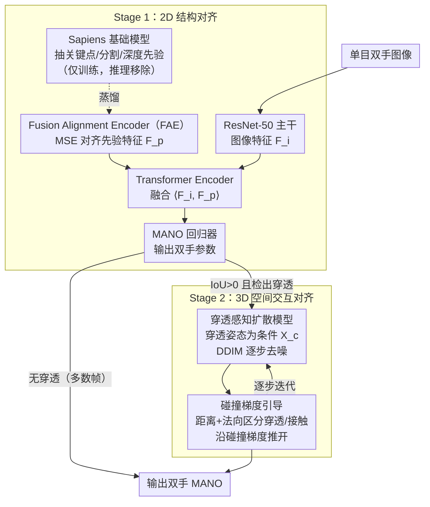

# A2P: From 2D Alignment to 3D Plausibility for Occlusion-Robust Two-Hand Reconstruction

**会议**: CVPR 2026  
**arXiv**: [2503.17788](https://arxiv.org/abs/2503.17788)  
**代码**: [项目页](https://gaogehan.github.io/A2P/)  
**领域**: 人体理解 / 手部重建  
**关键词**: 双手重建, fusion alignment encoder, penetration-free diffusion, MANO, Sapiens

## 一句话总结

解耦双手重建为 2D 结构对齐 + 3D 空间交互对齐：Stage 1 用 Fusion Alignment Encoder 隐式蒸馏 Sapiens 的关键点/分割/深度三种 2D 先验（推理时免基础模型，56fps），Stage 2 用穿透感知扩散模型 + 碰撞梯度引导将穿透姿态映射到物理合理配置——InterHand2.6M 上 MPJPE 降至 5.36mm（超 SOTA 4DHands 2.13mm），穿透体积降 7 倍。

## 研究背景与动机

**领域现状**：单目双手 3D 重建是 AR/VR、机器人和角色动画的关键能力。大规模手部数据集（InterHand2.6M/Re:InterHand）推动了基于缩放数据、增强骨干和注意力建模手间关系的方法进展（IntagHand/ACR/4DHands）。同时，人体重建中已验证基础模型 2D 先验（关键点/分割/深度）和扩散生成先验的有效性。

**现有痛点**：(1) 现有双手方法（IntagHand/ACR/4DHands）缺乏显式 2D-3D 对齐机制，导致空间不一致和非自然交互；(2) 互遮挡时 2D 线索不可靠，手指穿透频繁发生；(3) 直接使用基础模型（如 Sapiens 1B 参数）计算代价过大（3fps），且多任务预测的 2D-3D 特征对齐模糊；(4) 扩散先验（InterHandGen）仅作为输出正则器，未显式建模 3D 空间交互。

**核心矛盾**：2D 先验在遮挡区域不可靠 → 需要 3D 交互先验补充；但 3D 生成先验需要准确的 2D 对齐作为锚点否则会漂移到不合理状态。两者相互依赖但又各有局限。

**本文目标** (1) 如何在推理高效的条件下利用多模态 2D 先验实现结构对齐；(2) 如何用生成模型实现 3D 空间交互的物理合理性（消除穿透）。

**切入角度**：将问题解耦为两个互补阶段——2D 结构对齐（先验蒸馏，解决遮挡下的姿态估计）和 3D 空间交互对齐（条件扩散，解决物理穿透），渐进式校正从根源解决失败。

**核心 idea**：训练时用 Sapiens 基础模型提供 2D 先验指导 + 推理时用蒸馏小模型替代（18.7× 加速），再用条件扩散 + 碰撞梯度引导将穿透姿态映射到合理配置。

## 方法详解

### 整体框架

A2P 想解决的是单目双手重建里最棘手的两类失败：互遮挡时 2D 线索不可靠导致姿态估歪，以及手指彼此穿模（穿透）这种物理上不可能的配置。作者把它拆成两个互补阶段，让每个阶段只管自己擅长的事。

Stage 1 负责「2D 结构对齐」：ResNet-50 从图像抽出特征 $\mathbf{F}_i$，训练时再用 Sapiens 基础模型抽出关键点、分割、深度三种 2D 先验特征 $\mathbf{F}_k, \mathbf{F}_s, \mathbf{F}_d$，融合成 $\mathbf{F}_p$；一个轻量的 Fusion Alignment Encoder 把 $\mathbf{F}_p$ 蒸馏下来，于是推理时可以直接扔掉 Sapiens。两路特征 $\langle\mathbf{F}_i, \mathbf{F}_p\rangle$ 经 Transformer Encoder 融合后送进 MANO 回归器，得到双手参数。Stage 2 负责「3D 空间交互对齐」：只有当检测到双手包围盒 IoU>0 且确实发生穿透时才启动，把这组穿透的 MANO 参数当条件喂给扩散模型，边 DDIM 去噪边用碰撞梯度往「不穿模」的方向推，最终输出物理上站得住的配置。大部分帧不穿透，直接跳过 Stage 2。

### 关键设计

**1. Fusion Alignment Encoder（FAE）：把基础模型的 2D 先验蒸馏成一个推理时用得起的小模型**

直接拿 Sapiens 这种 1B 参数的基础模型做先验，精度好但只有 3fps，根本没法实用。一个自然的折中是让基础模型先吐出显式预测（关键点坐标、分割图、深度图）再当额外输入塞回主网络，但这样先验预测本身的误差会一路级联放大。FAE 的做法是绕开显式预测：训练时 Sapiens 抽三种先验特征，Projection 层融合成 $\mathbf{F}_p = \text{Proj}(\mathbf{F}_k, \mathbf{F}_s, \mathbf{F}_d)$，再让一个仅 52.6M 参数的 ResNet-50（即 FAE）用 MSE 损失去对齐 $\mathbf{F}_p$，把基础模型的结构知识隐式地装进自己的特征里。推理时整条 Sapiens 分支被移除，只留 FAE，帧率从 3fps 拉到 56fps（18.7× 加速），MRRPE 仅多 0.47mm。一句话概括它的取舍就是「foundation-level guidance without foundation-level cost」——蒸馏隐式特征而非显式预测，既保住了先验的结构信息，又避开了预测误差的级联。

**2. 穿透感知扩散模型：把「修穿模」当成一个条件生成问题来学**

遮挡下 2D 先验补不全的部分，最容易表现为手指互相穿模——这是 Stage 1 治不了的物理错误。已有工作要么把扩散先验只当输出正则器（InterHandGen），要么用 CNN 抽交互特征（Zuo et al.），都没有直接对「穿透→合理」这条映射建模。A2P 用一个 Transformer 架构、MDM 风格的扩散过程（1000 步 + 余弦噪声调度）来显式学这条映射。它的妙处在配对数据怎么造：一方面拿低性能模型真实吐出的穿透姿态当条件 $\mathbf{X}_c$、对应 GT 当目标 $\mathbf{X}_0$；另一方面对干净的 GT MANO 参数持续加噪直到出现穿透，反过来构成（穿透条件，合理目标）的配对。去噪目标就是从带噪输入和穿透条件里还原出合理姿态：

$$\mathcal{L}_{diffusion} = \|\mathbf{X}_0 - \mathcal{D}(\mathbf{X}_t, \mathbf{X}_c)\|_2$$

这样扩散模型做的是「修复」而不是「凭空生成」——输入一组穿模的手、输出一组不穿模的手，比从零采样一个双手交互稳定得多，也因为只在 IoU>0 且检出穿透时激活，绝大多数帧不付这份开销。

**3. 碰撞梯度引导：在去噪的每一步给扩散加一道物理碰撞约束**

光靠扩散学到的数据分布还不足以保证完全无穿透，需要在采样过程中显式注入物理约束，难点是怎么区分「该纠正的穿模」和「正常的手指接触」——两者顶点距离都很近。碰撞梯度引导用一个距离 + 方向的混合准则来分辨：每步 DDIM 去噪后把估计的 $\hat{\mathbf{X}}_0$ 过一遍 MANO 拿到 mesh 顶点，先算双手顶点间距离 $\mathbf{N}_{ij} = |\mathbf{V}_{t-1}^i - \mathbf{V}_c^j|^2$ 留下 $\mathbf{N}_{ij} < d_{threshold}$ 的近邻对，再看法向余弦相似度 $\cos(\theta_{ij}) < \cos(\theta_{thre})$——法向量反向意味着一只手戳进了另一只手内部（穿透，要纠正），法向量同向则是两个表面自然贴合（接触，不该动）。只对判定为穿透的近邻对用 GMoF 鲁棒函数算碰撞损失并沿其梯度更新：

$$\hat{\mathbf{X}}_0 = \hat{\mathbf{X}}_0 - \lambda \nabla \mathcal{L}_{collision}$$

GMoF 的作用是压住个别离群顶点，避免单点异常主导整个梯度方向，让纠正更平稳。

### 一个完整示例：一帧穿模的双手怎么被修回来

设输入是一帧两手交叠、食指穿进对方掌心的图像。Stage 1 先用 FAE 蒸馏特征 + MANO 回归器估出一组参数，但因为遮挡，估出的姿态食指明显插进了另一只手。进入 Stage 2，系统先检测：双手包围盒 IoU>0 ✓、穿透检出 ✓，于是启动扩散——把这组穿模参数当条件 $\mathbf{X}_c$，从噪声开始 DDIM 去噪。每一步去噪得到 $\hat{\mathbf{X}}_0$ 后立刻过 MANO 取 mesh：在交叠区找到一批近邻顶点对，其中食指尖那几对法向反向，被判为穿透，对它们算碰撞梯度把食指往外推；而两手掌侧那些法向同向的接触顶点被准则放过、不受干扰。逐步去噪 + 逐步推开后，最终输出的双手食指退出掌心、掌侧接触保留——穿透体积从 0.76 降到 0.11 量级，得到一个既贴合图像又物理合理的配置。

### 损失函数 / 训练策略

Stage 1：$\mathcal{L}_{total} = \mathcal{L}_{hand}$ (MANO 参数 + 3D/2.5D 关节 L1) $+ \mathcal{L}_{prior}$ (FAE 与融合先验的 MSE)。4×A100，AdamW lr=1e-4（第 4 epoch 降 10×），batch 48。训练数据：InterHand2.6M + Re:InterHand + COCO + FreiHAND + HO-3D（比 4DHands 用的数据集少得多）。Stage 2：L2 去噪损失，1000 步余弦调度。

## 实验关键数据

### 主实验——InterHand2.6M (5fps test)

| 方法 | MRRPE↓ | MPJPE↓ | MPVPE↓ | IH MPJPE↓ | SH MPJPE↓ |
|------|--------|--------|--------|-----------|-----------|
| IntagHand | - | 9.95 | 10.29 | 10.27 | 9.67 |
| ACR | - | 8.09 | 8.29 | 9.08 | 6.85 |
| InterWild | 26.74 | 7.85 | 8.16 | 8.24 | 6.72 |
| InterHandGen | 25.42 | 7.50 | 7.78 | 8.13 | 6.47 |
| 4DHands | 24.58 | 7.49 | 7.72 | - | - |
| **Ours** | **21.60** | **5.36** | **5.58** | **5.93** | **4.84** |

### 消融实验——逐步加模块（InterHand2.6M）

| 配置 | MRRPE↓ | MPJPE↓ | MPJPE-XY↓ | MPJPE-Z↓ |
|------|--------|--------|-----------|----------|
| Baseline | 25.30 | 7.77 | 5.21 | 4.54 |
| + 关键点先验 | 24.71 | 6.48 (-1.29) | 4.28 | 4.43 |
| + 分割先验 | 24.52 | 6.19 (-0.29) | 4.21 | 4.40 |
| + 深度先验 | 22.38 | 5.74 (-0.45) | 4.13 | **3.37** |
| + 穿透扩散 | **21.60** | **5.36** (-0.38) | **3.87** | **3.01** |

### 关键发现

- 三种先验互补：关键点贡献最大（-1.29 MPJPE），深度先验主要改善 Z 维度（4.54→3.37），分割先验在遮挡时提供可靠 2D 轮廓
- HIC 野外数据（训练集不含 HIC）：超越 4DHands MPJPE 9.32→6.67mm，证明泛化能力
- 穿透指标：PenVol 0.76→0.11（↓7×），PenDist 0.04→0.01，消除穿透效果显著
- FAE 效率：52.6M 参数（vs 1B）,56fps（vs 3fps），MRRPE 仅增 0.47mm

## 亮点与洞察

- **训练时用大模型、推理时用蒸馏小模型**：FAE 的隐式蒸馏策略是"foundation-level guidance without foundation-level cost"的实用方案，18.7× 加速几乎无损精度
- **条件扩散做"修复"而非"生成"**：输入穿透姿态→输出合理姿态，比从零生成手部交互更稳定。加上 IoU 检测只在需要时激活，避免不必要的推理开销
- **碰撞梯度引导的混合距离-方向准则**：距离近+法向量反向=穿透，距离近+法向量同向=正常接触。这一设计精准区分穿透和合理接触，避免错误纠正
- **用更少训练数据超越 SOTA**：4DHands 用 3 类双手 + 9 类单手数据集，本文仅用更少数据但 MPJPE 降 2.13mm，说明方法本身的有效性

## 局限与展望

- 运动模糊时 2D 先验不可靠，FAE 蒸馏的特征质量也会下降
- 未利用视频时序信息，可与 4DHands 的时空建模结合
- 扩散模型推理仍引入额外开销（虽然仅在穿透时激活），实时性受限
- 碰撞梯度引导需要 MANO mesh 重建，对非 MANO 表示（如 implicit 手部模型）不直接适用
- 仅验证了 ResNet-50 作为 FAE，更轻量的骨干（MobileNet）效果未知

## 相关工作与启发

- **vs 4DHands**：4DHands 用 RAT+SIR 建模双手关系但无显式穿透处理。A2P 用扩散模型显式学习穿透→合理的映射，且用更少数据实现更好性能
- **vs InterHandGen**：扩散模型仅做正则化，穿透抑制不充分（PenVol 0.76）。A2P 显式建模条件去穿透 + 碰撞梯度引导（PenVol 0.11）
- **vs Zuo et al.**：CNN Encoder 提取交互特征，缺乏强几何约束。A2P 的扩散模型直接在 MANO 参数空间操作
- FAE 的蒸馏范式和条件扩散修复的思路可迁移到人体重建、人-物交互等相关任务

## 评分

- 新颖性: ⭐⭐⭐⭐ 2D 先验蒸馏 + 穿透扩散的两阶段解耦设计新颖，碰撞梯度引导的距离-方向混合准则巧妙
- 实验充分度: ⭐⭐⭐⭐⭐ InterHand2.6M/HIC/FreiHAND + 野外数据，详细消融（先验/扩散/FAE 效率/穿透指标）
- 写作质量: ⭐⭐⭐⭐ 动机清晰，Pipeline 图表信息量大，两阶段设计逻辑自洽
- 价值: ⭐⭐⭐⭐ MPJPE 大幅降低 2.13mm 且穿透消除效果显著，对手部交互重建有实际推动

<!-- RELATED:START -->

## 相关论文

- [\[CVPR 2026\] HandDreamer: Zero-Shot Text to 3D Hand Model Generation](handdreamer_zero_shot_text_to_3d_hand_model_generation.md)
- [\[CVPR 2025\] WiLoR: End-to-end 3D Hand Localization and Reconstruction in-the-wild](../../CVPR2025/human_understanding/wilor_end-to-end_3d_hand_localization_and_reconstruction_in-the-wild.md)
- [\[CVPR 2026\] MoLingo: Motion-Language Alignment for Text-to-Human Motion Generation](molingo_motion-language_alignment_for_text-to-motion_generation.md)
- [\[CVPR 2026\] A Two-Stage Dual-Modality Model for Facial Expression Recognition](a_two_stage_dual_modality_model_for_facial_expression_recognition.md)
- [\[CVPR 2026\] 4DSurf: High-Fidelity Dynamic Scene Surface Reconstruction](textit4dsurf_high-fidelity_dynamic_scene_surface_reconstruction.md)

<!-- RELATED:END -->
