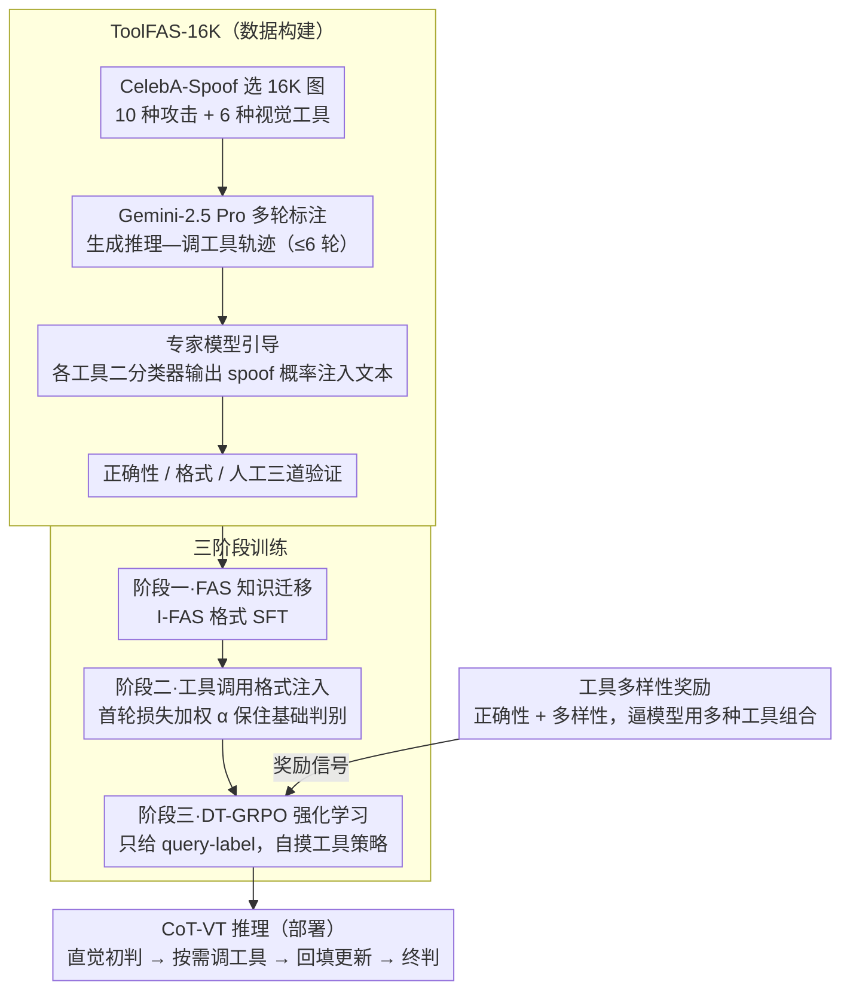

# From Intuition to Investigation: A Tool-Augmented Reasoning MLLM Framework for Generalizable Face Anti-Spoofing

**会议**: CVPR 2026  
**arXiv**: [2603.01038](https://arxiv.org/abs/2603.01038)  
**代码**: 无  
**领域**:人体理解
**关键词**: 人脸反欺骗, 多模态大语言模型, 工具增强推理, 链式思维, 强化学习

## 一句话总结

提出 TAR-FAS 框架，首次将人脸反欺骗（FAS）任务重构为 Chain-of-Thought with Visual Tools（CoT-VT）范式，让 MLLM 在推理过程中自适应调用外部视觉工具（LBP/FFT/HOG等），从"直觉判断"升级为"精细调查"，在 1-to-11 跨域协议上取得 SOTA。

## 研究背景与动机

**领域现状**：人脸识别系统面临照片打印、视频重放、3D 面具等欺骗攻击，FAS 技术用于增强系统可靠性。早期方法在域内表现好，但跨域泛化能力差。

**现有痛点**：近期基于 MLLM 的 FAS 方法（如 I-FAS）将二分类任务转为文本生成，但仅能捕获粗粒度语义线索（如面具轮廓、屏幕边框），对高质量伪造样本的细粒度视觉模式感知力不足。

**核心矛盾**：MLLM 对低级视觉特征存在"盲区"（blindness to low-level visual features），而 FAS 恰恰依赖这些细粒度特征来区分真假人脸。简短的文本描述进一步加剧了这一问题。

**本文目标**：如何引导 MLLM 感知那些容易被忽略的细微欺骗线索？

**切入角度**：从传统 FAS 方法的成功经验出发——LBP、HOG、FFT 等基础视觉算子已被证明能有效提取细粒度 spoof 特征。将这些算子作为"外部工具"嵌入 MLLM 的 CoT 推理过程。

**核心 idea**：让 MLLM 像侦探一样，先直觉判断，再用工具深入调查——"From Intuition to Investigation"。

## 方法详解

### 整体框架

TAR-FAS 把人脸反欺骗从"看一眼就下结论"改造成"先怀疑、再取证"的过程，作者称之为 CoT-VT（Chain-of-Thought with Visual Tools）范式。一张待检人脸进来，MLLM 先凭直觉给一个初判（比如"看起来像屏幕重放"），然后不直接收工，而是按需调用外部视觉工具去"验尸"：怀疑是重放就调 FFT 看频域里有没有屏幕刷新留下的摩尔纹，怀疑是打印照片就调 LBP 看皮肤纹理是否过于均匀，怀疑是 3D 面具就调 Zoom-In 放大边缘和 HOG 看结构。每调用一次工具，工具结果会以文本回填进上下文，模型据此更新判断，如此多轮直到给出最终判决。这条推理链本身就是可解释的证据。

要让一个普通 MLLM 学会这套"会调工具的侦探"行为，作者搭了一条从数据到强化学习的完整链路：先造一份带工具调用轨迹的数据集 ToolFAS-16K，再用三阶段训练把"懂人脸 → 会调工具的格式 → 自己摸索调工具的策略"逐级灌进模型。下面三个设计——ToolFAS-16K 数据集、三阶段训练、DT-GRPO 的工具多样性奖励——分别支撑这条链路的数据、训练流程与强化学习策略。

### 关键设计

**1. ToolFAS-16K：把传统 spoof 算子变成 MLLM 能照着学的"取证轨迹"**

MLLM 的软肋是对低级视觉特征近乎"失明"，而 LBP、FFT、HOG 这些老牌算子恰好擅长抠出这些细粒度 spoof 痕迹——与其让模型硬学，不如把算子包成工具、把"什么时候该调哪个工具、调完怎么读结果"写成示范数据喂给它。作者从 CelebA-Spoof 选了 16,172 张图像，覆盖真实样本和 10 种攻击类型，备齐 6 种工具：Zoom-In（局部放大）、LBP（纹理分析）、FFT 与 Wavelet（频域分析）、Laplacian Edge 与 HOG（结构分析）。标注交给 Gemini-2.5 Pro 多轮生成，每个样本产出 $L$ 轮"推理—调工具"的轨迹（上限 $L^{max}=6$）。

直接信 Gemini 对工具输出的判读并不保险，所以作者加了一道专家模型引导：为每个工具单独训一个二分类器 $\mathcal{E}_k$，对工具输出预测一个 spoof 概率 $p_k$，再把它翻译成文本提示（如"FFT 结果显示 87% 存在 spoof 痕迹"）注入标注。这相当于在标注现场请来一位"第二意见"专家，给通用模型的判读托底。最后再经正确性、格式和人工三道验证，才落成数据集。

**2. 三阶段训练：先认识人脸，再学会调工具的格式，最后自己摸索调工具的策略**

一步到位地直接做强化学习并不现实，模型既不懂 FAS 也不会工具调用格式。作者把训练拆成递进的三步。阶段一是 FAS 知识迁移，用 I-FAS 格式数据 $\mathcal{D}_1$ 做 SFT，把视觉和语言对齐、让模型先具备基本的真假人脸概念。阶段二是工具调用格式注入，在 ToolFAS-16K 上训练多轮调工具的输出格式；这里有个容易被长轨迹训练拖垮的隐患——多轮训练会稀释第一轮那个最基础的分类能力，作者给第一轮的生成损失单加一个缩放因子 $\alpha$ 来加重它的权重，保住基础判别力。阶段三是 DT-GRPO（Diverse-Tool Group Relative Policy Optimization），此时只喂 query-label 对、不再给工具使用标签，靠强化学习让模型自己摸索出高效的工具使用策略。

**3. DT-GRPO 的工具多样性奖励：逼模型别只盯着一两把"万能工具"**

阶段三若只用正确性奖励，会出现一个典型的偷懒解：模型发现某一两个工具大多数情况都能蒙对，就懒得再调别的，结果丢掉了各工具互补的优势，遇到它们覆盖不到的攻击类型就翻车。为此作者在标准 GRPO 的奖励里额外加一项工具多样性奖励，鼓励模型在一条轨迹里尝试不同工具的组合。这样训练出来的策略更鲁棒：面对 3D 面具、屏幕重放等不同攻击，模型会自发地选用更对路的工具组合，而不是用同一把锤子敲所有钉子。

### 损失函数 / 训练策略

- 阶段一：标准自回归交叉熵损失 $\mathcal{L}_1$
- 阶段二：多轮 NLL 损失加权组合 $\mathcal{L}_2 = \alpha \cdot \mathcal{L}_{nll}(0) + (1-\alpha) \cdot \sum_{l=1}^{L} \mathcal{L}_{nll}(l)$
- 阶段三：GRPO + 工具多样性奖励

## 实验关键数据

### 主实验（Protocol 2: One-to-Eleven 跨域测试）

在 CelebA-Spoof 上训练，跨 11 个数据集测试：

| 方法 | 平均 HTER(%) ↓ | 平均 AUC ↑ |
|------|---------------|-----------|
| ViTAF | 23.85 | 82.82 |
| ViT-L | 21.08 | 85.61 |
| FLIP | 18.73 | 87.90 |
| I-FAS | 11.30 | 93.71 |
| **TAR-FAS (Ours)** | **7.54** | **96.67** |

相比前 SOTA I-FAS，HTER 降低 33%，AUC 提升 3 个百分点。

### 各数据集详细结果

| 数据集 | TAR-FAS HTER(%) | I-FAS HTER(%) | 提升 |
|--------|----------------|---------------|------|
| CASIA-MFSD | **0.00** | 1.11 | 完美检测 |
| HKBU-MARs | **3.48** | 18.64 | 降低 81% |
| HiFiMask | **17.97** | 28.23 | 降低 36% |
| CASIA-SURF-3DMask | **2.09** | 6.18 | 降低 66% |

### 关键发现

- 在 3D 面具等高难度攻击（HiFiMask、HKBU-MARs）上提升最为显著，说明工具增强推理对细粒度 spoof 线索特别有效
- TAR-FAS 产生的推理链可解释性强，清晰展示从"直觉观察"到"工具调查"的过渡
- DT-GRPO 使模型在没有工具使用标签的情况下自主学会高效的工具使用策略

## 亮点与洞察

- **范式创新**：首次将传统 FAS 视觉算子（LBP/FFT/HOG）以工具形式融入 MLLM 推理框架，巧妙结合了传统方法的细粒度特征感知能力和 MLLM 的推理泛化能力
- **实用设计**：专家模型引导机制、损失缩放因子、工具多样性奖励，每个设计都针对具体问题
- **可解释性**：推理链不仅给出结果，还展示了调查过程，增强了 FAS 系统的可信度

## 局限与展望

- 工具集固定为 6 种，未来可扩展更多视觉工具或自动发现有效工具
- 标注流水线依赖商业模型（Gemini-2.5 Pro），成本较高
- 推理时间因多轮工具调用而增加，实时性有待优化
- 仅在人脸反欺骗任务上验证，CoT-VT 范式可推广至其他细粒度视觉任务

## 相关工作与启发

- **I-FAS**：首个 MLLM-based FAS 方法，本文在其基础上引入工具增强推理
- **ReAct / DeepEyes**：工具使用 MLLM Agent 的先驱工作，本文将此范式引入 FAS 领域
- **GRPO**：DeepSeek 提出的群组相对策略优化，本文扩展为 DT-GRPO

## 评分

- 新颖性: ⭐⭐⭐⭐⭐ 首次将 tool-augmented reasoning 引入 FAS，CoT-VT 范式创新
- 实验充分度: ⭐⭐⭐⭐ 11 个跨域数据集测试全面，但缺少推理时间分析
- 写作质量: ⭐⭐⭐⭐ 从"直觉到调查"的类比清晰直观
- 价值: ⭐⭐⭐⭐⭐ 为 MLLM+Domain Tools 的组合范式提供了优秀范例

<!-- RELATED:START -->

## 相关论文

- [\[CVPR 2026\] FaceCoT: Chain-of-Thought Reasoning in MLLMs for Face Anti-Spoofing](facecot_cot_reasoning_face_anti_spoofing.md)
- [\[AAAI 2026\] PA-FAS: Towards Interpretable and Generalizable Multimodal Face Anti-Spoofing via Path-Augmented Reinforcement Learning](../../AAAI2026/human_understanding/pa-fas_towards_interpretable_and_generalizable_multimodal_face_anti-spoofing_via.md)
- [\[ECCV 2024\] TF-FAS: Twofold-Element Fine-Grained Semantic Guidance for Generalizable Face Anti-Spoofing](../../ECCV2024/human_understanding/tf-fas_twofold-element_fine-grained_semantic_guidance_for_generalizable_face_ant.md)
- [\[CVPR 2026\] rPPG-VQA: A Video Quality Assessment Framework for Unsupervised rPPG Training](rppg_vqa_video_quality_assessment.md)
- [\[ECCV 2024\] Towards Unified Representation of Invariant-Specific Features in Missing Modality Face Anti-Spoofing](../../ECCV2024/human_understanding/towards_unified_representation_of_invariant-specific_features_in_missing_modalit.md)

<!-- RELATED:END -->
