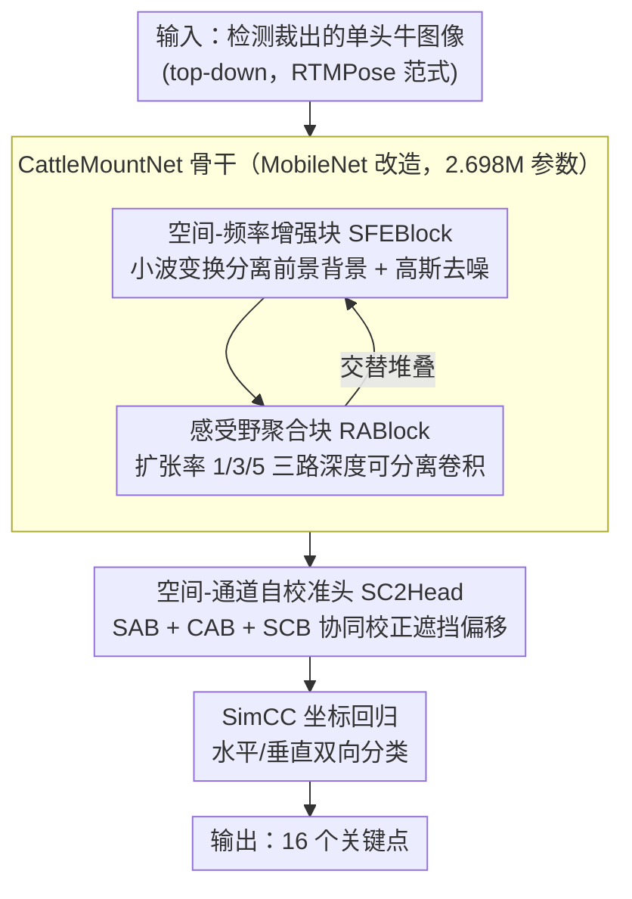

# FSMC-Pose: Frequency and Spatial Fusion with Multiscale Self-calibration for Cattle Mounting Pose Estimation

**会议**: CVPR 2026  
**arXiv**: [2603.16596](https://arxiv.org/abs/2603.16596)  
**代码**: [https://github.com/](https://github.com/)  
**领域**: 人体理解  
**关键词**: 牛只姿态估计, 发情检测, 频率空间融合, 多尺度自校准, 轻量骨干网络

## 一句话总结

FSMC-Pose 提出面向牛只爬跨(mounting)姿态估计的轻量级 top-down 框架，包含频率-空间融合骨干网络 CattleMountNet（通过 SFEBlock 的小波变换+高斯滤波分离前景-背景，RABlock 的多尺度扩张卷积聚合上下文）和多尺度自校准头 SC2Head（空间-通道共校准 + 自校准分支纠正结构偏移），同时构建了首个牛只爬跨数据集 MOUNT-Cattle，在复杂群养环境中以极低计算成本(4.41 GFLOPS, 2.698M 参数)达到 89% AP。

## 研究背景与动机

1. **领域现状**：牛只发情检测对畜牧业经济效益至关重要。爬跨行为是最直观的发情视觉指标。现有动物姿态估计主要沿用人体姿态方法（DeepLabCut、HRNet 等），分为自底向上和自顶向下两种范式。
2. **现有痛点**：(1) 缺乏公开的牛只爬跨数据集，研究基础空白；(2) 发情牛只倾向聚集，爬跨场景比一般牧场密度更高；(3) 杂乱背景干扰、牛只间严重遮挡、相似皮毛模式导致关键点混淆和身份混乱；(4) 现有方法计算量大，不适合实时生产监控。
3. **核心矛盾**：密集群养环境下的爬跨姿态估计需要同时处理背景干扰、遮挡和多尺度关键点，但现有方法无法在轻量计算下同时解决这些问题。
4. **本文目标**：构建数据集 + 设计轻量高精度的爬跨姿态估计方法。
5. **切入角度**：从频率域（小波分解）和空间域（多尺度上下文）两个互补视角增强特征。
6. **核心 idea**：频率-空间融合分离前景 + 多尺度感受野捕获尺度变化 + 自校准纠正遮挡偏移。

## 方法详解

### 整体框架

FSMC-Pose 要解决的是「密集群养牛场里给爬跨牛只估姿态」这件事：背景杂乱、牛只互相遮挡、皮毛花色又相似，而生产环境还要求模型足够轻能实时跑。它沿用 RTMPose 的 top-down 范式——先检测裁出单头牛，再回归 16 个关键点——但把骨干和预测头都换成自己设计的轻量模块。一张裁好的牛只图先进 CattleMountNet 骨干：里面交替堆叠 SFEBlock（从频率域把牛只从背景里"剥"出来）和 RABlock（用多尺度感受野同时盯住小蹄部和大躯干），输出多层级特征；再送进 SC2Head 预测头，用空间-通道协同校准纠正遮挡带来的结构偏移，最后按 SimCC 方式回归出坐标。整套骨干基于 MobileNet 改造，所以参数量能压到 2.698M。

### 关键设计

**1. 空间-频率增强块 SFEBlock：在低对比度牛场里把牛只从背景剥出来**

牛场里泥土、阴影和光照让牛只的纹理跟背景糊成一片，低对比度下关键点本身就模糊，纯空间域卷积很难把前景拎清楚。SFEBlock 的思路是引入一条频率域的旁路：用小波变换卷积（WTConv）对输入做小波分解，得到低频和高频子带，在每个子带上分别做卷积去捕获不同尺度的频率特征，再逆小波变换重建回来——低频管大块的躯干轮廓，高频管边缘和纹理细节，这样能在不堆叠层数的情况下增大感受野又保住局部结构。与此并行，一个固定的 5×5 高斯核负责平滑掉噪声。两路特征相加后用 1×1 卷积压缩通道，再做元素级乘法去精化空间响应，最后残差连接把原始输入带回来：$F_{\text{out}} = \text{Conv}^{3\times3}(F_{\text{WTconv}} \otimes F_{\text{temp}}) + F_{\text{in}}$。频率域建模相当于给网络多了一个"看对比度"的视角，这也是消融里 SFEBlock 在高遮挡场景增益最明显的原因。

**2. 感受野聚合块 RABlock：让同一层特征既看得清小蹄子又罩得住大躯干**

牛只的关键点尺度跨度很大——蹄部只占几个像素，躯干却占大半张图，单一感受野的特征没法同时把两端都照顾到。RABlock 在倒残差（inverted residual）单元的基础上挂了三条并行的 3×3 深度可分离卷积，扩张率分别取 1、3、5，对应捕获局部、中程和远程上下文。三条支路的输出直接求和，再过一层 LayerNorm 归一化：

$$\mathbf{H}_{l-1} = \text{LN}(\mathbf{H}^1 + \mathbf{H}^2 + \mathbf{H}^3)$$

后面配 HardSwish 激活和残差连接。用深度可分离卷积 + 扩张率而不是真的堆多分辨率分支，是为了在拿到多尺度感受野的同时把计算量压住，符合整篇追求轻量的基调。

**3. 空间-通道自校准头 SC2Head：在预测端纠正遮挡造成的关键点错位和误关联**

骨干里的 SFEBlock 和 RABlock 主要在早期特征提取阶段发力，但牛只彼此严重遮挡时，关键点还是容易被错关联到隔壁那头牛身上、或者位置发生结构性偏移，这得在预测头单独处理。SC2Head 设了三条分支：空间注意力分支（SAB）用平均池化加最大池化生成空间权重，告诉网络"该关注图里哪块区域"；通道注意力分支（CAB）用通道级池化生成通道权重，调节"哪些特征通道更可信"；自校准分支（SCB）则提供一路结构校正信号。三者按 $C_o = f_{1\times1}([\text{SA}, \text{CA}]) \odot \text{SC} + X$ 融合——空间和通道权重拼接后压成一张联合注意力图，与自校准信号逐元素相乘做结构修正，再残差加回原特征。把空间、通道、结构三种校准放在一起协同，比单独用某一种注意力更能压住遮挡引发的身份混乱。

### 损失函数 / 训练策略

沿用 RTMPose 的 SimCC 坐标回归策略，把关键点定位拆成水平、垂直两个方向的分类问题，用 KL 散度损失监督预测分布与目标分布对齐。

## 实验关键数据

### 主实验

| 方法 | AP↑ | AP75↑ | AR↑ | GFLOPs | 参数量 |
|------|-----|-------|-----|--------|--------|
| RTMPose-s | 87.6 | 89.5 | 89.0 | 5.47 | 13.49M |
| HRNet-w32 | 86.8 | 88.1 | 88.3 | 9.83 | 28.54M |
| SimpleBaseline | 85.4 | 87.2 | 87.5 | 8.90 | 34.00M |
| **FSMC-Pose** | **89.0** | **92.5** | **89.9** | **4.41** | **2.698M** |

FSMC-Pose 以最低的计算量和参数量达到最高精度。

### 消融实验

| 配置 | AP | AP75 | 说明 |
|------|-----|------|------|
| MobileNet 基线 | 86.2 | 87.8 | 无 SFE/RA |
| +SFEBlock | 87.5 | 89.2 | 频率增强的贡献 |
| +RABlock | 88.1 | 90.8 | 多尺度聚合的贡献 |
| +SC2Head (完整) | 89.0 | 92.5 | 自校准的贡献 |

### 关键发现

- SFEBlock 在高遮挡场景提升最大，说明频率域前景-背景分离有效
- AP75（严格阈值）提升比 AP 更大（+3.0% vs +1.4%），说明方法提升了精确定位能力
- 参数量仅 2.698M（比 RTMPose 减少 80%），GFLOPs 4.41，支持商用 GPU 实时推理
- MOUNT-Cattle 数据集涵盖 1176 个爬跨实例，是首个专注爬跨行为的数据集

## 亮点与洞察

- **首个爬跨姿态数据集**：填补了牛只发情视觉检测的数据空白，采用 COCO 格式支持即插即用训练
- **频率-空间双重建模**：小波变换在动物姿态估计中的应用是新颖的
- **极致轻量化**：2.698M 参数 + 4.41 GFLOPs 实现 89% AP，具有强实际部署价值

## 局限与展望

- 数据集规模有限（1176 实例），泛化到不同牧场/品种需要更多数据
- 仅考虑了 16 个关键点，更细粒度的行为分析可能需要更多关键点
- 未结合行为识别进行端到端发情判断
- 未来可扩展到视频级的时序行为识别

## 相关工作与启发

- **vs DeepLabCut**: DeepLabCut 在拥挤场景下个体混淆严重，FSMC-Pose 通过自校准解决
- **vs RTMPose**: RTMPose 通用性强但参数量大，FSMC-Pose 针对牛只场景定制更高效
- **vs CMBN**: CMBN 压缩 HRNet 但仍是自底向上，密集场景下关键点误关联

## 评分

- 新颖性: ⭐⭐⭐ 方法是已有模块的组合，但场景应用新颖
- 实验充分度: ⭐⭐⭐⭐ 数据集构建扎实，对比充分
- 写作质量: ⭐⭐⭐⭐ 问题定义清晰
- 价值: ⭐⭐⭐⭐ 对智慧牧业有实际价值

<!-- RELATED:START -->

## 相关论文

- [\[CVPR 2026\] GazeOnce360: Fisheye-Based 360° Multi-Person Gaze Estimation with Global-Local Feature Fusion](gazeonce360_fisheye-based_360_multi-person_gaze_estimation_with_global-local_fea.md)
- [\[CVPR 2026\] E-3DPSM: A State Machine for Event-Based Egocentric 3D Human Pose Estimation](e-3dpsm_a_state_machine_for_event-based_egocentric_3d_human_pose_estimation.md)
- [\[CVPR 2026\] Efficient Onboard Spacecraft Pose Estimation with Event Cameras and Neuromorphic Hardware](efficient_onboard_spacecraft_pose_estimation_with_event_cameras_and_neuromorphic_hardware.md)
- [\[ECCV 2024\] Pose-Aware Self-Supervised Learning with Viewpoint Trajectory Regularization](../../ECCV2024/human_understanding/pose-aware_self-supervised_learning_with_viewpoint_trajectory_regularization.md)
- [\[CVPR 2026\] CIGPose: Causal Intervention Graph Neural Network for Whole-Body Pose Estimation](cigpose_causal_intervention_graph_neural_network_for_whole-body_pose_estimation.md)

<!-- RELATED:END -->
