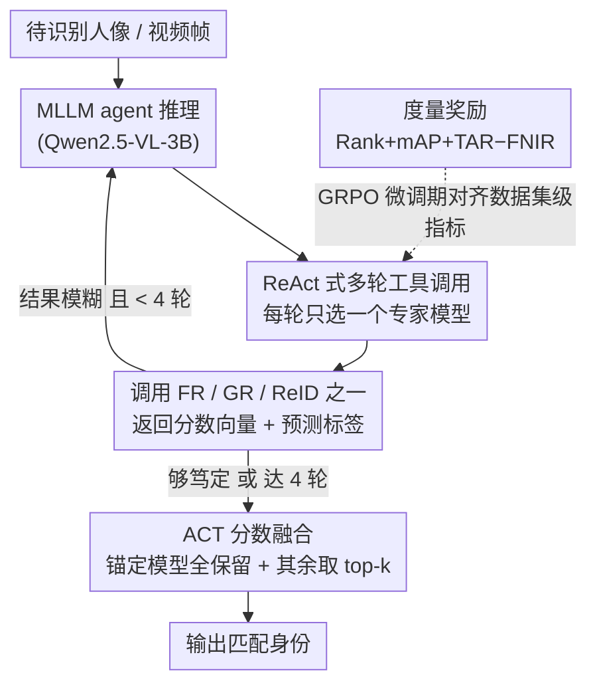

# FusionAgent: A Multimodal Agent with Dynamic Model Selection for Human Recognition

**会议**: CVPR 2026  
**arXiv**: [2603.26908](https://arxiv.org/abs/2603.26908)  
**代码**: [https://github.com/FusionAgent](https://github.com/FusionAgent) (项目页面)  
**领域**: 人体理解  
**关键词**: 模型融合, 多模态大语言模型, 动态模型选择, 生物特征识别, 强化学习微调

## 一句话总结
本文提出 FusionAgent，一个基于多模态大语言模型（MLLM）的智能体框架，用于全身生物特征识别中的动态样本级模型选择——将每个专家模型（人脸识别/步态识别/行人重识别）封装为工具，通过强化微调（RFT）让 agent 学会根据每个测试样本的特征自适应选择最优模型组合，配合新提出的 ACT 分数融合策略，显著超越现有 SOTA 融合方法。

## 研究背景与动机

1. **领域现状**：全身人体识别（whole-body recognition）需要融合人脸、步态、体型等多种生物特征模态。不同的专家模型（FR/GR/ReID）各有擅长场景，通常通过分数融合（score fusion）进行集成。现有融合方法分为规则方法（Z-score、Min-max等）和学习方法（QME等），但它们都采用固定的模型组合策略——对所有测试样本使用相同的全模型组合。

2. **现有痛点**：（1）静态融合假设所有模型对每个样本都有贡献，但实际中人脸模型对背向镜头的人无法提供有用信息；（2）低质量输入的分数会污染融合结果，即使考虑质量感知（如 QME），低质量模型的分数仍会影响最终输出；（3）对所有样本调用所有模型，计算效率低且不必要。

3. **核心矛盾**：最优模型组合是样本相关的——不同质量、角度、分辨率的输入需要不同的模型子集。对所有样本使用相同的模型全集既浪费计算资源，又因为低质量分数的引入而降低了融合质量。

4. **本文目标**（1）如何为每个样本自适应选择最优模型子集？（2）如何在动态选择的异构模型分数之间进行有效融合？

5. **切入角度**：将模型选择建模为 MLLM agent 的工具调用决策问题。agent 可以观察输入样本的特征，reasoning 后决定调用哪些模型，通过强化学习从结果反馈中学习最优策略。

6. **核心 idea**：用 MLLM agent 做样本级动态模型选择，把"用什么模型"的决策从人工规则变成可学习的 reasoning 过程，配合锚定式 top-k 分数融合实现鲁棒的选择性集成。

## 方法详解

### 整体框架
FusionAgent 想解决的事很具体：给一张待识别的人像（或视频帧），到底该信人脸模型、步态模型还是 ReID 模型？以往做法是把三个专家模型的分数全部加权融合，但背向镜头的人脸分数纯属噪声、低质量输入还会污染结果。FusionAgent 的思路是让一个 MLLM 自己看着样本决定"调谁、调几个"。

整体怎么转：每个生物特征模型被封装成一个工具（tool），调用后返回该模型对 gallery 的分数向量和预测标签。一个基于 Qwen2.5-VL-3B 的 agent 接收多模态输入，按 ReAct 风格逐轮推理——先看样本特征和已经拿到的结果，再决定下一步调哪个模型，拿到分数后继续观察、判断是否够了，直到输出答案。最后把这几个被选中模型的异构分数交给 ACT 融合策略整合。整个 agent 用 GRPO 做强化微调，奖励信号是格式、工具调用成功、识别准确性和数据集级度量四项的组合。

### 关键设计

**1. ReAct 式多轮工具调用：把"选哪几个模型"拆成每步只选一个**

直接让 agent 一次性输出"用哪个模型组合"是个组合爆炸问题——$Z$ 个模型就有 $2^Z$ 种子集，RL 几乎学不动。FusionAgent 改成 ReAct（reason-then-act）的多轮控制器：每一轮 agent 先推理当前样本和手头已有的中间结果，然后只选**一个**模型去调，拿回它的分数向量和预测标签，再回到推理决定是继续加模型还是直接收尾，最多走 4 轮。这样做不只是降低了学习难度，更关键的是让决策**依赖中间结果**——第一个模型预测得很笃定就早停，模棱两可才追加下一个模型印证，同时逐轮的结构也让 credit assignment 落得下去。

**2. 度量奖励（Metric-based Reward）：让 agent 对齐数据集级指标，而不是单样本对错**

全身识别真正关心的指标如 TAR@FAR、FNIR@FPIR 都是**阈值依赖**的，必须在整个数据集上算才有意义，单看一个样本选得对不对并不能反映这些指标。于是除了 per-sample 的准确性奖励，FusionAgent 额外设计了一个数据集级奖励：每个 query 采样 $N=6$ 个 rollout 得到各自的模型组合 $M_{o_i}$，以它为基准保留 $\gamma=0.8$ 比例的样本组合不变、其余 20% 随机换新组合以保持探索；再用 ACT 把这些选择下的分数矩阵融合起来，在全训练集上算综合度量

$$R_{mat} = \text{Rank} + \text{mAP} + \text{TAR} - \text{FNIR}$$

把它当奖励回传。这样 agent 学到的就不是"这个样本选对了"，而是"这套选择策略让整个数据集的部署指标更好"，更贴近真实使用场景。

**3. ACT（Anchor-based Confidence Top-k）分数融合：让动态选出来的异构分数能干净地合在一起**

动态选择带来一个新麻烦：每次选中的模型集合都不一样，它们的分数量纲也各不相同，简单相加会被尺度和低置信度噪声带偏。ACT 的处理是"锚定 + 稀疏贡献"：把 agent 选的**第一个**模型当锚定模型 $m_a$，它的分数向量全部保留，作为全局排序的基准；其余被选模型先做 Z-score 标准化对齐尺度，再只保留每个模型 top-$k$ 最高分条目的贡献——

$$c_{m,q,g} = \begin{cases} z_{m,q,g} \cdot s_{m,q,g}, & g \in \mathcal{T}_{m,q} \\ 0, & \text{否则}\end{cases}$$

最终融合分数为

$$\mathbf{s}_q' = \frac{1}{1 + |\mathbf{M}_q|}\Big(\mathbf{s}_{m_a,q} + \sum_{m \in \mathbf{M}_q} \mathbf{c}_{m,q}\Big)$$

top-$k$ 过滤的意义在于：非匹配的 gallery 个体（冒名者）在某个弱模型上偶尔会得高分，若全盘融合就会把这些噪声拉进来抬高错配；只留 top-$k$ 等于让每个辅助模型"只在自己最有把握的地方发言"，锚定模型则保证整体排序不被打散。这也是消融里 ACT 在开放集 FNIR 上优势最大的原因。

### 一个完整示例：一张监控人像怎么被识别
以 LTCC 这类低质量监控样本为例走一遍。输入是一帧背向、分辨率不高的行人图：

- **第 1 轮**：agent 推理"看不到清晰正脸，人脸识别多半不可靠"，于是先调 ReID 模型当锚 $m_a$，拿到它对整个 gallery 的分数向量和 top-1 预测。
- **第 2 轮**：发现 ReID 的 top-1 与 top-2 分数很接近、不够笃定，于是追加调步态模型印证，得到第二组分数。
- **收尾**：判断人脸模型在此样本上无信息，不再调用（最多 4 轮但此处 2 轮即停）。把 ReID（锚定，全保留）和步态（Z-score 标准化后取 top-$k$）两组分数送进 ACT 融合，输出最终匹配身份。

整篇论文的模型选择统计正印证了这种自适应：面部清晰的 CCVID 上 agent 主要选 AdaFace（人脸），低质量监控的 LTCC/MEVID 上则主要选 ReID 模型——"调谁"完全由样本自己决定。

### 损失函数 / 训练策略
- 使用 GRPO 优化，复合奖励 $R = R_f + R_{tool} + R_{acc} + R_{mat}$
- 基础模型为 Qwen2.5-VL-3B，使用 LoRA（rank=64, α=128）
- 学习率 $2 \times 10^{-5}$（线性衰减），KL 系数 $\beta = 0.04$
- 训练 200 步，4 张 H100 GPU，约 4 小时完成
- 所有生物特征模型权重在训练过程中冻结

## 实验关键数据

### 主实验——CCVID 数据集

| 方法 | Rank1↑ | mAP↑ | TAR↑ | FNIR↓ |
|------|--------|------|------|-------|
| AdaFace (单模型) | 94.0 | 87.9 | 75.7 | 13.0±3.5 |
| Z-score | 92.2 | 90.6 | 73.9 | 15.1±1.5 |
| QME (之前SOTA) | **94.1** | 90.8 | 76.2 | 12.3±1.4 |
| **FusionAgent (CoT)** | 93.4 | **92.6** | **85.9** | **10.1±1.5** |

TAR 从 76.2% 提升到 85.9%（+9.7%），FNIR 从 12.3% 降至 10.1%。

### LTCC 数据集

| 方法 | Rank1↑ | mAP↑ | TAR↑ | FNIR↓ |
|------|--------|------|------|-------|
| QME | 73.8 | 39.6 | 35.0 | 64.3±8.0 |
| **FusionAgent (CoT)** | **75.5** | **41.0** | **37.0** | **50.0±8.5** |

FNIR 从 64.3% 降至 50.0%（-14.3%），开放集搜索性能大幅提升。

### 消融实验

| 配置 | Rank1 | mAP | TAR | FNIR |
|------|-------|-----|-----|------|
| QME (baseline) | 73.8 | 39.6 | 35.0 | 64.3 |
| Agent + Z-score | 74.8 | **41.7** | **37.1** | 63.7 |
| Agent + FarSight | 74.8 | **41.7** | **37.2** | 62.5 |
| Agent + ACT (Ours) | **75.5** | 41.4 | 36.5 | **51.0** |

- Agent 选择 + 任何融合方法都优于 QME，证明动态选择是关键
- ACT 在 FNIR 上优势最大（-11.5%），因为 top-k 过滤有效抑制了冒名者分数

### 关键发现
- **动态模型选择是性能提升的主要驱动力**：即使用简单的 Z-score 融合，加上 agent 选择也优于 QME
- **Hard selection（使用全部模型）反而不如 agent 动态选择**：证明"用更多模型≠更好"，选择性融合至关重要
- **FNIR 获益最大**：开放集搜索场景下，冒名者分数的噪声被 top-k 过滤有效控制
- **Cross-domain 泛化**：MEVID 训练→LTCC 测试的零样本设置下仍能获得接近 in-domain 的性能
- **模型选择统计揭示数据集特性**：CCVID（面部清晰）主要选 AdaFace，LTCC/MEVID（监控低质量）主要选 ReID 模型

## 亮点与洞察
- **将模型融合重新定义为 agent 的工具选择问题**：这一框架将多年来的 score fusion 研究提升到了新的层面。不再是设计更好的融合公式，而是让 AI 自己决定用什么模型、怎么融合
- **ReAct 多轮设计**：将 $2^Z$ 的模型组合搜索空间分解为每步单选，使 RL 学习可行。同时支持根据中间结果动态调整策略
- **度量奖励的设计**：巧妙地将数据集级别的评估指标（TAR@FAR, FNIR@FPIR）编码为 RL 的奖励信号，使 agent 能学到超越 per-sample 准确性的全局优化策略
- **CoT 推理提供可解释性**：agent 的推理链条可以解释为什么选择某个模型组合（如"检测到清晰的正面人脸，选择人脸识别模型作为锚"），增强了系统可信度

## 局限与展望
- 基于 Qwen2.5-VL-3B，推理速度相对慢（CoT 模式 2.81s/样本），在实时场景中可能受限
- 3B 模型的 reasoning 能力有限，更大的 MLLM 可能带来更好的选择策略
- 当前的 tool 定义是固定的生物特征模型集合，泛化到新模型需要重新训练 agent
- ACT 的 top-k 超参数需要在训练集上调优，对不同数据集需要不同的 k 值
- 穷举搜索样本级最优模型组合计算上不可行，所以无法得知当前 agent 决策与理论最优的差距

## 相关工作与启发
- **vs QME**：QME 是质量感知的加权融合，但仍使用全部模型。FusionAgent 通过动态选择子集就能超越 QME，说明"选择用什么模型"比"给每个模型分配什么权重"更关键
- **vs 传统 score fusion (Z-score, FarSight)**：加上 agent 动态选择后，简单的融合方法就能超越复杂的学习方法。这启示我们融合策略的复杂度可能不是瓶颈，模型选择才是
- **vs SapiensID**：端到端的多模态识别模型，但缺乏模块化和可解释性。FusionAgent 通过 agent 框架实现了可解释的模块化融合

## 评分
- 新颖性: ⭐⭐⭐⭐ 将 MLLM agent 引入模型融合/选择问题是新颖的，度量奖励设计有创意
- 实验充分度: ⭐⭐⭐⭐⭐ 三个数据集、多个基线、全面消融、跨域评估、统计分析、可视化案例
- 写作质量: ⭐⭐⭐⭐ 问题建模清晰，框架完整，但部分公式可以更简洁
- 价值: ⭐⭐⭐⭐ agent + tool use 的范式对多模型融合领域有启发性，可扩展到其他需要模型选择的场景

<!-- RELATED:START -->

## 相关论文

- [\[CVPR 2026\] A Two-Stage Dual-Modality Model for Facial Expression Recognition](a_two_stage_dual_modality_model_for_facial_expression_recognition.md)
- [\[CVPR 2026\] Dynamic Label Noise Suppression with Optimal Teacher Pool for Facial Expression Recognition](dynamic_label_noise_suppression_with_optimal_teacher_pool_for_facial_expression_.md)
- [\[CVPR 2026\] M4Human: A Large-Scale Multimodal mmWave Radar Benchmark for Human Mesh Reconstruction](m4human_a_large-scale_multimodal_mmwave_radar_benchmark_for_human_mesh_reconstru.md)
- [\[CVPR 2026\] HUMAPS-4D: A Multimodal Dataset for HUman Motion Analysis with Physiological and Semantic informations](humaps-4d_a_multimodal_dataset_for_human_motion_analysis_with_physiological_and_.md)
- [\[ICCV 2025\] EgoAgent: A Joint Predictive Agent Model in Egocentric Worlds](../../ICCV2025/human_understanding/egoagent_a_joint_predictive_agent_model_in_egocentric_worlds.md)

<!-- RELATED:END -->
