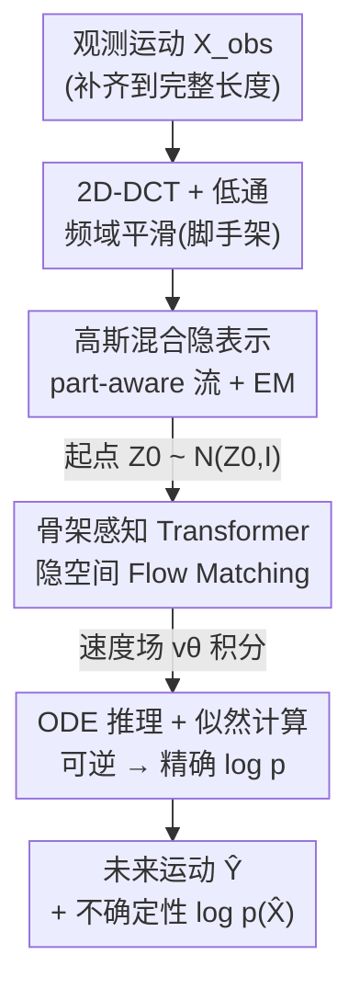

# Gaussian-Mixture Latent Flow for Stochastic 3D Human Motion Prediction

**会议**: CVPR 2026  
**论文**: [CVF Open Access](https://openaccess.thecvf.com/content/CVPR2026/html/Ma_Gaussian-Mixture_Latent_Flow_for_Stochastic_3D_Human_Motion_Prediction_CVPR_2026_paper.html)  
**代码**: 未公开  
**领域**: 人体理解 / 随机人体运动预测  
**关键词**: 随机运动预测, 标准化流, Flow Matching, 高斯混合先验, 不确定性量化  

## 一句话总结
针对随机人体运动预测里"为了准确度和多样性牺牲合理性、且无法可靠量化不确定性"两个老问题，本文在隐空间里用 EM 学一个数据驱动的高斯混合先验把不同运动模式拆开，再用一个全可逆的隐空间 Flow Matching（配骨架感知 Transformer）做预测，从而既能拿到精确的对数似然作为不确定性度量，又在 Human3.6M / AMASS 上同时刷到 SOTA 的准确度与合理性。

## 研究背景与动机
**领域现状**：人体运动预测（HMP）要从观测到的若干帧 3D 姿态预测未来一段运动。早期方法把它当回归问题、只预测一条"最可能"的未来，忽略了人体运动天然的多模态性（同一段历史可以延伸成走路、坐下、转身等多种合理未来）。因此近年主流转向**随机预测**，用 VAE、扩散模型等深度生成模型去学未来运动的整个分布，目标从"准"扩展到"准 + 多样 + 合理"，最好还能给出每条预测的不确定性。

**现有痛点**：作者指出两个被普遍忽视的硬伤。其一是**合理性（plausibility）被牺牲**——预测出现物理上不可能的姿态（如关节角度超出生理范围）；根因是这些方法把一个**单模态先验**（如 VAE 里的标准高斯）强行套在多模态的人体行为上，结果把"走路"和"坐下"这类本应分开的行为模式混在一起（semantic entanglement），生成的运动语义错乱。其二是**不确定性建模不足**——VAE / 扩散模型只能拿变分下界（VLB）这种近似似然，它不是可靠的不确定性度量，在自动驾驶、人机协作这类安全敏感场景里没法用。

**核心矛盾**：单模态先验的表达能力 与 人体运动的多模态本质之间存在结构性错配；同时，为了准确度而采用的生成框架（SDE 扩散、VAE）往往**不可逆 / 似然不可解**，使得"高质量采样"和"精确似然"很难兼得。

**本文目标**：(1) 用一个能自动适配数据的多模态先验把不同运动模式在隐空间里解耦，提升合理性；(2) 用一个全可逆、似然可解的模型，让不确定性可以由精确的对数似然直接读出。

**切入角度**：作者注意到标准化流（normalizing flow）和 Flow Matching 这条线天生满足"可逆 + 似然可算"，正好补上扩散/VAE 缺的那块；同时高斯混合（GMM）天然是多模态的，只要能在隐空间里把混合分布学出来，就能把行为模式拆开。

**核心 idea**：在隐空间里用 **EM 无监督地学一个高斯混合先验**来解耦多模态运动，再用**隐空间 Flow Matching（ODE）+ 骨架感知 Transformer** 做预测——可逆架构让对数似然可精确计算，从而把"准确 + 合理 + 可量化不确定性"统一进一个框架。这是首个面向 HMP 的隐空间 Flow Matching 方法。

## 方法详解

### 整体框架
方法是一个**两阶段框架**：先**造隐空间**，再在隐空间里**学动力学**。

第一阶段（隐空间构造），用一个 part-aware 的流模型作为隐空间骨干（同一个可逆模型正向当编码器、逆向当解码器）。运动序列先经 2D-DCT 投到频域并低通滤波以鼓励生成连续运动，再被流模型映成隐变量 $\mathbf{Z}=f_\theta(\mathbf{X})$；与此同时，用 **EM 算法**把隐空间的目标分布拟合成一个 $K$ 分量的高斯混合 $q_z(\mathbf{Z})=\sum_i \beta_i \mathcal{N}(\boldsymbol{\mu}_i,\boldsymbol{\sigma}_i)$，让不同运动行为各自落到不同子高斯里，从而被解耦——整个过程不需要动作标签。

第二阶段（隐空间预测），把观测序列 $\mathbf{X}_{obs}$ 用最后一帧补齐到完整长度后编码得到起点 $\mathbf{Z}_0$，然后用 **Flow Matching** 学一个速度场 $v_\theta$，把分布 $p_{\mathbf{Z}_0}=\mathcal{N}(\mathbf{Z}_0,\mathbf{I})$ 沿直线 ODE 运到真值未来对应的隐码 $\mathbf{Z}_1$。速度场由一个**骨架感知 Transformer** 实现（按关节的时间轨迹做 token，而非按姿态做 token）。推理时用 ODE 解算器从采样的 $\hat{\mathbf{Z}}_0$ 积分到 $\hat{\mathbf{Z}}_1$ 再逆流解码出运动 $\hat{\mathbf{X}}$，并沿途累积出**精确对数似然** $\log p(\hat{\mathbf{X}})$ 作为不确定性度量。

### 关键设计

**1. 数据驱动高斯混合隐先验：用 EM 把多模态行为在隐空间里拆开**

这一设计直击"单模态先验把不同行为揉成一团"的痛点。作者不再假设隐分布是标准高斯，而是把它建成 $K$ 个高斯分量的混合 $q_z(\mathbf{Z})=\sum_{i=1}^{K}\beta_i\mathcal{N}(\boldsymbol{\mu}_i,\boldsymbol{\sigma}_i)$，并用 EM 算法和流模型**联合优化**。E 步对每个序列算后验责任度 $q(i\mid\mathbf{Z})=\frac{\beta_i\mathcal{N}(f_\theta(\mathbf{X})\mid\boldsymbol{\mu}_i,\boldsymbol{\sigma}_i)}{\sum_j \beta_j\mathcal{N}(f_\theta(\mathbf{X})\mid\boldsymbol{\mu}_j,\boldsymbol{\sigma}_j)}$——注意分子分母里的 Jacobian 行列式 $|\det(\partial f_\theta/\partial\mathbf{X})|$ 因为对每个分量都一样而被约掉，所以责任度只由混合系数和各子高斯密度决定。M 步分两手：先用**软分配**（按 $q(i\mid\mathbf{Z})$ 加权）更新各子高斯的 $(\boldsymbol{\mu}_i,\boldsymbol{\sigma}_i)$ 和系数 $\beta_i$；再固定混合分布、对流模型参数 $\theta$ 用**硬分配**（指示函数 $\mathbb{I}(i)$ 只让似然最大的那个分量贡献梯度）做更新：

$$\sum_{i=1}^{K}\Big[\mathbb{I}(i)\log\Big(\mathcal{N}\big(f_\theta(\mathbf{X})\mid\boldsymbol{\mu}_i^{new},\boldsymbol{\sigma}_i^{new}\big)\,|\det(\tfrac{\partial f_\theta}{\partial\mathbf{X}})|\Big)\Big].$$

软/硬分配的分工很关键：硬分配（每个样本只归属一个分量）是为了**防止 mode collapse**——否则混合分布会塌回单模态，多模态先验就白设了。和相关工作的区别在于：FlowGMM / STG-NF 等需要标签来定混合，MGF 虽无监督但靠在 2D 轨迹上**预先聚类**定死混合中心（对高维、空间结构复杂的 3D 运动失效）；本文的混合分布是**训练中边学边定**，因而能捕到更有意义的运动语义。

**2. 骨架感知 Transformer 的隐空间 Flow Matching：把"未来预测"写成隐码间的直线 ODE 输运**

Flow Matching 省掉了训练时昂贵的 ODE 积分，但也丢掉了隐扩散方法常用的数据空间监督，准确度会受损；同时朴素 Transformer 把整帧姿态当一个 token，丢了人体的空间结构。作者用两点把这块补回来。其一，把预测重写成两个分布间的输运：源 $p_{\mathbf{Z}_0}=\mathcal{N}(\mathbf{Z}_0,\mathbf{I})$（以观测编码 $\mathbf{Z}_0$ 为均值，注意不是标准正态——保留历史上下文），目标 $p_{\mathbf{Z}_1}=\delta(\mathbf{Z}_1)$（真值未来的隐码），沿 Rectified Flow 的直线插值 $\mathbf{Z}_t=t\mathbf{Z}_1+(1-t)\hat{\mathbf{Z}}_0$ 学速度场，目标为 $\mathbb{E}\,\Vert(\mathbf{Z}_1-\hat{\mathbf{Z}}_0)-v_\theta(\mathbf{Z}_t,t)\Vert_2^2$。其二，速度场 $v_\theta$ 用骨架感知 Transformer：它**按单个关节的时间轨迹做 token（temporal tokenization）**而不是按姿态/帧做 token，于是 joint-wise 注意力能显式建模骨架内的空间依赖；注意力沿 $J、C$ 维计算 $\mathrm{Attention}(\mathbf{Q}_i,\mathbf{K}_i,\mathbf{V}_i)=\mathrm{softmax}(\mathbf{Q}_i^\top\mathbf{K}_i/\sqrt{d_k})\mathbf{V}_i$，其中 $\mathbf{Q},\mathbf{K}$ 过 RMSNorm、$\mathbf{V}$ 不过。观测 $\mathbf{X}_{obs}$ 经线性嵌入与 $\mathbf{Z}_t$ 对齐后**逐元素相加**注入为条件信号，而非像旧方法那样把任务当重建——这让历史-未来的依赖被显式建模。此外借鉴扩散图像生成，按时间步 $t$ 对特征做 feature-wise modulation（RMSNorm 后仿射、残差前缩放，参数由 MLP 从 $t$ 的嵌入生成）。这套设计同时把骨架先验和历史条件灌进速度场，补上准确度和合理性。

**3. 可逆架构带来的两阶段精确似然：把不确定性从"近似下界"换成"可算的对数似然"**

VAE/扩散只能给 VLB 这种近似似然，没法当可靠的不确定性度量。本文的模型全程可逆（流编码器可逆 + neural ODE 可逆），于是对数似然可以**精确**地算出来，分两段累加。第一段，沿 $v_\theta$ 把 $\hat{\mathbf{Z}}_0$ 积分到 $\hat{\mathbf{Z}}_1$，用瞬时变量变换公式 $\log p(\hat{\mathbf{Z}}_1)=\log p(\hat{\mathbf{Z}}_0)+\int_0^1 -\mathrm{tr}\big(\nabla_{\mathbf{Z}_t}v_\theta(\mathbf{Z}_t,t)\big)\mathrm{d}t$（其中的迹用 Hutchinson 估计器近似）。第二段，把 $\hat{\mathbf{Z}}_1$ 经流模型逆过程映回运动空间得 $\hat{\mathbf{X}}$，再加上流模型的 Jacobian 行列式项 $\log|\det(\partial\hat{\mathbf{X}}/\partial\hat{\mathbf{Z}}_1)|$，即得 $\log p(\hat{\mathbf{X}})$。作者强调：虽然也能直接用式 (8) 的全局混合分布算似然，但那只反映全局数据分布；**给定观测历史的条件似然**才是更忠实的不确定性度量——它评估"在当前情景下这条预测发生的可能性"，对安全敏感的下游决策（如响应优先级排序）更有用。

### 损失函数 / 训练策略
训练目标由两部分迭代驱动：(1) EM 交替更新——E 步算责任度（式 5），M 步先软分配更新各子高斯 $(\boldsymbol{\mu}_i,\boldsymbol{\sigma}_i,\beta_i)$（式 6），再硬分配更新流模型 $\theta$（式 7），反复迭代得到数据驱动的混合先验 $q_z(\mathbf{Z})$；(2) Flow Matching 的速度场回归损失（式 9）。推理用 Euler 解算器、100 步积分（论文主结果设置），并可换其他 ODE 解算器。姿态用 exponential map 表示，预处理走 2D-DCT 低通；Human3.6M 观测 25 帧（0.5 s）预测 100 帧（2 s）、17 关节，AMASS 观测 30 帧预测 120 帧、22 关节。

## 实验关键数据

### 主实验
在 Human3.6M 和 AMASS 上与 VAE 类、扩散类、参数化（Motron / ProbHMI）基线对比，每个历史采 50 条预测（Best-of-50）。准确度看 ADE/FDE/MMADE/MMFDE，多样性看 APD，合理性看 FID/CMD（AMASS 无动作标签故不算 FID）。

| 数据集 | 方法 | ADE↓ | FDE↓ | CMD↓ | FID↓ | APD↑ |
|--------|------|------|------|------|------|------|
| Human3.6M | BeLFusion | 0.372 | 0.474 | 5.988 | 0.209 | 7.602 |
| Human3.6M | CoMusion | 0.350 | 0.458 | 3.202 | 0.102 | 7.632 |
| Human3.6M | SkeletonDiff | 0.344 | 0.450 | 4.178 | 0.123 | 7.249 |
| Human3.6M | **本文** | **0.333** | **0.399** | **3.015** | **0.088** | 4.804 |
| AMASS | CoMusion | 0.494 | 0.547 | 9.636 | — | 10.848 |
| AMASS | SkeletonDiff | 0.480 | 0.545 | 11.417 | — | 9.456 |
| AMASS | **本文** | **0.461** | **0.474** | **8.579** | — | 7.144 |

本文在 ADE/FDE 上取得 SOTA：Human3.6M 与 AMASS 的 FDE 分别约提升 8.5% 和 13%；CMD/FID（合理性）也都是最优。代价是 APD（多样性）明显低于扩散类方法——作者论证这是有意为之：GSPS/STARS 这类 VAE 方法 APD 高但 FID/CMD 差（生成了不真实运动来"堆多样性"），本文在 MMADE/MMFDE 上仍位列前茅，说明它是用"高效覆盖"贴近真值分布，而非靠不合理的乱猜来虚增多样性。

### 消融实验

| 配置 | H36M ADE↓ | H36M FDE↓ | H36M FID↓ | AMASS CMD↓ | 说明 |
|------|-----------|-----------|-----------|------------|------|
| Ours（完整） | 0.333 | 0.399 | 0.088 | 8.579 | 可学高斯混合先验 + 条件 + 时间 token |
| w/ Fixed Gaussian | 0.336 | 0.407 | 0.133 | 9.583 | 混合中心聚类后固定（≈仅式7单独训），多数指标退化 |
| w/ Standard Normal | 0.356 | 0.421 | 0.143 | 10.706 | 换回单模态标准高斯，合理性大跌 |
| w/ FM Only | 0.341 | 0.408 | 0.156 | 12.563 | 去掉隐空间、直接在数据空间做 ODE，最差 |
| w/o Past | 0.346 | 0.419 | 0.223 | 8.849 | 源分布换成 $\mathcal{N}(0,I)$，多样性微增但准确度显著掉 |
| w/o Condition | 0.352 | 0.417 | 0.118 | 8.981 | 去掉观测条件→变成重建架构，准确度多样性都掉 |
| w/ Spatial Tokenization | 0.397 | 0.461 | 0.208 | 10.056 | 按帧/频率做 token（无骨架先验），准确度合理性大幅退化 |

似然估计对比（LL↑，越大越好）：

| 数据集 | Ours | w/ FM Only | w/ Standard Normal | Motron |
|--------|------|-----------|--------------------|--------|
| Human3.6M | **1.584** | 0.777 | -0.134 | 1.319 |
| AMASS | **-0.628** | -0.677 | -1.105 | — |

### 关键发现
- **多模态先验是合理性的主要来源**：从"可学混合 → 固定混合 → 标准高斯 → 无隐空间"一路退化，FID/CMD 持续变差，证明单模态先验确实会把行为模式揉乱、损害合理性；可学（EM 边训边学）比固定聚类更能贴合数据分布。
- **隐先验过简会反噬似然**：在 LL 指标上，"无任何先验（FM Only）"竟比"标准正态先验"还好，说明给复杂人体运动强加过于简单的先验会损害分布建模；高斯混合先验 LL 最高，且超过参数化的 Motron，支撑了"用似然当不确定性度量"的可靠性。
- **历史条件要显式注入而非当重建目标**：w/o Past（源分布丢掉 $\mathbf{Z}_0$）和 w/o Condition（去掉观测条件）都让准确度明显下降，验证把观测当条件信号显式注入优于把任务当重建。
- **按关节时间轨迹做 token 很关键**：换成空间 token（w/ Spatial Tokenization）后准确度和合理性都大幅退化，验证骨架感知 Transformer 引入的结构先验有效。
- **多样性-合理性是显式 trade-off**：定性结果显示本文对跳舞等灵活动作保留可见多样性（手臂摆幅/时序有差异），对坐下等受限动作则优先合理性、避免过度臆测；扩散基线偶尔生成极端关节弯折或违反历史语义，本文则没有这类伪影。

## 亮点与洞察
- **把"似然可算"当一等公民**：选 normalizing flow + Flow Matching 作骨干，本质是把可逆性写进架构，于是不确定性不再是事后近似（VLB），而是沿 ODE 精确累加 + 流 Jacobian 的闭式量——这是扩散/VAE 难以给出的，对安全敏感场景很实用。
- **EM 联合训练流模型与混合先验，且软/硬分配各司其职**：软分配更新分布、硬分配更新流模型来防 mode collapse，是一个干净的无监督多模态解耦方案，绕开了 FlowGMM/STG-NF 对标签的依赖，也比 MGF"在 2D 轨迹上预聚类"更适配高维 3D 运动。这套"用 EM 在隐空间里边训边长出多模态先验"的思路可迁移到其他多模态轨迹/序列生成任务。
- **温度恰好的多样性观**：作者用 APD 低却 MMADE/MMFDE 高来说明"低多样性不等于差"，把"高效覆盖真值分布"与"靠乱猜堆 APD"区分开——这对随机预测领域长期偏爱高 APD 的评测惯性是一种纠偏。
- **按关节时间轨迹 token + joint-wise 注意力**是把骨架结构先验灌进 Transformer 速度场的轻量做法，可复用到其它以人体骨架为输入的生成/预测模型。

## 局限与展望
- 作者承认：构造出的高斯混合先验直接用于分类/异常检测等其他任务时表现欠佳，根因是缺标签监督聚类、且"既要清晰语义边界又要生成连续性"本身矛盾。
- 面对**长尾分布**时混合先验可能退化成单模态去拟合主模态；常用的重采样方法因本框架无标签而难以套用，作者提议在分配过程加约束作为未来方向。
- 方法**偏保守**：默认尽量保持已知运动上下文，但现实中人可能在不久后改变运动模式，这种偏离不会被"历史一致"的预测捕捉到——⚠️ 这意味着在需要预测"突变/意图切换"的场景下本方法可能系统性漏掉真值分支。
- 多样性（APD）系统性低于扩散基线，虽被论证为"有意为之"，但在确实需要广覆盖的应用里仍是劣势。
- 推理用 100 步 Euler 积分，ODE 求解成本与效率细节放在附录，正文未展开；实际部署时积分步数与延迟的权衡需另行评估。

## 相关工作与启发
- **vs 单模态 VAE 类（GSPS / STARS / DLow）**: 它们靠标准高斯先验 + 显式多样化采样，APD 高但 FID/CMD 差、易出不合理姿态；本文用数据驱动高斯混合先验解耦行为模式，牺牲部分 APD 换来显著更好的合理性与似然。
- **vs 隐扩散类（BeLFusion / CoMusion / SkeletonDiff）**: 同样在隐空间操作，但它们用 VAE/AE 当骨干、SDE 训练，似然不可解、依赖数据空间监督；本文换成可逆流骨干 + ODE Flow Matching，得到精确似然，并用骨架感知 Transformer + 显式历史条件补回准确度。
- **vs 混合先验流方法（FlowGMM / STG-NF / MGF）**: 前两者需标签构造混合，MGF 虽无监督却靠 2D 轨迹预聚类定死混合（对 3D 高维运动失效）；本文用 EM 在训练中联合学混合分布，更能捕到 3D 运动语义。
- **vs 参数化不确定性方法（Motron / ProbHMI）**: Motron 在 SO(3) 上用集中高斯采样、缺约束故合理性差；ProbHMI 用可逆网络映到隐高斯但似然靠分位数近似。本文似然为精确累加，LL 指标上超过 Motron。

## 评分
- 新颖性: ⭐⭐⭐⭐⭐ 首个 HMP 隐空间 Flow Matching，把 EM 学高斯混合先验、可逆精确似然、骨架感知速度场三者统一，切入角度清晰。
- 实验充分度: ⭐⭐⭐⭐ 两大 MoCap 数据集 + 准确/多样/合理三维度 + 多组消融 + 似然对比，较扎实；效率分析仅在附录、长尾场景未实测。
- 写作质量: ⭐⭐⭐⭐ 动机-方法-实验逻辑顺畅，公式完整；EM 软/硬分配与两阶段似然推导讲得清楚。
- 价值: ⭐⭐⭐⭐ 把"精确不确定性"带进随机 HMP，对自动驾驶/人机协作等安全敏感下游有实用价值，思路可迁移到多模态序列生成。

<!-- RELATED:START -->

## 相关论文

- [\[CVPR 2026\] Unified Number-Free Text-to-Motion Generation Via Flow Matching](unified_number-free_text-to-motion_generation_via_flow_matching.md)
- [\[CVPR 2025\] Stochastic Human Motion Prediction with Memory of Action Transition and Action Characteristic](../../CVPR2025/human_understanding/stochastic_human_motion_prediction_with_memory_of_action_transition_and_action_c.md)
- [\[AAAI 2026\] Spatiotemporal-Untrammelled Mixture of Experts for Multi-Person Motion Prediction](../../AAAI2026/human_understanding/spatiotemporal-untrammelled_mixture_of_experts_for_multi-person_motion_predictio.md)
- [\[CVPR 2026\] Anatomical Domain Shifts: Test-time Heterogeneous Adaptation for 3D Human Pose Prediction](anatomical_domain_shifts_test-time_heterogeneous_adaptation_for_3d_human_pose_pr.md)
- [\[CVPR 2026\] FMPose3D: monocular 3D pose estimation via flow matching](fmpose3d_monocular_3d_pose_estimation_via_flow_matching.md)

<!-- RELATED:END -->
