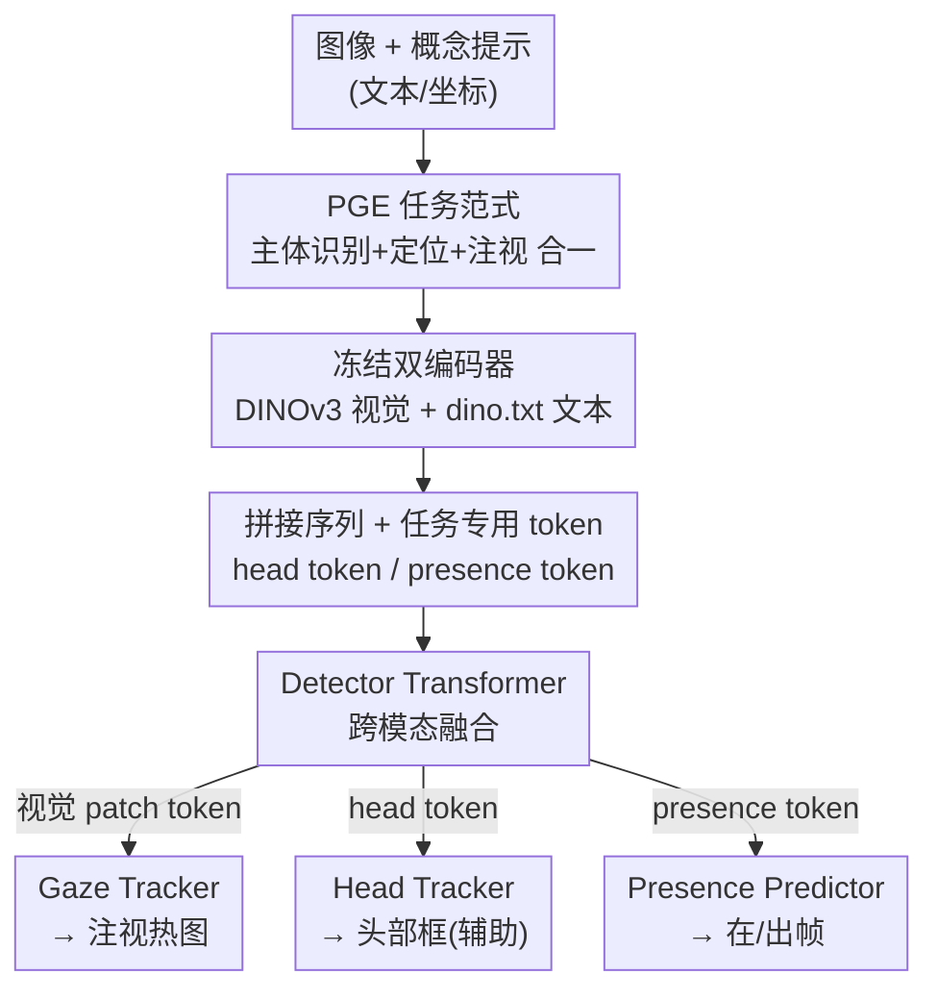

# Gaze Target Estimation Anywhere with Concepts

**会议**: CVPR 2026  
**论文**: [CVF Open Access](https://openaccess.thecvf.com/content/CVPR2026/html/Cao_Gaze_Target_Estimation_Anywhere_with_Concepts_CVPR_2026_paper.html)  
**代码**: https://github.com/IrohXu/GazeAnywhere (有)  
**领域**: 人体理解 / 注视目标估计  
**关键词**: 注视目标估计, 可提示感知, 概念驱动, 端到端, 视觉基础模型  

## 一句话总结
本文提出"可提示注视目标估计（PGE）"这一新任务——用一句自然语言或一个坐标点指定画面里的某个人，模型端到端直接吐出他注视位置的热图，并配套了 120K 概念标注数据集 Gaze-Co 和首个 PGE 模型 GazeAnywhere，在多个基准上达到 SOTA。

## 研究背景与动机
**领域现状**：注视目标估计（gaze-following，给一个人预测他在场景里看哪儿）的主流做法是多分支融合架构——先用一堆专用模型抽显式线索（头部框、人体姿态、深度图），再把这些特征拼起来回归注视点。代表作如 Gaze-LLE、ViTGaze、Sharingan 都依赖这些中间表示。

**现有痛点**：这套流水线在推理时也强依赖头部/人脸 bounding box 这类先验。在真实场景（拥挤人群、光照差、儿童小脸难检）里，前置的检测/跟踪一旦出错，错误会**级联**放大，整个系统直接失败。更别提这些模型没法让用户灵活指定"我要分析画面里哪一个人"——要么只能分析检测器恰好框出来的人，要么端到端模型干脆无法指定主体。

**核心矛盾**：注视分析本该是个语义任务（"那个红衣服小孩在看哪"），却被工程上拆成了"先精确定位、再估计方向"的刚性串行流程。定位环节成了瓶颈，而它本不该是必需的输入。

**本文目标**：把"指定主体"和"估计注视"这两件事**合成一个端到端任务**，让用户用自然语言或一个点就能完成主体指定，彻底去掉对头部框/姿态的硬依赖。

**切入角度**：开放词汇检测器（OVD）和 SAM 系列已经证明——视觉系统可以被**概念级**的文本/视觉提示驱动，而非依赖预定义的显式定位线索。作者把这套"可提示"范式迁移到注视理解。

**核心 idea**：用一个概念提示（如"穿红衬衫的男孩"）条件化注视预测，让单个模型隐式地同时完成主体识别、定位与注视估计，把多阶段流水线压成一次前向。

## 方法详解

### 整体框架
GazeAnywhere 的输入是一张 RGB 图像 $I \in \mathbb{R}^{3\times H\times W}$ 加一个提示 $P$（文本或视觉坐标），输出是注视热图 $\hat{H}\in\mathbb{R}^{H_{out}\times W_{out}}$，其中 $\hat{H}(i,j)$ 表示提示所指主体注视位置 $(i,j)$ 的概率。整条流水线只有一组**冻结**的双编码器 + 一个**可训练**的 Detector Transformer + 三个解码头，没有任何外部检测/姿态/深度模型。

具体地：冻结的视觉编码器（DINOv3）和文本编码器（dino.txt）分别把图像和提示编成 token；两个投影层把它们映射到同一低维空间 $D$；把投影后的视觉 patch token、文本 token，再加上两个专用 token（head token 与 presence token）拼成一条序列，喂进 Detector Transformer 做跨模态融合；最后三个解码头分别从对应 token 上读出注视热图、头部框（辅助任务）、在/出帧二分类。

### 关键设计

**1. PGE 任务范式：把"指定谁"和"看哪"合并成一次端到端预测**

这是全文的根，针对的痛点正是多阶段流水线的级联失败。传统方法必须先有头部框才能算注视；PGE 重新定义任务为"给定图像 $I$ 和提示 $P$，直接产出热图 $\hat{H}$"，从根上排除了 bounding box、pose、depth 这些辅助输入。提示有两类：**文本提示**用一句可视觉定位的名词短语，**视觉提示**给一个空间坐标（如头框中心点 `[0.52, 0.48]`）。为缓解自然语言固有的歧义（如"后面那个人"指代不清），作者把文本提示结构化成四类可组合字段——外观（identity + 修饰词如发色/衣着/眼镜）、位置、姿态、动作。模型必须隐式学会"先认人、再定位、再估注视"这一整套，而不是调用外部专家模型的显式输出。这个范式转变才是论文真正的贡献，后面的架构和数据集都是为落地它服务的。

**2. 冻结双编码器 + Detector Transformer：用基础模型特征做跨模态融合**

针对"如何在不引入专用定位模型的前提下对齐主体语义与图像内容"。视觉端用冻结 ViT $\phi_V$ 抽 patch token 序列 $\phi_V(I)=[c, s_1,\dots,s_{N_V}]$（含一个 `[CLS]` token $c$）；文本端用冻结编码器 $\phi_T$，把 `[EOS]` token 映射进图像嵌入空间。由于两者维度可能不同，用两个可训练线性投影 $W_V, W_T$ 把它们压到共享低维 $D$：$Z_V = W_V\cdot\phi_V(I)$，$Z_T = W_T\cdot\phi_T(T_E)$。Detector Transformer $\psi$ 直接复用 DINOv3 的 transformer block，输入是把投影后视觉 patch token $s'$、文本内容 token $t'$、两个专用 token 拼成的单序列 $F=[t_h, t', s', t_p]\in\mathbb{R}^{(N_T+N_V+2)\times D}$，并给文本 token 加 1D、视觉 token 加 2D 正弦位置编码。$\psi$ 输出等长的精炼序列，再分发给各解码头。冻结大编码器 + 只训练投影/融合/解码这套轻量配置，既复用了 VFM 的视觉-文本对齐能力，又把可训练参数压得很小——消融显示 DINOv3 backbone 在几乎所有指标上最好，印证它的视觉-文本对齐最契合 PGE。

**3. 双任务专用 token：解耦"局部定位"与"全局在/出帧判断"**

针对"注视估计本质是局部任务，但'目标在不在画面里'要看全局上下文，硬塞给一个 query 会互相打架"这个具体冲突。作者引入两个可学习 token：**Head Token** $t_h$（用文本 `[EOS]` 嵌入初始化，$t_h = t'_{eos}$）负责显式预测主体头部框，作为图文对齐的监督目标；**Target Presence Token** $t_p$（用视觉 `[CLS]` 初始化并加可学习偏置，$t_p = c' + E_{presence}$）专门做在/出帧的全局布尔判断。两者经 $\psi$ 融合后各自接解码头：head token 过 3 层 FFN 回归 4 维框 $[x,y,w,h]$；presence token 过 2 层 FFN 出一个 logit 做二分类；视觉 patch token 重排回 2D 网格后过两层转置卷积上采样成 $64\times64$ 热图。把"局部定位"和"全局在/出帧"显式拆给不同 token，避免单一机制顾此失彼——损失消融里 head 辅助任务同时提升了注视估计和在/出帧预测，正是这种解耦带来的协同。

**4. Gaze-Co 数据引擎：人在回路、MLLM 优先的概念标注流水线**

针对"没有任何现成注视数据集带概念标注"这一缺口。引擎分三阶段：**(1) 对齐与过滤**——把 GazeFollow、VAT、ChildPlay 三个来源统一成同一 schema（像素头框 + 归一化注视点），并用几何/清晰度阈值（头框宽 ≥30px、高 ≥40px、面积 ≥2500px²、框图比 ∈[0.008,0.3]、Tenengrad 清晰度足够）剔除过小/过大/模糊样本；**(2) 概念生成**——用 Gemini 2.5 Pro 批量生成"外观+位置+动作+姿态+可见人数"的短概念短语，外观优先用稳定视觉线索（发型、眼镜、颜色），末尾词限定为 man/woman/boy/girl/infant/child 作为感知年龄性别线索（非身份验证）；**(3) 验证**——MLLM 先审每条概念标 pass/fail，人工再抽检通过批次、评估批成功率，检查一致性（概念与头框对得上）、完整性（四字段齐全不冲突）、隐私（无敏感身份信息），错误率高则回到生成阶段调 prompt 重跑，迭代到错误率 ≤1%。最终产出 120K 训练样本，并把三个数据集测试集转成 GazeFollow-Concept / VAT-Concept / ChildPlay-Concept 三个基准，外加一个 IRB 批准的私有自闭症儿童社交沟通 OOD 集 Child-SC。

### 损失函数 / 训练策略
端到端多任务联合训练，总损失为三项加权和：

$$L_{total} = L_{gaze} + L_{presence} + L_{head}$$

- $L_{gaze}$：注视热图的逐像素 BCE，监督目标是把 2D 高斯（$\sigma=3$）放在真值注视点处构造的热图。
- $L_{presence}$：在/出帧的 Focal Loss（超参用原文默认值）。
- $L_{head}$：头部框的 L1 + GIoU，$L_{head}=\lambda_{l1}\|b-\hat{b}\|_1 + \lambda_{iou}L_{iou}(b,\hat{b})$，沿用 DETR/OWL-ViT 设 $\lambda_{l1}=5,\ \lambda_{iou}=2$。

训练 25 epoch（Adam + cosine，初始 lr 1e-3，batch 128），再以 lr 1e-5 续 5 epoch；4×H100 训练，输出热图 $64\times64$。

## 实验关键数据

### 主实验
基线由三个 SOTA 注视模型（Gaze-LLE / Sharingan / ViTGaze）分别配三个 OVD（GroundingDINO / LLMDet / OWLv2 / RexSeek）拼成两阶段流水线；GazeAnywhere 是单模型端到端。下表摘取代表性结果（L2 越低越好，AP/AUC 越高越好）：

| 模型 | 参数量 | 单样本耗时(ms)↓ | GazeFollow Avg L2↓ | VAT L2↓ / AP↑ | ChildPlay L2↓ / AP↑ | Child-SC(OOD) L2↓ / AP↑ |
|------|--------|------|------|------|------|------|
| Gaze-LLE + RexSeek | 3B | 1183 | 0.108 | 0.121 / 0.861 | 0.119 / 0.914 | 0.172 / 0.846 |
| Gaze-LLE + OWLv2-L | 745M | 208 | 0.146 | 0.229 / 0.792 | 0.127 / 0.893 | 0.161 / 0.830 |
| Sharingan + RexSeek | 3B | 1159 | 0.207 | 0.273 / 0.601 | 0.178 / 0.863 | 0.166 / 0.810 |
| **GazeAnywhere-CLIP-L** | 430M | **35** | 0.105 | 0.137 / 0.874 | 0.104 / 0.915 | 0.146 / 0.868 |
| **GazeAnywhere-DINOv3-L** | 870M | 96 | **0.099** | **0.123 / 0.879** | 0.098 / 0.906 | **0.090 / 0.902** |

关键看点：DINOv3 版在大多数指标上 SOTA，且在最难的真实临床 OOD 集 Child-SC 上 L2 仅 0.090 / AP 0.902，远超所有两阶段基线（最好的也才 0.161/0.846）；CLIP-L 版只用 430M 参数、35ms/张，做到精度-速度双优——单模型端到端的延迟优势相比 RexSeek 这类大 OVD（>1100ms）极其明显。

GazeAnywhere 还甩开零样本通用 VLM 一大截：

| 模型 | 参数 | GazeFollow Avg L2↓ | VAT L2↓ / AP↑ |
|------|------|------|------|
| Qwen3-VL-8B | 8B | 0.201 | 0.286 / 0.651 |
| Gemini 2.5 Flash | - | 0.216 | 0.292 / 0.661 |
| **GazeAnywhere-DINOv3-L** | 870M | **0.099** | **0.123 / 0.879** |

说明 PGE 需要专门建模，通用 VLM 直接做注视点预测远不够。

### 消融实验

**损失项消融**（GazeFollow-Concept / VAT-Concept）：

| $L_{gaze}$ | $L_{presence}$ | $L_{head}$ | GazeFollow Avg L2↓ | VAT L2↓ / AP↑ |
|:---:|:---:|:---:|------|------|
| ✓ | ✗ | ✗ | 0.102 | 0.135 / — |
| ✓ | ✓ | ✗ | 0.103 | 0.136 / 0.863 |
| ✓ | ✗ | ✓ | 0.099 | 0.128 / — |
| ✓ | ✓ | ✓ | **0.099** | **0.123 / 0.879** |

**提示策略消融**（VAT-Concept）：

| 提示类型 | AUC↑ | L2↓ | AP↑ |
|------|------|------|------|
| 无提示 | 0.875 | 0.210 | 0.796 |
| 视觉提示(坐标) | 0.914 | 0.131 | 0.894 |
| 文本(仅外观) | 0.904 | 0.153 | 0.840 |
| 文本(仅位置) | 0.893 | 0.188 | 0.826 |
| 文本(全部字段) | **0.928** | **0.123** | 0.879 |

### 关键发现
- **head 辅助框任务贡献最大**：去掉 $L_{head}$ 后 VAT L2 从 0.123 退到 0.136，且它同时提升注视估计和在/出帧；而 presence loss 只服务于自身的在/出帧二分类，对注视点本身几乎无帮助——印证"定位/在帧解耦"的设计判断。
- **文本提示能追平视觉提示**：四字段全用时（L2 0.123）与坐标视觉提示（0.131）相当甚至更好，说明自然语言指定主体是可行的；分解看，外观和姿态是最关键的字段。
- **编码器选择**：DINOv3-L 在几乎所有指标上压过 CLIP / SigLIP2 / MetaCLIP2，体现其视觉-文本对齐对 PGE 更友好。
- **OOD 泛化强**：在未见过的儿童社交沟通视频上仍稳健，对自闭症等临床场景有现实价值。

## 亮点与洞察
- **把"可提示"范式迁移到注视理解**：SAM/OVD 证明了概念提示能驱动检测分割，本文第一个把它用到 gaze-following，并顺手解决了"指定主体"这个长期没法做的功能——这是最"啊哈"的迁移。
- **用初始化把先验注入专用 token**：head token 用文本 `[EOS]` 初始化（天然带语义对齐倾向），presence token 用视觉 `[CLS]` 初始化（天然带全局信息）——这个小细节让两个 token 一上来就站在对的起点，思路可迁移到任何"局部+全局双任务"的 token 设计。
- **端到端换来的不只是精度还有延迟**：去掉外部 OVD 后，CLIP 版 35ms/张 vs 两阶段 200~1100ms，AR 实时部署才成为可能（论文还演示了 AnyGaze AR Agent）。
- **数据引擎可复用**：MLLM 优先 + 人工抽检 + 批成功率回路把错误率压到 ≤1%，这套"自动生成-自动审-人工抽检-不合格回炉"的流程对任何需要概念标注的视觉任务都通用。

## 局限与展望
- **依赖结构化四字段提示**：自然语言固有歧义靠"外观+位置+动作+姿态"结构化来缓解，真实用户的自由表达（如"后面那个人"）能否稳定 grounding，论文用结构化字段绕开了，未充分压力测试。⚠️ 提示歧义鲁棒性以原文实验为准。
- **概念标注链路重依赖商用 MLLM**：Gaze-Co 的概念由 Gemini 2.5 Pro 批量生成，标注质量与该模型的视觉理解上限绑定；私有 Child-SC 因 IRB 限制只能全人工标，规模有限。
- **仍是单帧注视目标**：任务定义在图像/单帧上，视频里的注视转移、时序连续性未在主模型中显式建模（AR Agent 里靠外层 MLLM 数 gaze shift）。
- **改进方向**：可探索把视觉提示从单点扩到框/涂鸦等更丰富交互；把时序融进 Detector Transformer 做视频级 PGE；以及在标注引擎里减少对单一闭源 MLLM 的依赖。

## 相关工作与启发
- **vs Gaze-LLE / ViTGaze / Sharingan**：它们都用 VFM 特征做注视估计，但**推理时仍需头部框**，必须外接 OVD 才能指定主体，形成串行瓶颈；本文把主体指定吸收进模型内部，单次前向完成，且延迟显著更低。
- **vs 两阶段 OVD + 注视模型流水线**：基线把"检测人头"和"估计注视"拆开，检测出错就级联失败；GazeAnywhere 端到端联合优化三任务，OOD 集上优势尤其明显（L2 0.090 vs 0.161+）。
- **vs 通用 VLM（Qwen3-VL / Gemini）零样本预测注视点**：通用模型缺乏注视专门建模，L2 差一倍以上，说明 PGE 仍需专用模型 + 专用数据。
- **承袭 OVD / SAM 的可提示范式**：本文是该范式在 human-centric 注视任务上的自然延伸，把"概念条件化感知"从物体推广到"人在看哪"。

## 评分
- 新颖性: ⭐⭐⭐⭐⭐ 首次把可提示概念驱动范式引入注视目标估计，定义了 PGE 新任务并去掉多阶段依赖
- 实验充分度: ⭐⭐⭐⭐⭐ 三公开基准 + 临床 OOD 集，含损失/提示/编码器多组消融与延迟对比
- 写作质量: ⭐⭐⭐⭐ 任务动机与架构讲得清楚，部分公式/记号排版略粗糙
- 价值: ⭐⭐⭐⭐⭐ 端到端、低延迟、可文本指定主体，对 AR 与自闭症临床评估有直接落地价值

<!-- RELATED:START -->

## 相关论文

- [\[ICCV 2025\] Multi-view Gaze Target Estimation](../../ICCV2025/human_understanding/multi-view_gaze_target_estimation.md)
- [\[CVPR 2026\] GazeShift: Unsupervised Gaze Estimation and Dataset for VR](gazeshift_unsupervised_gaze_estimation_and_dataset_for_vr.md)
- [\[AAAI 2026\] Toward Gaze Target Detection in Young Autistic Children](../../AAAI2026/human_understanding/toward_gaze_target_detection_of_young_autistic_children.md)
- [\[CVPR 2026\] Render-to-Adapt: Unsupervised Personal Adaptation for Gaze Estimation](render-to-adapt_unsupervised_personal_adaptation_for_gaze_estimation.md)
- [\[CVPR 2026\] See Through the Noise: Improving Domain Generalization in Gaze Estimation](see_through_the_noise_improving_domain_generalization_in_gaze_estimation.md)

<!-- RELATED:END -->
