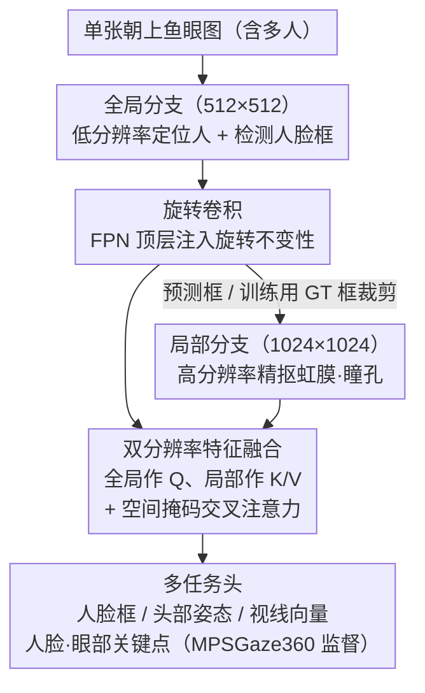

# GazeOnce360: Fisheye-Based 360° Multi-Person Gaze Estimation with Global-Local Feature Fusion

**会议**: CVPR 2026  
**arXiv**: [2603.17161](https://arxiv.org/abs/2603.17161)  
**代码**: [https://caizhuojiang.github.io/GazeOnce360/](https://caizhuojiang.github.io/GazeOnce360/) (Project Page)  
**领域**: 人体理解
**关键词**: 视线估计, 鱼眼相机, 多人场景, 双分辨率融合, 合成数据

## 一句话总结
本文提出 GazeOnce360，一个端到端的双分辨率 CNN 模型，用于从单个朝上放置的桌面鱼眼相机进行 360° 多人视线方向估计，同时构建了首个面向该场景的大规模合成数据集 MPSGaze360，在精度和速度两方面均大幅超越现有多阶段方法 GAM360。

## 研究背景与动机
视线估计在人机交互、协作分析、VR 等领域有广泛应用。现有单人视线估计方法已较为成熟（MPIIGaze、ETH-XGaze 等数据集驱动），但真实场景往往涉及多人。

现有多人视线估计的痛点：(1) **前向相机视场角有限**，需要多台同步设备才能覆盖全部方向；(2) 已有尝试（如 GAM360）使用鱼眼相机，但采用**多阶段流水线**（检测人脸 → 透视投影 → 单独估计），计算昂贵、容易累积误差，且全景拼接可能在边界处裂开人脸导致检测遗漏。

本文的切入点是：朝上放置的鱼眼相机天然覆盖 360° 全景，一台设备即可捕获所有方向的人。但鱼眼图像存在**严重的几何畸变**和**透视变化**，且缺乏公开的多人朝上鱼眼视线数据集。于是作者从数据（合成数据集）和模型（端到端双分辨率架构）两方面同时解决这些问题。

## 方法详解

### 整体框架
GazeOnce360 要解决的是：单张朝上的鱼眼图里同时出现好几个朝向各异的人，怎么一次性把每个人的人脸框、头部姿态和视线方向都估出来，而不走"检测人脸→透视投影→逐人估计"那套又慢又会累积误差的多阶段流水线。它的做法是把整张图同时喂给两条分辨率不同的分支：全局分支在低分辨率下看整幅鱼眼图，负责定位人在哪、检测人脸框并提供空间上下文，并在高层特征上叠一层旋转卷积来抵消鱼眼里人脸的任意朝向旋转；局部分支在高分辨率下只盯着被裁出来的人脸区域，专门抠虹膜、瞳孔这些视线最依赖的精细眼部特征。两路特征用交叉注意力对齐融合后，再由一组多任务头同时回归人脸框、头部姿态、视线向量以及人脸/眼部关键点。整个网络是 anchor-based 的检测+回归结构，端到端一次前向跑完，训练时用 GT 框去裁局部分支、测试时改用预测框。

### 关键设计

**1. 旋转卷积：让高层特征对鱼眼里的人脸旋转免疫**

鱼眼相机从桌面往上拍，画面里不同方位的人会绕着图像中心呈现几乎任意角度的旋转——同一张脸，朝东的人和朝南的人在图上是两个旋转过的姿态。标准 CNN 只有平移不变性，碰到这种旋转就得靠数据硬背，泛化很差。旋转卷积的做法是把一个卷积核额外复制成四个正交旋转版本（0°/90°/180°/270°），对四个方向各自的特征响应做加权平均，相当于让同一组权重去匹配任意朝向的局部结构，从而把旋转不变性直接编码进卷积本身。它只挂在 FPN 顶层、作用于语义最强的高层特征，开销可控。一个值得注意的对比是：作者也试过用可变形卷积（DCN）去吸收畸变，但效果反而更差（10.39° vs 11.05°），说明鱼眼畸变的主要矛盾是"旋转"而非一般意义上的空间形变，针对性地建模旋转才对症。

**2. 双分辨率特征融合：用低分辨率定位、高分辨率抠眼睛，再交叉注意力对齐**

视线方向几乎完全取决于虹膜和瞳孔这些极细小的眼部线索，理论上分辨率越高越准；但把整幅鱼眼图都按高分辨率处理又非常浪费——画面里绝大多数像素是背景和躯干，跟视线无关。这个设计把这对矛盾拆开：全局分支在 512×512 下提取空间布局、负责"人在哪、脸框在哪"，局部分支在 1024×1024 下只对裁出的人脸区域做精细编码、负责"眼睛怎么转"。两路特征通过交叉注意力融合，以全局特征作 Query、局部人脸特征作 Key/Value：

$$\text{Attention}(\mathbf{Q}, \mathbf{K}, \mathbf{V}) = \text{softmax}\!\left(\frac{\mathbf{QK}^T}{\sqrt{d_k}}\right)\mathbf{V}$$

并加一个空间掩码，把注意力强制限制在对应人脸区域内，避免一个人的全局位置去乱配到别人的眼部特征。消融显示这套方案的精度几乎追平"全程 1024 高分辨率"（8.968° vs 8.945°），速度却快了 22%（16.23 vs 13.30 FPS），等于用低分辨率全局图省掉了大部分无效计算。

**3. 多任务监督 + 合成数据集 MPSGaze360：用渲染数据换来真实世界拿不到的像素级标注**

朝上鱼眼这个视角有个绕不过去的现实障碍：真人场景里几乎不可能给"从下往上看的多人瞳孔中心"打出精确标注，没有数据就训不出端到端模型。作者干脆用 Unreal Engine 5 + MetaHuman 把数据合成出来——MPSGaze360 含 23,496 张鱼眼图，每帧 1–7 人、覆盖 69 种人物模型，先以五个正交透视视角渲染、再按等距模型投影成鱼眼图像，从而能输出 3D 视线向量、2D 人脸/眼部关键点、人脸框、3D 头部姿态等一整套像素级精确标注。这些标注不只是训练 GT，更被当作辅助任务一起监督：尤其是眼部关键点，消融里它是单项贡献最大的因素（12.14° → 8.89°），因为逼网络显式定位瞳孔，等于给视线回归喂了最直接的几何先验。合成→真实的可行性此前已被 GazeGene 等工作验证，本文在真实鱼眼图上的定性结果也能产出合理视线。

### 损失函数 / 训练策略
多任务联合损失：$\mathcal{L} = \lambda_1\mathcal{L}_c + \lambda_2\mathcal{L}_b + \lambda_3\mathcal{L}_d + \lambda_4\mathcal{L}_h + \lambda_5\mathcal{L}_g + \lambda_6\mathcal{L}_{fl} + \lambda_7\mathcal{L}_{el}$，其中 $\mathcal{L}_c$ 为平衡交叉熵分类损失，其余均为 Smooth L1 损失。训练 150 epochs，Adam 优化器，初始 lr=$10^{-3}$，在 30 和 100 epoch 衰减。

## 实验关键数据

### 主实验

| 方法 | 视线误差(°) ↓ | 调整后视线误差(°) ↓ | FPS ↑ |
|------|-------------|-------------------|-------|
| GAM360 (多阶段) | 18.96 | 18.76 | 4.23 |
| **GazeOnce360** | **10.39** | **9.99** | **16.23** |
| 提升 | -8.57 | -8.77 | +12.00 |

### 消融实验

| 配置 | 精度↑ | 召回↑ | 视线误差(°)↓ | FPS↑ | 说明 |
|------|-------|-------|-------------|------|------|
| 基线(无RotConv,无关键点) | 0.984 | 0.993 | 12.14 | — | 基线 |
| +RotConv | 0.992 | 0.993 | 11.14 | — | 旋转不变性降低1° |
| +RotConv+眼部关键点 | 0.994 | 0.994 | **8.89** | — | 眼部监督贡献最大 |
| 单分辨率(512) | 0.996 | 0.992 | 16.50 | 20.49 | 低分辨率精度差 |
| 单分辨率(1024) | 0.998 | 0.993 | 8.945 | 13.30 | 高精度但慢 |
| 双分辨率(512+1024) | 0.999 | 0.993 | 8.968 | **16.23** | 精度≈高分辨率,速度+22% |
| RotConv vs DCN | — | — | 10.39 vs 11.05 | — | RotConv 优于 DCN |

### 关键发现
- 眼部关键点监督是提升视线精度的最大贡献因素（12.14° → 8.89°，降低了 26.8%）
- 旋转卷积明确优于可变形卷积，说明鱼眼畸变的核心问题是旋转而非一般的空间变形
- 模型在跨场景+跨身份设置下视线误差仅从 8.945° 升至 10.39°，泛化性良好
- 纯合成数据训练的模型在真实鱼眼图像上也能产生合理的视线预测

## 亮点与洞察
- 问题定义有价值：单台桌面鱼眼相机实现 360° 多人视线估计，在智能会议室、服务机器人等场景有明确应用前景
- 端到端方案 vs 多阶段流水线：精度提升近 2 倍，速度提升近 4 倍
- 合成数据生成管线设计完善，从 UE5 MetaHuman 到鱼眼投影模型，可复现可扩展

## 局限与展望
- 目前仅在合成数据上训练和评估，真实场景的定量结果缺失（只有定性可视化）
- MPSGaze360 规模相对有限（23K 图像，69 种人物），多样性可能不足以覆盖真实场景的复杂性
- 鱼眼投影只采用了等距模型，实际部署中不同镜头的畸变模型差异较大
- 远距离人物的眼部分辨率仍然很低，高分辨率裁剪的效果可能打折扣

## 相关工作与启发
- GazeOnce（前置相机多人视线估计）的鱼眼扩展版，继承了 anchor-based 多任务设计
- 旋转卷积在鱼眼感知中的成功可迁移到其他鱼眼任务（如鱼眼检测、分割）
- Sim-to-Real 策略的可行性得到了验证，未来可通过域适应或域随机化进一步提升泛化

## 评分
- 新颖性: ⭐⭐⭐⭐ 问题定义新颖，但各技术组件（旋转卷积、双分辨率、合成数据）均非首创
- 实验充分度: ⭐⭐⭐ 仅合成数据评估，缺少真实数据定量对比和更多基线方法
- 写作质量: ⭐⭐⭐⭐ 结构清晰，图示丰富，数据集生成流程讲述详尽
- 价值: ⭐⭐⭐⭐ 鱼眼视线估计的首个端到端方案，有明确的实用场景

<!-- RELATED:START -->

## 相关论文

- [\[CVPR 2026\] Render-to-Adapt: Unsupervised Personal Adaptation for Gaze Estimation](render-to-adapt_unsupervised_personal_adaptation_for_gaze_estimation.md)
- [\[CVPR 2026\] See Through the Noise: Improving Domain Generalization in Gaze Estimation](see_through_the_noise_improving_domain_generalization_in_gaze_estimation.md)
- [\[CVPR 2026\] Pose-guided Enriched Feature Learning for Federated-by-camera Person Re-identification](pose-guided_enriched_feature_learning_for_federated-by-camera_person_re-identifi.md)
- [\[CVPR 2026\] Gaze Target Estimation Anywhere with Concepts](gaze_target_estimation_anywhere_with_concepts.md)
- [\[CVPR 2026\] MAMMA: Markerless Accurate Multi-person Motion Acquisition](mamma_markerless_accurate_multi-person_motion_acquisition.md)

<!-- RELATED:END -->
