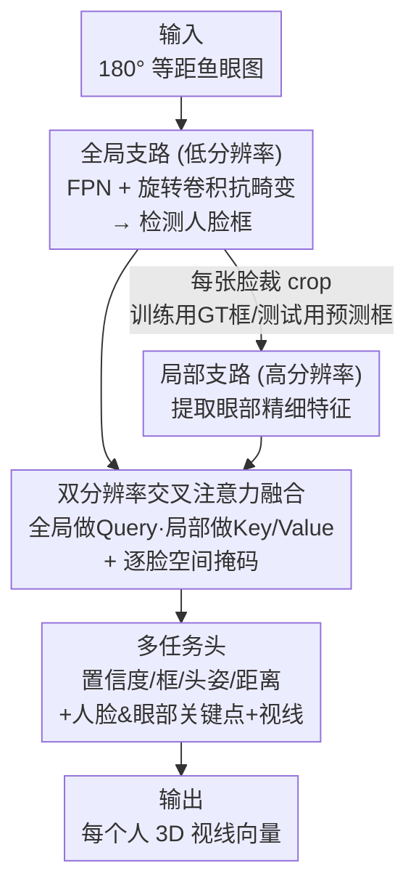

# GazeOnce360: Fisheye-Based 360° Multi-Person Gaze Estimation with Global-Local Feature Fusion

**会议**: CVPR 2026  
**论文**: [CVF Open Access](https://openaccess.thecvf.com/content/CVPR2026/html/Cai_GazeOnce360_Fisheye-Based_360deg_Multi-Person_Gaze_Estimation_with_Global-Local_Feature_Fusion_CVPR_2026_paper.html)  
**代码**: [项目主页](https://caizhuojiang.github.io/GazeOnce360/)  
**领域**: 人体理解 / 视线估计  
**关键词**: 多人视线估计, 鱼眼相机, 旋转卷积, 双分辨率融合, 合成数据集

## 一句话总结
用一台朝上放在桌面的鱼眼相机一次性拍下 360° 全场景，GazeOnce360 用旋转卷积 + 眼部关键点监督 + 全局/局部双分辨率交叉注意力，端到端地同时检测并回归多人的 3D 视线方向，在自建合成数据集 MPSGaze360 上把视线误差从多阶段管线的 18.96° 降到 10.39°、速度提升约 4 倍。

## 研究背景与动机

**领域现状**：单人视线估计经过十年发展（MPIIGaze、ETH-XGaze、Gaze360 等大规模数据集）已经相当成熟，appearance-based 回归方法在野外条件下都能给出稳健的 3D 视线。真实交互场景往往涉及同场多人，于是问题自然延伸到「多人视线估计」。

**现有痛点**：以往的多人方案几乎都用**前向相机**，视场有限、要覆盖整个房间得多台设备同步，部署笨重。少数尝试用「朝上鱼眼」配置的工作（如 GAM360）走的是**多阶段管线**：先在鱼眼图上检测人脸 → 把每张脸投影成正视透视图 → 再逐脸估计视线。这条链路慢、难部署、误差逐级累积，而且把鱼眼图投影成全景表示时常常把一张脸切在边界两侧，直接漏检。

**核心矛盾**：鱼眼-从下往上的设置同时带来三个绕不开的难点——① 镜头造成的**严重几何畸变**（外围尤其离谱）；② 大视场让人脸只占画面很小一块，高分辨率背景区域**冗余计算**巨大；③ 这种朝上鱼眼多人视线**没有公开数据集**可训。多阶段管线只是把这些难点往后推，没有正面解决。

**本文目标**：设计一个**端到端**、可直接从鱼眼输入预测多人视线的框架，把畸变鲁棒性、计算效率、细粒度眼部特征三件事一次性解决；并补上缺失的训练数据。

**切入角度**：作者观察到，对视线估计真正有用的是**高频的眼部细节**，而非高分辨率的背景；但全局场景结构对消歧多人布局又必不可少，两者天然该用不同分辨率处理。同时鱼眼畸变本质是旋转方向上的变化，应该用对旋转更友好的卷积而非靠暴力对齐。

**核心 idea**：用「旋转卷积抗畸变 + 眼部关键点监督学细粒度眼动 + 全局低分辨率/局部高分辨率双分支交叉注意力融合」三件套，把多阶段管线压成单阶段端到端模型，并用 Unreal Engine 合成的 MPSGaze360 数据集喂它。

## 方法详解

### 整体框架

GazeOnce360 本质是一个**带旋转卷积的 anchor-based CNN 检测器**，但把检测头扩展成了多任务头，并叠了一条高分辨率局部支路。输入是一张 180° 等距投影（$r = f \cdot \theta$）的鱼眼图 $I \in \mathbb{R}^{H\times W\times 3}$，输出是图中所有 $N$ 个可见人的 3D 视线向量集合 $\{g_i\}_{i=1}^N = F(I; \Theta)$，全部定义在相机坐标系下。

整条流水线是这样转的：**低分辨率全局支路**用 FPN 提取大尺度空间上下文，并在顶层套上旋转卷积来抵抗鱼眼畸变，先把每个人的人脸框检测出来；对每个检测到的区域，**高分辨率局部支路**裁出人脸 crop（训练时用 GT 框、测试时用预测框）去抓眼部精细特征；两条支路的特征经**交叉注意力**融合后，送进一组**多任务头**同时输出置信度、框、头姿、距离、人脸/眼部关键点和视线方向。整个模型单阶段端到端训练。

### 关键设计

**1. 旋转卷积（RotConv）：让卷积核适配鱼眼的极端视角畸变**

鱼眼图从桌面往上拍，人脸出现在画面四周、朝向各异，标准卷积只有平移不变性，根本扛不住这种大角度旋转变化。作者沿用 Wei 等人 [35] 的旋转卷积：把同一个卷积核**复制成四个正交朝向的旋转版本**，对这四个旋转核的响应做加权平均聚合，从而让网络对鱼眼引入的大角度方向变化更鲁棒。它只被**插在 FPN 的顶层**（高层语义特征），让高层表示拿到旋转不变性的好处。消融里 RotConv 单独加进来就把视线误差从 12.14° 降到 11.14°、头姿误差从 5.01° 降到 4.15°；而且作者专门和可变形卷积（DCN）对比，RotConv 误差更低（10.39° vs 11.05°），说明**显式建模旋转畸变**比泛泛地用空间自适应核更对路。

**2. 眼部关键点多任务监督：用精确眼动几何把视线学准**

视线方向对眼部几何极其敏感，但真实数据里很难拿到精确的瞳孔/眼中心标注——有些工作靠视线和瞳孔标签反推眼部关键点，反而引入额外标注误差。作者借合成数据天然拥有 MetaHuman 模型精确坐标的优势，把**眼部关键点（双眼中心 + 瞳孔）**作为额外监督喂进网络。网络输出是一组 $\{y_c, y_b, y_d, y_h, y_g, y_{fl}, y_{el}\}$（置信度/框/距离/头姿/视线/人脸关键点/眼部关键点），关键点只作辅助监督来塑造「空间上有意义的眼部表示」。消融显示：在 RotConv 基础上加眼部关键点监督，视线误差从 11.14° 进一步降到 **8.89°**，是各组件里增益最大的一项。有意思的是，**同时加人脸+眼部关键点反而不如只加眼部**（8.945° vs 8.890°）——作者解释人脸关键点主要编码粗糙头部几何，超出眼部之外会引入噪声或冲突监督。

**3. 双分辨率特征融合：全局上下文 + 局部眼部细节的交叉注意力**

鱼眼大视场让人脸只占画面一小块，若整图都跑高分辨率则背景区域纯属冗余计算；但只看局部脸 crop 又丢了多人布局这种全局消歧信息。作者用两条并行 ResNet-50 支路（结构同、参数独立）分别处理：全局支路吃低分辨率整图抓布局与人-相机粗几何，局部支路吃高分辨率脸 crop 抓眼部精细特征。关键在**交叉融合机制**：对局部高分辨率特征 $F_h \in \mathbb{R}^{N\times H_h\times W_h\times C_h}$ 先做全局平均池化压成紧凑人脸描述子 $\bar{F}_h \in \mathbb{R}^{N\times C_h}$；全局特征加位置编码后展平成序列 $\tilde{F}_{l,s}$。然后让**全局特征当 Query、局部人脸描述子当 Key/Value**做交叉注意力：

$$\text{Attention}(Q,K,V) = \text{softmax}\!\left(\frac{QK^\top}{\sqrt{d_k}}\right)V$$

融合时用残差聚合 $F_{\text{fuse},s} = F_{l,s} + M \odot \text{Attention}(Q,K,V)$，其中 $M$ 是**逐脸空间掩码**（每张脸一个掩码，把注意力限制在该脸对应的全局特征图区域上），保住全局上下文的同时只往脸所在位置注入高分辨率语义。这一过程在 FPN 的三个尺度 $s\in\{1,2,3\}$ 上并行做。效果上，双分辨率（512+1024）几乎不掉精度（8.968° vs 单 1024 的 8.945°）却拿到 **22% 更快**的推理速度，正好卡在效率与精度的平衡点上。

### 损失函数 / 训练策略

整体是多任务联合优化：

$$L = \lambda_1 L_c + \lambda_2 L_b + \lambda_3 L_d + \lambda_4 L_h + \lambda_5 L_g + \lambda_6 L_{fl} + \lambda_7 L_{el}$$

其中 $L_c$ 是正负样本平衡的交叉熵分类损失，其余（框/距离/头姿/视线/人脸关键点/眼部关键点）都对正样本用 Smooth L1。主实验里所有权重设为 1 以避免任务加权的 trick（补充材料里说调高视线损失权重还能再涨点）。训练用 Adam，初始学习率 $10^{-3}$，在第 30/100 epoch 降到 $10^{-4}/10^{-5}$，3 张 RTX 2080 Ti 上跑 150 epoch、batch size 9，端到端单阶段训练。

### 数据集 MPSGaze360

为解决「无公开朝上鱼眼多人视线数据」，作者用 UE5 + MetaHuman 合成了 MPSGaze360：随机采样人数、空间排布、头/眼朝向、眼睑闭合度（头姿 yaw $[-60°,60°]$、pitch $[-35°,35°]$、roll $[-5°,5°]$；视线在头部局部坐标系 yaw/pitch $[-30°,30°]$），并随机化光照与外观。因 UE 无原生鱼眼相机，每个样本先渲染**五张正交透视视图**再投影成一张 180° 等距鱼眼图。共 **23,496 张**鱼眼图、每图 1–7 张脸、69 个不同人物模型，标注涵盖 3D 视线、2D 人脸/眼部关键点、人脸框、3D 头姿、距相机距离，全部从场景自动抽取、像素级精确。

## 实验关键数据

实验在 MPSGaze360 子集（5,673 训练 / 804 测试，1024×1024）上做，主指标是**视线角度误差（Gaze Error，°）**，并辅以检测精/召回、距离误差、头姿误差、FPS；跨设置比较时还报告 **Adjusted Gaze Error**（只在各方法共同成功检测到的人脸交集上算，把视线精度和检测差异解耦）。

### 主实验：与多阶段方法 GAM360 对比（D2 跨场景+跨身份设置）

| 方法 | Gaze Error (°)↓ | Adjusted Gaze Error (°)↓ | FPS↑ |
|------|------|------|------|
| GAM360（多阶段管线） | 18.96 | 18.76 | 4.23 |
| **GazeOnce360（本文）** | **10.39** | **9.99** | **16.23** |

端到端单阶段方案在最难的 D2 设置下把视线误差几乎砍半，同时推理速度快约 4 倍——直接验证了「不再逐脸投影+逐脸估计」的价值。

### 消融实验：RotConv 与关键点监督

| 配置 | Prc.↑ | Rec.↑ | Dist(cm)↓ | Head pose(°)↓ | Gaze(°)↓ |
|------|------|------|------|------|------|
| w/o RotConv, w/o ldmks | 0.9836 | 0.9927 | 3.486 | 5.010 | 12.14 |
| RotConv only | 0.9923 | 0.9934 | 3.422 | 4.150 | 11.14 |
| RotConv + 人脸关键点 | 0.9888 | 0.9932 | 3.447 | 3.769 | 9.782 |
| RotConv + 眼部关键点 | 0.9936 | 0.9940 | 3.387 | 3.448 | **8.890** |
| RotConv + 人脸&眼部关键点 | 0.9981 | 0.9933 | 3.390 | 3.411 | 8.945 |

### 消融实验：双分辨率 vs 单分辨率

| 配置 | Gaze(°)↓ | FPS↑ | 说明 |
|------|------|------|------|
| Single (512) | 16.50 | 20.49 | 快但精度差，眼部细节不够 |
| Single (1024) | 8.945 | 13.30 | 精度高但慢 |
| **Dual (512,1024)** | 8.968 | **16.23** | 精度几乎追平 1024、速度 +22% |

### 关键发现
- **眼部关键点监督是增益最大的单项组件**：在 RotConv 基础上把视线误差从 11.14° 拉到 8.89°，远超人脸关键点（9.78°）；而人脸+眼部一起反而轻微回退（8.945°），佐证「人脸关键点只带粗头部几何、超出眼部就成噪声」。
- **RotConv > DCN**：在 D2 设置下 RotConv 10.39° 优于可变形卷积 11.05°，说明对鱼眼这种结构化旋转畸变，显式旋转建模比纯自适应核更对症。
- **泛化稳健**：从标准 split（8.945°）到跨身份 D1（9.446°）再到跨场景+跨身份 D2（10.39°），误差只温和上升；且纯合成训练的模型在真实鱼眼图上定性结果也能 work。

## 亮点与洞察
- **「分辨率分工」想法很巧**：把视线估计拆成「全局低分辨率管布局消歧 + 局部高分辨率管眼部细节」，再用交叉注意力 + 逐脸掩码把局部精细特征**定向**注回全局特征图——既省掉背景冗余计算又不丢全局上下文，几乎零精度代价换 22% 提速，这种 trade-off 设计可直接迁移到其它「目标小但需要全局上下文」的密集预测任务。
- **合成数据反哺监督信号**：眼部关键点（瞳孔/眼中心）在真实数据里几乎拿不到精确标注，作者借 UE5+MetaHuman 的「天生精确坐标」把它变成免费且无噪的辅助监督，这是合成数据相对真实数据的一个被低估的优势——不只是补数量，更是补「难标注的精确几何标签」。
- **端到端击穿多阶段累积误差**：把「检测→投影→逐脸估计」三段式压成单网络，既避免了鱼眼投影切脸导致的漏检，又消掉了逐级误差累积，精度和速度同时大幅领先，给「鱼眼/全景下的密集人体感知该不该坚持端到端」提供了有力正面证据。

## 局限与展望
- 作者承认：对**极端头姿**或**离相机很远**的人，性能会下降；且当前框架几乎只靠合成数据训练，虽有一定真实泛化但仍有提升空间。
- 自己观察：评估几乎全在自建合成集上，缺乏带 GT 的**真实鱼眼**定量评测（真实场景只有定性可视化），合成→真实的 domain gap 到底多大无法量化；⚠️ 而且训练子集只有 5,673 张，相对 23,496 张全集偏小，规模上限未充分探索。
- 全局支路当 Query、局部当 Key/Value 的设计里，逐脸空间掩码 $M$ 是按 GT/预测框区域构造的，**检测一旦出错会直接污染融合**——Adjusted Gaze Error 正是为规避这一点而设，但真实部署下检测误差对端到端精度的影响值得单独评估。
- 改进思路：引入少量真实鱼眼数据做半监督/域适应、对极端头姿与遮挡专门增广、把旋转卷积的离散四朝向扩成连续角度自适应，可能进一步收窄外围畸变下的误差。

## 相关工作与启发
- **vs GAM360 [8]**：同为朝上鱼眼多人视线，GAM360 走「检测→逐脸投影正视图→逐脸估计」多阶段管线，慢、难部署、误差累积、投影切脸易漏检；本文用单阶段端到端 + 旋转卷积直接在鱼眼上算，D2 设置下误差 10.39° vs 18.96°、FPS 16.23 vs 4.23 全面领先。
- **vs GazeOnce [36]（MPSGaze）**：GazeOnce 也是端到端 anchor-based 多人视线 + 多任务监督，但面向**透视相机**，且其合成数据靠图像替换/拼接生成；本文专门补上鱼眼畸变处理（RotConv）、双分辨率融合和 UE5 渲染的鱼眼合成集，把同一思路搬进 360° 鱼眼场景。
- **vs 鱼眼感知的「先展开再 CNN」路线 [14,25]**：那条路把鱼眼重投影成多张透视图恢复平移等变性，但在视图边界引入断裂与畸变；本文跟随「网络天生兼容全向畸变」的旋转等变卷积路线 [15,35,41]，无需展开/重投影，直接在鱼眼上操作。

## 评分
- 新颖性: ⭐⭐⭐⭐ 首个朝上鱼眼 360° 多人视线的端到端方案 + 配套合成数据集，组件（RotConv/眼部监督/双分辨率）虽多为已有技术的巧妙组合，但问题设定和系统设计新。
- 实验充分度: ⭐⭐⭐ 消融到位、各组件贡献清晰，但几乎全在自建合成集上、缺真实鱼眼定量评测，且只对比了一个多阶段 baseline。
- 写作质量: ⭐⭐⭐⭐ 动机—难点—设计三者对应清楚，公式和架构图完整，易读。
- 价值: ⭐⭐⭐⭐ 桌面单鱼眼即可覆盖 360° 多人视线，对协作空间/服务机器人/前台等交互场景部署价值高，数据集也利于后续研究。

<!-- RELATED:START -->

## 相关论文

- [\[CVPR 2026\] Pose-guided Enriched Feature Learning for Federated-by-camera Person Re-identification](pose-guided_enriched_feature_learning_for_federated-by-camera_person_re-identifi.md)
- [\[CVPR 2026\] Gaze Target Estimation Anywhere with Concepts](gaze_target_estimation_anywhere_with_concepts.md)
- [\[CVPR 2026\] MAMMA: Markerless Accurate Multi-person Motion Acquisition](mamma_markerless_accurate_multi-person_motion_acquisition.md)
- [\[CVPR 2026\] GazeShift: Unsupervised Gaze Estimation and Dataset for VR](gazeshift_unsupervised_gaze_estimation_and_dataset_for_vr.md)
- [\[CVPR 2026\] Render-to-Adapt: Unsupervised Personal Adaptation for Gaze Estimation](render-to-adapt_unsupervised_personal_adaptation_for_gaze_estimation.md)

<!-- RELATED:END -->
