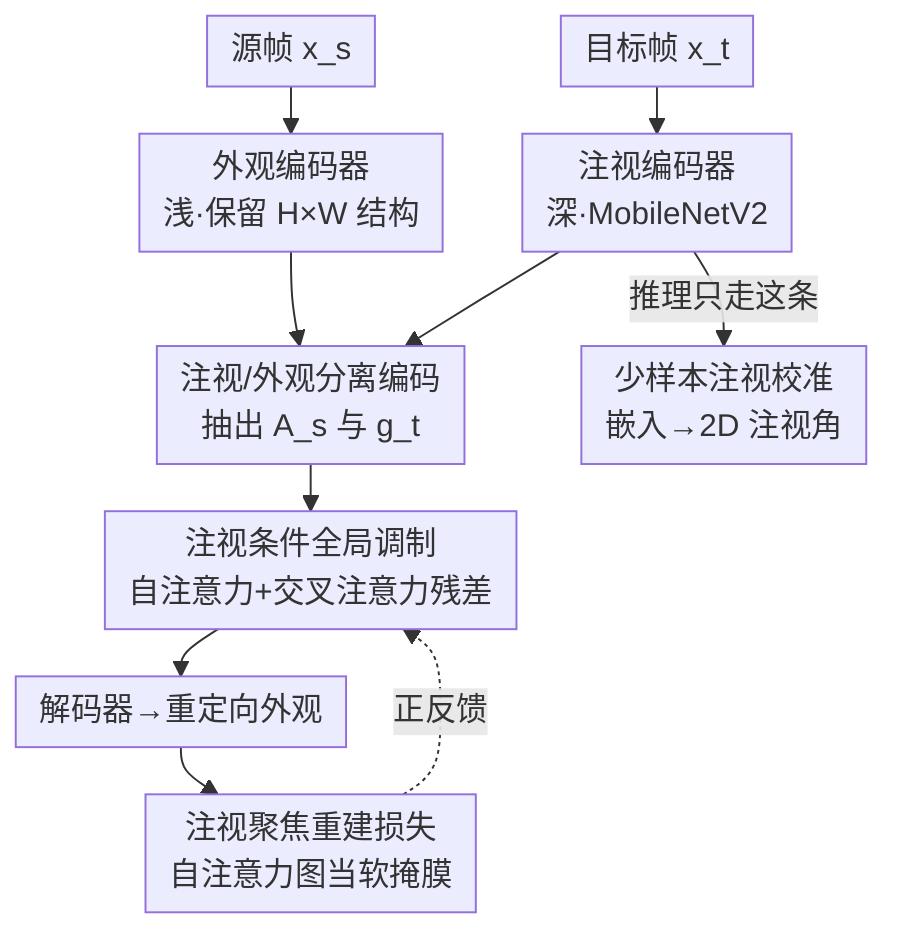

# GazeShift: Unsupervised Gaze Estimation and Dataset for VR

**会议**: CVPR 2026  
**论文**: [CVF Open Access](https://openaccess.thecvf.com/content/CVPR2026/html/Shapira_GazeShift_Unsupervised_Gaze_Estimation_and_Dataset_for_VR_CVPR_2026_paper.html)  
**代码**: https://github.com/gazeshift3/gazeshift （有）  
**领域**: 人体理解 / 注视估计  
**关键词**: 无监督注视估计, VR 近眼成像, 注视重定向, 交叉注意力, 离轴数据集

## 一句话总结
针对 VR 头显「离轴近眼红外相机 + 没有可靠标注」的困境，本文一边发布首个大规模离轴注视数据集 VRGaze（68 人、210 万张），一边提出 GazeShift——用「同一只眼睛不同时刻两帧之间的注视重定向」作为无监督代理任务，靠标准交叉注意力把注视和外观解耦，再用模型自身注意力图当软掩膜聚焦眼区，仅 34.2 万参数 / 55 MFLOPs、头显 GPU 上 5ms 推理，VRGaze 上达到 1.84° 误差，接近有监督水平。

## 研究背景与动机

**领域现状**：注视估计是 VR/XR 的核心组件（注视点渲染、免手交互、自适应内容）。现代头显为减少视野遮挡，把近眼红外相机斜装在眼角，即所谓「离轴（off-axis）」几何，相机看到的是带强烈透视畸变的单眼局部图像。

**现有痛点**：有监督方法依赖大规模精确标注，但注视标签本身就不可靠——让被试盯住指定目标无法保证真实注视，眨眼、非自主扫视（saccade）都会污染标签，标注既慢又错。更糟的是公开数据集对不上 VR 场景：OpenEDS2020 全是「正轴（on-axis）」相机、几何不匹配；NVGaze 大部分是正轴、离轴子集只有 26 万帧且注视方向单一；TEyeD 多数非 VR 环境、且标签是算法自动生成的不准。

**核心矛盾**：无监督注视学习虽已被探索，但现有方法（Cross-Encoder、Yu&Odobez 等）是为**远程 RGB 相机、完整人脸**设计的——要么依赖几何先验/多视角一致性，要么用复杂的 warping 场，要么用整脸的对比/等变目标，全都迁不到「单眼、红外、离轴」的近眼模态。同时 Cross-Encoder 用单个共享编码器同时编注视和外观，会让解码器「偷看」到目标外观信息，造成解耦泄漏。

**本文目标**：(1) 补上离轴近眼这块数据空白；(2) 设计一个**不带任何注视专用模块**、对近眼也对远程都适用、且足够轻能跑在头显上的无监督框架。

**切入角度**：头戴相机有个天然特性——它把外部光照、相机位置等变化都压制住了，于是**注视变化成为同一只眼睛不同帧之间外观差异的主导来源**。如果让模型学会「把源帧的注视重定向到目标帧的注视」，那个用来做重定向的条件嵌入就必然富含注视信息。

**核心 idea**：用「同眼跨时刻两帧的注视重定向」当代理任务，用标准交叉注意力（而非几何 warping）实现注视-外观解耦，再让模型自己的自注意力图反过来当损失的软掩膜，形成「注意力越准 → 重建越聚焦 → 注意力更准」的正反馈。

## 方法详解

### 整体框架
GazeShift 训练时做一个生成式代理任务：给定同一只眼睛、同一人的源帧 $x_s$ 和目标帧 $x_t$，用**外观编码器**从源帧抽出保留空间结构的外观特征图 $A_s\in\mathbb{R}^{H\times W\times C_a}$，用**注视编码器**从目标帧抽出一个非空间的注视嵌入 $g_t\in\mathbb{R}^{C_g}$，然后让解码器在 $g_t$ 的条件下，把源帧的外观「重定向」成目标帧（即把源眼睛的注视方向掰到目标的注视方向），用重建损失监督。由于训练对来自同眼不同时刻，帧间差异主要就是注视，模型为了把重建做好，被迫把注视信息压进 $g_t$。

推理时整套生成结构都不要了——**只保留注视编码器**，把 $x$ 喂进去得到嵌入，再接一个轻量校准模块（VR 用 per-person 线性回归，远程用共享 MLP）映射到 2D 注视角。所以重的外观编码器、注意力、解码器都只在训练期存在，推理零开销。

### 关键设计

**1. 注视/外观分离双编码器：让两种本质不同的属性各归各位**

针对 Cross-Encoder「单一共享编码器导致外观信息泄漏到注视表征、解耦不干净」的痛点，作者观察到注视和外观是两类**本质不同**的属性：注视是抽象、非空间的（每帧就 2-3 个实值角度），需要一个**深**编码器去匹配它的抽象层级；外观是具体、空间的、紧贴局部图像结构，用一个**浅**编码器、并保留源帧的 2D 结构即可。于是显式拆成 $A_s=f_{app}(x_s)$、$g_t=f_{gaze}(x_t)$ 两条支路。这种「深注视 + 浅外观」的非对称切分既反映了二者本性、又天然促进解耦，而且因为推理时只用注视编码器，把外观编码器做重也没有运行时代价。注视编码器用 MobileNetV2 的倒残差块实现以满足边缘实时约束。

**2. 注视条件全局调制：用注视当「单一全局 query」去拨动外观，而不破坏空间结构**

有了 $A_s$ 还得让目标注视 $g_t$ 去「拨动」它，难点是不能把空间结构搅乱。作者先对 $A_s$ 做多头自注意力得到 $A_s'=\mathrm{SelfAttn}(A_s)$ 捕捉空间内部交互；再把 $g_t$ 线性投影到 $C_a$ 维，作为**唯一一个全局 query** $q_g$，以空间外观特征 $A_s'$ 当 key/value 做交叉注意力，得到注视条件下的全局上下文向量

$$c = \mathrm{CrossAttn}(q_g,\, A_s',\, A_s') \in \mathbb{R}^{C_a}.$$

再把 $c$ 在空间维度广播成 $C\in\mathbb{R}^{H\times W\times C_a}$，残差加回去：$F = A_s' + C$。这相当于一次 feature-wise 的**全局调制**——把潜表征整体往目标注视方向偏，同时保留外观图的空间分辨率和结构完整性。关键是：注视嵌入只通过这个交叉注意力作为「缓冲层」去影响解码器，把注视编码器和解码器隔开，从机制上**阻止外观信息回流污染注视表征**（这正是 Cross-Encoder 泄漏问题的解法）。

**3. 注视聚焦重建损失：把模型自己的注意力图变成软掩膜，聚焦到真正传递注视的眼区**

标准注视重定向用逐像素 MSE，对所有像素一视同仁，逼模型连背景、边界这些与注视无关的区域都要重建好，结果注视嵌入里塞进一堆没用的外观细节、降低注视特异性。以往工作靠外部定义的注视掩膜或手工几何先验来约束，本文则**复用模型自身的自注意力图**当软掩膜——因为在本设定下源/目标帧间外观差异主要就来自注视，这些注意力图天然会高亮注视相关区域（虹膜周围）。先把低分辨率注意力权重图 $w$ 上采样到目标分辨率，再定义带锐化参数 $\gamma>0$ 的损失：

$$L_{focus} = \frac{1}{\sum_i w_i^{\gamma}} \sum_i w_i^{\gamma}\,(x_{t,i}-\hat{x}_{t,i})^2.$$

其中 $i$ 索引像素。$\gamma=1$ 退化为标准注意力加权；$\gamma>1$ 锐化注意力、更聚焦注视区；$\gamma<1$ 软化、监督更弥散。归一化权重 $\tilde{w}_i=w_i^{\gamma}/\sum_j w_j^{\gamma}$ 下，逐像素梯度幅度正比于 $\tilde{w}_i$，所以增大 $\gamma$ 会放大高注意力（注视相关）区的梯度、压制其余区域。这就把「注意力图」和「注视表征保真度」自耦合起来，形成正反馈、且无需任何额外正则项。消融显示这一项贡献最大（2.07°→1.84°），$\gamma=1$ 最优。

**4. 少样本注视校准：把无监督嵌入落到真实注视角，分 VR / 远程两套协议**

无监督预训练后注视编码器输出的是「编码了注视方向的潜嵌入」，还需校准成真实角度。VR 场景精度要求高，用轻量**少样本 per-person 校准**：取少量标注的注视点拟合一个线性回归把嵌入映到 2D 注视角。之所以必须 per-person，是因为 kappa 角（光轴与视轴的偏移）因人而异；此外每次录制前还做 session 级校准来补偿头显滑动/重新佩戴。远程相机场景不做个体拟合，而是在跨被试汇集的 100–200 个标注样本上训一个共享小 MLP。

### 损失函数 / 训练策略
训练目标即上面的注视聚焦重建损失 $L_{focus}$（含 $\gamma$ 锐化）。训练批次严格由「同一人、同一只眼、不同时刻」的帧对组成，以保证源-目标差异主要是注视。VRGaze 上注视编码器用 MobileNetV2 块；远程低分辨率（64×32）场景换一种 MobileNetV2 配置、外观编码器用 ResNet-18（与 Cross-Encoder 对齐）。

## 实验关键数据

### 主实验

VRGaze（离轴 VR）上对比有监督与无监督方法：

| 监督方式 | 方法 | 校准 | 平均误差 [°] |
|----------|------|------|--------------|
| 有监督 | Appearance-Based | per-person | 1.54 |
| 有监督 | Feature-Based | per-person | 3.2 |
| 无监督 | VAE | per-person | 5.30 |
| 无监督 | Cross-Encoder | per-person | 2.15 |
| 无监督 | **GazeShift** | per-person | **1.84** |
| 无监督 | Cross-Encoder | person-agnostic (K=200) | 2.26 |
| 无监督 | **GazeShift** | person-agnostic (K=200) | **2.13** |

GazeShift 1.84° 已逼近有监督 appearance-based 的 1.54°，且全面超过 Cross-Encoder。

远程相机 MPIIGaze（在 Columbia 上无监督训练、跨数据集评测，留一被试 100-shot）：

| 监督方式 | 方法 | 误差 [°] | 参数 | FLOPs |
|----------|------|----------|------|-------|
| 有监督 | ResNet-18 | 8.35 | 11M | 75M |
| 无监督 | Cross-Encoder | 8.32 | 11M | 75M |
| 无监督 | **GazeShift (MobileNetV2)** | **8.00** | **1M** | **2M** |
| 无监督 | GazeShift (ResNet-18) | 7.56 | 11M | 75M |

轻量版用 35× 更少 FLOPs / 10× 更少参数反超 Cross-Encoder；同算力（ResNet-18）下进一步到 7.56°。在 MPIIGaze 上无监督微调协议下 GazeShift(MobileNetV2) 达 7.15°，优于 Cross-Encoder 的 7.20° 且参数少 10×。

### 消融实验

| # | 分离编码器 | 注意力重定向 | 注视聚焦损失 | 误差 [°] |
|---|:---:|:---:|:---:|:---:|
| 1 | × | × | × | 2.15 |
| 2 | ✓ | × | × | 2.10 |
| 3 | ✓ | ✓ | × | 2.07 |
| 4 | ✓ | ✓ | ✓ | **1.84** |

$\gamma$ 敏感性：

| $\gamma$ | 0.5 | 1.0 | 2.0 | 4.0 |
|----------|-----|-----|-----|-----|
| 误差 [°] | 2.03 | **1.84** | 2.19 | 2.41 |

### 关键发现
- **注视聚焦损失是涨点主力**：分离编码器（2.15→2.10）和交叉注意力（→2.07）各带来小幅提升，但真正大跳是加上注视聚焦损失（2.07→1.84）。值得注意的是——交叉注意力不仅自身涨点，更是**使注视聚焦损失成为可能**的前提（损失需要注意力图当掩膜），两者是耦合的。
- **离轴数据不可替代**：在正轴 OpenEDS2020 上训、到 VRGaze 离轴测，per-person 误差 5.2°，远差于直接在 VRGaze 上训的 1.84°，证明正轴模型抓不住离轴近眼的几何畸变，专用离轴数据集是必要的。
- **解耦确有其事**：固定注视加 100 种光照/对比扰动，注视嵌入余弦距离仅 0.08（外观嵌入 0.12）；固定光照换 80 种注视方向，注视嵌入变 0.17 而外观嵌入仅 0.04——注视嵌入只随注视变、外观嵌入只随外观变。
- **$\gamma$ 不是越大越好**：$\gamma>1$ 监督太窄，会忽略眼睑边缘、glint 等上下文线索反而伤注视嵌入稳定性；$\gamma<1$ 太弥散、模糊了注视与外观信号；$\gamma=1$ 最佳。
- **真·实时边缘部署**：注视编码器 342K 参数 / 55 MFLOPs，在自研头显 Exynos 2200 的 Xclipse 920 移动 GPU 上双眼推理仅 5ms。

## 亮点与洞察
- **「相机本身帮你做了变量控制」是整套方法的地基**：头戴相机压制了外部光照/位置变化，使注视成为帧间差异主导来源——正是这个先验让「重定向代理任务能学出注视嵌入」成立。这提示一个可迁移的思路：当采集设备天然锁死了某些干扰变量时，自监督代理任务能更纯净地学到目标因子。
- **用模型自己的注意力图反哺损失**，无需任何外部掩膜或几何先验就实现了空间聚焦，且形成正反馈闭环——这是「自监督权重」很优雅的一个实例，把「注意力准不准」和「注视学得好不好」绑成一个自洽循环。
- **交叉注意力当「缓冲层」隔离注视编码器与解码器**：这是相对 Cross-Encoder 共享编码器泄漏问题的针对性结构设计，把解耦从「希望它解耦」变成「结构上堵死泄漏路径」。
- **训练重、推理轻的非对称设计**：外观分支只服务训练，推理只剩 342K 参数的注视编码器，是「为部署而设计架构」的好范例。

## 局限与展望
- 作者承认：GazeShift 的核心假设「帧间外观变化主要反映注视变化」在 VR 里基本成立（光照、相机位置受控），但在 **AR / 混合现实**下光照和反射不受控，眨眼、眼睑运动、瞳孔扩张等非注视外观变化的影响是个开放问题。
- ⚠️（自己观察）远程相机场景里，为了让「帧间差异主要来自注视」成立，训练对是**人工挑选**的：Columbia 限定同一头姿内采样、MPIIGaze 用短时间窗采样。这意味着方法对「如何构造低非注视方差的训练对」有依赖，在完全 in-the-wild 数据上能否自动满足存疑。
- ⚠️ per-person 校准在 VR 可接受（本就要校准头显），但对「person-agnostic 零校准」场景仍有 2.13° 的精度回落，跨用户即插即用还不够。
- 改进方向：把非注视变化（眨眼、光照）显式建模进代理任务，或引入更鲁棒的自动配对策略，可能让方法摆脱对受控采集的依赖、推广到 AR。

## 相关工作与启发
- **vs Cross-Encoder [30]**：Cross-Encoder 用单一共享编码器联合编注视和外观，解码器能接触目标外观、造成泄漏与解耦受限；GazeShift 用两个专用编码器 + 交叉注意力缓冲层从结构上隔离，VRGaze 上 2.15°→1.84°、MPIIGaze 上同精度而参数/FLOPs 各省 10×/35×。
- **vs Yu & Odobez [33]**：他们最早提出用注视重定向做表征学习，但依赖复杂 warping 场和几何先验、且代码不开源、效果逊于 Cross-Encoder；GazeShift 只用标准注意力模块、无任何注视专用组件就达到同样的重定向行为。
- **vs 全脸无监督方法（对比/等变目标 [8,13,31]）**：它们都在完整人脸上做，迁不到只能看到单眼局部的头显相机；GazeShift 直接从单眼红外图学，补上这块空白。
- **vs 几何/特征法 [14,37,22]**：传统几何法需要标定的相机-光照 3D 配置和专用硬件，商用 VR 头显往往拿不到；本文走外观/无监督路线绕开了对显式眼模型与标定的依赖。

## 评分
- 新颖性: ⭐⭐⭐⭐ 「用标准注意力做注视重定向 + 自注意力图反哺损失」组合干净有效，但单看每个组件较常规
- 实验充分度: ⭐⭐⭐⭐⭐ 跨 VR/远程双场景、解耦分析、注意力可视化、$\gamma$ 敏感性、消融、边缘实测一应俱全
- 写作质量: ⭐⭐⭐⭐ 动机与机制讲得清楚，公式完整；少数符号（如 $C_g$ 维度）需结合上下文理解
- 价值: ⭐⭐⭐⭐⭐ 同时贡献首个大规模离轴 VR 数据集 + 轻量实时无监督方法，落地价值高

<!-- RELATED:START -->

## 相关论文

- [\[CVPR 2026\] Render-to-Adapt: Unsupervised Personal Adaptation for Gaze Estimation](render-to-adapt_unsupervised_personal_adaptation_for_gaze_estimation.md)
- [\[CVPR 2026\] Gaze Target Estimation Anywhere with Concepts](gaze_target_estimation_anywhere_with_concepts.md)
- [\[CVPR 2026\] HamiPose: Hamiltonian Optimization for Unsupervised Domain Adaptive Pose Estimation](hamipose_hamiltonian_optimization_for_unsupervised_domain_adaptive_pose_estimati.md)
- [\[CVPR 2026\] EgoPoseFormer v2: Accurate Egocentric Human Motion Estimation for AR/VR](egoposeformer_v2_accurate_egocentric_human_motion_estimation_for_arvr.md)
- [\[CVPR 2026\] See Through the Noise: Improving Domain Generalization in Gaze Estimation](see_through_the_noise_improving_domain_generalization_in_gaze_estimation.md)

<!-- RELATED:END -->
