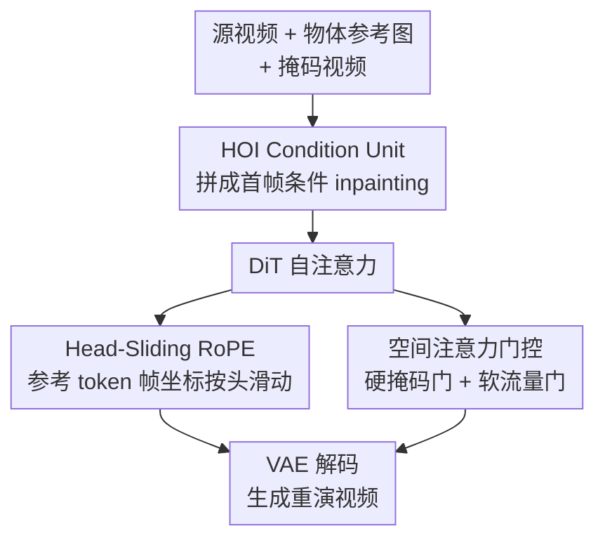

# GenHOI: Towards Object-Consistent Hand-Object Interaction with Temporally Balanced and Spatially Selective Object Injection

**会议**: CVPR 2026  
**论文**: [CVF Open Access](https://openaccess.thecvf.com/content/CVPR2026/html/Huang_GenHOI_Towards_Object-Consistent_Hand-Object_Interaction_with_Temporally_Balanced_and_Spatially_CVPR_2026_paper.html)  
**代码**: [项目页](https://xuanhuang0.github.io/GenHOI/)（未开源代码）  
**领域**: 视频生成 / 数字人 / 手物交互  
**关键词**: 手物交互, 视频重演, Head-Sliding RoPE, 空间注意力门控, 物体一致性

## 一句话总结
GenHOI 给预训练视频生成大模型（Wan-14B-I2V）外挂一个仅 157M 参数（约 0.95%）的轻量模块，用 **Head-Sliding RoPE**（时间上把参考物体 token 的影响均摊到每一帧）+ **空间注意力门控**（空间上把物体条件注意力聚焦到手物交互区），在不破坏底模泛化能力的前提下，让野外场景下的手-物交互视频既动作自然又跨帧保持物体外观一致，在自重演/跨重演各指标上显著超过 VACE、HOI-Swap 等 SOTA。

## 研究背景与动机
**领域现状**：数字人视频合成（电商带货、在线教育里的"主播拿着产品演示"）里，手-物交互（Hand–Object Interaction, HOI）是核心难点：模型既要生成物理上说得通的手-物接触，又要在整段视频里保住参考物体的颜色、纹理、logo 等身份信息。目前两条主流路线——专门的 HOI 重演方法（HOI-Swap 的逐帧 warp、Re-HOLD 的布局引导扩散）和通用的"全能"视频编辑模型（VACE）。

**现有痛点**：HOI 专用方法基本都是 in-domain 训练和评测，换到真实野外场景就垮（论文里 HOI-Swap 自重演 PSNR 只有 24.29），因为它们重度依赖任务先验、对底模做了大量魔改，泛化丢了。全能编辑模型靠互联网级数据预训练，泛化强、鲁棒，但偏偏栽在 HOI 最关键的"物体一致性"上——同一个杯子越往后帧越走样。

**核心矛盾**：要泛化就得尽量少动预训练大模型、少灌任务先验；但少动模型又压不住 HOI 特有的"物体跨帧退化"。两者难以兼得。作者进一步把"退化"拆出两个具体根因：①**时间维**——把参考物体 token 塞进自注意力后，3D RoPE 的天然性质让"位置越远注意力越弱"，给参考 token 固定一个帧坐标（如 −1）会导致它对最早帧响应最强、对最晚帧最弱，于是后面的帧物体逐渐糊掉；②**空间维**——参考物体信息如果无差别地灌向整张图，会污染本该保持原样的背景，引入伪影。

**本文目标**：在尽量保留底模能力的前提下，把参考物体信息"温柔地"注入——时间上别厚此薄彼，空间上别越界污染。

**核心 idea**：不重训、不加分支，只给自注意力做两处外科手术——用 **Head-Sliding RoPE** 让参考 token 的帧坐标在不同注意力头之间"滑动"，从而把它对各帧的影响均摊开；用 **空间注意力门控** 硬性切断参考 token → 背景的信息流、再软性调制注入强度。

## 方法详解

### 整体框架
给定一段源视频 $V=\{I_1,\dots,I_F\}$ 和一张物体参考图 $I_{ref}$，目标是重演出手与该目标物体之间真实的交互。训练用自监督重建：从源视频里派生出参考视频 $V_r$、二值掩码视频 $V_{mask}$ 和参考图 $I_{ref}$，让模型从随机噪声 $X_{rand}$ 出发、以这三者为条件把 $V$ 重建回来：

$$V = D\big(M(X_{rand}, E(I_{ref}), E(V_r), \psi(V_{mask}))\big)$$

其中 $(E,D)$ 是预训练 VAE 编解码器，$M$ 是 DiT 去噪器，$\psi$ 是平均池化。整条 pipeline 分三步：先用 **HOI Condition Unit (HCU)** 把"参考视频 + 掩码"按底模原有的输入组织方式拼进 latent，把生成任务改写成"首帧条件下的视频 inpainting"；再在 DiT 的自注意力里同时插入 **Head-Sliding RoPE**（管时间）和 **空间注意力门控**（管空间），完成时间均衡、空间选择性的物体信息注入；最后 VAE 解码出视频。推理时只需换一张新的物体参考图，即可把目标视频里的物体替换重演。

### 关键设计

**1. HOI Condition Unit：把"换物体"重写成首帧条件下的视频 inpainting**

直接拿通用视频生成模型做 HOI，要么得加新分支、加参数（伤泛化），要么没法告诉模型"哪里该改、哪里该留"。HCU 的做法是不加任何分支/参数，把 HOI 线索直接揉进 latent 输入流。具体先按掩码构造参考视频 $V_r$：首帧（$F=0$）保留原始 $V$ 作为外观锚点，其余帧把交互区抠掉填常数 $\lambda=127$（归一化后变 0），背景区保留：

$$V_r = \begin{cases} V, & F=0 \\ (1-V_{mask})\cdot V + V_{mask}\cdot\lambda, & F>0 \end{cases}$$

然后把噪声目标 latent $X_t$、参考视频 latent $E(V_r)$、池化后的掩码 $\psi(V_{mask})$ 沿通道维拼接成 DiT 输入 $L_v=\mathrm{Concat}(X_t, E(V_r), \psi(V_{mask}))$。这样一来，生成问题被改写成"首帧条件的视频 inpainting"：$E(V_r)$ 提供背景上下文，$\psi(V_{mask})$ 告诉模型该在哪改。它解决的是"如何零侵入地把 HOI 任务接到预训练底模上"，是后续两个注意力设计能生效的容器。

**2. Head-Sliding RoPE：让参考物体 token 的影响在帧间被均摊，治住时间退化**

这一条针对前面"时间维退化"：RoPE 下位置越远注意力越弱，给参考 token 钉死一个帧坐标会让它前强后弱。已有做法（Stand-In、OminiControl 的 "separate RoPE"）把条件 token 放到单独坐标空间、固定帧索引（如 −1），帧维分量形如 $e^{j(-1)\theta}$，后果就是物体到后面帧逐渐失真。GenHOI 改成让参考 token 的帧坐标随注意力头编号 $n_{head}$ 滑动：

$$[R_f] = \Big[\, e^{\,j\lceil \frac{N_f}{N_{head}} n_{head}\rceil\theta} \,\Big]_{N\times D_1}\,,\quad \big[\, e^{\,j f^m\theta} \,\big]_{M\times D_1}$$

其中 $N_f$ 是 latent 视频总帧数、$N_{head}$ 是注意力头总数。直观说：第 1 个头让参考 token"站在"第 0 帧附近，第 2 个头让它站到更靠后的帧……跨所有头平均下来，参考 token 对整段视频每一帧的注意力响应被拉平，同时仍保留各自不同的空间坐标（高/宽维不动），模型既能区分"这是参考 token 不是视频 token"，又不会偏心任何一帧。消融里它比 separate RoPE 提了 1.15 dB PSNR、比 ref-in-bbox 提 0.54 dB。

**3. 空间注意力门控：硬掩码门切断越界、软流量门调制强度，把容量聚到交互区**

这一条针对"空间维污染"。门控分两级。**硬掩码门 (Hard Mask Gate)**：把视频 token 分成 HOI 区 $T_{V_{HOI}}$ 和背景区 $T_{V_B}$，连同参考 token 一起构成 $Q,K,V$，再用一个二值掩码 $M$ 控制注意力里谁能看谁：

$$M_{m,n} = \begin{cases} 0 & m\in\{Q_{V_B}\},\, n\in\{K_{ref}\} \\ 0 & m\in\{Q_{ref}\},\, n\in\{K_{V_{HOI}},K_{V_B}\} \\ 1 & \text{其余} \end{cases}\,,\qquad T_{out}=\mathrm{softmax}\!\Big(\frac{M\odot QK^\top}{\sqrt{d_k}}\Big)V$$

含义是：背景 query **不准**去看参考物体 key（参考视频 $V_r$ 已给背景足够上下文，再看参考物体只会引入伪影），参考 query 也**不准**回看视频 key（保持自我正则），于是参考信息只单向流进 HOI 区。论文可视化里参考 key 对背景 query 响应为 0、对 HOI 区 query 激活很强，验证了这点。⚠️ 注意原文公式（式 8/9）里 $M=0$ 表示"屏蔽"、$M=1$ 表示"放行"，且式 9 写成 $M\odot QK^\top$（按位相乘），但图 4 标注又写"1=masked, 0=allowed"，两处约定相反——按机制理解应取"$0$ 屏蔽、$1$ 放行"，掩码作用于打分而非简单乘零（实现上通常加 $-\infty$），以原文为准。

**软流量门 (Soft Flow Gate)** 在硬截断之上再做逐 token 的动态调制（思路借鉴 LLM 里的门控）：取出更新后的视频 token $T'_v$，过 LayerNorm + 全连接 + sigmoid 得每 token 门控系数，再逐元素相乘：

$$G_v = \sigma\big(F(\mathrm{LN}(T'_v))\big)\,,\qquad \tilde{T}_v = G_v \odot T'_v$$

它按内容放大信息量大的区域、抑制冗余响应。两者互补——硬掩码门管"信息能不能流"，软流量门管"流多强"，合起来就是空间注意力门控：聚焦 HOI 区、保护背景、稳健注入参考线索。

### 训练策略
基于预训练 Wan-14B-I2V，自监督重建训练：约 19,000 段视频、16× H100 (80GB) 训 3 天，学习率 $1\times10^{-5}$。训练时参考物体图与首帧都从原视频取；推理时参考图由用户给、首帧用图像编辑方法生成。新增可学习参数仅 157M，约占底模 16.5B 的 0.95%。

## 实验关键数据

### 主实验
评测集为重整后的 **AnchorCrafter HOI**（≥720p，50 段自重演 + 50 段跨重演）。指标含 PSNR/SSIM/LPIPS（保真）、FID/FVD（感知真实度）、Object CLIP（OC，物体框内 CLIP 相似度，衡量物体一致性），跨重演无 GT 故加 30 人用户研究（VQ 视频质量、RF 参考保真度，1–5 分）。

短视频生成（81 帧）自重演 + 跨重演 + 用户研究主结果：

| 设置 | 方法 | PSNR↑ | SSIM↑ | LPIPS↓ | OC↑ | 跨重演FVD↓ | 用户RF↑ |
|------|------|-------|-------|--------|-----|-----------|---------|
| 短视频 | HOI-Swap | 24.29 | 0.843 | 0.173 | 0.787 | 570.5 | 1.20 |
| 短视频 | MimicMotion | 20.13 | 0.685 | 0.206 | 0.777 | 608.5 | 2.09 |
| 短视频 | UniAnimate-DiT | 22.20 | 0.754 | 0.179 | 0.846 | 640.5 | 2.97 |
| 短视频 | VACE（次优） | 28.60 | 0.937 | 0.056 | 0.880 | 524.7 | 2.80 |
| 短视频 | **GenHOI** | **31.71** | **0.952** | **0.036** | **0.937** | **429.5** | **4.64** |

GenHOI 在所有指标上明显领先最强对手 VACE，物体一致性（OC 0.937 vs 0.880）和参考保真度（RF 4.64 vs 2.80）差距尤其大。长视频生成（401 帧）领先幅度进一步拉大：自重演 PSNR 差从 3.11 扩到 4.37，跨重演 FVD 差从 95.2 扩到 267，用户 VQ 差从 0.5 扩到 1.3——印证它在长序列里物体抗退化的优势。

### 消融实验
自重演设置下逐组件消融（HCU 为基线）：

| 配置 | PSNR↑ | LPIPS↓ | FVD↓ | OC↑ | 说明 |
|------|-------|--------|------|-----|------|
| HCU | 28.25 | 0.058 | 248.6 | 0.907 | 基线：底模 + HOI 条件单元 |
| HCU + separate RoPE | 29.73 | 0.050 | 223.8 | 0.908 | 固定帧坐标的条件 RoPE |
| HCU + ref-in-bbox | 30.34 | 0.044 | 101.9 | 0.919 | 把参考图直接贴进掩码区 |
| HCU + HS RoPE | 30.88 | 0.039 | 103.9 | 0.915 | 换成 Head-Sliding RoPE |
| HCU + HS RoPE + SAG | 31.21 | 0.038 | 98.09 | 0.920 | 加空间注意力门控 |
| **Full (+ FLF)** | **31.71** | **0.036** | **67.95** | **0.937** | 再加首尾帧条件 |

### 关键发现
- **Head-Sliding RoPE 是物体一致性的主力**：相比 separate RoPE 提 1.15 dB、相比 ref-in-bbox 提 0.54 dB；ref-in-bbox 虽然能保住外观，但会把模型带偏成"贴图"而非"交互"，生成不出自然接触——说明时间均摊比直接贴图更对路。
- **空间注意力门控贡献稳健但偏小**：加 SAG 后 PSNR 31.21（⚠️ 正文写 31.12，与表 2 略有出入，以表为准），FVD 从 103.9 降到 98.09，主要价值在抑制背景污染、把容量约束到交互区。
- **首尾帧 (FLF) 条件锦上添花**：PSNR 31.21→31.71，FVD 98.09→67.95，边界帧锚定明显提了整体质量（FVD 跌幅最大）。
- **极轻量**：仅 +157M 参数（0.95%），既保住底模泛化、又几乎不增推理开销，这是它能在仅 ~19k 视频上训出 SOTA 的关键。

## 亮点与洞察
- **把"3D RoPE 远距离衰减"从 bug 当 feature 治**：别人用固定坐标区分 token 类型，作者发现固定坐标恰恰造成时间偏心，于是让坐标"跨头滑动"做时间均摊——一个几乎零成本的位置编码改动就治住了长视频物体退化，很巧。
- **硬门 + 软门的分工很清晰**：硬掩码门负责"能不能流"（拓扑级切断背景污染），软流量门负责"流多强"（内容级调制），把"空间选择性"这个模糊目标拆成两个正交可控的旋钮，可迁移到任何"条件信息要注入但别越界"的注入式生成任务。
- **外挂式适配范式**：不重训、不加分支、只动自注意力的 0.95% 参数，就把通用视频底模特化成 HOI 专家——这套"轻量外挂保泛化"的思路对其他想复用大底模的细分任务（换装、换背景、局部编辑）都有借鉴价值。

## 局限与展望
- **依赖外部首帧编辑**：推理首帧靠现成图像编辑方法生成，首帧质量/编辑能力会直接影响整段重演，论文未深入分析首帧失败时的鲁棒性。
- **掩码约定表述不一致**（⚠️）：式 8/9 与图 4 对"1/0 谁屏蔽"的标注相反，复现时需谨慎核对实现。
- **评测集偏窄**：只在 AnchorCrafter HOI（电商/主播类场景，各 50 段）上评，物体类别、交互复杂度的覆盖有限；对更剧烈的双手操作、遮挡严重的交互是否仍稳未知。
- **硬掩码依赖准确的 HOI 区划分**：硬门要先知道哪些是 HOI token、哪些是背景 token，掩码不准时（手物边界模糊）门控可能失效，作者未讨论该敏感性。

## 相关工作与启发
- **vs VACE（全能视频编辑）**：VACE 靠互联网级数据泛化强、支持多条件，但维持物体一致性差（OC 0.880、RF 2.80）；GenHOI 不追求"全能"，只在自注意力里做时间/空间两处定向注入，专攻物体一致性，全指标反超。区别在于 GenHOI 把"物体退化"显式拆成时间偏心 + 空间污染并各个击破。
- **vs HOI-Swap（HOI 重演专用）**：HOI-Swap 用逐帧 warp 把图像级 inpainting 扩到视频，in-domain 还行但野外彻底失效（PSNR 24.29）；GenHOI 靠"轻量外挂保住底模泛化"，野外场景 PSNR 31.71，泛化是分水岭。
- **vs Stand-In / OminiControl（separate RoPE 注入条件 token）**：它们给条件 token 单列坐标空间但固定帧索引，导致时间响应不均；GenHOI 的 Head-Sliding RoPE 正是对这一系列方法的针对性修正。

## 评分
- 新颖性: ⭐⭐⭐⭐ Head-Sliding RoPE 用"跨头滑动帧坐标"治时间退化、硬+软双门治空间污染，切口刁钻且具体，非堆模块。
- 实验充分度: ⭐⭐⭐⭐ 短/长视频 + 自/跨重演 + 用户研究 + 逐组件消融齐全；但仅一个评测集、物体类别覆盖偏窄。
- 写作质量: ⭐⭐⭐⭐ 动机—机制—验证链条清晰，公式到位；掩码 1/0 约定与正文 PSNR 数字有小出入。
- 价值: ⭐⭐⭐⭐ 仅 0.95% 参数外挂即达 SOTA，电商/数字人换物体落地价值高，"轻量外挂保泛化"范式可迁移。

<!-- RELATED:START -->

## 相关论文

- [\[CVPR 2026\] Decoupled Generative Modeling for Human-Object Interaction Synthesis](decoupled_generative_modeling_for_human-object_interaction_synthesis.md)
- [\[CVPR 2026\] ReGenHOI: Unifying Reconstruction and Generation for 3D Human-Object Interaction Understanding](regenhoi_unifying_reconstruction_and_generation_for_3d_human-object_interaction_.md)
- [\[CVPR 2026\] RegFormer: Transferable Relational Grounding for Efficient Weakly-Supervised Human-Object Interaction Detection](regformer_transferable_relational_grounding_for_efficient_weakly-supervised_huma.md)
- [\[ICCV 2025\] Dynamic Reconstruction of Hand-Object Interaction with Distributed Force-aware Contact Representation](../../ICCV2025/human_understanding/dynamic_reconstruction_of_hand-object_interaction_with_distributed_force-aware_c.md)
- [\[CVPR 2026\] IMU-HOI: A Symbiotic Framework for Coherent Human-Object Interaction and Motion Capture via Contact-Conscious Inertial Fusion](imu-hoi_a_symbiotic_framework_for_coherent_human-object_interaction_and_motion_c.md)

<!-- RELATED:END -->
