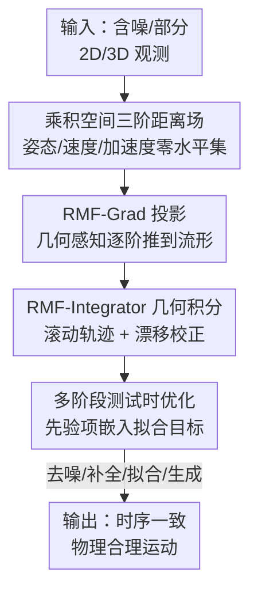

# Geometric Neural Distance Fields for Learning Human Motion Priors

**会议**: CVPR 2026  
**论文**: [CVF Open Access](https://openaccess.thecvf.com/content/CVPR2026/html/Yu_Geometric_Neural_Distance_Fields_for_Learning_Human_Motion_Priors_CVPR_2026_paper.html)  
**代码**: 待开源（作者承诺 publish 后释出）  
**领域**: 3D 人体运动 / 人体理解  
**关键词**: 人体运动先验, 神经距离场, 黎曼流形, 二阶动力学, 测试时优化  

## 一句话总结
本文提出 NRMF（Neural Riemannian Motion Fields），把人体运动的「姿态、速度、加速度」三阶动力学分别建模成三个条件神经距离场的零水平集，并配套一个几何投影算法和一个几何积分器，使得用同一个无条件先验就能稳健地完成去噪、补全（in-betweening）、单目拟合和生成等多种任务，在 AMASS/3DPW/PROX 等多个 benchmark 上全面超过 VAE 和扩散类先验。

## 研究背景与动机
**领域现状**：人体运动恢复（从稀疏/含噪观测重建 3D 运动）通常依赖一个「运动先验」来约束解的合理性。早期工作（PoseNDF、NRDF、DPoser）逐帧建模静态姿态分布；现代方法转向动力学建模，要么用自回归 VAE（HuMoR、PhaseMP），要么用扩散模型（MDM、RoHM）。

**现有痛点**：逐帧的姿态先验忽略时间一致性，导致过平滑、不合理的过渡；VAE 类存在后验坍缩，且误差随时间累积（drift）；扩散类推理慢、只擅长干净短序列、且把观测当条件做 inversion 很困难。即便是试图弥合差距的 RoHM，也因为对加速度等高阶动力学处理不足，产生过平滑的过渡和漂移。MoManifold 虽然考虑了加速度，但它把每个关节的加速度孤立建模，忽略了关节间的相互依赖，而且只能处理固定的短时间窗。

**核心矛盾**：现有先验要么只建模到 0 阶（姿态）或 1 阶（速度），缺失了对运动「自然度」至关重要的 2 阶（加速度）信息；要么虽然碰了加速度但没有尊重关节旋转所在的非欧几何（SO(3) 流形），用欧氏近似导致大噪声下失效。

**本文目标**：构建一个通用、富表达力、稳健的无条件运动先验，能完整刻画姿态—速度—加速度三阶动力学，并严格尊重 articulated motion 的底层几何。

**切入角度**：作者把「合理运动的流形」直接显式表示成距离场的零水平集——任意一个状态到这个流形的（测地）距离就是它的「不合理程度」，于是约束运动只需要把状态往零水平集投影。这个视角天然支持把不同阶的动力学解耦成相互条件的子场。

**核心 idea**：用三个建立在乘积流形 $\mathcal{M}=SO(3)^{N_J}\times so(3)^{N_J}\times \mathbb{R}^{3\times N_J}$ 上的条件神经距离场（分别对应姿态/速度/加速度）来隐式表示合理运动分布，并配套几何感知的投影与积分算法来部署这个先验。

## 方法详解

### 整体框架
NRMF 的核心是把人体运动状态 $X_t=[\mathbf{t}_r,\;\boldsymbol{\theta},\;\dot{\boldsymbol{\theta}},\;\ddot{\boldsymbol{\theta}}]$（根平移、关节旋转、角速度、角加速度）当作乘积流形 $\mathcal{M}$ 上的一个点，并把「所有合理运动」建模成一个隐式距离场 $f_\Gamma:\mathcal{M}\to\mathbb{R}^3_+$ 的零水平集 $\mathcal{S}=\{x\mid f_\Gamma(x)=\mathbf 0\}$。$f_\Gamma$ 的输出是该状态到最近合理状态的无符号测地距离。训练阶段在 AMASS 上学好这三个距离场；部署阶段用一个投影算法（RMF-Grad）把含噪状态推到零水平集，并用一个几何积分器（RMF-Integrator）从合理的加速度/速度「滚动」出连贯轨迹，最后把二者嵌进一个多阶段测试时优化框架，对接去噪、补全、单目拟合、生成等下游任务。

整条管线是「表示 → 投影 → 积分 → 部署优化」的串行结构，下面的框架图自上而下对应四个关键设计：

### 关键设计

**1. 乘积空间三阶神经距离场：把缺失的高阶动力学补回来**

针对「现有先验只到 0/1 阶、忽略加速度且不尊重几何」的痛点，作者把单一距离场 $f_\Gamma$ 解耦成三个相互条件的子场：
$$f_\Gamma=\big[\;f^R_\Phi(\boldsymbol\theta),\;\; f^\omega_\Psi(\dot{\boldsymbol\theta}\mid\boldsymbol\theta),\;\; f^{\dot\omega}_\Xi(\ddot{\boldsymbol\theta}\mid\boldsymbol\theta,\dot{\boldsymbol\theta})\;\big]$$
分别度量姿态、过渡（速度）、加速度的不合理程度，且每一阶都条件于更低阶。关键在于这三个场建在各自正确的几何空间上：姿态在旋转群 $SO(3)^{N_J}$、速度在李代数 $so(3)^{N_J}$（切空间，由 $\boldsymbol\Omega_t=\mathbf{R}_t^{-1}\dot{\mathbf{R}}_t$ 这样的反对称矩阵给出）、加速度在 $\mathbb{R}^{3\times N_J}$。每个子场用「层级网络 + MLP 解码器」实现（沿用 NRDF/PoseNDF 的结构），训练目标是让网络预测出的距离逼近到数据集中最近样本的真实测地距离：
$$\Phi^\star=\arg\min_\Phi\sum_i\big\|\,f^R_\Phi(\boldsymbol\theta_i)-\min_{\boldsymbol\theta'\in\mathcal{D}_\theta} d_{SO}^{N_J}(\boldsymbol\theta_i,\boldsymbol\theta')\,\big\|$$
速度场、加速度场同理（分别用 $so(3)$ 和 $\mathbb{R}^3$ 上的距离度量）。与 MoManifold 把各关节加速度孤立处理不同，这里的加速度场条件于全身姿态与速度，保留了关节间的依赖关系；与逐帧的 NRDF 相比，它第一次把三阶动力学都正确地放在尊重几何的距离场里建模。

**2. RMF-Grad：几何感知的自适应步长投影**

光有距离场还不够，需要把一个任意（含噪）状态映射到零水平集上才能用作约束。作者设计了一个三阶级联的单步投影，每一阶都沿着对应距离场的梯度往下走，但姿态这一阶用黎曼指数映射保证更新后仍落在 $SO(3)$ 上：
$$\boldsymbol\theta_{t+1}=\mathrm{Exp}_{\boldsymbol\theta_t}\!\Big(-\alpha_\theta\, f^R_\Phi(\boldsymbol\theta_t)\,\frac{\mathrm{grad}\,f^R_\Phi(\boldsymbol\theta_t)}{\|\mathrm{grad}\,f^R_\Phi(\boldsymbol\theta_t)\|}\Big)$$
速度、加速度两阶因为生活在（近似）欧氏的切空间/加速度空间，用普通梯度下降更新（步长 $\alpha_{\dot\theta},\alpha_{\dot\omega}$），方向同样是「距离值 × 单位梯度」。步长按距离自适应（离流形越远走得越多），故称 adaptive-step hybrid——hybrid 指它混合了流形上的 Exp 更新与欧氏更新。作者还指出在理想情况下投影后的速度应满足 $\Pi^\omega(\dot{\boldsymbol\theta})\approx \Pi^R(\boldsymbol\theta)^\top\dot{\overline{\Pi^R(\boldsymbol\theta)}}$，用这个关系来应对输入速度本身含噪的情况。相比 PoseNDF 的纯欧氏投影，这种几何感知投影在大噪声下不会失效（实验里欧氏 PoseNDF 投影在大噪声下崩掉）。

**3. RMF-Integrator：几何投影积分器，滚动轨迹兼漂移校正**

投影只保证「单帧合理」，但要生成或补全连贯序列还需要把合理的加速度/速度积分成时间上自洽的轨迹。作者提出一个确定性的几何积分器，本质是带先验投影的 Euler 积分：先更新速度、再积分旋转：
$$\dot{\boldsymbol\theta}_{t+1}=\Pi^\omega\big(\dot{\boldsymbol\theta}_t+\lambda_t\ddot{\boldsymbol\theta}_t\big),\qquad \boldsymbol\theta_{t+1}=\Pi^R\big(\mathrm{Exp}_{\boldsymbol\theta_t}(\alpha_t\,[\dot{\boldsymbol\theta}_t]_x)\big)$$
注意每一步积分后都再套一次对应的投影 $\Pi$，所以积分过程本身就在持续把轨迹及其各阶导数往合理流形上拉。这等价于对轨迹和它的导数做去噪、做 drift correction——这正是 VAE 类方法误差随时间累积、扩散类过平滑的痛点所在。给定一个合理的初始状态和一串加速度，就能 roll out 出物理上可信的整段运动。

**4. 多阶段测试时优化：把无条件先验部署成有条件求解器**

最后要让这个无条件先验服务于「给定观测 $O_{0:T}$（2D/3D 关节、点云）恢复运动」的下游任务。作者设计两阶段优化：**Stage I** 只用 0 阶姿态先验做初始化，最小化类 HuMoR 目标 $E_I=L_{data}+\lambda_\beta L_\beta+\lambda_\theta L_\theta+\lambda_{reg}L_{reg}$，其中 $L_\theta=f^R_\Phi(\boldsymbol\theta_i)$ 就是姿态距离场本身；**Stage II** 引入过渡与加速度先验项 $L_{\dot\theta}=f^\omega_\Psi(\dot{\boldsymbol\theta}_i)$、$L_{\ddot\theta}=f^{\dot\omega}_\Xi(\ddot{\boldsymbol\theta}_i)$，再加脚—地接触物理约束进 $L_{reg}$，并在每次迭代内调用 RMF-Integrator 做 rollout 进一步提精度。这样一来，同一组先验通过更换 $L_{data}$ 就能覆盖去噪、部分观测补全、单目 RGB(-D) 拟合；生成则从随机初始的加速度/速度 roll out 出含噪序列，再走一遍 integrator + 测试时优化得到干净运动。

> ⚠️ 上面投影/积分式中的部分符号（如 $\lambda_t,\alpha_t$ 的具体取法、egrad2rgrad 细节）原文放在 supplementary，正文只给主式，具体实现以原文补充材料为准。

## 实验关键数据

### 主实验

**3D 含噪观测的运动去噪（AMASS，4cm 高斯噪声，90 帧）**：NRMF 在位置误差和加速度误差上全面领先（单位 mm，Acc Err 越低越好）。

| 方法 | All Pos. Err ↓ | Vtx ↓ | Acc Err ↓ |
|------|------|------|------|
| HuMoR (VAE) | 35.5 | — | 4.67 |
| RoHM (扩散) | 32.4 | — | 2.61 |
| NRDF + T-NRDF | 22.6 | — | 2.97 |
| Motion-NDF | 23.5 | — | 2.64 |
| **NRMF (ours)** | **19.9** | — | **2.25** |

**部分观测拟合（AMASS，遮挡掩码 0.9m）**：在遮挡区域（Occ）和全身（All）误差上同样最优。

| 方法 | Occ ↓ | All ↓ | Acc Err ↓ |
|------|------|------|------|
| HuMoR | 120.3 | 67.9 | 4.78 |
| RoHM | 88.4 | 51.3 | 2.43 |
| NRDF + T-NRDF | 87.1 | 48.5 | 3.01 |
| **NRMF (ours)** | **83.8** | **46.3** | **2.31** |

**单目 mesh 精修（3DPW，以 SMPLer-X 初始化）**：作为优化式精修模块叠加在回归结果上。

| 方法 | MPJPE ↓ | MPVPE ↓ | Acc Err ↓ | Trans Err(×10⁻³) ↓ |
|------|------|------|------|------|
| SMPLer-X | 82.65 | 94.23 | 23.71 | 31.63 |
| + NRDF (仅 0 阶) | 71.88 | 83.23 | 24.31 | 26.38 |
| + RoHM | 69.78 | 79.72 | 9.13 | 12.37 |
| **+ NRMF (full)** | **66.13** | **75.61** | **6.52** | **5.67** |

### 消融实验

Table 3 内部天然构成逐阶消融：只加各阶先验时，加速度/过渡误差的下降最能说明高阶先验的价值。

| 配置 | MPJPE ↓ | Acc Err ↓ | Trans Err(×10⁻³) ↓ | 说明 |
|------|------|------|------|------|
| + No prior | 84.67 | 26.75 | 34.54 | 仅优化像素对齐，运动不合理 |
| + NRDF (0 阶姿态) | 71.88 | 24.31 | 26.38 | 缺高阶约束，Acc/Trans 几乎没改善 |
| + T-NRDF (加 1 阶过渡) | 66.98 | 9.89 | 7.98 | Acc Err 骤降，过渡先验最吃重 |
| + A-NRDF (加 2 阶加速度) | 70.88 | **6.73** | 11.87 | 加速度先验把 Acc Err 压到最低 |
| **NRMF (full)** | **66.13** | 6.52 | **5.67** | 三阶联合，整体最优 |

### 关键发现
- **过渡（1 阶）先验对加速度误差贡献最大**：从仅 0 阶到加上 T-NRDF，Acc Err 从 24.31 直接掉到 9.89；这印证了「逐帧姿态先验导致过平滑/不合理过渡」的诊断。
- **加速度（2 阶）先验单独看最能压低 Acc Err**（A-NRDF 6.73），而把三阶合起来才能在位置精度与各阶误差间同时取得最优，说明三者互补而非冗余。
- **尊重几何很关键**：表 1/2 中正确处理旋转几何的方法（NRDF、NRMF）普遍优于欧氏 PoseNDF 投影，后者在大噪声下直接失效。
- **生成任务（Table 4）**：NRMF 拿到最低的运动 FIDm（5.317，对比 HuMoR 9.147、MoManifold 8.351）和最低的平均加速度范数（3.18，抖动最小），同时保持有竞争力的多样性 APD（96.37），说明它生成的运动既稳又多样。
- **野外 RGB(-D)（i3DB/EgoBody/PROX）**：在可见与遮挡关节上都显著降低位置与加速度误差，例如 EgoBody 上 All 误差 92.10 vs RoHM 98.33、Acc 1.58 vs 2.97。

## 亮点与洞察
- **「不合理程度 = 到流形的距离」这个隐式视角很优雅**：把先验建模成距离场零水平集后，约束运动就是梯度投影，天然支持解耦成多阶条件子场——这比 VAE 编解码、扩散去噪都更直接地表达「合理性」。
- **同一个无条件先验打通四类任务**：去噪/补全/拟合/生成只通过更换数据项 $L_{data}$ 实现，先验本身不需要重训或重新条件化，这是相对扩散类「难以做 inversion」的实用优势。
- **投影 + 积分双算子的分工清晰**：投影负责「单帧拉回流形」，积分器负责「把合理导数串成连贯轨迹并校正漂移」，二者组合直击 VAE 漂移与扩散过平滑两大顽疾，是可迁移到其他流形上序列建模（如手部 MANO、刚体姿态）的思路。
- **几何严谨性**：在 $SO(3)/so(3)$ 上用 Exp 映射与黎曼梯度更新，而非欧氏近似，实验证明这是大噪声下不崩的关键。

## 局限与展望
- **运行时间长**：迭代式投影/优化使处理 <1min 的序列可能耗时数分钟，难以实时部署（作者承认）。
- **缺理论保证**：投影—积分器没有严格的最优性/收敛性分析，无法证明所得轨迹是最优的（作者承认）；展望用 learning-to-optimize 或黎曼 Langevin MCMC 这类有原理的采样器替代当前积分器。
- ⚠️（自己发现）训练依赖 AMASS 单一 mocap 数据集，先验的「合理」范围受限于 AMASS 动作分布；对训练集中罕见的极端/专业动作（如体操、特技）是否会被错误地拉向「平均合理」运动，文中未单独评估。
- ⚠️ 速度/加速度用中心差分估计，作者称是真值的良好近似，但在采样率低或运动剧烈时差分误差对 2 阶先验的影响如何，正文未展开。

## 相关工作与启发
- **vs NRDF / PoseNDF**：它们只建模 0 阶逐帧姿态距离场；NRMF 的姿态场 $f^R_\Phi$ 实际就退化为 NRDF，但额外补上了 1 阶过渡场和 2 阶加速度场，从「逐帧姿态先验」升级为「完整动力学先验」，解决了逐帧建模的时序不一致与过平滑。
- **vs MoManifold**：两者都考虑加速度，但 MoManifold 把各关节加速度解耦孤立、且限定固定短窗口；NRMF 的加速度场条件于全身姿态与速度，保留关节间依赖，且不受窗口长度限制。
- **vs HuMoR / PhaseMP（VAE 自回归）**：VAE 受后验坍缩与误差累积之苦；NRMF 用距离场投影 + 积分器主动做漂移校正，从机制上抑制 drift。
- **vs RoHM / MDM（扩散）**：扩散类推理慢、对观测做条件（inversion）困难、且因高阶处理不足而过平滑；NRMF 是优化式部署，换数据项即可适配任意观测模态，且加速度先验直接管住平滑度。

## 评分
- 新颖性: ⭐⭐⭐⭐⭐ 首次在乘积流形上完整、几何严谨地建模姿态/速度/加速度三阶神经距离场，并配套几何投影与积分器，视角新颖。
- 实验充分度: ⭐⭐⭐⭐⭐ 覆盖去噪/补全/单目拟合/生成四类任务、五个数据集，含逐阶消融，对比全面。
- 写作质量: ⭐⭐⭐⭐ 几何推导严谨清晰，但大量核心细节（投影/积分伪代码、损失权重）下放到 supplementary，正文略难自洽复现。
- 价值: ⭐⭐⭐⭐⭐ 一个先验通吃多任务、机制上同时治 drift 与过平滑，对运动恢复与生成都有较强实用与启发价值。

<!-- RELATED:START -->

## 相关论文

- [\[CVPR 2026\] Hierarchical Enhancement of Semantic Priors for Disentangled Text-Driven Motion Generation](hierarchical_enhancement_of_semantic_priors_for_disentangled_text-driven_motion_.md)
- [\[ICLR 2026\] NeuroGaze-Distill: Brain-informed Distillation and Depression-Inspired Geometric Priors for Robust Facial Emotion Recognition](../../ICLR2026/human_understanding/neurogaze-distill_brain-informed_distillation_and_depression-inspired_geometric_.md)
- [\[CVPR 2025\] Learning Affine Correspondences by Integrating Geometric Constraints](../../CVPR2025/human_understanding/learning_affine_correspondences_by_integrating_geometric_constraints.md)
- [\[CVPR 2026\] Learning Long-term Motion Embeddings for Efficient Kinematics Generation](learning_long-term_motion_embeddings_for_efficient_kinematics_generation.md)
- [\[CVPR 2026\] MoLingo: Motion-Language Alignment for Text-to-Human Motion Generation](molingo_motion-language_alignment_for_text-to-motion_generation.md)

<!-- RELATED:END -->
