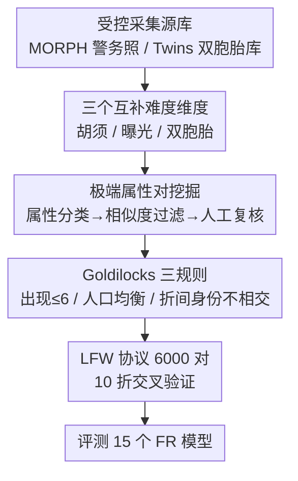

# Goldilocks Test Sets for Face Verification

**会议**: CVPR 2026  
**论文**: [CVF Open Access](https://openaccess.thecvf.com/content/CVPR2026/html/Wu_Goldilocks_Test_Sets_for_Face_Verification_CVPR_2026_paper.html)  
**代码**: https://github.com/HaiyuWu/SOTA-FaceRecognition-Train-and-Test  
**领域**: 人体理解  
**关键词**: 人脸验证, 测试集基准, 面部属性, 双胞胎识别, 人口公平  

## 一句话总结
当主流人脸验证测试集已被刷到饱和（LFW 99.8%）时，本文不靠降画质/加遮挡造难度，而是从受控采集的高质量人脸库里挖出三类"自然但难"的图像对——大胡须差异（Hadrian）、强曝光差异（Eclipse）、同卵双胞胎（ND-Twins），并配一套"Goldilocks 三规则"保证测试集难得恰到好处，结果难度反超那些靠加合成口罩、降分辨率的人工 benchmark。

## 研究背景与动机
**领域现状**：自 ArcFace 以来，人脸识别（FR）模型在 LFW、CFP-FP、CPLFW、CALFW、AgeDB-30 等一套标准测试集上评测。随着训练集规模膨胀，这些测试集的准确率迅速饱和——LFW 上各模型普遍 99.8%，连"最难"的 CPLFW 也已到 ~94%，几乎区分不出模型优劣。

**现有痛点**：为了重新拉开难度，社区近年造的"难"测试集（MLFW 加合成口罩、XQLFW 降分辨率、TALFW 加对抗扰动）几乎都走"人为破坏图像质量"这条路。但这类难度来自图像退化，并不反映模型在**正常画质、正常人脸**下到底差在哪。

**核心矛盾**：FR 模型真正的薄弱点其实藏在三种"画质完好但语义上难"的配对里——① 同一人但面部属性差异大的正样本对（genuine pair，如一张没胡子、一张络腮胡）；② 不同人但属性高度相似的负样本对（impostor pair）；③ 长得像的人（双胞胎、亲属）。这些难度被现有"降画质"路线完全绕开了。

**本文目标**：在不损伤图像质量的前提下，构造能暴露上述三类弱点的测试集；同时解决老测试集本身的设计缺陷（单图反复出现、人口分布失衡、同一身份散落在多个交叉验证折里）。

**切入角度**：作者注意到受控采集的人脸库（MORPH 警务照、Twins Challenge 双胞胎库）画质高、有属性/人口元数据，正好能在"高画质"约束下精挑出极端属性对。

**核心 idea**："用自然属性的极端配对代替图像退化来制造难度"，并加一层 Goldilocks 约束让难度恰到好处——既不会因噪声/重复样本难到全员随机猜，也不会松到再次饱和。

## 方法详解

### 整体框架
本文不是模型方法，而是一条**测试集构造流水线**：从受控采集的源库出发，按目标属性挖出"极端配对"作为候选，用 FR 相似度过滤掉太易/太难和标签噪声，再施加 Goldilocks 三条规则约束样本分布，最后按 LFW 的 10 折交叉验证协议组装成 6,000 对的测试集，用来评测 15 个 FR 模型（5 种损失算法 × 3 个训练集）。三套测试集（Hadrian / Eclipse / ND-Twins）共用同一条流水线，只是目标属性和源库不同。

### 关键设计

**1. 三个互补难度维度：把"自然但难"拆成胡须 / 曝光 / 双胞胎三个轴**

针对"现有难测试集都靠降画质、绕开了自然语义难度"这个痛点，作者把 FR 的三类天然弱点各做成一套测试集。**Hadrian** 攻面部毛发差异：正样本对设计成 {无胡须, 络腮胡} 这种同人大反差，负样本对设计成 {络腮胡, 络腮胡} 这种异人高相似——因为已有研究发现毛发属性差异越大、相似度越低，而都留胡子的人之间相似度反而最高。**Eclipse** 攻曝光差异：把人脸按面部亮度分位划成强欠曝(SU)/欠曝(U)/中(M)/过曝(O)/强过曝(SO)五档，正样本对取 {高曝光, 低曝光}，负样本对取 {高,高} 或 {低,低}；为隔离变量，Eclipse 只用无胡须图像，反过来 Hadrian 也压制曝光影响，两套测试集做到"单属性"干净对照。**ND-Twins** 攻长相相似：已有相似脸测试集（SLLFW、DoppelVer）收的是"撞脸者"，模型轻松刷过 96%+，太易；本文改用专门的同卵双胞胎库，15 个模型在其上平均只有 71.57%，真正逼出"长得像"的难度。三套各管一类弱点，互补而不重叠。

**2. 极端属性对挖掘：属性分类 → 相似度过滤 → 人工复核的三级提纯**

光按属性标签配对还不够，会混入标签噪声和"假难"对。作者用三级提纯把候选收紧到"真·难且真·对"。先用属性分类器（阈值 0.9）筛出目标属性图像；再用 FR 模型抽特征算余弦相似度，对 genuine/impostor 各随机取 7,000 对做分析，并用阈值剔除疑似标签错误的对——impostor 相似度 $>0.7$ 与 genuine 相似度 $<0.3$ 都被排除（前者大概率是同人误标成异人、后者反之）；Hadrian 还额外要求 genuine 对的年龄差 $\le 5$ 岁以隔离年龄变量。最后一步是**人工复核**：肉眼核对身份标签噪声、genuine 对里其实没差异的"假难"、impostor 对里属性其实差很多的"假相似"——Hadrian 据此剔掉 543 对 genuine、279 对 impostor（属性配错）和 44 对（身份噪声）。这套"算法粗筛 + 人工精修"是测试集"难得干净"的关键，避免把噪声当难度。

**3. Goldilocks 三规则：让难度恰到好处而非"太难/太松"**

这是本文方法论上的核心贡献，名字取自童话"金发姑娘"——不太烫也不太凉、刚刚好。规则一**限制单图出现次数**：每张图在 6,000 对里出现 $\le 6$ 次（genuine、impostor 各 $\le 3$ 次）。这条至关重要——作者实测若不加此约束，少数极难样本会反复出现放大评测偏差，导致所有 FR 模型在 ND-Twins 上都跌破 50%（不如随机猜）、在 Hadrian/Eclipse 上 $<55\%$，难到失去区分度。规则二**人口分组均衡**：用 FairFace 估种族标签、按身份多数投票定标，让各人口组贡献等量图像对（Hadrian/Eclipse 因 MORPH 自带人口标签可严格均衡；ND-Twins 受双胞胎库限制只能 85% 白人 / 15% 黑人）。规则三**折间身份不相交**：10 折交叉验证里，同一身份的 genuine 对不跨折出现，避免测试折的身份在另外 9 个训练折里泄露阈值——这是老测试集普遍忽略的环节。三条规则共同把测试集卡在"难但稳"的甜区。

### 一个完整示例：Hadrian 的组装
以非裔男性(AAM)为例走一遍：先用属性分类器从 15.5 万张 AAM 图像里筛出"无胡须"和"络腮胡"两类；按目标配对 {无胡须, 络腮胡} 凑 genuine、{络腮胡, 络腮胡} 凑 impostor，各随机 7,000 对；用 FR 相似度剔除 $>0.7$ 的 impostor 和 $<0.3$ 的 genuine、再卡年龄差 $\le 5$ 岁、单图出现 $\le 3$ 次，AAM 的 genuine 收缩到 2,205 对、impostor 到 4,180 对；人工复核再砍掉属性配错和身份噪声；最终 AAM 贡献 1,500 genuine + 1,500 impostor。CM（白人男性）同流程，两组各 3,000 对拼成 Hadrian 的 6,000 对，分成 10 折、每折 300 genuine + 300 impostor，折间身份不相交。

## 实验关键数据

### 主实验：三套测试集都比现有"最难"基准更难
用 ResNet100 backbone、5 种损失算法各在 3 个训练集（MS1MV2 / WebFace4M / Glint360K）上训练，共 15 个模型，下表为 15 模型平均准确率（%）。$\Delta\mathrm{Acc}$ = 本文 $-$ CPLFW（CPLFW 是此前最难的常用测试集）：

| 测试集 | 关注难度 | 平均准确率 | ∆Acc vs CPLFW |
|--------|---------|-----------|----------------|
| LFW | 通用 | 99.79 | +5.75 |
| CFP-FP | 姿态 | 98.91 | +4.87 |
| CPLFW | 姿态 | 94.04 | 0（基准） |
| AgeDB-30 | 年龄 | 98.05 | +4.01 |
| CALFW | 年龄 | 96.09 | +2.05 |
| **Hadrian** | 面部毛发 | **92.62** | **−1.42** |
| **Eclipse** | 曝光 | **82.81** | **−11.23** |
| **ND-Twins** | 双胞胎 | **71.56** | **−22.48** |

三套测试集准确率全部低于 CPLFW，且 Eclipse、ND-Twins 比靠加合成口罩(MLFW)、降画质(XQLFW)的退化型测试集更难——说明"自然属性极端配对"造出的难度可与"破坏图像质量"相当甚至更高，却不牺牲画质。

### 消融实验

| 配置 | 关键结果 | 说明 |
|------|---------|------|
| 随机抽 MORPH5（域对照） | 各模型 $>99\%$ | 同源库随机配对极易，证明难度来自属性设计而非域偏移（表 3）|
| 折间身份不相交 vs 重叠 | $\Delta$ 仅 $\sim$0.05~0.15% | 身份泄露对准确率影响很小，但仍建议严格不相交以保严谨（表 4）|
| 各人口组分项准确率 | 组间差 $>30.62\%$ | 如 Eclipse 上 AAM 95% vs CF 65%，凸显人口均衡评测的必要性（表 5）|
| 去掉"出现 $\le 6$"约束 | ND-Twins 全员 $<50\%$ | 不限重复→极难样本反复出现→模型跌破随机猜，验证 Goldilocks 规则一 |

### 关键发现
- **难度真来自属性设计，不是域差**：同样取自 MORPH 的随机配对集准确率 $>99\%$，反而比野采集的测试集还容易，排除了"难是因为换了数据域"的质疑。
- **人口组间鸿沟巨大**：Eclipse 上非裔/白人男性可达 93–95%，而女性组（CF/AAF）只有 65–74%，组间差超 30%——若不均衡评测会被白人样本主导而高估泛化。
- **"作弊"难以奏效**：作者论证即便把固定属性模式注入算法，多分类训练范式会让模型在其他测试集上掉点；且 {络腮胡, 极端曝光, 同卵双胞胎} 这些属性在主流训练集里几乎不出现，难以针对性刷分。

## 亮点与洞察
- **难度来源的范式转换**：从"破坏图像"转向"挑选自然但极端的语义配对"，证明高画质照样能造出超越退化型 benchmark 的难度——这对依赖"加噪造难"的评测社区是个有力反例。
- **Goldilocks 三规则可复用**：出现次数封顶、人口均衡、折间身份不相交，是一套与具体属性无关的"测试集卫生"准则，可直接迁移到任何 LFW 协议的人脸（乃至更广义验证）benchmark。
- **"出现 $\le 6$"的反直觉作用**：限制重复反而是控制难度的关键旋钮——不限会让少数极难样本主导评测、难到失去区分度，这点很容易被忽视。
- **变量隔离的工程巧思**：Hadrian 压曝光、Eclipse 压胡须，让两套测试集成为彼此干净的单属性对照，便于把"模型到底栽在哪个属性"归因清楚。

## 局限与展望
- **规模偏小**：6,000 对与常用测试集一致，但远小于 IJB 系列，泛化性评估受限；作者靠 Goldilocks 规则尽量纳入更多图像/人口组来缓解。
- **ND-Twins 难以满足全部规则**：双胞胎数据稀缺，无法做到人口均衡，且只能让一个身份占 9 折、其余各占 1 折，没完全满足折间不相交。
- **⚠️ 折间不相交收益很小**：消融显示身份泄露仅影响 $\sim$0.1%，作者仍坚持严格不相交更多是出于设计严谨性而非实证必要——这条规则的实际价值可再评估。
- **可改进方向**：扩大双胞胎/亲属数据规模、把 Goldilocks 规则推广到 TAR@FAR 协议的 IJB 类大规模测试集、加入更多自然属性轴（如妆容、配饰）。

## 相关工作与启发
- **vs MLFW / XQLFW / TALFW（退化型难测试集）**：它们靠加合成口罩、降分辨率、对抗扰动制造难度，难度来自图像退化；本文用自然属性极端配对，画质不损而难度反超，更能反映真实部署中的薄弱点。
- **vs SLLFW / DoppelVer（相似脸测试集）**：它们收"撞脸者"，模型轻松刷过 96%+，未能反映真实相似脸难度；ND-Twins 改用同卵双胞胎，把准确率压到 71.57%，真正暴露"长得像"问题。
- **vs LFW 评测协议**：完全沿用 LFW 的 10 折交叉验证结构以保证可比，但补上了 LFW 系列忽略的三个设计缺陷（重复样本、人口失衡、折间身份泄露）。

## 评分
- 新颖性: ⭐⭐⭐⭐ 难度来源的范式转换 + Goldilocks 规则有清晰创新，但属基准构造而非新模型
- 实验充分度: ⭐⭐⭐⭐⭐ 15 模型 × 多测试集主评 + 域/折/人口/重复四项消融，论证扎实
- 写作质量: ⭐⭐⭐⭐ 构造流程交代清楚，三套测试集逻辑统一；个别选样数字略琐碎
- 价值: ⭐⭐⭐⭐⭐ 提供画质无损的高难度 benchmark + 可复用的测试集卫生准则，对 FR 评测有实际意义

<!-- RELATED:START -->

## 相关论文

- [\[AAAI 2026\] AHAN: Asymmetric Hierarchical Attention Network for Identical Twin Face Verification](../../AAAI2026/human_understanding/ahan_asymmetric_hierarchical_attention_network_for_identical.md)
- [\[CVPR 2026\] Anatomical Domain Shifts: Test-time Heterogeneous Adaptation for 3D Human Pose Prediction](anatomical_domain_shifts_test-time_heterogeneous_adaptation_for_3d_human_pose_pr.md)
- [\[ICLR 2026\] GaitSnippet: Gait Recognition Beyond Unordered Sets and Ordered Sequences](../../ICLR2026/human_understanding/gaitsnippet_gait_recognition_beyond_unordered_sets_and_ordered_sequences.md)
- [\[CVPR 2026\] FaceCoT: Chain-of-Thought Reasoning in MLLMs for Face Anti-Spoofing](facecot_cot_reasoning_face_anti_spoofing.md)
- [\[CVPR 2026\] IDperturb: Enhancing Variation in Synthetic Face Generation via Angular Perturbations](idperturb_enhancing_variation_in_synthetic_face_generation_via_angular_perturbat.md)

<!-- RELATED:END -->
