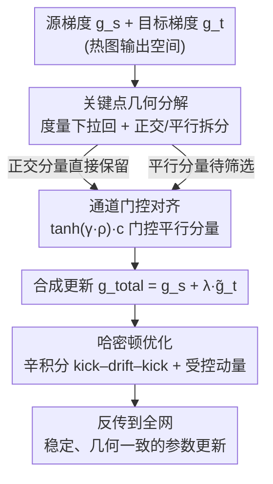

# HamiPose: Hamiltonian Optimization for Unsupervised Domain Adaptive Pose Estimation

**会议**: CVPR 2026  
**论文**: [CVF Open Access](https://openaccess.thecvf.com/content/CVPR2026/html/Li_HamiPose_Hamiltonian_Optimization_for_Unsupervised_Domain_Adaptive_Pose_Estimation_CVPR_2026_paper.html)  
**代码**: 待确认  
**领域**: 人体理解 / 姿态估计 / 无监督域适应  
**关键词**: 姿态估计, 无监督域适应, 梯度冲突, 哈密顿优化, 辛积分

## 一句话总结
针对合成→真实域姿态估计中"源监督梯度 vs 目标一致性梯度"互相打架导致的训练震荡，HamiPose 先按关键点把目标梯度正交分解、用置信度门控只放行不冲突的成分，再用带辛积分器的哈密顿优化器给更新加上"受控动量"压住高频抖动，在多个 UDA 姿态基准上拿到 SOTA。

## 研究背景与动机

**领域现状**：姿态估计依赖大量带精确标注的数据，真实世界采集昂贵，于是社区转向"合成数据训练 + 无监督域适应（UDA）迁移到真实域"的范式。主流 UDA 姿态方法走过两条路：早期做特征/分布对齐（对抗训练、矩匹配），后来转向预测空间，用 Mean Teacher 框架让学生网络与教师的伪热图保持一致。

**现有痛点**：无论对齐特征还是对齐预测，都没解决一个更底层的问题——**训练过程中多个监督信号在优化时怎么相互作用**。近期工作发现，域偏移下性能退化的根源往往是"源监督目标"与"目标一致性目标"之间的**梯度冲突**。

**核心矛盾**：姿态估计的梯度冲突有它**独特的形态**。姿态用热图监督，每个关节是一个又窄又尖的高斯峰，有效梯度只存在于峰值附近一小块邻域——这有两个恶果：(1) **稀疏且尖锐**：哪怕预测只偏一点点，梯度方向都可能翻转，在尖峰附近放大成剧烈震荡；(2) **跨关节异质**：伪热图质量随遮挡、截断、运动模糊而波动，于是冲突高度集中在少数"困难关节"上，其它关节却很一致。把所有关节、所有信号一锅端地平均，就会发生破坏性抵消，参数更新来回振荡，难以收敛。

**本文目标**：在稀疏、异质监督下，找到一种**保持动力学稳定**的优化方式——既剔除真正冲突的梯度成分，又不误伤有用信号，还要在长训练过程里压住高频震荡。

**切入角度**：作者把优化看成"能量地形上的几何感知输运"——损失充当势能，一个数据驱动的度量诱导动能，参数沿着保结构的流演化。物理里**哈密顿动力学 + 辛积分器**正是为"振荡 + 长时演化"系统设计的：它们守恒能量、抑制数值过冲，能在长积分中保持振荡运动的定性稳定性。

**核心 idea**：把整个优化过程建模成一个哈密顿系统——先在检测头处对每个关键点做梯度**正交分解 + 置信度门控**，产出"解耦且置信度校准"的梯度；再用辛积分器把它输运为带受控动量的更新，从而同时解决"冲突"和"震荡"两件事。

## 方法详解

### 整体框架

HamiPose 建立在 Mean Teacher 框架上：学生 $f_\theta$ 在带标签源域上学监督损失，在无标签目标域上与教师 $f_{\theta'}$（参数按 EMA $\theta'_t=\tau\theta'_{t-1}+(1-\tau)\theta_t$ 更新）保持一致。总损失是 $L(\theta)=L_s(\theta)+\lambda L_t(\theta,\theta')$，其中 $L_s$ 是源域热图 MSE，$L_t$ 是目标域学生-教师热图一致性 MSE。

关键在于：它**不是直接把 $g_s^{out}=\nabla_H L_s$ 和 $g_t^{out}=\nabla_H L_t$ 简单相加**反传，而是先在输出（热图）空间检测并化解冲突，再把"干净"梯度反传到全网。整条管线分三步串行：

1. **关键点几何分解**——在一个统一的、归一化的度量几何里，把每个关键点通道的目标梯度拆成"与源平行"和"与源正交"两部分，正交部分天然无害先保留；
2. **通道门控对齐**——对平行部分按"几何一致性 × 教师置信度"打门控分，只放行可靠的正向对齐成分，抑制不靠谱的伪信号；
3. **哈密顿优化**——把这份"解耦 + 置信度校准"的梯度交给带辛积分器的哈密顿优化器，用动量惯性平滑残余的尖刺式抖动。

### 关键设计

**1. 关键点几何分解：在统一度量下把目标梯度拆成"无害的正交"和"待审的平行"**

痛点直说：稀疏热图监督下，不同关节梯度的尺度/曲率差异很大，直接在原始空间比较源/目标梯度方向会被尺度误导，而困难关节的冲突会被平均掉。本设计先给参数空间装一个**块对角度量** $D_k^{(t-1)}=(\alpha_{t-1}^{(k)}+\varepsilon)I$，其中二阶矩累加器 $\alpha^{(k)}$ 按实际参数增量的平方做 EMA 更新（$\alpha_{t-1}^{(k)}=\mu\alpha_{t-2}^{(k)}+(1-\mu)\,\mathrm{mean}((\Delta\theta_{t-1}^{(k)})^2)$）——相当于给每个关键点通道一个自适应的"质量"，让不同关节的梯度在同一把尺子下可比。

机制上，把输出梯度通过雅可比 $J_k=\partial H_k/\partial\theta^{(k)}$ 拉回到参数空间：$\hat g_s^{(k)}=J_k^\top g_s^{(k)}$，$\hat g_t^{(k)}=J_k^\top g_t^{(k)}$，在度量 $(D_k^{(t-1)})^{-1}$ 下算度量归一化余弦 $\rho_k$ 和投影系数 $a_k=\frac{(\hat g_s^{(k)})^\top (D_k^{(t-1)})^{-1}\hat g_t^{(k)}}{(\hat g_s^{(k)})^\top (D_k^{(t-1)})^{-1}\hat g_s^{(k)}}$。然后在输出空间把目标梯度分解：

$$g_{t,\parallel}^{(k)}=a_k\,g_s^{(k)},\qquad g_{t,\perp}^{(k)}=g_t^{(k)}-g_{t,\parallel}^{(k)}.$$

构造上正交分量满足 $(J_k^\top g_{t,\perp}^{(k)})^\top (D_k^{(t-1)})^{-1}(J_k^\top g_s^{(k)})=0$——即正交部分在该度量下对源下降方向**无害**，可以无条件保留；真正可能冲突的只剩平行部分，留给下一步审查。按关键点单独评估，正是为了把遮挡/噪声引起的**局部**冲突就地处理掉，而不是被全局平均稀释。

**2. 通道门控对齐：用"几何一致性 × 教师置信度"只放行可靠的平行成分**

即使在归一化几何下，某些关键点的目标梯度仍可能与源相反（遮挡、截断、伪标签差）。本设计对平行分量做一个**确定性门控**：先从教师热图取每通道置信度 $c_k=\max_{u\in\Omega}(f_{\theta'}(x^T))_k(u)\in[0,1]$（峰值越高越可信），再用一个随训练退火的锐度参数 $\gamma(t)=\gamma_{min}+(\gamma_{max}-\gamma_{min})\cdot\min(1,t/T_{warm})$，组成门控分：

$$\phi_k=\max\!\big(0,\ \tanh(\gamma(t)\,\rho_k)\big)\cdot c_k\in[0,1].$$

这个门有三重含义：当对齐为非正（$\rho_k\le 0$）时 $\phi_k=0$ 直接封死、绝不引入反向梯度；随 $\gamma$ 增大逐步放行正向对齐成分；再乘教师置信度抑制不靠谱通道。退火设计避免训练早期就"硬过滤"——早期估计差，过早严格筛选会误杀，随着估计变好再逐渐提高选择性。最终每通道过滤后的目标梯度 $\tilde g_{t,pc}^{(k)}=g_{t,\perp}^{(k)}+\phi_k\,g_{t,\parallel}^{(k)}$（正交全保留 + 平行按门放行），合成总更新 $g_{total}^{out}=g_s^{out}+\lambda\,\tilde g_{t,pc}$。论文证明 $\phi_k\ge 0$ 且 $\rho_k>0\Rightarrow a_k>0$，于是合成更新与源方向在度量下**非冲突**。

**3. 哈密顿优化：用辛积分器给更新加"受控动量"压住高频震荡**

经过门控后，目标信号仍然稀疏异质，跨 batch 会产生高频振荡。本设计把优化建模成哈密顿系统：给参数 $\theta$ 配一个同形动量 $p$，定义哈密顿量 $H(\theta,p)=\tfrac12 p^\top (D^{(t-1)})^{-1}p+L_s(\theta)+\lambda L_t(\theta)$，质量矩阵 $D^{(t-1)}=(\alpha_{t-1}+\varepsilon)I$（同样按全局参数增量平方 EMA 自适应）。对应正则方程 $\dot\theta=(D^{(t-1)})^{-1}p$、$\dot p=-\nabla_\theta(L_s+\lambda L_t)$。

实现上用**单梯度辛欧拉（kick–drift–kick）**：把过滤后的输出梯度拉回参数空间 $g_H=J_\theta^\top g_{total}^{out}$（这一步保持了头部建立的非冲突性质，让全网各层都收到几何一致的更新），然后

$$p\leftarrow p-\tfrac{\epsilon}{2}g_H,\quad \theta\leftarrow\theta+\epsilon (D^{(t-1)})^{-1}p,\quad p\leftarrow p-\tfrac{\epsilon}{2}g_H.$$

每步只算一次梯度、两次动量 kick 复用同一个 $g_H$，所以每步成本约等于一次标准反传；额外开销只是对动量做逐组标量缩放（$D$ 块对角），$O(|\theta|)$ 可忽略。物理直觉是：自适应几何耦合的动量带来惯性，把尖刺式热图监督引发的高频"踢动"在时间上积分平滑掉，自然滤掉不一致的梯度爆发，保持一阶效率的同时改善长程稳定性——这正是 SGD/Adam 在这种稀疏尖峰监督下做不到的。

### 损失函数 / 训练策略
总目标即 $L=L_s+\lambda L_t$（$\lambda=1.0$）。骨干用 ResNet101 的 Simple Baseline；训练 70 epoch、batch 32、每 epoch 500 iter；所有 EMA 衰减取 0.99（教师 $\tau$、全局/分组二阶矩 $\mu$ 都是 0.99）；辛步长 $\epsilon=10^{-3}$，一个 epoch 线性 warmup 后余弦衰减；门控锐度取 $\gamma_{min}=0,\gamma_{max}=2$，warmup 比例 10%。

## 实验关键数据

数据集：人体姿态用合成 SURREAL → 真实 LSP / Human3.6M；手部姿态用合成 RHD → 真实 H3D / FreiHand。指标用 PCK@0.05（落在图像尺寸 5% 内算正确），分关节区域细分（人体 Sld/Elb/Wrist/Hip/Knee/Ankle，手部 MCP/PIP/DIP/Fin）。

### 主实验（UDA 人体姿态，PCK@0.05 All）

| 迁移设定 | Source Only | RegDA(CVPR21) | UniFrame(ECCV22) | PGDA(NeurIPS24) | **HamiPose** |
|----------|-------------|---------------|------------------|-----------------|--------------|
| SURREAL→LSP | 56.7 | 74.6 | 82.0 | 82.7 | **83.9** |
| SURREAL→Human3.6M | 55.3 | 75.6 | 79.0 | 79.2 | **79.8** |

手部姿态（RHD→H3D / RHD→FreiHand，All）上 HamiPose 同样最优：H3D 83.1（次优 DA-LLPose 82.6），FreiHand 59.9（次优 59.2），在困难的 DIP/Fin 细分关节上优势更明显。

### 消融实验（逐步加三大组件，PCK All）

| Unified Metric | Channelwise Filtering | Hamiltonian Transport | SURREAL→Human3.6M | RHD→H3D |
|:---:|:---:|:---:|:---:|:---:|
| ✘ | ✘ | ✘ | 75.3 | 79.3 |
| ✔ | ✘ | ✘ | 77.2 | 80.9 |
| ✔ | ✔ | ✘ | 78.5 | 82.3 |
| ✔ | ✔ | ✔ | **79.8** | **83.1** |

三个组件各自贡献约 +1.5~2 点且互补：统一度量先把梯度尺度拉平、削弱"易监督关节"的更新主导（Human3.6M 75.3→77.2，hip 等困难部位提升更大）；通道门控滤掉反向平行分量（→78.5）；哈密顿输运再压住残余震荡（→79.8，hip 升到 55.0、指尖 72.0）。

### 关键发现
- **关键点门控 vs 统一门控**：作者画了"梯度冲突比"（负余弦相似度梯度的占比）随 epoch 的曲线——关键点级门控到 epoch 30 收敛到约 6%，而统一门控停在 8~9%。原因是每个关键点在自己的几何上下文里评估对齐，能就地清掉遮挡/噪声引起的局部冲突。
- **哈密顿 vs SGD/Adam**：相同条件下 SGD 早期剧烈震荡（源/目标交替监督下过冲）、Adam 中期出现噪声平台，哈密顿则全程单调、低方差下降，step-to-step 波动最小——动量耦合自适应几何起到惯性平滑作用，且无额外计算成本。
- **超参敏感性**（RHD→H3D）：$\gamma_{max}$ 取中等值（≈2.0）最好——太小没充分利用对齐更新、太大反而增加冲突；warmup 比例要适中（10%），太短过早引入噪声更新、太长延迟适应。最佳组合 $\gamma_{min}=0,\gamma_{max}=2$、warmup 10%（H3D ratio 列峰值 70.3%）。
- **域泛化（DG）**：在 SURREAL→LSP 上训练直接评测未见的 Human3.6M，All 77.5% 居首（对比 Fishr/SAM/SAGM/GGA 等 DG 基线）；RHD→H3D 训练评测未见 FreiHand 也全指标最优（All 52.2%），说明方法不止适配单一目标域。

## 亮点与洞察
- **把"梯度冲突"具象到姿态任务的物理形态**：不是泛泛说梯度打架，而是精确点出"稀疏尖峰 + 跨关节异质"两个根因，并据此设计"按关键点单独审、正交全留、平行按置信门控"的细粒度方案——动机扎实。
- **正交分解的非冲突性是构造保证而非经验**：$g_{t,\perp}$ 在度量下与源严格正交、门控 $\phi_k\ge0$ 保证合成更新非冲突，有形式化证明兜底，比单纯的 PCGrad 式投影更稳。
- **把物理里的辛积分器搬进优化器**：单梯度 kick–drift–kick 每步只一次反传、动量缩放 $O(|\theta|)$，几乎零额外成本就换来"惯性平滑"——这种"用保结构积分换稳定性"的思路可迁移到任何稀疏/尖峰监督的训练（如热图检测、关键点跟踪）。
- 自适应质量矩阵 $D$ 用"实际参数增量平方的 EMA"而非梯度平方（区别于 Adam），把度量直接绑到真正落地的更新上，⚠️ 这个设计细节论文未深入对比，以原文为准。

## 局限与展望
- 仅在热图式 2D 姿态（人体/手部）上验证，是否迁移到 3D 姿态、回归式（非热图）输出未知。
- 雅可比拉回 $J_k^\top$、按关键点逐通道的度量分解，作者声称成本可忽略，但 batch 内对 K 个关键点循环（算法里是 for k=1..K）在大量关键点或大模型上的实际开销没给具体 wall-clock 数据。
- 哈密顿优化相对 Adam 的优势主要由 loss 曲线"更平滑"佐证，最终最小值"comparable"——稳定性增益是否一定换来更高终点精度，依赖前两个梯度处理模块的配合，单独换优化器的纯收益边界不清晰。
- 置信度 $c_k$ 直接取教师热图峰值，遮挡严重时教师本身可能"自信地错"，门控对这种高置信错误信号的鲁棒性存疑。

## 相关工作与启发
- **vs PCGrad / 投影式梯度手术（如 CGDM、PGDA）**：它们也做"去掉冲突分量"的投影，但在原始/全局尺度上做、且不区分关键点；HamiPose 在**度量归一化的几何**里按关键点做，并额外用置信度门控只放行可靠平行成分，冲突比下降更快更彻底。
- **vs Mean Teacher 一致性方法（UniFrame、SFHPE、DA-LLPose）**：它们改进伪标签/一致性正则，停在"对齐预测"层面；HamiPose 直接干预**优化动力学**，解决的是这些方法都没碰的"信号如何在更新中相互作用"。
- **vs 锐度感知（SAM、SAGM）/ 梯度统计（Fishr）DG 方法**：它们追平坦极小或匹配梯度方差，HamiPose 用哈密顿辛积分提供"受控动量"压震荡，在 DG 基准上反超这批方法（Human3.6M 77.5 vs GGA 76.8）。

## 评分
- 新颖性: ⭐⭐⭐⭐⭐ 把哈密顿动力学+辛积分引入 UDA 姿态优化，且与按关键点的正交分解/置信门控紧密耦合，角度新且自洽
- 实验充分度: ⭐⭐⭐⭐ 覆盖人体+手部 6 个数据集、UDA 与 DG 双设定、组件消融+冲突比/loss 曲线分析齐全，唯缺计算开销实测
- 写作质量: ⭐⭐⭐⭐ 动机推导清晰、公式完整、证明放附录，符号略密但逻辑连贯
- 价值: ⭐⭐⭐⭐ "保结构积分器当优化器"的思路对稀疏尖峰监督训练有较强可迁移性

<!-- RELATED:START -->

## 相关论文

- [\[CVPR 2026\] GazeShift: Unsupervised Gaze Estimation and Dataset for VR](gazeshift_unsupervised_gaze_estimation_and_dataset_for_vr.md)
- [\[CVPR 2026\] Render-to-Adapt: Unsupervised Personal Adaptation for Gaze Estimation](render-to-adapt_unsupervised_personal_adaptation_for_gaze_estimation.md)
- [\[ICLR 2026\] Cross-Domain Policy Optimization via Bellman Consistency and Hybrid Critics](../../ICLR2026/human_understanding/cross-domain_policy_optimization_via_bellman_consistency_and_hybrid_critics.md)
- [\[CVPR 2026\] See Through the Noise: Improving Domain Generalization in Gaze Estimation](see_through_the_noise_improving_domain_generalization_in_gaze_estimation.md)
- [\[CVPR 2026\] COG: Confidence-aware Optimal Geometric Correspondence for Unsupervised Single-reference Novel Object Pose Estimation](cog_confidence-aware_optimal_geometric_correspondence_for_unsupervised_single-re.md)

<!-- RELATED:END -->
