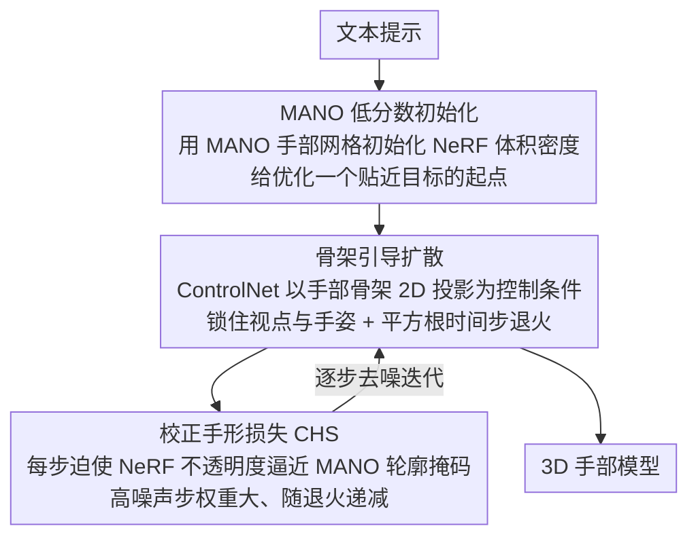

# HandDreamer: Zero-Shot Text to 3D Hand Model Generation

**会议**: CVPR 2026  
**arXiv**: [2604.04425](https://arxiv.org/abs/2604.04425)  
**代码**: 无  
**领域**: 三维生成 / 手部建模  
**关键词**: text-to-3D, hand generation, SDS, MANO, view consistency

## 一句话总结

提出 HandDreamer，首个从文本提示零样本生成 3D 手部模型的方法，通过 MANO 初始化、骨架引导扩散和校正手形损失解决 SDS 中的视图不一致和几何畸变问题。

## 研究背景与动机

VR 时代需要高质量可定制的 3D 手部模型，但传统方法需要多视图采集系统和图形艺术家。Score Distillation Sampling (SDS) 使从文本生成 3D 成为可能，但在手部生成上存在严重的 Janus 伪影（视图不一致），因为手部的关节变化极多，概率分布中存在大量模式。

作者分析了视图不一致的根源：文本提示定义的概率景观中存在大量可能模式，SDS 优化无法保证每个视图收敛到"正确"模式。对于高关节度物体（如手），由于手姿态变化巨大导致模式数量极多，问题尤为严重。

## 方法详解

### 整体框架

HandDreamer 要从一句文本零样本生成 3D 手部模型，难点在于 SDS 在手这种高关节度物体上会出严重的 Janus 伪影（视图不一致）。它分两阶段：先用 MANO 手部网格初始化 NeRF 的体积密度，给优化一个语义和几何上都接近目标的起点；再用骨架引导的 SDS 配合校正手形损失把最终 3D 手部模型生成出来。

### 关键设计

**1. MANO 低分数初始化：让各视图从一开始就朝「正确模式」收敛**

SDS 出 Janus 伪影的根源是：文本提示定义的概率景观里有大量可能模式，优化无法保证每个视图都收敛到「正确」那个，手的姿态变化又巨大、模式数量尤其多。HandDreamer 用 MANO 手部模型初始化 NeRF 的体积密度，让初始 3D 表示在语义和几何上就贴近目标手部。论文从理论上证明这种低分数初始化能引导各视图收敛到正确模式而非错误模式，从源头压住 Janus 伪影。

**2. 骨架引导扩散：用 2D 骨架投影同时锁住视点和手姿，砍掉多余模式**

光有好的起点还不够，每个视点下的概率景观仍然太宽。这里用 ControlNet 把手部骨架作为控制条件——骨架的 2D 投影同时编码了视点和手部姿态信息，等于在每个视角下大幅削减了可能模式的数量。再配上平方根时间步退火策略逐渐降噪，让生成稳定收敛。

**3. 校正手形损失（CHS）：在每步优化里把几何拉回合理范围**

即便有前两者，侧视图这类自遮挡严重的角度仍容易几何畸变。CHS 在 SDS 的每次迭代中额外最小化 NeRF 不透明度与 MANO 轮廓掩码的 L2 距离，确保手部几何不跑偏。它在高噪声时间步权重更大（因为高 $t$ 主要做几何更新），随退火逐渐递减，正好把约束力集中在最该管几何的阶段。

### 损失函数 / 训练策略

总损失 $= \lambda_{sds} \cdot L_{sds} + \lambda_t^{chs} \cdot L_{chs}(t) + \lambda_{img} \cdot L_{img} + \lambda_{zvar} \cdot L_{zvar}$。初始化阶段 2000 迭代（~15min），SDS 阶段 8000 迭代（~45min），底座为 Stable Diffusion 1.5 + ControlNet 1.1。

## 实验关键数据

### 主实验

| 方法 | CLIP L14↑ | FID↓ | HPSv2↑ |
|------|---------|------|--------|
| DreamFusion | 25.12 | 344.19 | 0.187 |
| CFD | 26.62 | 262.83 | 0.223 |
| HandDreamer (Ours) | **28.63** | **254.62** | **0.241** |

### 消融实验

| 配置 | CLIP L14↑ | 说明 |
|------|---------|------|
| 无骨架CN + 无MANO + 无CHS | 26.40 | 严重 Janus 伪影 |
| +骨架CN | 26.67 | 手形出现但几何不准 |
| +骨架CN +MANO | 28.48 | 高保真但侧视图畸变 |
| +全部 (Full) | **28.63** | 最优 |

### 关键发现

- MANO 初始化对减少 Janus 伪影至关重要
- CHS 损失主要解决侧视图的几何畸变（自遮挡严重的角度）
- 用户研究在几何、纹理和一致性三个维度均最优

## 亮点与洞察

- 对 SDS 视图不一致的根因分析深入且有理论支撑（定理 1）
- 三个组件（MANO初始化+骨架控制+CHS损失）各有明确动机和作用
- 生成的手部模型可导出为网格并绑定骨骼用于动画和关节控制

## 局限与展望

- 可能继承预训练扩散模型的偏见
- 关节控制需要额外导出网格和绑定步骤
- 生成速度约 1 小时/模型

## 评分

- 新颖性：⭐⭐⭐⭐ — 首个零样本文本到3D手部生成方法
- 技术深度：⭐⭐⭐⭐ — 理论分析+三阶段方法设计扎实
- 实验充分度：⭐⭐⭐⭐ — 定量+定性+消融+用户研究
- 实用价值：⭐⭐⭐⭐ — VR/游戏应用前景

<!-- RELATED:START -->

## 相关论文

- [\[CVPR 2026\] Text-Driven 3D Hand Motion Generation from Sign Language Data](text-driven_3d_hand_motion_generation_from_sign_language_data.md)
- [\[CVPR 2026\] Humanoid-GPT: Scaling Data and Structure for Zero-Shot Motion Tracking](humanoid-gpt_scaling_data_and_structure_for_zero-shot_motion_tracking.md)
- [\[CVPR 2026\] ProjFlow: Projection Sampling with Flow Matching for Zero-Shot Exact Spatial Motion Control](projflow_projection_sampling_with_flow_matching_for_zero-shot_exact_spatial_moti.md)
- [\[CVPR 2026\] A2P: From 2D Alignment to 3D Plausibility for Occlusion-Robust Two-Hand Reconstruction](from_2d_alignment_to_3d_plausibility_unifying_hete.md)
- [\[CVPR 2026\] MGDHand: Multi-Granularity Prior-to-Inertial Distillation Framework for Sequential 3D Hand Pose Estimation from Sparse IMUs](mgdhand_multi-granularity_prior-to-inertial_distillation_framework_for_sequentia.md)

<!-- RELATED:END -->
