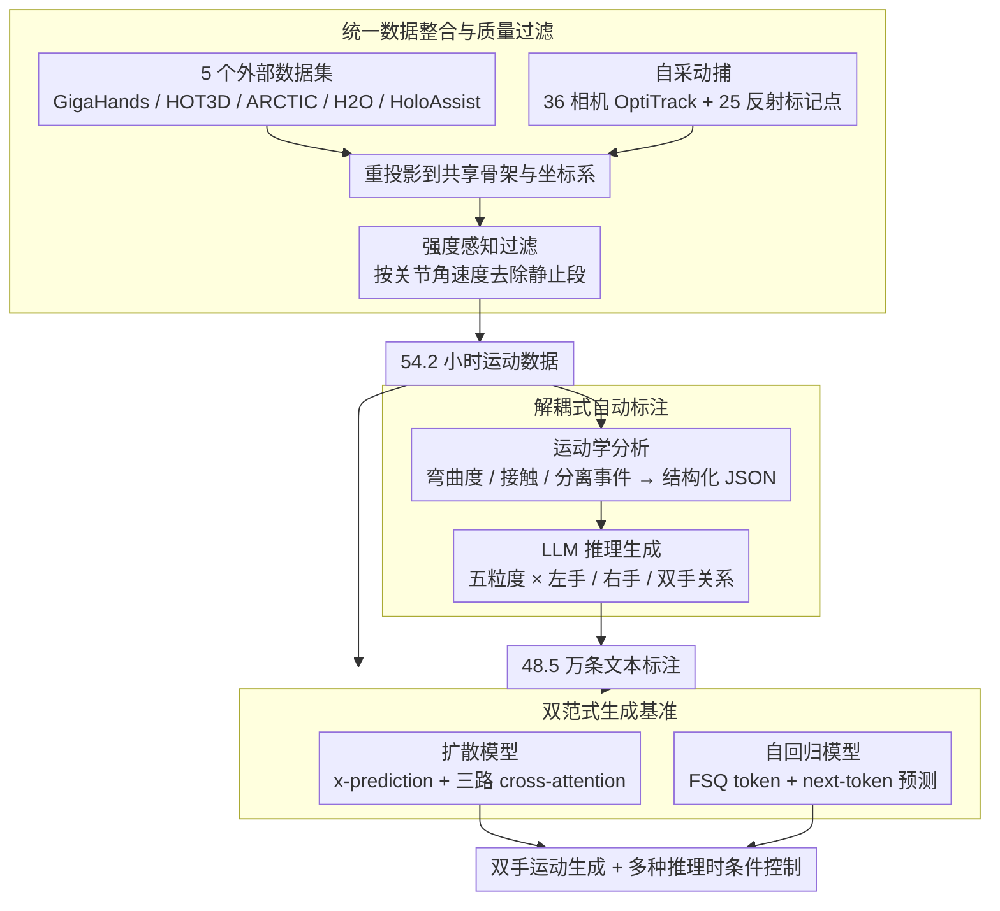

# HandX: Scaling Bimanual Motion and Interaction Generation

**会议**: CVPR 2026  
**arXiv**: [2603.28766](https://arxiv.org/abs/2603.28766)  
**代码**: [https://handx-project.github.io](https://handx-project.github.io)  
**领域**: 人体理解 / 动作生成  
**关键词**: 双手运动生成, 灵巧手部交互, 运动捕捉数据集, 文本到运动, Scaling Law

## 一句话总结
构建了 HandX——一个统一的双手运动生成基础设施（包含 54.2 小时运动数据 + 48.5 万条细粒度文本标注），提出解耦式自动标注策略（运动学特征提取 + LLM 推理生成描述），并基准测试了扩散和自回归两种生成范式，展示了明确的数据和模型 scaling 趋势。

## 研究背景与动机

**领域现状**：人体运动生成在身体层面取得了显著进展（如 MDM、MotionDiffuse 等），但几乎所有方法都将手部视为刚体末端执行器，缺乏精细的手指关节表示。手部相关的数据集和度量标准同样匮乏——现有数据要么缺少手部细节（HumanML3D、InterAct），要么局限在物体操作场景（ARCTIC、H2O），且标注粒度粗糙。

**现有痛点**：1) 缺少包含精细手指动力学和双手协调的高保真运动数据；2) 不同数据源的骨架定义、帧率和标注协议不统一，难以合并使用；3) 大规模人工标注成本过高；4) 现有评估指标无法衡量手部运动保真度和双手协调质量。

**核心矛盾**：要生成逼真的双手运动需要大量高质量数据和精细标注，但高质量数据采集昂贵，人工标注无法扩展，且缺少统一的评估体系。

**本文目标** 建立一个涵盖数据、标注和评估的统一基础设施，支持高质量双手运动生成的研究。

**切入角度**：采用"整合 + 自采 + 自动标注"三步走策略解决数据问题，同时基准测试两种生成范式来研究 scaling 行为。

**核心 idea**：通过整合已有数据集、自采新动捕数据、解耦式 LLM 自动标注三管齐下构建大规模双手运动基础设施，并验证明确的 scaling 趋势。

## 方法详解

### 整体框架
HandX 包含三个层面的贡献：1) 数据层——整合 5 个已有数据集（GigaHands、HOT3D、ARCTIC、H2O、HoloAssist）并自采新动捕数据，统一为共享骨架表示，经质量过滤后获得 54.2 小时运动数据；2) 标注层——提出两阶段自动标注策略，先提取结构化运动学特征（接触事件、手指弯曲度等），再用 LLM 推理生成多粒度文本描述（48.5 万条）；3) 生成层——基准测试扩散模型和自回归模型两种范式，支持多种条件控制模式。

### 关键设计

**1. 统一数据整合与质量过滤：把五个异构数据集拼成一致可训练的整体**

不同数据源的骨架定义、帧率、坐标系各不相同，直接拼起来训练只会让模型学到噪声，这是合并使用最现实的障碍。HandX 先把所有序列重投影到同一套共享骨架表示和坐标系上，再用一个强度感知过滤器按关节角速度筛选——数据集里占主导的往往是静止或近静止的片段，这些对学习交互动作几乎没有价值，过滤掉后只留下有意义的运动段落。除了整合外部数据，作者还自采了一批专门针对双手交互的数据：用 36 相机 OptiTrack 光学动捕系统，每个演员佩戴 25 个反射标记点来捕捉精细的手指关节运动，再通过估计关节中心加解剖约束优化来重建手部骨架。这批自采数据补的正是现有数据集最缺的部分——双手协调、手指间接触这类高难度场景，最终整套数据经质量过滤后得到 54.2 小时。

**2. 解耦式自动标注：把"看懂运动"和"写成语言"拆成两步**

大规模人工标注成本太高、无法扩展，但直接让 LLM 标注又行不通——LLM 擅长语言推理，却读不懂高维连续的运动信号。HandX 的做法是把标注拆成两个阶段，让 LLM 只干它擅长的那一半。第一阶段不碰语言，纯做运动学分析：提取手指弯曲度、手指-手掌距离、双手空间关系等结构化描述子，再沿时间轴分析它们的演化，抽出接触、分离、过度伸展等离散事件，整理成结构化 JSON。第二阶段才把这份 JSON 喂给 LLM，用提示引导它生成五个粒度级别的描述（从简要摘要到中等细节再到全面描述），并要求每条都覆盖左手、右手、双手关系三个维度且保持时间顺序。这样运动对齐性由第一阶段的结构化事件保证，自然语言的流畅度由 LLM 负责，多粒度设计又顺带增加了标注多样性，最终产出 48.5 万条文本。

**3. 双范式生成基准：在同一份数据上同时跑通扩散和自回归两条路线**

为了搞清楚哪类生成范式更适合双手运动，作者把两种主流路线都实现了一遍并放在同一基准下对比。扩散模型用坐标加旋转标量的联合表示，预测干净的运动序列；关键的工程细节是它没有把左手、右手、双手交互三段文本简单拼成一句话喂进去，而是用三路 cross-attention 分别处理——因为简单拼接时模型会把右手该做的动作错误地分给左手，分路注意力正好切断了这种串味。自回归模型则走离散化路线，用 FSQ（有限标量量化）把运动压成 token，再以文本作前缀做 next-token 预测；选 FSQ 而非 VQ-VAE 是看中它更高的 codebook 利用率和更稳的缩放行为。扩散这一支还额外支持多种推理时条件控制，包括动作补间、关键帧生成、手腕轨迹跟随、单手反应生成和长程生成。

### 损失函数 / 训练策略
扩散模型训练目标为直接预测干净信号（x-prediction），用标准去噪 MSE 损失。自回归模型的 tokenizer 训练使用重建损失 $\|\mathbf{x} - \mathcal{D}(\hat{\mathbf{y}})\|_2^2$，自回归部分使用标准交叉熵损失。提出接触精确率/召回率/F1 等手部交互专用指标，接触阈值设为 2cm。

## 实验关键数据

### 主实验 (扩散模型 Scaling)

| 数据比例 | 解码器层数 | R-Prec Top1↑ | FID↓ | CF1↑ |
|---------|-----------|-------------|------|------|
| 5% | 4 | 0.142 | 2.574 | 0.523 |
| 5% | 12 | 0.343 | 1.837 | 0.618 |
| 20% | 12 | 0.357 | 1.140 | 0.606 |
| 100% | 12 | **0.427** | 1.349 | **0.641** |
| 100% | 16 | 0.382 | 1.675 | 0.624 |
| Ground Truth | - | 0.854 | 0.000 | 0.984 |

### 消融实验 (自回归模型 Scaling)

| 模型大小(M) | Codebook | R-Prec Top1↑ | FID↓ |
|-------------|----------|-------------|------|
| 4.63 | 512 | 0.366 | 8.377 |
| 26.33 | 1024 | 0.322 | 2.750 |
| 38.95 | 2048 | 0.305 | 3.245 |
| 215.31 | 4096 | 0.281 | **1.721** |

### 关键发现
- 扩散模型展现明确的 scaling 趋势：从 5% 到 100% 数据 + 从 4 层到 12 层解码器，R-Precision Top1 从 0.142 提升到 0.427（3x），接触 F1 从 0.523 提升到 0.641
- 16 层解码器反而不如 12 层，表明存在过拟合/优化困难
- 自回归模型中 codebook 大小和模型容量需要匹配缩放：单独扩大 codebook 而不增加模型容量会导致性能下降
- FID 在最大模型+最大数据配置下取得最优（扩散 1.140，自回归 1.721），但与 Ground Truth 差距仍然很大

## 亮点与洞察
- 解耦式标注策略是本文最有价值的贡献——将运动特征提取和语言生成分离，让 LLM 只负责它擅长的语言推理部分，这个思路可以迁移到任何需要大规模标注的动作理解任务
- 三路 cross-attention 解决左右手混淆的设计简单有效，是双手运动生成的重要工程细节
- 首次系统性地展示了双手运动生成中的 scaling 行为，和 NLP/CV 领域的 scaling law 趋势一致
- 将生成的灵巧运动迁移到真实人形机器人上，展示了实际应用潜力

## 局限与展望
- R-Precision Top1 最高仅 0.427（GT 为 0.854），生成质量与真实运动仍有很大差距
- 自采数据量相对有限，整合的外部数据在质量和一致性上可能存在问题
- 运动表示使用 3D 坐标而非旋转参数，可能限制了物理真实性
- 接触检测使用简单的距离阈值（2cm），未建模接触力学
- 评估指标虽然引入了接触 F1，但仍缺少对双手协同时序的评估

## 相关工作与启发
- **vs BOTH2Hands**: BOTH2Hands 提供 8.31 小时双手运动，但标注粗糙。HandX 规模大 6.5x 且标注细粒度多层次
- **vs CLUTCH**: CLUTCH 从野外视频重建手部运动，标注为动作级别。HandX 使用动捕系统获取高精度数据，标注覆盖手指级细节
- **vs Motion-X**: Motion-X 是全身运动数据集但手部标注粗糙。HandX 专注手部，填补了手部运动生成的数据空白

## 评分
- 新颖性: ⭐⭐⭐⭐ 统一基础设施 + 解耦标注策略设计新颖
- 实验充分度: ⭐⭐⭐⭐⭐ 双范式对比、多尺度 scaling 分析、多种条件控制、机器人迁移
- 写作质量: ⭐⭐⭐⭐ 结构清晰，数据统计详尽
- 价值: ⭐⭐⭐⭐⭐ 填补双手运动生成基础设施空白，对社区有重要推动作用

<!-- RELATED:START -->

## 相关论文

- [\[CVPR 2026\] LLaMo: Scaling Pretrained Language Models for Unified Motion Understanding and Generation with Continuous Autoregressive Tokens](llamo_scaling_pretrained_language_models_for_unified_motion_understanding_and_ge.md)
- [\[CVPR 2026\] PAMotion: Physics-Aware Motion Generation for Full-Body Interaction with Multiple Objects](pamotion_physics-aware_motion_generation_for_full-body_interaction_with_multiple.md)
- [\[CVPR 2026\] Humanoid-GPT: Scaling Data and Structure for Zero-Shot Motion Tracking](humanoid-gpt_scaling_data_and_structure_for_zero-shot_motion_tracking.md)
- [\[CVPR 2026\] PolySLGen: Online Multimodal Speaking-Listening Reaction Generation in Polyadic Interaction](polyslgen_online_multimodal_speaking-listening_reaction_generation_in_polyadic_i.md)
- [\[CVPR 2026\] ReGenHOI: Unifying Reconstruction and Generation for 3D Human-Object Interaction Understanding](regenhoi_unifying_reconstruction_and_generation_for_3d_human-object_interaction_.md)

<!-- RELATED:END -->
