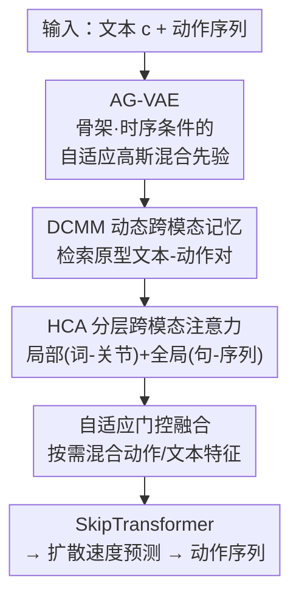

# Hierarchical Enhancement of Semantic Priors for Disentangled Text-Driven Motion Generation

**会议**: CVPR 2026  
**论文**: [CVF Open Access](https://openaccess.thecvf.com/content/CVPR2026/html/Lv_Hierarchical_Enhancement_of_Semantic_Priors_for_Disentangled_Text-Driven_Motion_Generation_CVPR_2026_paper.html)  
**代码**: 无  
**领域**: 人体理解 / 文本驱动动作生成 / 扩散模型  
**关键词**: 文本到动作、潜空间解耦、自适应高斯先验、跨模态记忆、分层注意力

## 一句话总结
HESP 用一个把潜空间显式拆成多个语义子流形的自适应高斯 VAE（AG-VAE），再配合动态跨模态记忆（DCMM）和分层跨模态注意力（HCA），让文本驱动的 3D 人体动作生成更可控、更可解释，在 HumanML3D 和 KIT-ML 上的 FID、R-Precision 都优于 SALAD、MoMask、MDM 等基线。

## 研究背景与动机

**领域现状**：文本到动作（text-to-motion）的主流是基于扩散模型的方法，如 MDM、MoMask、SALAD，它们把文本（通常经 CLIP 编码）当条件，在一个潜空间里逐步去噪生成骨架姿态序列。

**现有痛点**：这些方法普遍假设潜空间服从**各向同性高斯先验**（isotropic Gaussian），并且只在帧级（frame-level）做浅层跨模态监督。各向同性先验等于假设所有动作动态都平滑地连成一个流形，结果是语义纠缠——"走路"和"挥手"这类语义截然不同的动作在潜空间里占据重叠的分布区域，可控性和可解释性都很差。

**核心矛盾**：人类动作本质上是**多个离散但相互依赖的动态模式**的组合，硬塞进单峰高斯不仅会语义纠缠还会模式坍塌；同时文本（词→句）和动作（关节→序列）都是**分层结构**，但现有方法把文本-动作对齐当成扁平的单阶段过程，忽略了这种层级对应，导致生成动作经常误解复杂指令、缺乏全局时序连贯。

**本文目标**：把潜空间从"单一单峰先验"重塑为"分层组织的语义子流形"，并在多个粒度上建模文本-动作对齐。

**切入角度**：作者认为人体动作的潜空间应当反映**分层的语义组织**，而不是一个扁平的单峰先验；而且这种结构应当随骨架拓扑和时间动态自适应演化，而非静态。

**核心 idea**：用一个"以骨架拓扑 + 时序语义为条件、混合权重随时间自适应"的高斯混合先验替换各向同性先验，把动作建模成"随时间变化的语义子流形混合"，再用记忆 + 分层注意力把语言与运动层级动态对齐。

## 方法详解

### 整体框架
HESP（Hierarchical Enhancement of Semantic Priors）是一个统一的文本到动作扩散框架，输入是一句自然语言文本 $c$，输出是动作序列 $m_{1:N} = x_1, \dots, x_N$，其中 $x_n$ 是第 $n$ 帧的骨架姿态向量。整体由三个核心模块串起来：AG-VAE 先学一个语义结构化的潜空间，DCMM 在文本与动作特征间检索长程上下文依赖，HCA 在语言层级与运动层级之间做细到粗的对齐；三者统一在一个基于扩散的去噪解码器里联合优化。

流程上：动作序列先经骨架-时序卷积编码进 AG-VAE 的结构化潜空间；去噪网络接收带骨架感知的时空潜表示 $Z$ 与文本条件 $c$，先做位置编码以区分时间与关节位置，然后用 DCMM 注入长程语义记忆、用 HCA 做局部/全局两级对齐，再用自适应门控融合把"记忆增强的动作特征"和"文本嵌入"按需混合，最后经 SkipTransformer 投影出扩散速度（diffusion velocity）预测，完成去噪。

### 关键设计

**1. AG-VAE：用骨架与时序条件化的自适应高斯混合先验取代各向同性先验**

这一点直接针对"各向同性高斯导致语义纠缠"的痛点。常规 VAE 强制 $p(z)=\mathcal{N}(0, I)$，把所有动作动态当成平滑连接的单流形；GMVAE 用静态高斯混合缓解了一些，但仍忽略骨架拓扑和动作的时序演化。AG-VAE 把先验定义成一个**随时间自适应**的高斯混合：$p(z_t|S,T)=\sum_{k=1}^{K}\pi_k(t,S)\,\mathcal{N}(z_t|\mu_k(S),\Sigma_k(S,T))$，其中 $S$ 是编码关节依赖的骨架图、$T$ 是时间位置索引、混合权重 $\pi_k(t,S)$ 由一个轻量注意力网络预测。编码用骨架-时序卷积 $z=\text{STPool}(\text{TempConv}(\text{SkelConv}(m_{1:N})))$。这样潜分布能沿动作序列动态演化、同时保持解剖一致性，把动作建模成"随时间变化的语义子流形混合"。它的 ELBO 目标把联合 KL 拆开成 $\mathcal{L}=\mathbb{E}_{q_\phi}[\log p_\theta(x|z,k)]-D_{KL}(q_\phi(k|x)\|p(k))-\mathbb{E}_{q_\phi(k|x)}[D_{KL}(q_\phi(z|x,k)\|p(z|k))]$，关键在于软分配 $q_\phi(k|x)$ 是**每个时间步**的（而非整段序列固定一个 $k$），从而允许多粒度语义切换，提升解耦与可解释性。实测它的重建 MSE 更低（如某样本 0.2089 vs 标准 VAE 的 0.3127）、潜空间可分性更好。

**2. DCMM：用检索增强的记忆库注入超出当前样本的长程语义**

针对"扁平单阶段对齐丢失长程语义一致性"的问题。DCMM 维护一个存储原型文本-动作对的记忆库 $M=\{M_p\}_{p=1}^{P}$。给定动作潜特征 $z_t$ 和文本嵌入 $c_w$，先用各自的均值拼成查询 $q=\varphi_q([\text{mean}_t(z_t),\text{mean}_w(c_w)])$，与每个槽位 $M_p$ 算相似度得到注意力权重 $\alpha_p$，再读出 $r=\sum_p \alpha_p M_p$，融合表示 $z'_t=z_t+r$。这相当于让网络在去噪每个样本时还能"回忆"训练中见过的原型动作-文本配对，把长程上下文先验注入进来，改善文本-动作一致性，而不只是依赖当前这一条样本的局部信息。

**3. HCA：词-关节与句-序列两级对齐，用可学习门控平衡局部与全局**

针对"语言（词→句）和动作（关节→序列）层级失配"的痛点。HCA 做两阶段对齐：局部对齐在词嵌入与逐关节动作 token 之间，捕捉细粒度动作语义；全局对齐在句嵌入与整条动作轨迹之间，保证时序连贯。具体为 $A_{local}=\text{softmax}(Q_{motion}K_{word}^\top/\sqrt{d})V_{word}$、$A_{global}=\text{softmax}(Q_{motion}K_{sent}^\top/\sqrt{d})V_{sent}$，再用一个**可学习门控** $\lambda$ 凸组合：$h_t=\lambda A_{local}+(1-\lambda)A_{global}$。这样同时强制了微观（动作细节准确）和宏观（时序平滑）两层语义保真，区别于此前方法的单阶段扁平注意力。

**4. 自适应门控融合：按 token 决定动作线索与文本线索的混合比例，避免特征过平滑**

为了把记忆增强的动作特征和文本表示整合起来又不让特征过度平滑。对每个样本 $b$ 先沿时间维平均得到动作摘要向量 $m_b\in\mathbb{R}^D$；对每个词级文本嵌入 $c_{b,\ell}$ 用 sigmoid 算门控系数 $g_{b,\ell}=\sigma(W_g[m_b,\,c_{b,\ell}]+b_g)\in[0,1]^D$；最终增强文本表示是两模态的凸组合并接 LayerNorm：$c^{enh}_{b,\ell}=\text{LayerNorm}(g_{b,\ell}\odot m_b+(1-g_{b,\ell})\odot c_{b,\ell})$。直觉上 $g_{b,\ell}$ 接近 1 时偏向动作引导的信息流，较小时强调原始文本语义——逐 token 自适应地决定该信谁，保证融合表示语义一致又能捕捉动作相关的细微差别。

### 损失函数 / 训练策略
整体目标来自 AG-VAE 的 ELBO（重建项 + 两个 KL 项，见上式 $\mathcal{L}$），统一在扩散去噪框架里联合优化。训练在单张 NVIDIA RTX 3090 Ti 上完成；用 AdamW，VAE 训练 50 个 epoch、去噪器训练 500 个 epoch；去噪器用 1000 步扩散训练，推理时用 DDIM 采样 50 步；并使用 classifier-free guidance（具体权重值缓存 OCR 处缺失，⚠️ 以原文为准）。

## 实验关键数据

### 主实验
两个标准基准：HumanML3D（14,616 条动作、44,970 条文本、22 关节）与 KIT-ML（3,911 条动作、6,278 条文本），划分沿用 SALAD。指标含 R-Precision（Top-1/2/3，越高越好）、FID（越低越好）、MM-Dist（多模态距离，越低越好）、Diversity（越接近真实越好）、MultiModality（越高越好）。

HumanML3D 测试集主结果：

| 方法 | R-Top1 ↑ | R-Top3 ↑ | FID ↓ | MM-Dist ↓ |
|------|----------|----------|-------|-----------|
| Real motion | 0.511 | 0.797 | 0.002 | 2.974 |
| MDM | 0.320 | 0.611 | 0.544 | 5.566 |
| MoMask | 0.521 | 0.807 | 0.045 | 2.958 |
| SALAD | 0.581 | 0.857 | 0.076 | 2.649 |
| **HESP (本文)** | **0.600** | **0.871** | **0.045** | **2.521** |

KIT-ML 测试集主结果：

| 方法 | R-Top1 ↑ | R-Top3 ↑ | FID ↓ | MM-Dist ↓ |
|------|----------|----------|-------|-----------|
| Real motion | 0.424 | 0.779 | 0.031 | 2.788 |
| MoMask | 0.433 | 0.781 | 0.204 | 2.779 |
| SALAD | 0.477 | 0.828 | 0.296 | 2.585 |
| **HESP (本文)** | **0.514** | **0.844** | **0.267** | **2.499** |

在两个数据集上 HESP 的 R-Precision 与 MM-Dist 均拿到最佳，FID 在 HumanML3D 上与 MoMask 并列最低（0.045），KIT-ML 上的 FID 0.267 也优于 SALAD 的 0.296。⚠️ KIT-ML 行个别数值（如 R-Top3 的 ±误差 0.055）疑似 OCR 串位，以原文表 1 为准。

### 消融实验
缓存正文未给出逐模块的数值消融表（AG-VAE/DCMM/HCA 各自的贡献），仅以重建质量与潜空间可视化佐证 AG-VAE 的作用：

| 配置 | 重建 MSE（样本示例） | 说明 |
|------|----------------------|------|
| Standard VAE | 0.3127 / 0.1295 | 潜空间分布重叠、无结构 |
| AG-VAE | 0.2089 / 0.0572 | 潜空间多峰可分、各模式对应明确动作动态 |

### 关键发现
- AG-VAE 是可解释性的来源：图 1 显示标准 VAE 的潜分布大面积重叠难以区分动作模式，而 AG-VAE 呈现清晰分离的多峰分布，且簇概率分配置信度高，说明潜空间被成功切成"各自代表一类动作动态"的可解释子流形。
- 重建 MSE 一致下降（0.3127→0.2089、0.1295→0.0572），佐证结构化潜空间不仅更可解释，重建精度也更高。
- ⚠️ 缺少 DCMM、HCA、门控融合的独立去除实验，三模块各自贡献多少未能从缓存正文量化。

## 亮点与洞察
- **把"先验"做成时变的、条件化的**：最巧的是不再用静态高斯混合，而是让混合权重 $\pi_k(t,S)$ 随时间与骨架拓扑变化，并允许每个时间步有自己的软分配 $k$——这把"动作是若干语义原语随时间切换"的直觉直接写进了生成先验里，是可控性和可解释性的根。
- **结构化潜空间天然带来可解释簇**：解耦不是靠额外的对比 loss 硬拽，而是先验结构自带的，副产品是能看到清晰的语义边界，这个思路可迁移到任何"潜空间语义纠缠"的生成任务（如语音、轨迹）。
- **记忆库 + 分层门控注意力的组合**：DCMM 解决"超出单样本的长程语义"，HCA 解决"跨模态层级对齐"，门控融合解决"两模态怎么按 token 配比"，三者分工清晰、可拆装复用。

## 局限与展望
- 缓存正文缺少对 DCMM / HCA / 门控融合的逐模块消融，无法判断除 AG-VAE 外其余设计的实际增益，结论的归因强度受限。
- 记忆库大小 $P$、混合分量数 $K$、门控/注意力的超参敏感性未在缓存中讨论，实际部署的调参成本未知。
- 训练资源虽只用单卡 3090 Ti，但去噪器训 500 epoch + VAE 50 epoch，整体训练时长被放到补充材料，正文未量化。
- 多模态性（MultiModality）并非全面领先（HumanML3D 上 1.814 低于 MDM 的 2.799），在"同一文本生成多样动作"维度上仍有取舍空间。

## 相关工作与启发
- **vs SALAD / MDM / MoMask**：它们用各向同性高斯先验 + 帧级/扁平跨模态监督，HESP 改成结构化的时变高斯混合先验 + 分层（局部/全局）对齐，核心区别是把潜空间和对齐都"分层化"，优势是可控性与可解释性，代价是模块更复杂。
- **vs GMVAE / CGMVAE**：同样用高斯混合，但 GMVAE 是静态的、CGMVAE 靠 Fisher 判别正则；HESP 的 AG-VAE 显式以骨架拓扑 + 时序为条件、混合权重随时间自适应，是"结构感知 + 时间自适应"的分解。
- **启发**：当一个生成任务的潜空间出现语义纠缠时，与其在 loss 上加解耦项，不如重新设计"条件化、可随状态演化的混合先验"，让结构本身承担解耦。

## 评分
- 新颖性: ⭐⭐⭐⭐ 时变条件化高斯混合先验 + 分层跨模态对齐的组合较新颖，但各组件（GMVAE、记忆库、分层注意力）多为已有思路的有机整合。
- 实验充分度: ⭐⭐⭐ 两基准主结果完整且领先，但缺逐模块数值消融，归因证据偏弱。
- 写作质量: ⭐⭐⭐⭐ 动机-方法链条清晰、公式完整；⚠️ 部分表格数值疑被 OCR 串位。
- 价值: ⭐⭐⭐⭐ 对文本驱动动作生成的可控/可解释性是实在推进，结构化先验思路可迁移。

<!-- RELATED:START -->

## 相关论文

- [\[CVPR 2026\] MotionMaster: Generalizable Text-Driven Motion Generation and Editing](motionmaster_generalizable_text-driven_motion_generation_and_editing.md)
- [\[CVPR 2026\] Text-Driven 3D Hand Motion Generation from Sign Language Data](text-driven_3d_hand_motion_generation_from_sign_language_data.md)
- [\[CVPR 2026\] MotionHiFlow: Text-to-Motion via Hierarchical Flow Matching](motionhiflow_text-to-motion_via_hierarchical_flow_matching.md)
- [\[CVPR 2026\] Multi-level Causal LLM-based Text-to-Motion Generation with Human Alignment (MoTiGA)](multi-level_causal_llm-based_text-to-motion_generation_with_human_alignment.md)
- [\[CVPR 2026\] MoLingo: Motion-Language Alignment for Text-to-Human Motion Generation](molingo_motion-language_alignment_for_text-to-motion_generation.md)

<!-- RELATED:END -->
