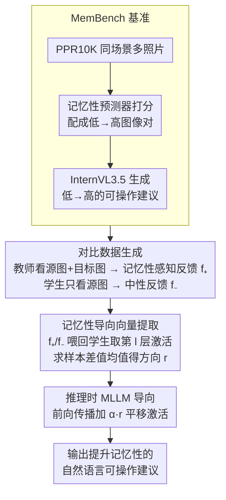

# How to Take a Memorable Picture? Empowering Users with Actionable Feedback

**会议**: CVPR 2026  
**arXiv**: [2602.21877](https://arxiv.org/abs/2602.21877)  
**代码**: [https://laitifranz.github.io/MemCoach](https://laitifranz.github.io/MemCoach)  
**领域**: 人体理解  
**关键词**: 图像记忆性, 可操作反馈, 激活导向, MLLM, 拍照辅助

## 一句话总结
定义了记忆性反馈（MemFeed）新任务，提出 MemCoach——一种 training-free 的 MLLM 激活导向方法，通过教师-学生策略将记忆性感知知识注入模型激活空间，使 MLLM 能生成提升照片记忆性的自然语言可操作建议。

## 研究背景与动机
**领域现状**：图像记忆性（被记住的概率）已被证实是可预测和可量化的图像固有属性。现有研究分为预测（回归记忆性分数）和生成（自动编辑提高记忆性）两条线。

**现有痛点**：预测模型只能报告数字分数，对用户没有可操作价值；生成模型直接修改图像，用户失去控制权。在拍照时，用户需要的是"怎么改进这张照片"的具体建议，而非分数或自动编辑。

**核心矛盾**：即使人类也无法准确判断什么是 memorable 的。MLLM 虽然有强大的推理能力，但实验证明它们对记忆性毫无理解（Spearman相关系数接近0）。

**本文目标** 如何让不理解记忆性的 MLLM 生成有效的记忆性提升建议。

**切入角度**：利用同一场景中不同记忆性照片之间的差异，从教师模型中蒸馏出记忆性感知的激活方向向量。

**核心idea**：通过激活导向（activation steering），在推理时将学生模型的激活向记忆性感知反馈方向偏移，无需训练。

## 方法详解

### 整体框架
这篇论文要解决的是一个尴尬的事实：MLLM 推理能力很强，但对"什么样的照片更容易被记住"几乎一无所知，直接让它给拍照建议只会说些泛泛而谈的话。MemCoach 的思路是**不去训练模型理解记忆性，而是在推理时把记忆性知识"推"进它的激活里**。整条流水线分三步走：先用一个见过"答案"的教师模型，从同一场景的高/低记忆性照片对里榨出"记忆性感知反馈"，再让学生模型对同一张源图生成普通反馈，两者配对；接着把这两类反馈分别喂回学生、收集中间层激活，算出一个指向"记忆性方向"的向量；最后在真正推理时把这个向量加到学生激活上，让它原本平庸的建议偏向真正能提升记忆性的方向。整个过程不更新任何权重。

### 关键设计

**1. MemBench 基准：先把"无答案"的任务变成"有监督信号"的任务**

记忆性反馈是个全新任务，既没有现成数据也没有评测协议，连人类都说不清什么是 memorable，这让方法无从下手。作者基于 PPR10K 构建了 MemBench：该数据集里每个场景都有多张同主体照片，正好提供了"控制变量"的天然对照。流程是先用记忆性预测器给同场景照片打分排序、配成低→高的图像对，再用 InternVL3.5 生成"从这张低记忆性照片变到那张高记忆性照片需要做什么"的可操作建议。最终得到约 10K 图像、1570 个场景、平均每场景 6.5 张照片的对照语料，这套"同场景对照"正是后面蒸馏方向向量的物质基础。

**2. 对比数据生成：用"看过答案 vs 没看过答案"的差异定义记忆性方向**

要让激活里浮现出"记忆性"这个抽象概念，关键是制造一对只在这一维度上有差异的反馈。作者让教师模型同时看到源图（低记忆性）和目标图（高记忆性），描述从前者变成后者所需的操作，得到记忆性感知反馈 $f_+^i$；而学生模型只看源图，按默认行为生成改进建议，得到中性反馈 $f_-^i$。两者唯一的区别在于教师握有"特权信息"——它知道目标图长什么样，学生则是在信息缺失下盲猜。这样 $f_+$ 与 $f_-$ 之差就干净地隔离出了"记忆性感知"这一个变量，而不是夹杂措辞、长度等无关因素。

**3. 记忆性导向向量提取：把成对反馈的激活差求均值，得到一个可复用的方向**

有了配对反馈，还需要把它落到学生自己的激活空间里——因为推理时要修改的是学生而非教师。作者把 $f_+$ 和 $f_-$ 分别放在 assistant 位置输入学生模型，读取第 $l$ 层的隐状态，再对所有样本求差值的均值：

$$\mathbf{r}^{(l)} = \frac{1}{N}\sum_{i=1}^N h_+^{i,(l)} - h_-^{i,(l)}$$

这一步背后是线性表示假说：模型对某个语义概念的"开/关"，往往对应激活空间里一条近似线性的方向，因此对大量样本求平均能把"记忆性感知"这个共性方向从各样本的噪声里捞出来，$\mathbf{r}^{(l)}$ 就是这条方向。

**4. 推理时 MLLM 导向：在前向传播中沿方向平移激活，把行为掰过去**

最后要在不重训的前提下让学生真的输出好建议。推理时，作者在第 $l$ 层把导向向量按强度 $\alpha$ 叠加到原激活上：

$$\tilde{h}^{(l)} = h^{(l)} + \alpha \cdot \mathbf{r}^{(l)}$$

$\alpha$ 越大、向"记忆性方向"推得越狠。由于这只是一次加法干预、不碰权重，整套方法是 model-agnostic 的——只要某个 MLLM 暴露了中间层表示的访问接口，就能直接插上这个向量，省去了为每个模型单独微调的成本。

## 实验关键数据

评测用三个指标：**Improvement Ratio (IR)**——按建议编辑后图像记忆性高于源图的比例；**Relative Memorability (RM%)**——相对记忆性提升幅度；**Perplexity**——模型在真实有效反馈上的困惑度（越低说明生成越贴近"好建议"）。

### 主实验

| 方法类型 | 模型 | IR ↑ | RM% ↑ | Perplexity ↓ |
|---------|------|------|-------|-------------|
| 编辑基线 | 空指令 | 0.68 | 3.72 | - |
| 零样本 | GPT-5 Mini | 0.75 | 7.03 | - |
| 零样本 | InternVL3.5 | 0.73 | 5.47 | 5.49 |
| 美学专家 | AesExpert | 0.73 | 6.67 | 5.97 |
| **MemCoach** | InternVL3.5 | **0.80** | **7.21** | **4.99** |
| 教师上限 | InternVL3.5 | 0.85 | 11.92 | 2.40 |

### 跨模型泛化

| 模型 | 零样本 IR | +MemCoach IR | 提升 |
|------|----------|-------------|------|
| LLaVA-OV | 0.70 | 0.73 | +4.29% |
| Idefics3 | 0.73 | 提升 | 一致提升 |
| Qwen2.5VL | 0.68 | 提升 | 最大提升 |

### 关键发现
- MLLM 对记忆性的预测能力为零（Spearman相关~0），证实需要外部信号注入
- MemCoach 比 GPT-5 Mini 零样本高 5% IR，比基线 InternVL3.5 高 31.81% RM
- 超越了需要训练的美学专家模型（AesExpert、Q-Instruct）
- 导向向量跨模型可迁移，4个不同MLLM上一致有效

## 亮点与洞察
- **任务定义有前瞻性**：将记忆性从"被动预测"推向"主动教导"，实用价值高于分数预测
- **teacher-student 激活导向**是一种新颖的知识蒸馏形式：不蒸馏输出分布，而是蒸馏激活空间中的方向性
- training-free + model-agnostic 的设计使其具有很好的实用性
- 首次将 activation steering 用于感知类任务（而非安全性或风格控制）

## 局限与展望
- 依赖编辑模型（FLUX.1 Kontext）来验证反馈效果，编辑质量会影响评估
- 记忆性预测器本身的准确性是系统的上界
- 导向强度 $\alpha$ 和层 $l$ 的选择需要调参
- 反馈主要是构图/语义层面，无法涵盖技术参数（如曝光、光圈）的建议

## 相关工作与启发
- **vs 记忆性编辑方法**: 编辑方法直接修改图像，MemCoach 给出自然语言建议让用户自己决定
- **vs 美学评分模型**: 美学模型给出评价/批评，MemCoach 给出面向记忆性的可操作指令
- activation steering 的 teacher-student 模式可推广到其他需要注入外部知识的 MLLM 应用

## 评分
- 新颖性: ⭐⭐⭐⭐⭐ 全新任务定义+创新的知识注入方式
- 实验充分度: ⭐⭐⭐⭐ 多模型验证+人类评估+消融实验
- 写作质量: ⭐⭐⭐⭐ 任务动机和方法概述图都很清晰
- 价值: ⭐⭐⭐⭐ 对计算摄影和创意AI有启发意义

<!-- RELATED:START -->

## 相关论文

- [\[CVPR 2026\] Reference-Free Image Quality Assessment for Virtual Try-On via Human Feedback](reference-free_image_quality_assessment_for_virtual_try-on_via_human_feedback.md)
- [\[ECCV 2024\] How Video Meetings Change Your Expression](../../ECCV2024/human_understanding/how_video_meetings_change_your_expression.md)
- [\[ICML 2025\] How to Move Your Dragon: Text-to-Motion Synthesis for Large-Vocabulary Objects](../../ICML2025/human_understanding/how_to_move_your_dragon_text-to-motion_synthesis_for_large-vocabulary_objects.md)
- [\[CVPR 2026\] RAM: Recover Any 3D Human Motion in-the-Wild](ram_recover_any_3d_human_motion_in-the-wild.md)
- [\[CVPR 2026\] Talking Together: Synthesizing Co-Located 3D Conversations from Audio](talking_together_synthesizing_co-located_3d_conversations_from_audio.md)

<!-- RELATED:END -->
