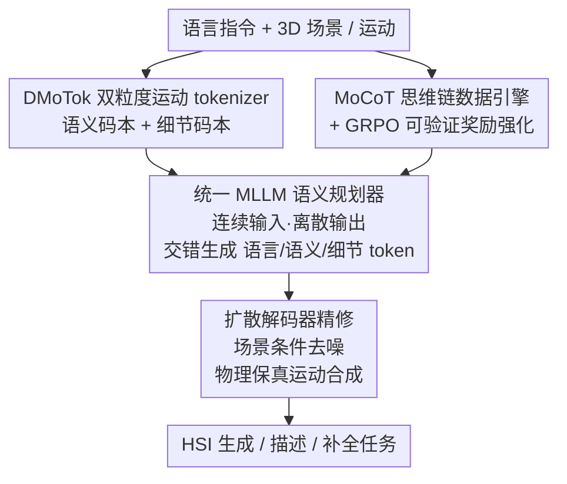

# HSI-GPT2: A Dual-Granularity Large Motion Reasoning Model with Diffusion Refinement for Human-Scene Interaction

**会议**: CVPR 2026  
**论文**: [CVF Open Access](https://openaccess.thecvf.com/content/CVPR2026/html/Wang_HSI-GPT2_A_Dual-Granularity_Large_Motion_Reasoning_Model_with_Diffusion_Refinement_CVPR_2026_paper.html)  
**代码**: 待确认  
**领域**: 人体理解  
**关键词**: 人-场景交互、运动生成与理解、双粒度运动 tokenizer、LLM+扩散、GRPO 推理

## 一句话总结
面向"统一理解 + 生成"人-场景交互（HSI）的大模型 HSI-GPT2，用**双粒度运动 tokenizer**把动作拆成语义码本与细节码本两路、用**LLM 当语义规划器 + 扩散解码器当去 token 器**提升物理保真、再配一套**运动思维链（MoCoT）数据引擎 + GRPO 强化学习**注入分步推理，在 HumanML3D / HUMANISE 上的生成、描述、补全任务全面超越 HSI-GPT。

## 研究背景与动机
**领域现状**：人-场景交互（HSI）要在 3D 场景里"摆放"既符合物理又契合语言意图的虚拟人，是具身智能的基础能力。受 MLLM 启发，近来的做法是把运动当成"类语言"的离散 token 对齐进 LLM 空间，目标是造一个真正理解 3D 场景、运动、文本三模态关系的统一 Large Scene-Motion-Language Model。HSI-GPT 是这条路上第一个统一模型。

**现有痛点**：作者把矛头直指前作 HSI-GPT 的三个硬伤——① **单粒度码本**：基于 VQVAE、纯重建监督，偏爱低频运动细节而忽视运动语义，缺 CLIP 式的预训练对齐；② **解码能力受限**：人体运动高度铰接，vanilla tokenizer 直接 token 解码不足以支撑细粒度交互，物理约束（稳定接触、防穿模/碰撞）容易破；③ **缺语义推理**：只靠 SFT 是被动模仿，做不了组合式、长程的推理。

**核心矛盾**：描述保真度（细节）和语义抽象（高层意图）本就处在**不同的表示层级**上，用一套单粒度码本同时承载二者必然顾此失彼；而离散 token 自回归解码与连续运动之间还有难以弥合的鸿沟。

**本文目标**：造一个同时具备"强运动表示 + 强解码 + 组合推理"三能力的统一 HSI 基座模型。

**切入角度**：人做动作是目标导向的"感知-行动"过程——先推断意图、再基于物理 affordance 行动，所以推理应当先于运动。把这条 CoT 显式建模进多模态上下文，再用可验证奖励的 RL 把"会推理"从"会模仿"里逼出来。

**核心 idea**：双粒度解耦运动表示（语义/细节两码本）+ LLM 规划与扩散精修分工 + CoT 数据引擎与 GRPO 强化，三件套合力把统一 HSI 模型的生成质量与推理能力同时拉上来。

## 方法详解

### 整体框架
HSI-GPT2 是一个 LLM+扩散的统一 MLLM。输入是语言指令 + 3D 场景（可含运动），先由双粒度运动 tokenizer（DMoTok）把身体网格离散成"语义 token + 细节 token"两套 LLM 可读 token；统一 MLLM 把语言/场景/运动 token 放进同一词表里自回归地交错生成"语言→语义→细节"token；扩散解码器再把离散语义/细节 token 映回连续 latent、在 3D 场景条件下迭代去噪出物理真实的运动；训练上先 SFT 冷启动、再用 MoCoT 数据引擎产出的思维链 + GRPO 强化推理。整体是"表示 → 规划 → 精修 → 推理强化"的多阶段协同。

### 关键设计

**1. DMoTok 双粒度运动 tokenizer：把语义与细节解耦进两套码本**

针对"单码本既要语义又要细节、必然偏向低层细节"的痛点，DMoTok 把运动量化进两个独立码本。语义路：先用 CLIP 式双编码器（运动语义编码器 $E_\text{sem}$ + 文本编码器 $E_t$）以对比损失预训练出文本对齐的运动表示空间，再把高层语义特征 $Z_\text{sem}$ 量化进语义码本 $C_\text{sem}\in\mathbb{R}^{K\times d_\text{sem}}$：

$$\hat{Z}_\text{sem}, I_\text{sem} = \arg\min_{k\in\{1,...,K\}}\lVert Z_\text{sem}-C_\text{sem}[k]\rVert$$

并用余弦相似度损失约束重建特征贴近 $E_\text{sem}$ 的语义特征。细节路：走类似 VQVAE 的编码把细节编码器 $E_\text{det}$ 的输出量化成 $\hat{Z}_\text{det}$，专门恢复局部运动连续性与时间平滑。两路 token 沿通道拼接后送入运动解码。这套"双词表"把语义保真和物理铰接拆开，得到一个既可解释又通用的运动 tokenization 空间，对理解与生成两类任务都有利——之所以有效，是因为"它是什么动作（语义）"和"动作怎么连贯地动（细节）"本就该用不同的表示承载，强行揉一起就会互相拖累。

**2. LLM 语义规划器 + 扩散解码器精修：用扩散补自回归的物理保真短板**

现有统一运动-语言模型纯自回归、直接从 VQVAE 解码器吐运动 token，生成能力有限、常违反物理约束（接触不稳、穿模碰撞），且连续运动与离散 token 之间存在固有 gap。HSI-GPT2 把"低层合成"和"语义规划"分开：LLM 只当**语义规划器**，把语言 prompt + 3D 场景结构化成符号运动指令、输出语义与细节 token；扩散解码器（以 MLD 为实例、把其文本编码器换成零嵌入）把这些 token 经码本映回连续嵌入，连同噪声 latent 与 3D 场景 query 一起迭代去噪生成场景接地的运动。模型还采用**连续输入-离散输出**设计——把预量化的连续运动特征经两个运动 projector 对齐进 LLM 文本空间作为输入，避免量化损失、保留表示丰富度，输出端才离散成 token 供优化。场景侧用预训练编码器编码 3D 几何 + affordance 图，经 Q-Former 式交互聚合器对齐进 LLM 空间。相比直接 VQVAE token 解码，扩散精修在真实感与时间连贯性上更强，推理时还用 classifier-free guidance 权衡保真与多样。

**3. MoCoT 运动思维链数据引擎：把"先推理后行动"灌进监督信号**

要让模型学会分步推理，得有高质量的运动 CoT 数据，但 Motion-R1 那种"只用单模态文本提示 LLM 把指令拆成子动作"往往啰嗦、token 不对齐、偏离真实行为。MoCoT 把推理**显式接地到运动上下文**：先把 3D 运动渲染成 SMPL-X 视频片段（选合适相机位姿），把 14.6K 视频片段 + 高层运动 caption 融成结构化 prompt，蒸馏 Qwen3-VL-235B 的语义规划能力成可执行运动计划，每个子动作还细化到运动方向、幅度、身体部位铰接，从而把计划接地到 HSI 任务的运动学与 affordance。为保证物理可信，引入**结构化人在回路验证**：先剔除渲染/视角伪影的低质片段，再把每段运动配 caption 与推理轨迹组成 {motion, caption, CoT} 三元组，随机抽 15% 人工按"动作保真度"与"动作歧义性"评审，分为完全准确（保留）/轻微错误（修正后保留）/不匹配（丢弃），所有接受、编辑、拒绝的理由都记录下来、codify 进 Gemini-2.5 Pro 的提示工程做可扩展验证。

**4. GRPO 强化运动推理：用可验证奖励把"会推理"从"会模仿"里逼出来**

MoCoT 提供了逐步监督，但纯 SFT 仍是模仿而非泛化推理。作者把运动生成重构成 RL 问题、首次把 GRPO 扩到 HSI 任务，最大化带 KL 正则的 clip 目标，优势 $\hat{A}_i=[r_i-\mu(r)]/\sigma(r)$。奖励是多方面运动感知奖励：① **格式奖励** $r_\text{form}$ 强制把 CoT 包在 `<think></think>`、运动 token 包在 `<answer></answer>` 里（合规给 1、不合规给 0）；② **运动保真奖励** $r_\text{fid}$ 与 **语义对齐奖励** $r_\text{sem}$ 用余弦相似度衡量生成运动 $\hat{m}$ 与真值/文本的对齐：

$$r_\text{fid} = \frac{\Psi(\hat{m})\cdot\Psi(m)}{\lVert\Psi(\hat{m})\rVert\lVert\Psi(m)\rVert},\quad r_\text{sem} = \frac{\phi(\hat{m})\cdot\phi(T)}{\lVert\phi(\hat{m})\rVert\lVert\phi(T)\rVert}$$

其中 $\Psi$ 是细节编码器 $E_\text{det}$、$\phi$ 是 CLIP 式语义编码器，扩散模型在算奖励时冻结。训练曲线显示：格式奖励约 70 步先到初始峰、模型迅速学会结构化输出，随后优化重心转向快速拉升语义对齐与保真奖励。之所以有效，是因为可验证奖励让模型在格式约束下自由探索推理轨迹，从被动复述升级到能泛化的分步推理；在短程、语义简单的 HUMANISE 上则省略 CoT 后训练（推理收益有限）。

### 损失函数 / 训练策略
分三块：① 双粒度 tokenizer 用 VQ 目标 $L_\text{vq}=\text{Sim}(\hat{m},m)+\lVert\text{sg}[Z]-\hat{Z}\rVert_2^2+\beta\lVert Z-\text{sg}[\hat{Z}]\rVert_2^2$，配 EMA 与码本重置防坍塌；② 扩散解码器把潜空间建成 Markov 加噪过程 $q(Z_t\mid Z_{t-1})=\mathcal{N}(\sqrt{\alpha_t}Z_{t-1},(1-\alpha_t)I)$，最小化噪声 MSE 学反向去噪；③ MLLM 先在文本+运动混合语料上做对齐预训练（只更新运动 connector、MIA projector、运动输入嵌入与运动输出头，冻结编码器与 LLM 核心权重），再 SFT 冷启动（HUMANISE/HumanML3D/PROX）、最后 GRPO 强化。

## 实验关键数据

### 主实验

HumanML3D 文本到运动生成：

| 方法 | 来源 | R-Prec.Top1↑ | FID↓ | MM-Dist↓ | Diversity→ |
|------|------|--------------|------|----------|-----------|
| HSI-GPT | CVPR 2025 | 0.495 | 0.187 | 3.058 | 9.845 |
| Motion-R1 | 2025 | 0.515 | 0.201 | 2.854 | 10.026 |
| MotionGPT-3 | 2025 | 0.543 | 0.217 | 2.793 | 9.662 |
| **HSI-GPT2** | 本文 | **0.545** | **0.139** | **2.708** | 10.489 |
| Real | —— | 0.511 | 0.002 | 2.974 | 9.503 |

HUMANISE 文本条件 HSI 生成（短程单步交互）：

| 方法 | Goal Dist↓ | APD↑ | Contact↑ | N-collision↑ |
|------|-----------|------|----------|--------------|
| HSI-GPT | 0.182 | 3.492 | 92.31 | 99.82 |
| **HSI-GPT2** | **0.143** | **4.876** | **97.98** | 99.82 |

相对 HSI-GPT：Goal Distance 0.143（+21.4%）、APD 4.876（+39.7%）、接触率 97.98%（+5.67%）。运动描述（captioning）任务上 HSI-GPT2 各项（R-Prec / Bleu / Rouge / CIDEr / BertScore）与运动补全（ADE/FDE）也全面领先。

### 消融实验

混合 LLM+扩散架构在不同基座 LLM 上（阴影=混合设置）：

| LLM 基座 | Goal Dist↓ | Contact↑ | R-P@3↑ | FID↓ |
|----------|-----------|----------|--------|------|
| Qwen2-1.5B（纯/混合） | 0.304 / 0.248 | 87.58 / 89.91 | 0.710 / 0.736 | 0.211 / 0.197 |
| Qwen2.5-3B（纯/混合） | 0.265 / 0.221 | 89.13 / 91.87 | 0.728 / 0.754 | 0.203 / 0.188 |
| Llama3-8B（纯/混合） | 0.198 / 0.172 | 93.22 / 95.08 | 0.781 / 0.807 | 0.176 / 0.159 |
| Qwen3-8B（纯/混合） | 0.161 / 0.143 | 96.54 / 97.89 | 0.820 / 0.835 | 0.147 / 0.139 |

> 注：APD = Average Pairwise Distance（多样性）；Goal Dist = 身体到目标距离（接地精度）；Contact / N-collision = 物理感知接触率与防碰撞率；ADE/FDE = 平均/最终位移误差（运动补全精度）。

### 关键发现
- **混合架构对任意基座都涨点**：同一 LLM 下，加扩散精修的混合设置在 Goal Dist / Contact / R-P@3 / FID 上一致优于纯自回归，且随基座变强（1.5B→8B）收益叠加，说明"LLM 规划 + 扩散精修"的分工是普适增益而非特定模型的 trick。
- **CoT 后训练按任务难度取舍**：长程、组合丰富的 HumanML3D 上 CoT+GRPO 收益明显；短程语义简单的 HUMANISE 上省略 CoT（推理收益有限），体现"推理预算要看任务难度"。
- **连续输入-离散输出抑制量化误差**：把预量化连续特征喂进 LLM、输出端才离散，明显提升交互动态精度。

## 亮点与洞察
- **双粒度码本是把"语义 vs 细节"解耦的干净做法**：语义路用 CLIP 对比预训练对齐文本、细节路用 VQVAE 抓物理连续性，两路各司其职，避免单码本顾此失彼——这个"按表示层级分码本"的思路可迁移到任何需要同时建模高层意图与低层细节的序列模态。
- **LLM 规划 + 扩散去 token 器**：用扩散当 detokenizer 替掉 VQVAE 直接解码，专治自回归运动生成的物理破绽（穿模、接触不稳），是"语义规划离散、低层合成连续"分工的好范例。
- **MoCoT 的"渲染成视频再蒸馏 + 人在回路"**：把抽象运动接地到可视上下文再让大 VLM 蒸馏 CoT，比纯文本拆解更对齐真实运动学，数据工程质量把控扎实。
- **首次把 GRPO 带进 HSI**：用格式/保真/语义三类可验证奖励把分步推理逼出来，给"运动也能做 R1 式 RL"开了头。

## 局限与展望
- 强依赖大模型蒸馏（Qwen3-VL-235B 产 CoT、Gemini-2.5 Pro 做验证规则）与人在回路抽检，数据管线成本高、可复现性受外部闭源模型约束。
- 扩散精修带来多步迭代去噪，推理开销与延迟高于纯自回归直接解码，实时具身场景下的可用性存疑。
- HUMANISE 上直接省略 CoT 说明该范式对"短程简单交互"增益有限，长程复杂指令才是其主战场。
- 评测仍集中在 HumanML3D / HUMANISE / PROX 等仿真/重定位数据，真实复杂场景与多人交互的泛化未充分验证。

## 相关工作与启发
- **vs HSI-GPT（前作）**：HSI-GPT 单粒度 VQVAE 码本、纯 SFT、直接 token 解码；本文双粒度码本 + 扩散精修 + GRPO 推理，三处硬伤逐一对症，HumanML3D R-Prec 0.495→0.545、FID 0.187→0.139。
- **vs MotionGPT 系 / M3GPT（统一运动 LLM）**：它们纯自回归把多模态控制信号离散进 LLM；本文加扩散目标提升生成质量、加双粒度码本提升表示。
- **vs Motion-R1（运动 CoT）**：Motion-R1 用单模态文本提示拆子动作、易啰嗦失配；MoCoT 把推理接地到渲染视频上下文、配人在回路验证，CoT 更忠实于运动学。
- **vs Afford-Motion / cVAE（专用 HSI 生成）**：专用生成模型跨任务泛化差；本文统一模型在生成、描述、补全多任务上一体化且全面领先。

## 评分
- 新颖性: ⭐⭐⭐⭐ 双粒度码本+LLM 扩散+GRPO 的组合在 HSI 统一模型上是首创整合，单个组件多有渊源
- 实验充分度: ⭐⭐⭐⭐⭐ 覆盖生成/描述/补全多任务、跨基座 LLM 消融，指标全面
- 写作质量: ⭐⭐⭐⭐ 动机清晰、模块分工讲得透，公式与流程偶有密集
- 价值: ⭐⭐⭐⭐ 对统一运动-语言建模与具身运动推理有实用推动

<!-- RELATED:START -->

## 相关论文

- [\[CVPR 2026\] SyncMos: Scalable Motion Synchronisation for Multi-Agent Scene Interaction](syncmos_scalable_motion_synchronisation_for_multi-agent_scene_interaction.md)
- [\[CVPR 2026\] SceMoS: Scene-Aware 3D Human Motion Synthesis by Planning with Geometry-Grounded Tokens](scemos_scene-aware_3d_human_motion_synthesis_by_planning_with_geometry-grounded_.md)
- [\[CVPR 2026\] Bi-directional Autoregressive Diffusion for Large Complex Motion Interpolation](bi-directional_autoregressive_diffusion_for_large_complex_motion_interpolation.md)
- [\[CVPR 2026\] A Two-Stage Dual-Modality Model for Facial Expression Recognition](a_two_stage_dual_modality_model_for_facial_expression_recognition.md)
- [\[CVPR 2026\] Towards Decompositional Human Motion Generation with Energy-Based Diffusion Models](towards_decompositional_human_motion_generation_with_energy-based_diffusion_mode.md)

<!-- RELATED:END -->
