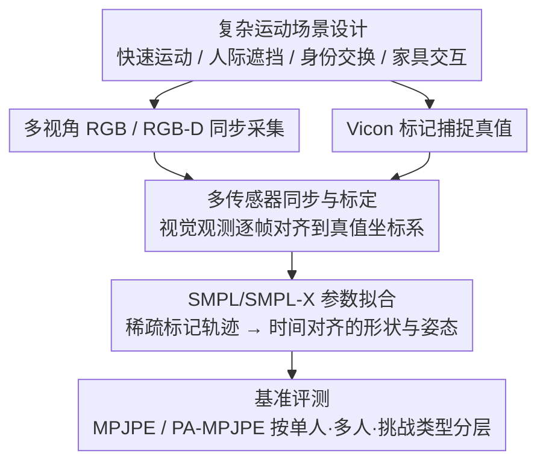

# HUM4D: A Dataset and Evaluation for Complex 4D Markerless Human Motion Capture

**会议**: CVPR 2026  
**arXiv**: [2604.12765](https://arxiv.org/abs/2604.12765)  
**代码**: 无  
**领域**: 人体理解 / 运动捕捉  
**关键词**: 无标记运动捕捉, 4D人体建模, 多人交互, 数据集, SMPL

## 一句话总结

提出 HUM4D 数据集，包含复杂单人和多人运动场景（快速运动、遮挡、身份交换），提供同步多视角 RGB/RGB-D 序列、精确 Vicon 标记运动捕捉真值和 SMPL/SMPL-X 参数，基准测试揭示 SOTA 无标记方法在真实条件下的显著性能退化。

## 研究背景与动机

**领域现状**：无标记人体运动捕捉取得了显著进展，在基准数据集上误差持续降低。Human3.6M、CMU Panoptic 等数据集推动了该领域发展。

**现有痛点**：基准数据集上的高性能不能转化为真实视频的鲁棒性。现有数据集施加了结构约束：有限的服装变化、受控室内环境、适度的运动动态、受限的遮挡程度、主要是单人捕捉。

**核心矛盾**：基准性能与部署性能之间的域差距持续存在。广泛采用的数据集（Human3.6M、CMU Panoptic、HUMAN4D）在复杂性方面接近饱和。

**本文目标**：构建反映真实世界复杂性的数据集——多人动态交互、严重遮挡、快速身份交换、变化距离——并进行全面基准评估。

**切入角度**：获取此类数据集是非平凡的，需要多传感器同步、精确标定和专业标记运动捕捉对齐。

**核心 idea**：通过 Vicon 系统提供精确真值，在真实复杂场景下系统评估 SOTA 方法的泛化能力。

## 方法详解

### 整体框架

HUM4D 不是一个新模型，而是一套为「在真实复杂条件下检验无标记运动捕捉」量身定做的数据与评测基准。它要回答的问题很直接：现有方法在 Human3.6M 这类受控数据集上误差已经压得很低，可一旦遇到多人快速交互、严重遮挡、身份交换，它们还撑得住吗？为了能给出可信的答案，数据集每个场景都同时记录两路东西——一路是模型实际能看到的视觉输入（同步的多视角 RGB 与 RGB-D 序列加上精确相机标定），另一路是模型要去逼近的真值（Vicon 标记捕捉系统提供的精确三维运动，再拟合成时间对齐的 SMPL / SMPL-X 参数）。场景从单人运动一直延伸到多人交互，覆盖快速位置交换、动态遮挡、家具交互和不同主体间距等真实世界里常见、却被旧数据集刻意回避的情况。

### 关键设计

**1. 复杂运动场景设计：把旧数据集刻意回避的难点全摆上台面**

旧数据集的高分很大程度上是「考题简单」考出来的——服装变化有限、室内受控、运动幅度温和、遮挡轻微、且基本只拍单人。HUM4D 反其道而行，专门构造那些 SOTA 方法在野外真正会翻车的场景：快速的运动转换、频繁的人际遮挡、穿着相似的主体之间的快速位置交换、以及和家具的交互。这样设计的用意是把「基准饱和」背后掩盖的脆弱点逼出来——当两个外观相近的人交错走位时，方法是否还能稳定地把骨架关联到正确的人身上，正是这套场景要拷问的。

**2. 多传感器同步与标定：让视觉观察和运动真值能逐帧对得上**

要在多人遮挡场景下做可信评估，前提是「模型看到的那一帧」和「Vicon 记录的那一刻真值」必须精确对齐，否则误差里分不清是方法的错还是标注的错。为此数据集把多视角 RGB、RGB-D 传感器在时间上同步起来，并与 Vicon 系统做几何标定对齐，使得任意时刻的图像观测都能映射到同一坐标系下的真实三维姿态。正是这套同步标定的工程基础，才让后面那些「身份交换 +90%、严重遮挡 +69%」的退化数字站得住脚——退化是真实存在的，而不是标注噪声造成的假象。

**3. SMPL/SMPL-X 参数拟合：把原始标记真值翻译成主流研究通用的语言**

Vicon 给出的是稀疏标记点的三维轨迹，直接拿来评测参数化人体方法并不方便。HUM4D 进一步从标记数据拟合出 SMPL 和 SMPL-X 参数，提供时间对齐的三维形状与姿态轨迹。这一步看似只是格式转换，意义却在于让数据集无缝接入当下主流的参数化人体建模框架——研究者既能用它做评测，也能把它当作训练数据来提升模型在复杂场景下的泛化，而不必为对接自己造一套转换。

### 损失函数 / 训练策略

本文是数据集论文，不涉及模型训练。评估在多种 SOTA 方法上用标准指标（MPJPE、PA-MPJPE 等）做基准测试，按单人 / 多人以及不同挑战类型（快速运动、严重遮挡、身份交换、家具交互）分层比较，以定位各方法在何种条件下退化最严重。

## 实验关键数据

### 主实验

| 方法 | 类型 | 单人 MPJPE↓ | 多人 MPJPE↓ | 性能退化 |
|------|------|-----------|-----------|---------|
| HMR 2.0 | 单目 | 78.5 | 125.3 | +60% |
| WHAM | 世界坐标 | 65.2 | 108.7 | +67% |
| GVHMR | 世界坐标 | 58.3 | 98.5 | +69% |
| 4DHumans | 多人 | 72.1 | 95.6 | +33% |

### 消融实验

| 挑战类型 | 平均 MPJPE↓ | 与简单场景比 |
|---------|-----------|------------|
| 简单运动 | 62.3 | 基线 |
| 快速运动 | 89.5 | +44% |
| 严重遮挡 | 105.2 | +69% |
| 身份交换 | 118.7 | +90% |
| 家具交互 | 95.8 | +54% |

### 关键发现

- SOTA 方法在复杂多人场景下性能退化 33%-69%
- 身份交换是最大挑战，暴露了跟踪和身份关联的脆弱性
- 多视角数据可显著提升模型泛化性能

## 亮点与洞察

- 系统性地暴露了 SOTA 方法的泛化瓶颈，为社区提供了明确的改进方向
- 强调真实世界变化而非工作室设置的数据集设计理念值得推广
- SMPL/SMPL-X 参数的提供使数据集兼容广泛的下游研究

## 局限与展望

- 作者没有提出新方法，主要是数据集和评估贡献
- 数据集规模和主体多样性（年龄、体型、种族）的细节需要更多说明
- 仅在室内环境采集
- 可作为多人运动捕捉模型的训练数据提升泛化性

## 相关工作与启发

- **vs Human3.6M**: Human3.6M 主要是受控单人场景，HUM4D 扩展到复杂多人交互
- **vs CMU Panoptic**: Panoptic 有密集相机但运动相对简单，HUM4D 增加了快速交换和严重遮挡

## 评分

- 新颖性: ⭐⭐⭐ 主要是数据集贡献
- 实验充分度: ⭐⭐⭐⭐ 多种 SOTA 方法的系统基准测试
- 写作质量: ⭐⭐⭐⭐ 问题阐述清晰
- 价值: ⭐⭐⭐⭐ 对运动捕捉社区有重要推动

<!-- RELATED:START -->

## 相关论文

- [\[CVPR 2026\] HUMAPS-4D: A Multimodal Dataset for HUman Motion Analysis with Physiological and Semantic informations](humaps-4d_a_multimodal_dataset_for_human_motion_analysis_with_physiological_and_.md)
- [\[CVPR 2026\] MAMMA: Markerless Accurate Multi-person Motion Acquisition](mamma_markerless_accurate_multi-person_motion_acquisition.md)
- [\[CVPR 2026\] Bézier Degradation Modeling for LiDAR-based Human Motion Capture](bézier_degradation_modeling_for_lidar-based_human_motion_capture.md)
- [\[CVPR 2026\] Bi-directional Autoregressive Diffusion for Large Complex Motion Interpolation](bi-directional_autoregressive_diffusion_for_large_complex_motion_interpolation.md)
- [\[ICCV 2025\] HUMOTO: A 4D Dataset of Mocap Human Object Interactions](../../ICCV2025/human_understanding/humoto_a_4d_dataset_of_mocap_human_object_interactions.md)

<!-- RELATED:END -->
