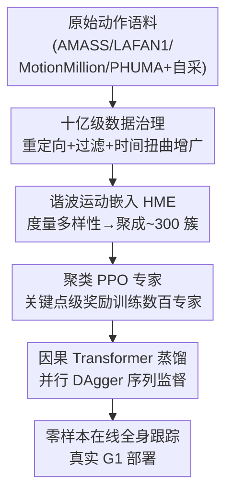

# Humanoid-GPT: Scaling Data and Structure for Zero-Shot Motion Tracking

**会议**: CVPR 2026  
**arXiv**: [2606.03985](https://arxiv.org/abs/2606.03985)  
**代码**: https://github.com/GalaxyGeneralRobotics/Humanoid-GPT/ (有)  
**领域**: 人形机器人 / 全身控制 / 运动跟踪 / Scaling Law  
**关键词**: 人形机器人, 运动跟踪, 零样本泛化, GPT 因果 Transformer, 数据 scaling

## 一句话总结
把人形机器人全身运动跟踪重新表述为 GPT 式的因果序列建模问题：先在约 20 亿帧重定向运动语料上聚类训练数百个 PPO 专家，再用 DAgger 把它们蒸馏进一个带因果掩码的 Transformer，从而在真实 Unitree-G1 上同时实现高动态敏捷性和对未见动作的零样本跟踪，并给出了运动跟踪任务的 scaling law。

## 研究背景与动机
**领域现状**：在语言和视觉里，泛化能力最可靠的来路是"做大"——更大的数据、更大的模型、精心设计的训练目标，scaling 往往还会解锁新能力。但人形运动跟踪没走上这条路：当前主流的跟踪器大多是在小规模运动语料上训练的浅层 MLP，连常用数据集（AMASS、LAFAN1 等）也只有约 $10^4$ 条轨迹、约 720 万帧。

**现有痛点**：规模严重不匹配导致一个顽固的失效模式——**敏捷性与泛化性此消彼长**。在域内敏捷动作上表现好的跟踪器（如 BeyondMimic、ASAP）往往无法零样本泛化到未见动作；泛化稍好的（如 TWIST、UniTracker）又在高动态复杂动作上欠拟合、跟踪精度发软。

**核心矛盾**：作者主张这个 trade-off 不是本质的，而是**规模不足 + 训练设计不匹配**的症状。但单纯往同一条流水线里塞更多片段也不够——当数据量涨几个数量级时，有三件事变得致命：① 该用什么数据、怎么清洗海量噪声数据；② 什么模型结构既符合在线跟踪（因果）约束、又能随规模持续变好；③ 什么训练配方在数据从百万涨到十亿帧时依然稳定。

**本文目标**：构建一个通用的、在线的人形运动跟踪器，让它同时具备敏捷性和零样本泛化，并把"为什么 scale 有用"讲成可量化的规律。

**切入角度**：在线跟踪本质上是因果的（测试时拿不到未来观测），而浅层 MLP 与非因果建模都会很早饱和——所以应该换成天然因果、且随数据/模型规模干净扩展的 GPT 式 Transformer。

**核心 idea**：把运动跟踪当作序列建模——用 GPT 因果注意力预测每个关节的 PD 目标，把数百个 RL 专家的知识蒸馏进一个生成式 Transformer，并用一套可平衡的多样性采样把十亿级语料的长尾喂均匀。

## 方法详解

### 整体框架
Humanoid-GPT 是一个三阶段流水线：**(a) 数据治理与处理** → **(b) 在聚类上训练 PPO 运动专家** → **(c) 用并行 DAgger 把所有专家蒸馏进单个 Transformer 通才策略**。输入是一段参考运动（可以是未见的、在线重定向的人体动作），经重定向映射到 Unitree-G1 的 29 自由度关节空间；输出是机器人每个关节的 PD 控制目标，从而以全零样本方式实时复现参考动作。

之所以分两段（先专家、后蒸馏），是因为单个 PPO 专家只能在自己那一簇运动上做到物理可信，遇到分布外目标就急剧退化；而把上百个专家的行为统一蒸馏进一个因果 Transformer，既能跨域消除断层、又能随数据和模型规模持续涨点——这正是 MLP 学不到的地方。

### 关键设计

**1. 十亿级运动语料治理：把噪声数据扩到 200 倍并保持稳定**

痛点直接对应"数据从百万涨到十亿后流水线会崩"。作者聚合了所有公开的动捕来源（AMASS、LAFAN1、Motion-X++、PHUMA、MotionMillion）再加上大规模自采内部数据，用现成的重定向框架把每条人体序列映射到 G1 的 29-DoF 关节空间，并显式过滤掉带物体交互的序列（坐椅子、游泳、爬楼梯）以保证在平地场景里可执行。为增强对运动速度的鲁棒性，对每条序列做均匀加速/减速的**时间扭曲增广**，把数据扩到约原来的 5 倍，最终得到约 **20 亿帧 / token** 的 G1 重定向语料，比以往跟踪器训练集大 $200\times$ 以上。关键在于：这个规模逼着系统重新设计奖励分量、重调敏感超参才能稳住训练，而正是在这个规模上，作者第一次给出系统证据——**视频估计的运动也能实质性改善跟踪**（小数据时这类噪声源往往帮倒忙）

**2. 谐波运动嵌入 HME：用周期特征量化多样性、把长尾喂均匀**

更多数据不等于更好泛化——大语料里常见风格会主导、稀有但重要的行为消失在长尾。HME 是一种直接从原始运动学习的表示：先在不同数据划分上训练若干 Periodic Autoencoder，提取每个关节的周期幅度与频率，再对每条序列聚合这些关节级谐波特征的均值与标准差，得到紧凑且有描述力的 HME 向量；最后用 K-Means（以两两距离为相似度）把全语料聚成约 **300 个簇**，每簇约 1k–2k 条序列，簇内一致、整体覆盖广。HME 还提供了**可量化的多样性指标**：给定嵌入矩阵 $X\in\mathbb{R}^{N\times D}$ 与协方差 $\Sigma$，定义几何平均标准差 $\text{gstd}=\exp\!\big(\frac{1}{D}\sum_{j=1}^{D}\log\sigma_j\big)$ 与对数体积 $\text{log-volume}=\tfrac{1}{2}\log\det(\Sigma+\epsilon I)$。作者的核心洞察是：**多样性与平衡缺一不可**——有多样性无平衡仍会过拟合高频模式，有平衡无多样性又会封顶能力上限，HME 让训练能做分布平衡的多样性感知采样

**3. 聚类 PPO 专家 + 关键点级奖励：在每簇上学物理可信的运动先验**

蒸馏的"老师"从哪来？在每个 HME 簇上训练一个 PPO 策略 $\pi:\mathcal{G}\times\mathcal{S}\mapsto\mathcal{A}$，把参考关节和本体感知观测映射为低层电机动作，再经 PD 控制器转成力矩。奖励在**身体关键点级别**计算（手臂、髋、脚、骨盆等），把位置/朝向/速度残差用指数软惩罚汇总：$R_{\text{kpt}}(t)=R_{\text{pos}}(t)+R_{\text{rot}}(t)+R_{\text{vel}}(t)+R_{\text{penal}}(t)$，其中位置项 $R_{\text{pos}}(t)=\sum_{k\in\mathcal{K}}w_k\exp(-\alpha_{\text{pos}}\|e^{\text{pos}}_{k,t}\|_1)$，旋转与速度项同理（用 $\mathrm{SO}(3)$ log map 误差 $\theta_{k,t}$ 与速度残差 $e^{\text{vel}}_{k,t}$），$R_{\text{penal}}$ 含自接触、平滑度等惩罚。训练后只保留高保真、长时程稳定的专家，构成异质运动域上的先验库。之所以用关键点级而非纯关节角奖励，是为了把"全局精确"和"局部稳定"同时约束住

**4. 因果 Transformer 蒸馏：用并行 DAgger 把序列监督榨干**

把分散的专家融成一个通才。蒸馏阶段采用 DAgger 框架，但**重新表述为序列建模**：每个时刻 $t$ 把本体状态 $s_t$ 与目标参考姿态 $q_t^{\text{ref}}$ 拼成 token $e_t$，把长度 $H$ 的 token 序列 $\{e_{t-H+1},\dots,e_t\}$ 喂进带**时间因果掩码**的 Transformer $G_\theta$。一次前向后，所有输出位置的动作都被对应老师在该历史上的输出监督：$\hat{a}_{t-H+1:t}=\bigcup_{t_i\in\mathcal{T}}\operatorname{concat}_{k\in[-H+1,0]} t_i(s_{t-k}^{priv.},g_{t-k})$，损失用 SmoothL1：$l=\mathcal{L}(G_\theta(e_{t-H+1:t}),\hat{a}_{t-H+1:t})$。这样**一次前向就在多个时间步上吃到 DAgger 反馈**，把 Transformer 的并行序列监督优势榨干；推理时维护一个最长 $H$ 的历史 token 队列、取末位输出作当前控制目标。一个额外收益是：不同位置的 token 关注到的历史长度不同，模型隐式学到**位置无关的时间预测**，即使在 episode 开头历史稀缺时也能输出稳定可信的控制——这正是因果设计契合在线部署约束的地方

### 损失函数 / 训练策略
专家阶段用 PPO 优化关键点级奖励（公式 1），评估用 root pose error、velocity error 和稳定跟踪时长，只保留收敛到物理一致的专家。蒸馏阶段用 DAgger + SmoothL1 损失（公式 2），在长度 $H$ 的因果窗口上做并行多步监督。部署侧把整模型导出 ONNX、用 TensorRT 编译计算图，并以 C++ 流式管线压低通信延迟，最终在单张 RTX 4090 上端到端推理延迟 < 1.5ms，约为 TWIST 的 5 倍快。

## 实验关键数据

### 主实验
在 MuJoCo 仿真、AMASS-test（训练时未见子集）上评估骨干架构与 scaling 效应。指标：跟踪成功率 SR（不摔倒比例）、平均每关节位置误差 MPJPE(rad)、平均每关节速度误差 MPJVE(rad/s)、根速度误差 RootVelErr(m/s)、平均每关键点位置误差 MPKPE(mm)。

| 骨干 | 训练 token | 参数(M) | SR ↑ | MPJPE ↓ | MPJVE ↓ | RootVelErr ↓ | MPKPE ↓ |
|------|-----------|---------|------|---------|---------|--------------|---------|
| MLP (3 层) | 2M | 0.25 | 76.89 | 0.1191 | 0.6081 | 0.2304 | 100.49 |
| TCN (8 层) | 2M | 0.65 | 81.48 | 0.0885 | 0.5716 | 0.2266 | 79.75 |
| Humanoid-GPT-S | 2M | 5.7 | 83.26 | 0.0853 | 0.5492 | 0.2049 | 62.65 |
| Humanoid-GPT-S | 20M | 5.7 | 86.02 | 0.0802 | 0.5210 | 0.1868 | 46.49 |
| Humanoid-GPT-B | 200M | 22.1 | 88.27 | 0.0793 | 0.5076 | 0.1820 | 44.78 |
| Humanoid-GPT-B | 2B | 22.1 | 90.43 | 0.0768 | 0.4891 | 0.1756 | 41.49 |
| Humanoid-GPT-L | 2B | 80.4 | **92.58** | **0.0735** | **0.4820** | 0.1785 | **40.99** |

最大的 Humanoid-GPT-L（2B token、80.4M 参数）在几乎所有指标上最优，SR 达 92.58%。MLP/TCN 也能从 scaling 受益，但暴露两个缺陷：**数据 scaling 早饱和**（TCN-L 在 2B token 才 89.05% SR，200M→2B 收益微弱）；**小数据上大模型反而过拟合**（仅 2M token 时 MLP-L 75.25% < MLP-S 76.89%，TCN-L 79.85% < TCN-S 81.48%）。即便最佳基线 TCN-L 的 MPKPE 56.15mm 仍比 Humanoid-GPT-S 的 43.25mm 落后约 30%。

### 真实世界评估
在真实 Unitree-G1 上跟踪四段训练时完全未见的高动态舞蹈动作（逐帧记录目标与执行关节配置算 MPJPE/MPJVE）：

| 骨干 | Can Do Can Go! MPJPE | Gokuraku Joudo MPJPE | HuoYuanJia MPJPE | PokerFace MPJPE |
|------|------|------|------|------|
| GMT | 0.1087 | 0.1098 | 0.0921 | 0.0994 |
| TWIST | 0.1253 | 0.1162 | 0.1079 | 0.1047 |
| Any2Track | 0.1039 | 0.1136 | 0.0956 | 0.0928 |
| Humanoid-GPT-S | 0.1024 | 0.1180 | 0.0825 | 0.0903 |
| Humanoid-GPT-B | **0.0974** | **0.1075** | 0.0858 | **0.0856** |

真实世界表现与仿真高度吻合，验证了强零样本 sim-to-real 迁移；在线遥操作（实时 MoCap 流重定向到 G1）也无需任何额外标定即可跟随蹲、迈步、转身、倾身等动作。

### 关键发现
- **架构是 scaling 的关键**：Transformer 随数据/模型规模稳定持续涨点，而同等参数的 MLP 很早饱和——这是 Humanoid-GPT 把跟踪重表述为序列建模的最直接收益。
- **多样性与平衡缺一不可**：作者用 HME 的 gstd / log-volume 量化数据集多样性，其 curated 大语料相比 AMASS 在 log-volume 上高约 4–5，更广的潜空间覆盖直接转化为更强的零样本先验。
- **数据 scaling 的边际递减信号**：200M→2B token 之间增益略有减小，提示当前模型容量下进入"数据受限"区间，需继续放大模型才能吃满更多数据。
- **工程可落地**：ONNX+TensorRT+C++ 流式管线把端到端延迟压到 <1.5ms（RTX 4090），约 5× 快于 TWIST，证明放大模型不必牺牲实时性。

## 亮点与洞察
- **把 trade-off 归因为"规模不足"而非"本质冲突"**：以往工作默认敏捷性和泛化性必须取舍，本文用 200× 数据 + 因果 Transformer 证明二者可同时拿到，是观念层面的 reframe。
- **HME 把"多样性"做成了可度量、可采样的量**：用周期自编码器抽谐波特征再聚类，既给出聚类依据、又给出 gstd/log-volume 这种可比指标，比泛泛说"我们数据更多样"实在得多，这套思路可迁移到任何需要平衡长尾的序列数据集。
- **并行 DAgger 序列监督**：一次前向在 $H$ 个时间步上同时吃老师反馈，把 Transformer 的并行性和 DAgger 的在线纠偏结合，蒸馏数百专家时效率优势明显。
- **位置无关的时间预测是因果设计的隐式红利**：不同位置 token 关注不同长度历史，让模型在 episode 开头历史稀缺时仍稳定输出——这是把在线部署约束"设计进架构"的漂亮一笔。

## 局限与展望
- **仅单一硬件平台**：所有实验都在 29-DoF Unitree-G1 上，跨形态（不同自由度/不同人形）的泛化未验证。
- **过滤掉了物体交互**：为保证平地可执行，治理阶段显式剔除了坐椅、爬楼、游泳等交互动作，意味着当前系统不覆盖接触丰富的操作类任务。
- **数据受限信号已出现**：200M→2B 增益递减，单纯堆数据回报在收窄；作者也承认需配合更大模型。
- **缺多模态输入**：当前只吃本体状态 + 参考姿态，作者展望引入接触、视觉、语言等模态，并与长时程规划或 VLA 式指令耦合，走向更通用的具身基础模型。

## 相关工作与启发
- **vs SONIC**：SONIC 把 MLP 控制器 scale 到 100M 帧，但 MLP 容量随数据增长饱和；本文用 2B 帧 + 因果 Transformer，把 SONIC 卡住的"架构天花板"换掉，零样本和精度都更高。
- **vs HumanPlus**：HumanPlus 也用 Transformer 控制器，但仅在有限运动时长上训、且用标准 PPO，错过了 Transformer 的并行序列监督优势；本文用并行 DAgger 蒸馏把这一优势吃满。
- **vs GMT / UniTracker**：GMT 用 MoE-MLP + 自适应采样，UniTracker 用 CVAE 师生框架，都改善了覆盖但受限于运动规模（约 6–9M 帧）；本文从数据规模（2B）和架构（因果 Transformer）双管齐下，在同等大小 MLP 饱和处仍能涨点。
- **vs TWIST / ASAP / BeyondMimic**：这些方法要么敏捷但不零样本（ASAP、BeyondMimic），要么泛化但弱于高动态（TWIST）；本文是首个同时拿下敏捷 + 零样本，并把跟踪重表述为 GPT 式序列建模、给出 scaling law 的系统。

## 评分
- 新颖性: ⭐⭐⭐⭐⭐ 首次把人形运动跟踪 reframe 为 GPT 式序列建模并配 200× 数据 + scaling law，HME 多样性度量是实打实的新工具。
- 实验充分度: ⭐⭐⭐⭐ 仿真有完整 scaling 表、真实 G1 有零样本舞蹈与在线遥操作验证，但局限于单一硬件、缺接触类任务。
- 写作质量: ⭐⭐⭐⭐⭐ 三问题驱动、动机—方法—实验逻辑清晰，scaling 论证扎实。
- 价值: ⭐⭐⭐⭐⭐ 给全身控制指出一条可量化的 scaling 路线图，真实硬件零样本 + <1.5ms 延迟具备很强落地意义。

<!-- RELATED:START -->

## 相关论文

- [\[CVPR 2026\] ProjFlow: Projection Sampling with Flow Matching for Zero-Shot Exact Spatial Motion Control](projflow_projection_sampling_with_flow_matching_for_zero-shot_exact_spatial_moti.md)
- [\[CVPR 2026\] HandDreamer: Zero-Shot Text to 3D Hand Model Generation](handdreamer_zero_shot_text_to_3d_hand_model_generation.md)
- [\[CVPR 2026\] HandX: Scaling Bimanual Motion and Interaction Generation](handx_scaling_bimanual_motion_and_interaction_generation.md)
- [\[CVPR 2026\] LLaMo: Scaling Pretrained Language Models for Unified Motion Understanding and Generation with Continuous Autoregressive Tokens](llamo_scaling_pretrained_language_models_for_unified_motion_understanding_and_ge.md)
- [\[CVPR 2026\] OpenT2M: No-frill Motion Generation with Open-source, Large-scale, High-quality Data](opent2m_no-frill_motion_generation_with_open-source_large-scale_high-quality_dat.md)

<!-- RELATED:END -->
