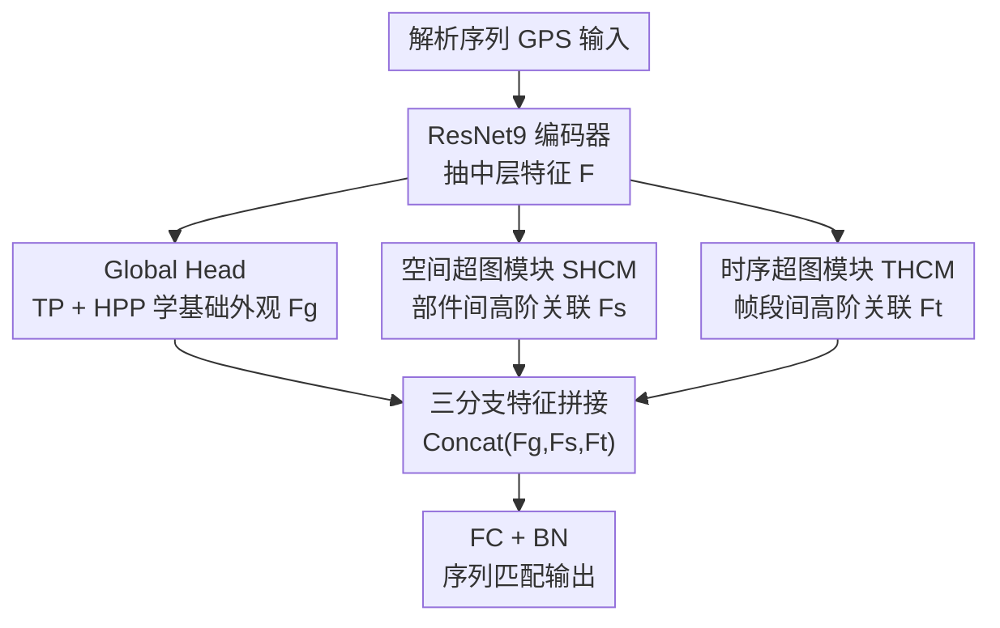

# HyperGait: Unleashing the Power of Parsing for Gait Recognition in the Wild via Hypergraph

**会议**: CVPR 2026  
**论文**: [CVF Open Access](https://openaccess.thecvf.com/content/CVPR2026/html/Zheng_HyperGait_Unleashing_the_Power_of_Parsing_for_Gait_Recognition_in_CVPR_2026_paper.html)  
**代码**: 无（论文未公开）  
**领域**: 人体理解 / 步态识别  
**关键词**: 步态识别、人体解析、超图卷积、高阶关联、单模态

## 一句话总结
HyperGait 用**超图卷积**把人体解析序列（gait parsing sequence）里身体部件之间、以及时间帧段之间的"高阶非线性关联"挖出来，仅以单一解析模态为输入，就在真实场景步态数据集 Gait3D 上拿到 80.5% Rank-1，超过此前同样只用解析的 SOTA（MultiGaitP）4.1 个百分点。

## 研究背景与动机
**领域现状**：步态识别（靠走路姿态认人）正从实验室走向真实场景。为应对随机遮挡、不规则行走、任意视角，研究者提出了多种步态表征——二值轮廓、光流、骨架、点云、3D SMPL，其中**解析序列（GPS，把人体分成语义部件）信息熵最高**，把轮廓换成解析能让多数方法 Rank-1 提升 12.5%~19.2%。

**现有痛点**：现有的解析步态方法被 CNN 和 GCN 主导，它们只能建模**成对、局部、线性**的关系——CNN 看不到部件级的全局结构，GCN 的固定二元边（一条边连两个点）+ 固定图结构既难适应视角变化和自遮挡，也没有充分建模帧之间的时序连接。换句话说，解析模态本身的高信息熵被这两类网络浪费了。

**核心矛盾**：步态里真正有判别力的，是"头-躯干-四肢多个部件**同时**怎么协同""相隔若干帧的部件**跨帧**怎么联动"这类**高阶（一对多、多对多）关联**；而成对边的图/局部卷积天然表达不了"一条边连任意多个顶点"的关系。

**本文目标**：只用单一解析表征（避免多模态带来的复杂数据处理），把解析里的高阶空间关联和高阶时序关联都榨出来，达到甚至超过多表征方法的精度与效率。

**切入角度**：超图（hypergraph）的一条**超边能连任意数量顶点**，天然适合建模"多个部件 / 多个帧"之间的多路交互。超图在目标检测（HyperYolo）、动作识别（HyperSA、HyperMV）里已验证有效，但在步态识别里从未被用过。

**核心 idea**：用超图卷积替代 CNN/GCN，在空间维度对身体部件、在时间维度对帧段分别构建并卷积一张**自适应超图**，把部件间和帧间的高阶相关性显式建模出来。

## 方法详解

### 整体框架
输入是步态解析序列 GPS $X=\{x_i\}_{i=1}^S$，先过一个 ResNet9 风格的编码器抽中层特征 $F_i = \mathcal{F}(x_i)$；随后 $F_i$ 分三路并行处理：**Global Head** 学基础外观特征 $F_g$、**SHCM**（空间超图卷积模块）学部件间高阶空间特征 $F_s$、**THCM**（时序超图卷积模块）学帧段间高阶时序特征 $F_t$；最后三路拼接 $F_{out}=\text{Concat}(F_g, F_s, F_t)$，过带 BN 的全连接层做序列到序列的匹配（训练/推理统一）。

### 关键设计

**1. Global Head：用最朴素的池化锚住基础外观，给两个超图分支兜底**

针对"光靠高阶关联可能丢掉全局形状信息"的风险，Global Head 只做最基础的事——先用时序池化 TP（时间维 max pooling）把序列压成一帧级特征，再用 GaitSet 的水平金字塔池化 HPP（横向切条 + max/mean pooling）得到细化的条带特征：$F^i_g = H(T(F_i))$。它学的是人体的基础外观知识，相当于 baseline 分支，和后面两个超图分支互补——超图负责挖高阶关联，Global Head 保证全局形状不丢。

**2. SHCM 空间超图卷积：用自适应超边捕捉身体部件间的一对多协同**

针对"GCN 只能成对连部件、且固定图结构难适应视角/遮挡"的痛点，SHCM 在部件级特征上构一张**按特征相似度自适应**的空间超图。沿用 ParsingGait 的方案把 11 个细部件合并成 5 个粗部件，对每帧用解析掩码抽出各部件特征、池化得部件向量 $Z_p$ 并归一化，再算两两欧氏距离 $D_{ij}=\|\hat{Z}_i-\hat{Z}_j\|_2$；关联矩阵按**自适应阈值**连接——$h_{ij}=1$ 当 $D_{ij}<\tau$，其中 $\tau=\min(\tau_0, 1.5\cdot\text{mean}(D))$ 随特征分布自动调整，既连上关键部件又滤掉噪声。然后做超图卷积 $Z'=D_v^{-1/2}HW_eD_e^{-1}H^TW_vD_v^{-1/2}\Theta(Z)$（信息从顶点传到超边再传回顶点，实现高阶聚合），加残差和 BN 稳定训练 $Z_{out}=\text{ReLU}(\text{BN}(Z'+Z))$，最后时序池化得 $F^i_s$。一条超边能同时连多个部件，正是 GCN 的成对边做不到的"多部件协同"。

**3. THCM 时序超图卷积：用 kNN 超边建模相隔帧之间的高阶时序联动**

针对"现有方法只做简单时序池化、没充分建模帧间复杂关系"的痛点，THCM 先把长度 $S$ 的序列切成 $K$ 个时序段，每段取中间帧并把其余帧的部件特征聚合进去得段表示 $T_k$；再算段间距离 $D_{ij}=\|T_i-T_j\|_2$。与空间超图用距离阈值不同，**时序超图用 k 近邻（kNN）策略**——每段连接它最近的 $k_{nn}$ 个段（含自身），$h_{ij}=1$ 当 $j$ 是 $i$ 的 kNN。同样做超图卷积 $T'=D_v^{-1/2}HW_eD_e^{-1}H^TW_vD_v^{-1/2}\Theta(T)$，加残差激活得 $F^i_t=\text{ReLU}(\text{BN}(T'+T))$。这样隔得较远但运动上相关的帧段能被一条超边一起聚合，把"跨帧的高阶时序协同"显式建出来——这是步态周期性最关键却又最隐含的信息。

### 损失函数 / 训练策略
三分支拼接后过带 BN 的全连接生成最终步态特征做序列匹配。Backbone 为 ResNet9（channels [64,128,256,512]、layers [1,2,2,1]），SGD（初始 lr 0.1、momentum 0.9、weight decay 5e-4），固定 30 帧输入，RandomHorizontalFlip/Rotate（概率 0.2）增广。SHCM/THCM 各用 1 层超图卷积；空间超图阈值 $\tau_0=0.4$；时序超图用 10 个段、3 近邻；解析按 5 个粗部件（头-躯干、左右上肢、左右下肢）构图。Gait3D 训 12 万次迭代、batch 32×2；SUSTech1K 训 5 万次、batch 8×8。

## 实验关键数据

### 主实验
在两个真实场景大规模数据集上，HyperGait 仅用解析输入即取得 SOTA，且超过同为单一解析模态的 MultiGaitP。

| 数据集 | 指标 | HyperGait | MultiGaitP(之前SOTA) | 提升 |
|--------|------|-----------|----------------------|------|
| Gait3D | Rank-1 | **80.5%** | 76.4% | +4.1 |
| Gait3D | mAP | **72.7%** | 68.7% | +4.0 |
| Gait3D | mINP | **54.3%** | 49.6% | +4.7 |
| SUSTech1K | Rank-1(整体) | **79.9%** | 77.3% | +2.6 |
| SUSTech1K | Rank-5(整体) | **93.0%** | 91.3% | +1.7 |

### 消融实验
在 Gait3D 上逐组件验证：SHCM、THCM 分别比 baseline（Backbone+Global Head）提升 1.0、2.2 个点，且分别比对应的标准 GCN 版本（S-GCN、T-GCN）高 0.5、1.1 个点，证明超图卷积优于成对图卷积；两者合用比 baseline 涨 4.8 个点、比 S-GCN+T-GCN 合用还高 2.4 个点，说明空时超图有协同增益。

| 配置 | Rank-1 | mAP | mINP | 说明 |
|------|--------|-----|------|------|
| Baseline (Backbone+Global Head) | 75.7 | 68.1 | 49.8 | 仅基础外观 |
| Baseline + S-GCN + T-GCN | 78.1 | 71.1 | 49.9 | 标准图卷积版 |
| Baseline + SHCM | 76.7 | 69.6 | 51.4 | 只加空间超图 |
| Baseline + THCM | 77.9 | 70.7 | 52.3 | 只加时序超图 |
| Baseline + SHCM + THCM (Full) | **80.5** | **72.7** | **54.3** | 完整模型 |

### 关键发现
- **THCM 比 SHCM 贡献更大**：单加 THCM 涨 2.2 点 > 单加 SHCM 涨 1.0 点，说明步态里"跨帧高阶时序关联"比"部件间空间关联"更有判别力——这与步态本质是周期性时序信号一致。
- **超图确实强于图**：在空间和时序两侧，超图版（SHCM/THCM）都稳定优于对应 GCN 版（S/T-GCN），验证"一对多超边"比"成对边"更能表达高阶关联。
- **空间超图要稀疏**：阈值 $\tau_0=0.4$ 时最优（Rank-1 80.5%），太低或太高都掉点——稀疏图能连上关键部件同时滤噪。
- **时序段数与近邻数有最优点**：10 段 + 3 近邻最佳（80.5%），段太少或近邻太多都下降，说明既要足够时序粒度又不能引入过多无关帧段。

## 亮点与洞察
- **把超图首次引入步态识别**：用"超边连任意多顶点"这一性质，统一了"多部件空间协同"和"多帧时序协同"两类高阶关系的建模，思路干净且可迁移到其他人体中心时序任务。
- **空间用阈值、时序用 kNN 的非对称构图**：作者没有把两侧用同一套构图法——空间部件少、用自适应距离阈值控稀疏；时序段多、用 kNN 保证每段都有固定邻居，这种"按维度特性选构图策略"的细节很值得借鉴。
- **只用单模态打过多模态**：在大家堆多表征的趋势下，HyperGait 证明把单一高熵表征（解析）吃透就能 SOTA，省掉多模态的数据处理开销，对效率敏感的部署友好。

## 局限与展望
- **衣着变化（CL）仍是弱项**：SUSTech1K 的 CL 条件下 HyperGait 39.6%，低于 MultiGaitP 的某些设置以及 GaitHeat，说明解析对换衣场景的鲁棒性仍有限。
- **依赖解析质量**：SUSTech1K 无官方解析，需用 CDGNet 现抽，解析器误差会传导到识别——解析不准时高阶关联也会建错。
- **超图为单层、构图较启发式**：SHCM/THCM 都只用 1 层超图卷积，阈值/段数/近邻数靠网格搜索，缺乏端到端可学的构图机制，留有改进空间。
- ⚠️ 部分对照表（如 Gait3D 完整 SOTA 列、SUSTech1K 各 probe 子条件）以原文表格为准。

## 相关工作与启发
- **vs ParsingGait**: 同样用解析部件，但 ParsingGait 用 GCN（固定二元边、固定图结构），难适应视角变化和自遮挡且忽略帧间连接；HyperGait 用自适应超图把成对关系升级为一对多高阶关系，Gait3D Rank-1 从 76.2% 提到 80.5%。
- **vs MultiGaitP**: 同为单一解析输入的前 SOTA，但未显式建模高阶空时关联；HyperGait 在 Gait3D/SUSTech1K 上分别高 4.1/2.6 个点。
- **vs 骨架 GCN（GaitGraph / GPGait / SkeletonGait）**: 它们把关节当节点、肢体当边构拓扑图，受限于关键点检测精度和成对边；HyperGait 改用语义部件 + 超边，信息熵和高阶表达力都更强。

## 评分
- 新颖性: ⭐⭐⭐⭐ 首次把超图卷积用于解析步态识别，空时双超图 + 非对称构图思路新颖。
- 实验充分度: ⭐⭐⭐⭐ 两大数据集 SOTA + 组件/构图策略消融齐全，但缺更多 backbone/解析器鲁棒性分析。
- 写作质量: ⭐⭐⭐⭐ 框架与公式清晰，超图构造交代到位；CL 弱项讨论略少。
- 价值: ⭐⭐⭐⭐ 用单模态打过多模态、且超图范式可迁移，对真实场景步态识别有实用价值。

<!-- RELATED:START -->

## 相关论文

- [\[CVPR 2026\] MMGait: Towards Multi-Modal Gait Recognition](mmgait_multi_modal_gait_recognition.md)
- [\[CVPR 2026\] EventGait: Towards Robust Gait Recognition with Event Streams](eventgait_towards_robust_gait_recognition_with_event_streams.md)
- [\[CVPR 2026\] Text-guided Feature Disentanglement for Cross-modal Gait Recognition](text-guided_feature_disentanglement_for_cross-modal_gait_recognition.md)
- [\[CVPR 2026\] Unlocking Motion from Large Vision Models with a Semantic and Kinematic Duality for Gait Recognition](unlocking_motion_from_large_vision_models_with_a_semantic_and_kinematic_duality_.md)
- [\[CVPR 2026\] BarbieGait: An Identity-Consistent Synthetic Human Dataset with Versatile Cloth-Changing for Gait Recognition](barbiegait_an_identity-consistent_synthetic_human_dataset_with_versatile_cloth-c.md)

<!-- RELATED:END -->
