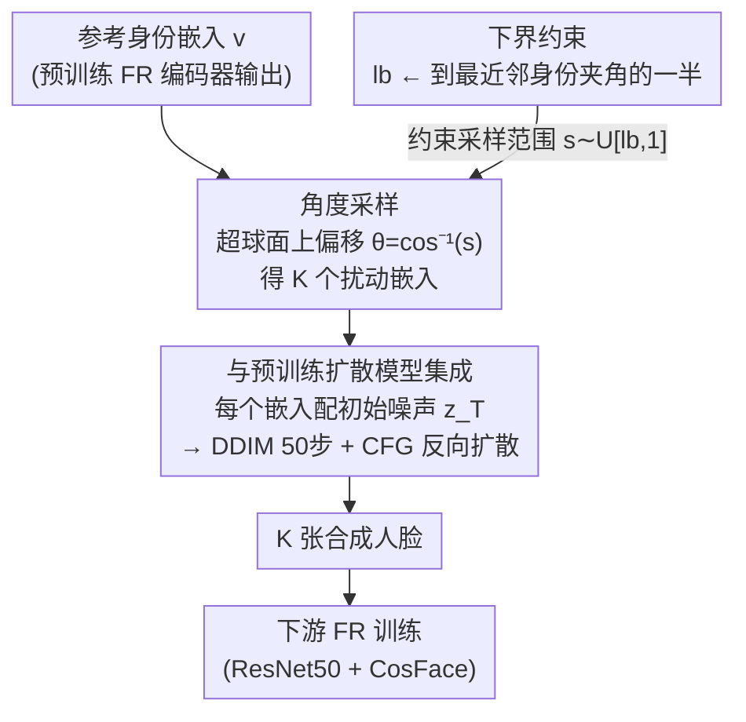

# IDperturb: Enhancing Variation in Synthetic Face Generation via Angular Perturbations

**会议**: CVPR 2026  
**arXiv**: [2602.18831](https://arxiv.org/abs/2602.18831)  
**代码**: [GitHub](https://github.com/fdbtrs/IDiff-Face)（基于 IDiff-Face）  
**领域**: 图像生成 / 人脸识别  
**关键词**: 合成人脸, 身份扰动, 角度采样, 扩散模型, 人脸识别

## 一句话总结

提出 IDperturb，一种在单位超球面上对身份嵌入进行角度扰动的几何采样策略，无需修改生成模型即可显著增强合成人脸数据集的类内多样性，提升下游人脸识别性能。

## 研究背景与动机

合成人脸数据已成为训练人脸识别 (FR) 系统的隐私友好替代方案。基于身份条件的扩散模型（如 IDiff-Face、DCFace）能生成逼真且身份一致的人脸图像，但普遍存在**类内变化不足**的问题——同一身份生成的图像在年龄、表情、姿态等方面过于相似，导致训练出的 FR 模型泛化能力不足。

现有方法通过引入额外标签条件（ID3）、学习风格模块（DCFace）或迭代优化嵌入（HyperFace）来增加多样性，但这些方法要么需要修改模型架构，要么需要辅助标签，要么计算成本较高。本文的核心观察是：**身份嵌入空间的几何结构本身就可以被利用来引入多样性**，无需对生成模型做任何修改。

## 方法详解

### 整体框架

IDperturb 想解决一个具体痛点：身份条件扩散模型生成的合成人脸「类内变化太小」，同一身份的脸在年龄、表情、姿态上都太像，拿去训人脸识别（FR）模型泛化就差。它的做法是一个**纯几何驱动**的推理时采样策略，完全工作在预训练身份条件扩散模型的嵌入空间里，不改模型一行代码：给定参考身份嵌入 $\mathbf{v}$，在它周围一个受约束的角度锥体内采出一组扰动嵌入 $\{\tilde{\mathbf{v}}_k\}_{k=1}^K$，每个扰动嵌入再作为条件去生成一张人脸。

### 关键设计

**1. 角度采样：在单位超球面上做受控角度偏移，保身份的同时引入变化**

要增多样性又不能丢身份，关键在「变得有分寸」。IDperturb 先均匀采样目标余弦相似度 $s \sim \mathcal{U}[\mathbf{lb}, 1]$，对应角度 $\theta = \cos^{-1}(s)$；再采随机噪声 $\mathbf{n} \sim \mathcal{N}(0, \mathbf{I})$ 并投影到 $\mathbf{v}$ 的正交超平面上得到单位向量 $\mathbf{u}$；最终构造扰动嵌入：

$$\tilde{\mathbf{v}} = \cos(\theta) \cdot \mathbf{v} + \sin(\theta) \cdot \mathbf{u}$$

这个构造同时保证 $\|\tilde{\mathbf{v}}\| = 1$（范数保持）与 $\langle \tilde{\mathbf{v}}, \mathbf{v} \rangle = \cos(\theta) = s$（精确角度控制）。它之所以有效，是因为 FR 嵌入空间里余弦相似度本就和身份语义强对应——沿超球面偏一个可控的小角度，正好在「还是这个人」的前提下引入年龄、姿态等方向的变化。

**2. 下界约束：用「角度取半」从几何上杜绝身份重叠**

参数 $\mathbf{lb}$ 决定允许的最大角度偏移，$\mathbf{lb}$ 越小变化越大、但身份一致性可能崩。为了不让扰动越界到别的身份，IDperturb 动态调整下界：

$$\mathbf{lb} \leftarrow \max\left(\mathbf{lb}, \max_{j \neq i} \cos\left(\frac{\angle(\mathbf{v}_i, \mathbf{v}_j)}{2}\right)\right)$$

也就是把下界顶到「到最近邻身份夹角的一半」，确保扰动后的嵌入始终比任何其他身份更接近原身份。这是一个干净的几何保证，把「身份不重叠」直接写进了约束里。

**3. 与预训练扩散模型的集成：即插即用，开销几乎为零**

IDperturb 不动模型，直接和预训练 LDM（如 IDiff-Face）配合：对每个身份生成 $K$ 个扰动嵌入，每个嵌入再配不同的初始噪声 $\mathbf{z}_T$，经 DDIM 50 步采样 + Classifier-Free Guidance 反向扩散出图。整个扰动过程额外开销极小——M3 CPU 上每身份 50 次扰动只要 0.01 秒，所以才能做到「不改模型、不加标签、不训练」就提升多样性。

### 损失函数 / 训练策略

IDperturb 本身不涉及训练，它只是推理时的采样策略。下游 FR 训练用 ResNet50 + CosFace loss（margin=0.35, scale=64），SGD 优化器训 34 epochs，初始学习率 0.1。

## 实验关键数据

### 主实验

在 IDiff-Face (C-WF) 基线上的 FR 验证准确率（%）：

| 数据集 | 指标 | IDperturb (lb=0.6) | Baseline (无扰动) | 提升 |
|--------|------|-------|----------|------|
| LFW | Acc | 99.40 | 98.75 | +0.65 |
| AgeDB-30 | Acc | 93.20 | 88.85 | +4.35 |
| CFP-FP | Acc | 93.61 | 91.61 | +2.00 |
| CA-LFW | Acc | 93.50 | 90.90 | +2.60 |
| CP-LFW | Acc | 88.37 | 86.15 | +2.22 |
| **平均** | Acc | **93.62** | 91.25 | **+2.37** |

与 SOTA 对比：在相同设置下（DGM 训练于 C-WF），IDperturb 以 93.62% 平均准确率超越所有竞争方法。

### 消融实验

| 配置 | 平均准确率 | 说明 |
|------|---------|------|
| lb=0.9 | 92.68 | 扰动较小，提升有限 |
| lb=0.8 | 93.31 | 适度扰动 |
| lb=0.7 | 93.44 | 接近最优 |
| **lb=0.6** | **93.62** | **最优平衡点** |
| lb=0.5 | 93.56 | 开始略微下降 |
| lb=0.4 | 93.36 | 身份一致性下降 |
| Baseline | 91.25 | 无扰动 |

CFG 强度消融（lb=0.6）：$\omega=2$ 达到最优（93.63%），过大的 $\omega$ 会限制多样性。

### 关键发现

- 降低 lb 单调增加类内多样性（$D_{intra}$），但降低身份一致性（$C_{intra}$），最优平衡点在 lb=0.6
- lb=0.6 时，年龄熵、表情熵、头部姿态 STD 均接近真实数据集 C-WF
- 扰动仅作用于嵌入空间，但隐式促进了姿态、年龄、表情等多方面的多样化

## 亮点与洞察

1. **极致的简洁性**：方法仅是一个几何操作——在超球面上做角度采样，无需修改模型、无需额外标签、无需训练，计算开销几乎为零
2. **数学优雅**：利用超球面几何保证范数不变和角度精确控制，身份重叠避免的角度取半策略也有严格几何解释
3. **通用性强**：可即插即用于任何身份条件扩散模型，已在 FFHQ 和 C-WF 两个基线上验证有效

## 局限与展望

1. lb 较低时（如 0.4），部分样本身份一致性明显下降，EER 显著升高
2. 目前仅在 IDiff-Face 上验证，未测试 Arc2Face 等更强基线
3. 角度采样方向是均匀随机的，未利用嵌入空间中不同方向对应不同属性变化的语义结构
4. 仅针对 2D 人脸合成场景，扩展到 3D 人脸或通用图像生成需要验证

## 相关工作与启发

- **IDiff-Face / UIFace**：本文的基线扩散模型，IDperturb 在其上即插即用地提升性能
- **DCFace**：通过学习风格嵌入增加多样性，更复杂但可能捕获更丰富的变化
- **HyperFace**：迭代优化嵌入空间采样，计算成本更高
- **启发**：超球面嵌入空间的几何结构可以被更深入地利用——例如沿特定方向（对应年龄、姿态等）做非均匀采样，或将这种思路扩展到其他条件生成任务（如风格迁移、文本条件生成）

## 评分

- 新颖性: ⭐⭐⭐⭐ 从纯几何视角解决多样性问题，思路简洁而有效
- 实验充分度: ⭐⭐⭐⭐ 多基线、多benchmark、多角度消融（多样性/一致性/属性/可分性），非常全面
- 写作质量: ⭐⭐⭐⭐ 数学推导清晰，图示直观，实验组织有条理
- 价值: ⭐⭐⭐⭐ 零成本即插即用提升合成人脸数据质量，对隐私保护场景的 FR 训练有直接实用价值

<!-- RELATED:START -->

## 相关论文

- [\[AAAI 2026\] SOSControl: Enhancing Human Motion Generation through Saliency-Aware Symbolic Orientation and Timing Control](../../AAAI2026/human_understanding/soscontrol_enhancing_human_motion_generation_through_saliency-aware_symbolic_ori.md)
- [\[CVPR 2026\] PC-Talk: Precise Facial Animation Control for Audio-Driven Talking Face Generation](pc-talk_precise_facial_animation_control_for_audio-driven_talking_face_generatio.md)
- [\[CVPR 2026\] Goldilocks Test Sets for Face Verification](goldilocks_test_sets_for_face_verification.md)
- [\[CVPR 2026\] FrankenMotion: Part-level Human Motion Generation and Composition](frankenmotion_part-level_human_motion_generation_and_composition.md)
- [\[CVPR 2026\] FloodDiffusion: Tailored Diffusion Forcing for Streaming Motion Generation](flooddiffusion_tailored_diffusion_forcing_for_streaming_motion_generation.md)

<!-- RELATED:END -->
