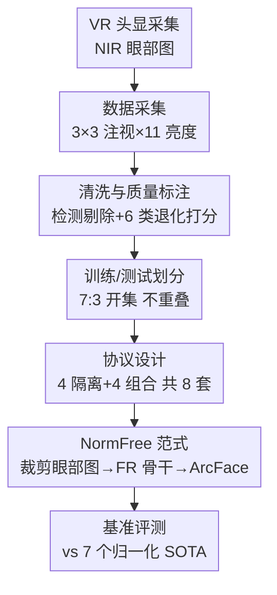

# ImmerIris: A Large-Scale Dataset and Benchmark for Off-Axis and Unconstrained Iris Recognition in Immersive Applications

**会议**: CVPR 2026  
**arXiv**: [2510.10113](https://arxiv.org/abs/2510.10113)  
**代码**: 待确认（论文承诺公开数据集）  
**领域**: 生物特征识别 / 数据集与基准 / 虹膜识别  
**关键词**: 虹膜识别、沉浸式应用、离轴成像、归一化无关、人脸识别范式

## 一句话总结
为 XR/VR 头显场景下"离轴、非约束"虹膜识别造了一个 546 人、49.98 万张眼部图像的大规模数据集 ImmerIris，配套 8 套难度递增的评测协议，并指出传统两阶段方法卡在"归一化"上，提出一个直接吃裁剪眼部图、套人脸识别骨干的 NormFree 范式，简单却在多数协议上反超归一化 SOTA。

## 研究背景与动机
**领域现状**：传统虹膜识别用于边检等高安全场景，用户正视专用相机，拿到的是"正轴（on-axis）、受控"的眼部图像，样本高度一致。识别管线沿用 Daugman 的两阶段范式：先做**归一化**（分割虹膜区域→拟合虹膜内外圆轮廓→极坐标展开成矩形纹理条），再做**特征提取**（把纹理条映射成身份模板，早期用 Gabor 等手工滤波器生成二值 iriscode，近年换成 CNN 等深度骨干）。

**现有痛点**：随着 XR/VR 兴起，消费级头显（HMD）的侧置相机能顺手采眼部图，用于登录、支付等无感识别。但这套采集方式与受控场景天差地别，带来三类独有挑战——**透视畸变**（相机斜对着眼睛，虹膜呈椭圆、局部纹理被不均匀拉伸）、**类内变化**（同一只眼受光照、注视方向变化，纹理一致性下降）、**质量退化**（用户不配合导致半闭眼遮挡、运动模糊等）。然而同时覆盖这三类挑战的数据集极少，多数现有数据集要么私有要么规模小，且几乎全是正轴受控采集。

**核心矛盾**：作者把传统 SOTA 在受控数据 CASIA-T 上训练好再迁到沉浸式协议上测，FRR（错误拒绝率）从个位数飙到 80%+，几乎不可用。诊断发现根因在归一化阶段：离轴畸变和退化会让极坐标展开"展歪"，类内变化又进一步破坏纹理一致性。一些 SOTA 试图改进归一化或加后处理，但既不直观也次优。换句话说，归一化在受控年代是功臣（特征提取器还很原始时，它提前产出相对不变的纹理），但在沉浸式场景里反而成了"技术债"。

**本文目标**：(1) 填补数据空白，造一个真正覆盖离轴+非约束三类挑战的大规模公开数据集；(2) 建立系统化、可隔离/可组合分析各挑战因素的评测协议；(3) 给出一个绕开归一化、对畸变退化更鲁棒的识别范式。

**核心 idea**：既然现代特征提取器已足够强（人脸识别 FR 的成功靠的是鲁棒骨干+判别性目标，而非精巧预处理），那就**砍掉易坏的归一化**，直接从"轻微调整过的眼部图"端到端学习——只用可靠检测器裁出虹膜区域、套 FR 骨干配 ArcFace。

## 方法详解

### 整体框架
本文产出"数据集 + 基准 + 一个基线方法"三件套。数据侧：用 VR 头显采集 NIR 眼部图 → 清洗+按 6 类退化标注质量分 → 7:3 划分训练/测试且受试者不重叠（开集）→ 据 6 个退化/变化因子组织成 8 套协议（4 套隔离单因素、4 套组合不同操作模式）。方法侧：把传统"分割→极坐标展开→特征提取"的两阶段范式，换成"检测裁剪→FR 骨干→ArcFace"的端到端范式 NormFree，并以"同骨干但保留归一化"的 NormKeep 作消融对照。

### 关键设计

**1. 离轴非约束的大规模采集：把三类挑战"主动复现"进数据里**

数据集的价值取决于它是否真覆盖目标场景的难点。作者用一台通用 VR 头显（Skyworth Pancake XR）配自研采集软件，侧置相机天然产生**透视畸变**（相机斜对眼睛）；为复现**类内变化**，屏幕上排 $3\times3$ 共 9 个编号红方块，受试者依次注视每个点以制造注视方向变化，同时头显在每个注视点自动把屏幕亮度从最暗到最亮扫过 11 个等级，模拟光照变化并诱发瞳孔自然缩放，每个亮度等级每只眼采 5 张 $640\times640$ 图。这样每个受试者双眼合计采 $9\times11\times5\times2=990$ 张。共招募 546 名亚裔成人志愿者（20–40 岁、性别近均衡，经 IRB 批准），初始 540,540 张。把畸变/光照/注视作为"采集时就写死"的变量，保证了数据集对沉浸式难点的覆盖是系统化而非偶然。

**2. 检测式清洗 + 6 维退化标注：把"质量退化"量化成可控的协议构件**

第三类挑战"质量退化"难以在采集时主动制造，只能事后筛与标。作者先用预训练眼部检测模型拿虹膜区域框，**检测失败的 36,697 张直接丢**（眼区出框、闭眼、眨眼/移动造成的严重运动模糊），再人工目检剔除 4,052 张缺陷图，清洗后剩 **499,791 张**。随后对每张图按 6 类常见退化打质量分——眼睑遮挡、睫毛遮挡、瞳孔过度扩张、极端离轴注视、镜面反射、运动模糊，每一维设阈值区分"正常/退化"。统计发现约 **42% 的图至少在一个维度上退化**，定量印证了退化在沉浸式场景的普遍性。这套 6 维标注不是摆设：它直接成为后面协议挑选样本对的依据（如按 iris-to-ocular 比例低选扩张样本对）。

**3. 隔离 + 组合的 8 套协议：让每个挑战因素都能被单独和联合地审视**

只给一堆图不够，得有"怎么测"的标尺。作者把类内变化和质量退化的因子组织成 8 套协议（离轴畸变是全数据集固有、不单独研究）。**4 套隔离协议**各盯一个单因素并尽量压住其他因素：Immer-Occlusion（含遮挡对，注视固定）、Immer-Dilation（成对都是低虹膜占比的扩张图）、Immer-Light（3 个低亮度配 3 个高亮度，扩张配正常）、Immer-Gaze（不同注视点配对、只取正常图）。**4 套组合协议**按难度递增模拟不同操作模式：Immer-Control（固定注视、完全配合，仅比传统受控多了离轴畸变）→ Immer-Fix（固定注视但可有遮挡/反射/模糊）→ Immer-Select（避开造成极端注视的视野角落，作者发现极端注视多发生在每只眼最内侧方向，故剔除右眼 3/6/9、左眼 1/4/7 注视点）→ Immer-Any（不加任何限制的理想非约束场景）。每套协议支持验证（1:1）和辨识（1:N）、单眼与双眼两种操作模式，验证采样最多 1.5M 同人对 + 3M 异人对以可靠估计到 FAR=1e-5。这种"先隔离归因、再组合压测"的设计让基准能定位到底是哪个因素拖垮了识别。

**4. NormFree：砍掉归一化、直接吃裁剪眼部图的端到端范式**

这是方法侧的核心贡献，针对"归一化在离轴退化下易坏"这一根因。做法极简：用与清洗阶段相同的预训练检测器拿虹膜区域框，按正方形框裁出区域、并把框**外扩 1.2 倍**以纳入邻近眼部上下文线索，resize 到目标输入尺寸——这一步比极坐标展开鲁棒得多、且可在线高效完成。特征提取则不再设计专用模块，而是直接借用人脸识别成熟实践：用与 SOTA 规模相当的 ResNet（IR-50）骨干，配角度间隔损失 ArcFace 训练。其有效性的逻辑是：归一化当年是为弥补原始特征提取器的不足而存在的"前置不变性"，如今深度骨干自己就能学到这种不变表示，归一化反而引入了"展歪纹理"的失败点。作为对照，作者额外构造 **NormKeep**（同骨干同损失，但保留归一化），二者差距即"砍掉归一化"的净收益

### 损失函数 / 训练策略
NormFree 用 ArcFace（angular-margin-based loss）作训练目标，骨干为 IR-50；消融时换成更小的 IR-18 验证对模型规模的鲁棒性。按沉浸式虹膜识别惯例，同一受试者的左右眼标为两个不同类别。训练/测试 7:3 划分、受试者不重叠以保证开集评测（系统需登记并识别此前未见过的人）。

## 实验关键数据

### 跨域崩塌：传统 SOTA 迁到沉浸式后几乎不可用
在受控 CASIA-T 上训练再测同分布很稳，但迁到 Immer-Any 后 FRR@FAR 全线暴涨（验证任务，越低越好）：

| 测试集 | 方法 | FRR@FAR=1e-1 | 1e-3 | 1e-5 |
|--------|------|------|------|------|
| CASIA-T | Gabor | 0.36 | 1.03 | 5.24 |
| CASIA-T | ComplexIrisNet | 1.08 | 13.74 | 35.79 |
| Immer-Any | Gabor | 32.12 | 64.33 | 85.47 |
| Immer-Any | ComplexIrisNet | 42.25 | 81.07 | 93.14 |

归一化对正轴/离轴名义上都适用、输入是对齐的，所以这种崩塌主要归因于数据域差，印证 ImmerIris 确实捕捉到了传统数据没有的独特挑战。

### 组合协议主结果：NormFree 简单却几乎全程第一/第二
4 套难度递增组合协议，验证 FRR@FAR（%，越低越好），下表取左眼代表值：

| 方法 | Control 1e-5 | Fix 1e-5 | Select 1e-5 | Any 1e-5 |
|------|------|------|------|------|
| CM [45] | 7.18 | 18.35 | 45.03 | 49.93 |
| ComplexIrisNet [27] | 7.32 | 19.73 | 49.13 | 57.62 |
| NormKeep（消融对照） | 6.41 | 19.77 | 49.20 | 56.63 |
| **NormFree（本文）** | **5.50** | **15.22** | **47.96** | **52.04** |

NormFree 在几乎所有情形排第一或第二；NormKeep 普遍落后最佳 SOTA、且与 NormFree 有可观差距——这正是"砍掉归一化"的独立收益。在最难的 Select/Any 上即便最佳 SOTA 也不令人满意，说明仍需方法论突破。

### 隔离协议：注视变化是头号难题，退化场景下 NormFree 增益更大
| 隔离因素 | 现象（相对 Control） |
|----------|---------------------|
| Occlusion 遮挡 | FRR@1e-5 平均仅 +9.34%，影响中等 |
| Dilation 扩张 | 意外地几乎不显著降低可识别性 |
| Light 光照 | SOTA 明显掉点（成对虹膜因光照自然缩放），说明归一化对光照也敏感 |
| Gaze 注视 | 平均退化 **36.99%**，是沉浸式场景最难的因素 |

NormFree 在遮挡、扩张上有效、对光照变化也鲁棒，且其相对 NormKeep 的增益在这些退化协议上更大（**4.12–16.82%**），说明砍归一化对处理退化尤其有利；但在 Gaze 上虽优于多数 SOTA 却无决定性优势，作者承认这是留待未来的方向。

### 辨识（rank-1，越高越好，左眼）
| 方法 | Control | Any | Occlusion | Gaze |
|------|---------|-----|-----------|------|
| ComplexIrisNet | 99.67 | 91.14 | 93.64 | 95.18 |
| NormKeep | 99.76 | 91.99 | 95.41 | 94.75 |
| **NormFree** | 99.52 | **94.39** | **98.23** | **95.49** |

趋势与验证一致：砍归一化在更难协议上的辨识增益明显。

### 消融：增益对模型规模与归一化实现都稳健
Immer-Any 上左右眼平均 FRR@FAR（%）：

| 方法 | 设置 | 1e-1 | 1e-3 | 1e-5 |
|------|------|------|------|------|
| NormKeep | Default | 5.84 | 29.72 | 55.23 |
| NormKeep | Alt. Model（IR-18） | 6.08 | 31.51 | 55.41 |
| NormKeep | Alt. Normalization | 3.25 | 24.08 | 52.77 |
| NormFree | Default | 2.32 | 23.95 | 50.80 |
| NormFree | Alt. Model（IR-18） | 2.11 | 24.59 | 51.99 |

把骨干换成更小的 IR-18，NormFree 仍胜过 NormKeep 和各 SOTA，说明增益对模型规模不敏感；换用更自适应的归一化实现只让 NormKeep 微弱改善，说明归一化的缺陷是普遍性的、而非某种特定实现的问题。

### 关键发现
- **去掉哪个最致命**：去掉归一化（NormFree vs NormKeep）在退化协议上掉点收益最大（4.12–16.82%），是性能提升的主因；而归一化实现怎么换都救不回来。
- **最难因素**：Gaze 注视变化平均拖垮 36.99%，是沉浸式识别的头号瓶颈，连 NormFree 也没拉开决定性差距。
- **反直觉点**：瞳孔扩张本以为会压缩纹理降识别度，实测几乎不显著；反倒是光照变化（伴随瞳孔缩放）更伤归一化方法。

## 亮点与洞察
- **"砍掉而非改进"的逆向思路**：面对归一化在离轴场景失效，多数 SOTA 选择改进归一化或加后处理，本文反其道把它整个砍掉、让强骨干自己学不变性——简单设计反超精巧设计，很"啊哈"。
- **采集设计即数据集质量**：用 $3\times3$ 注视格 + 11 级亮度把"注视/光照"两类变化主动写进采集流程，再用 6 维退化标注把"质量"量化成协议构件，是造高价值生物特征数据集的可复用范式。
- **借力邻域成熟范式**：直接搬人脸识别的"鲁棒骨干 + ArcFace"，提示了一条跨任务迁移的实用路径——当某子领域困在精巧预处理时，不妨问问隔壁领域是不是早已用"强表示学习"绕过了这个环节。
- **隔离+组合的协议设计**：先单因素归因再组合压测，能精确定位是哪个因素（这里是 Gaze）拖垮系统，对后续方法改进很有指导性。

## 局限与展望
- 作者承认 NormFree 在 Gaze 注视变化下缺乏决定性优势，需专门设计应对眼-相机几何变化，这是明确的未来工作。
- 数据集人群单一：仅亚裔成人（20–40 岁），跨种族、跨年龄的泛化未验证；采集只用一款 VR 头显（Skyworth Pancake XR），换设备/相机位形的鲁棒性未知。
- NormFree 依赖一个"可靠"的预训练检测器拿虹膜框，但论文把检测失败的样本直接清洗掉了——真实在线场景中检测本身的失败率与级联误差未被纳入端到端评估。
- 基准只对比到现有归一化 SOTA + 一个 NormKeep 消融，NormFree 作为"基线"留了很多可优化空间（如针对注视的几何对齐模块），后续方法仍有大量提升余地。

## 相关工作与启发
- **vs 传统两阶段归一化范式（Daugman [10] 及 Maxout/CM/ComplexIrisNet 等）**：他们先极坐标展开成归一化纹理再提特征；本文直接吃裁剪眼部图、端到端学。区别在于把"不变性"从手工预处理交给深度骨干，优势是对离轴畸变/退化鲁棒，劣势是放弃了归一化在受控场景的先验、对极端注视仍乏力。
- **vs 已有 normalization-free 工作（ThirdEye [1] 等）**：它们虽也想绕开归一化，但仍依赖虹膜分割——而分割正是归一化管线里易坏的一环；本文用更鲁棒的检测裁剪替代分割，彻底摆脱了这条脆弱链路。
- **vs PolyU Iris DB [42]**：同样用 VR 设备采集、概念接近，但 ImmerIris 进一步纳入真实世界的显著离轴畸变与光照变化，且规模更大（499,791 张 / 546 人，号称迄今最大公开虹膜数据集），覆盖三类挑战更完整。
- **vs 现代人脸识别（ArcFace [11] 等）**：本文把 FR 的"鲁棒骨干 + 角度间隔损失"成功迁到虹膜，验证了 FR 的成功经验（成功源于强表示而非精巧预处理）在虹膜识别同样成立。

## 评分
- 新颖性: ⭐⭐⭐⭐ 数据集填补沉浸式离轴虹膜空白，"砍归一化"范式逆向且有效，但方法本身是成熟 FR 组件的迁移组合
- 实验充分度: ⭐⭐⭐⭐⭐ 8 协议 × 验证/辨识 × 单/双眼 × 7 个 SOTA + NormKeep/规模/归一化消融，覆盖极全
- 写作质量: ⭐⭐⭐⭐ 动机—诊断—对策逻辑清晰，协议设计讲得很到位
- 价值: ⭐⭐⭐⭐⭐ 提供迄今最大公开虹膜数据集 + 系统基准 + 一条明确的鲁棒识别方向，对沉浸式生物识别社区是实打实的基础设施

<!-- RELATED:START -->

## 相关论文

- [\[CVPR 2026\] M4Human: A Large-Scale Multimodal mmWave Radar Benchmark for Human Mesh Reconstruction](m4human_a_large-scale_multimodal_mmwave_radar_benchmark_for_human_mesh_reconstru.md)
- [\[CVPR 2026\] RoMo: A Large-Scale, Richly Organized Dataset and Semantic Taxonomy for Human Motion Generation](romo_a_large-scale_richly_organized_dataset_and_semantic_taxonomy_for_human_moti.md)
- [\[CVPR 2026\] LCA: Large-scale Codec Avatars - The Unreasonable Effectiveness of Large-scale Avatar Pretraining](lca_large-scale_codec_avatars_the_unreasonable_effectiveness_of_large-scale_avata.md)
- [\[CVPR 2026\] RGB-Event based Pedestrian Attribute Recognition: A Benchmark Dataset and An Asymmetric RWKV Fusion Framework](rgb-event_based_pedestrian_attribute_recognition_a_benchmark_dataset_and_an_asym.md)
- [\[CVPR 2026\] OpenDance: Multimodal Controllable 3D Dance Generation with Large-scale Internet Data](opendance_multimodal_controllable_3d_dance_generation_with_large-scale_internet_.md)

<!-- RELATED:END -->
