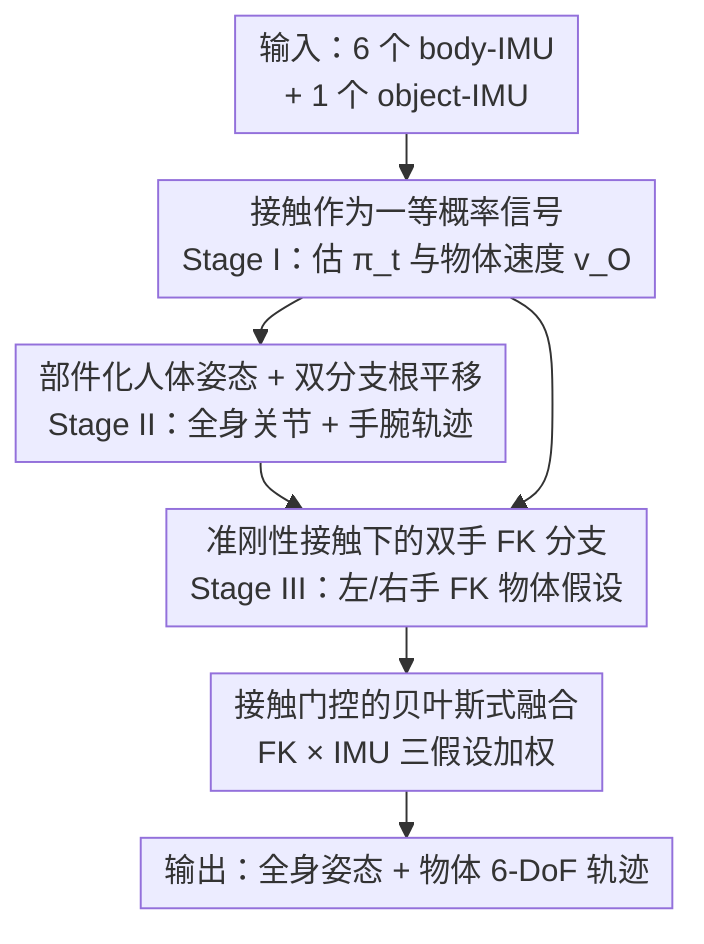

# IMU-HOI: A Symbiotic Framework for Coherent Human-Object Interaction and Motion Capture via Contact-Conscious Inertial Fusion

**会议**: CVPR 2026  
**论文**: [CVF Open Access](https://openaccess.thecvf.com/content/CVPR2026/html/Lin_IMU-HOI_A_Symbiotic_Framework_for_Coherent_Human-Object_Interaction_and_Motion_CVPR_2026_paper.html)  
**代码**: 无  
**领域**: 人体理解 / 惯性动作捕捉  
**关键词**: 稀疏IMU、人物交互、动作捕捉、接触门控、惯性融合

## 一句话总结
IMU-HOI 把"手与物体的接触"当成一等公民的概率信号，从贴在身体（6 个）和物体（1 个）上的稀疏 IMU 出发，用三阶段融合流水线同时恢复全身人体姿态和物体的 6-DoF 轨迹，在三个 HOI 基准上把物体轨迹误差相比强基线降低了 44%~64%。

## 研究背景与动机

**领域现状**：在 AR/VR 和人机协作里，既要捕捉全身人体动作、又要捕捉人手里操纵的物体。视觉方案（多目相机、预扫描网格）受遮挡、视场和光照限制大，而惯性动作捕捉（IMU mocap）凭着不需视线、不怕光照的特性成了有吸引力的替代方案——从 DIP、TransPose、TIP 到 DynaIP，稀疏 IMU 已能较好地还原人体姿态。

**现有痛点**：现有惯性 mocap 几乎都假设"人是孤立的"。它们只重建人体骨架，完全不建模接触、也不估计物体状态——而现实里人无时无刻在和工具、运动器材、日常物品打交道。于是系统输出和真实的"具身交互动态"之间存在一道鸿沟：你能知道手在哪，却不知道手里的东西在哪、有没有抓住。

**核心矛盾**：物体没有视觉观测时，只能靠物体上的 IMU。但纯惯性积分会随时间快速漂移（短时准、长时飘）；而把物体硬绑在手上做前向运动学（FK）虽然不漂、却在局部有系统偏差，且一旦接触判断错误就整段崩。两条路各有死穴，单用哪一条都不够。

**本文目标**：从仅有的稀疏 body-IMU + 单个 object-IMU，联合且连贯地恢复 (i) 全身姿态、(ii) 根平移、(iii) 物体 6-DoF 轨迹，且对长序列漂移鲁棒。

**切入角度**：作者发现 IMU 的小巧形态让它既能贴身体也能贴物体——只要把"哪只手在接触物体"显式估出来，就能用它当一个高层路由信号，在"运动学推理"和"惯性推理"之间动态切换。接触确信时把物体锚到手（FK），接触弱时退回 IMU 积分。

**核心 idea**：把手-物接触建成一个贯穿全流程的概率信号 $\pi_t$，用它门控（gate）FK 分支与 IMU 分支的贝叶斯式融合，从而在不需任何视觉、不需物体网格的前提下做出抗漂移的人-物联合动捕。

## 方法详解

### 整体框架
系统在每帧观测人体 IMU $X^{hum}_t \in \mathbb{R}^{N_{hum}\times 9}$ 和物体 IMU $X^{obj}_t \in \mathbb{R}^9$，输出全身 24 关节 $\hat{J}_t$、根轨迹 $\hat{p}_{root}(t)$ 和物体轨迹 $\hat{p}_O(t)$。整条流水线分三阶段串行：**Stage I** 先从局部惯性线索估出"校准过的接触先验 $\pi_t$"和"短时物体速度 $\hat{v}_O(t)$"；**Stage II** 用部件化骨干网络估全身姿态和根平移，并产出稳定的手腕轨迹；**Stage III** 在准刚性接触假设下，用左右手两条 FK 分支 + 一条 IMU 分支生成三个物体位置假设，再用接触门控把它们融合。接触在所有阶段都是显式概率信号，逐帧在"运动学 vs 惯性"之间路由，并以分阶段课程训练（训完冻结）来稳定优化。

最终物体位置是三假设的接触加权凸组合：

$$\hat{p}_O(t) = \sum_{k\in\{L,R,IMU\}} w_{t,k}\,\hat{p}^{(k)}_O(t)$$

### 关键设计

**1. 接触作为一等概率信号：把"哪只手在抓"做成贯穿全程的路由开关**

针对"现有惯性 mocap 完全无视接触"的痛点，作者不把接触当后处理，而是在 Stage I 就用一个紧凑 LSTM 头从短时人体/物体 IMU 窗口直接估接触状态。关键是接触的参数化没用标准三路 softmax，而是写成 $\pi_t = (p_L(t),\, p_R(t),\, 1-\max(p_L(t),p_R(t)))\in\Delta^2$，其中 $p_L,p_R$ 是左右手接触的边缘概率。这个写法有三个好处：双手都不接触时概率质量能被"互补项"正确保留；左右手切换或双手同握时不会重复计数；并且它的三个分量正好一一对应 Stage III 的三个物体位置来源（左 FK、右 FK、IMU）。训练用 focal 交叉熵以应对"长时间不接触 + 短促接触尖峰"的极端不平衡，再用温度缩放做校准。Stage I 同时回归物体线速度 $\hat{v}_O(t)$（Huber 损失 + 短时积分一致性项），并用一个可微的"物体静止门"在物体几乎不动时同时压低速度幅值和虚假接触 logit，减少静止段误报。

**2. 部件化人体姿态 + 双分支根平移：复用并改造 DynaIP/TransPose 拿到稳的手腕轨迹**

物体要锚到手上，前提是手腕位置足够稳。Stage II 沿用 DynaIP 把身体分成下肢/躯干/上肢三个区域、每区配一个 SubPoser，先用轻量全局 RNN 汇总序列上下文，再各区输出局部关节速度和缩减的全局旋转，最后插进 SMPL 做可微 FK 得到世界系关节 $\hat{J}_t$ 与左右手腕轨迹 $\hat{p}^{(L)}_H,\hat{p}^{(R)}_H$。根平移沿用 TransPose 的双分支思想但做了两处改造：**下肢接触分支**复用 SubPoser 预测的脚-根速度，选更可能着地的脚把其 FK 速度映成根速度（带可学偏置）；**躯干速度分支**则不像 TransPose 那样喂全部关节，而是只取躯干关节（髋、脊、颈、头）做有限差分构造紧凑速度描述子，预测局部根速度再用根 IMU 朝向转到世界系——用速度而非位置当信号更干净、也更贴近预测目标。两条速度假设按脚接触置信度凸组合，并加地面约束防穿透。

**3. 准刚性接触下的双手 FK 分支：没有物体网格也能把物体锚到手上**

针对"纯 IMU 物体轨迹会漂"的痛点，Stage III 假设一旦手 $s\in\{L,R\}$ 接触物体，物体上对应接触点在物体坐标系里保持固定，于是偏移量 $^{O}d^{(s)} = {}^{W}R_O(t)^\top({}^{W}p_O(t)-{}^{W}p^{(s)}_H(t))$ 随时间近似不变，物体位置可由手位置加上旋转后的偏移恢复。但本设定没有物体网格、无法几何细化接触点，作者改为**学一个物体系偏移**：每只手一个轻量 RNN 头吃手部运动学和物体朝向，预测物体系单位方向 $^{O}\hat{u}^{(s)}_t\in S^2$ 和非负伸展长度 $\hat{\ell}^{(s)}_t\ge 0$，把 $^{O}\hat{u}^{(s)}_t\hat{\ell}^{(s)}_t$ 当作偏移的近似，得到 FK 物体假设 $\hat{p}^{FK\text{-}s}_O(t)=\hat{p}^{(s)}_H(t)+{}^{W}R_O(t)\,{}^{O}\hat{u}^{(s)}_t\hat{\ell}^{(s)}_t$。在物体系里预测偏移把全局旋转因子化掉，对视角和抓握朝向更稳。IMU 分支则用 Stage I 的速度做残差积分 $\tilde{p}^{IMU}_O(t)=\hat{p}_O(t-1)+\hat{v}_O(t)\Delta t$，短时精度高但会漂。

**4. 接触门控的贝叶斯式融合：用接触先验当乘性偏置在 FK 与 IMU 间路由**

三个物体假设（左 FK、右 FK、IMU）由一个因果 LSTM 看物体 IMU 特征输出融合 logit $z_t\in\mathbb{R}^3$，再把 Stage I 的接触先验 $\pi_t$ 作为乘性偏置注入：$w_t=\mathrm{softmax}\big(\frac{1}{\tau}(z_t+\beta\log\pi_t)\big)$，其中 $\tau$ 控门控锐度、$\beta$ 平衡先验影响。这种贝叶斯式路由行为可解释：左手确信接触时放大左 FK 分支、不接触时权重自然滑向 IMU 分支。作者还正则化 $w_t$ 的剧变、轻微平滑 FK 输出以稳过渡，并用一/二阶有限差分损失强制"融合位置 $\hat{p}_O$、速度 $\hat{v}_O$、IMU 加速度"三者运动学-惯性一致，抑制抖动和漂移。这正是长序列里 FK-only 和 IMU-only 都会"物体脱手"、而融合仍贴着手的原因。

### 损失函数 / 训练策略
采用分阶段课程，训完即冻结。Stage I 单独先训 $L^{(1)}=L_{hands}+\lambda_{vel}L_{vel}+\lambda_{cal}L_{cal}$（focal 接触损失 + 速度损失 + 校准正则），收敛后全程冻结。Stage II 在冻结的 Stage I 上训 $L^{(2)}=L_{pose}+\lambda_{root}L_{root}+\lambda_{part}L_{vel\text{-}part}+\lambda_{feet}L_{feet}$。Stage III 分两阶段：先冻 I+II 只训物体平移模块 $L^{(3)}=L_{trans}+\lambda_{cons}L_{cons}+\lambda_{HOI}L_{HOI}+\lambda_{smooth}L_{smooth}$（含速度/加速度一致性、双手偏移的长度+方向损失和 HOI 相对位姿监督、融合权重平滑）；收敛后解冻 Stage II 与 III 做小学习率联合微调 $L^{(2+3)}=L^{(2)}+\lambda_{joint}L^{(3)}$，让人体姿态/根平移更好支撑物体平移，但始终冻结 Stage I 以保住校准过的接触先验。

## 实验关键数据

### 主实验
在三个公开 HOI 基准 OMOMO、IMHD2、BEHAVE 上评测（IMHD2 由 60fps 降到 30fps，长序列随机裁成 5–10s 窗口，序列级 80/20 划分）。对比四个惯性 mocap 基线 DIP、TIP、TransPose、GlobalPose 的 HOI 增强版（带 `*`，即补了 object-IMU 分支和本文 HOI 损失）。指标均为越低越好：**Obj Err**（物体轨迹误差，cm）、**HOI Err**（接触帧上的人-物交互精度，cm）、**Ang Err**（关节旋转误差，°）、**Pos Err**（关节位置误差，cm）、**Trans Err**（根平移误差，cm）、**Jitter**（关节 jerk 均值，mm/s³，衡量平滑度）。

下表为不评根平移设定（Tab. 1）下的物体与姿态精度对比（节选 Obj/HOI/Ang/Pos）：

| 数据集 | 指标 | GlobalPose* | TransPose* | 本文 (Fusion) | 相对 GlobalPose* 降幅 |
|--------|------|-------------|------------|----------------|------------------------|
| OMOMO | Obj Err / HOI Err | 39.34 / 39.51 | 32.54 / 32.73 | **14.15 / 14.94** | -64.0% / -62.2% |
| IMHD2 | Obj Err / HOI Err | 101.27 / 102.03 | 90.37 / 90.61 | **49.76 / 51.09** | -50.9% / -49.9% |
| BEHAVE | Obj Err / HOI Err | 40.14 / 40.21 | 40.39 / 40.40 | **22.26 / 22.62** | -44.5% / -43.7% |
| OMOMO | Ang Err / Pos Err | 4.13 / 3.69 | 4.48 / 3.15 | **2.84 / 2.27** | — |

在评根平移设定（Tab. 2）下，本文 Obj/HOI Err 继续大幅领先，且根平移精度有竞争力：OMOMO 上 Trans Err 与 GlobalPose* 持平（差 0.27，2.5%），小数据集 IMHD2 上 Trans Err 反降 39.99（68.5%）、BEHAVE 降 4.91（30.6%），说明本文基于 RNN 的接触门控估计器在数据有限时泛化更好。此外本文是轻量因果 RNN 单次前向，比依赖逐帧物理优化的 GlobalPose* 快一个数量级。

### 消融实验
物体平移头的三变体对比（Tab. 3，越低越好）：

| 配置 | OMOMO Obj/HOI | IMHD2 Obj/HOI | BEHAVE Obj/HOI | 说明 |
|------|----------------|----------------|-----------------|------|
| FK only | 31.06 / 32.51 | 61.58 / 57.64 | 23.68 / 24.58 | 锚到手但局部有偏 |
| IMU only | 11.52 / 18.07 | 68.59 / 72.58 | 22.99 / 28.03 | 短时准但长时漂 |
| **Fusion（完整）** | **11.31 / 17.44** | **43.97 / 43.39** | **20.90 / 25.74** | 接触门控融合 |

即插即用研究（Tab. 4）：把本文的接触门控 Fusion 接到现成 HPE 骨干上，相比仅给骨干补物体头，物体指标普遍大幅改善——例如 GlobalPose* 在 IMHD2 上 Obj Err 降 54.57（53.9%）、HOI Err 降 48.34（47.4%）。

### 关键发现
- **没有哪条单分支够用**：IMU-only 短时准但会漂、FK-only 不漂但局部偏，IMHD2 这类长序列上 Fusion 相对更强单头把 Obj Err 再降 28.6%，证明接触门控融合是抗漂移与交互保真的关键。
- **误差-时间曲线有"接力"现象**：短时（A 点）IMU-only 最低、稍长（B 点）FK-only 反超、再长（C 点）Fusion 超过两者，到序列末（D 点，约 120s）两个单头都已脱手而 Fusion 仍贴着手——长序列优势主要来自门控重加权 + 运动学-惯性一致约束。
- **模块化可移植**：人体模块可换成任意现成 HPE 骨干（DIP/TransPose/GlobalPose），接触门控融合作为即插件就能给它们装上鲁棒物体跟踪能力，额外成本极低。

## 亮点与洞察
- **把"接触"提升为一等概率信号**是全文最妙的一招：它既是 Stage I 的输出、又是 Stage III 融合的乘性偏置，把"路由 FK vs IMU"这件事做成可学、可校准、可解释的开关，而不是写死的启发式。$\pi_t$ 的三分量与三个物体源一一对应，设计非常自洽。
- **物体系偏移而非世界系**的小技巧值得借鉴：在物体坐标系里预测方向+长度偏移，把全局旋转因子化掉，让 FK 分支对视角和抓握朝向更稳，这是"没有物体网格仍能锚定"的关键。
- **即插即用属性**让方法的影响力放大：它不是又一个端到端黑箱，而是能给整个稀疏 IMU mocap 生态加装"物体感知"，这种"升级现有骨干"的定位在工程落地上很有价值。
- "短时信惯性、长时信运动学、接触切换时门控接力"这套思路，可迁移到任何"高频准但漂 + 低频稳但偏"两类信号需要互补的跟踪问题（如 VIO、SLAM 回环）。

## 局限与展望
- 作者承认：交互模型基于**准刚性、单接触点**抽象，无法显式处理滑动接触、多点同时接触、以及可形变物体的交互。
- 性能依赖接触标注质量：消融里指出长序列脱手"主要源于偶发接触标签不准导致交互点偏移并随时间累积"，说明接触估计是误差链上的关键瓶颈。
- ⚠️ 仅评测三个 HOI 基准且都为单物体场景，多物体/工具交替的复杂场景未验证；物体 IMU 假设刚性贴附，柔性或松动安装的鲁棒性未知。
- 可改进方向：引入物体几何先验（哪怕粗网格）细化接触点；把单接触点扩展到接触面/多点；用更强的自监督接触检测减少对接触标注的依赖。

## 相关工作与启发
- **vs 纯惯性 mocap（DIP / TransPose / TIP / DynaIP）**：它们只重建孤立人体、完全不管物体；本文显式建模物体侧与人-物交互，把纯惯性动捕从"只有人"扩展到"人+物联合"，且人体骨干就是复用 DynaIP/TransPose 再改造。
- **vs 视觉/混合 HOI 捕捉（PHOSA / I'M HOI / HybridCap / Interaction Replica / ECHO）**：这些通常要相机、物体网格或较多传感器（如全身动捕服、头+腕传感器）；本文证明仅 6 个 body-IMU + 1 个 object-IMU、无任何视觉就能恢复完整 HOI 位姿，部署门槛更低。
- **vs GlobalPose***：后者靠大规模训练和逐帧物理优化拿根平移，但数据有限时泛化差、且慢一个数量级；本文轻量 RNN + 接触门控在小数据上反而 Trans Err 更低、推理更快。

## 评分
- 新颖性: ⭐⭐⭐⭐⭐ 首个纯惯性的人-物联合动捕框架，把接触做成一等概率路由信号的设计很原创。
- 实验充分度: ⭐⭐⭐⭐ 三基准 + 充分消融 + 即插即用研究，但都是单物体场景、缺真实噪声/柔性安装的鲁棒性测试。
- 写作质量: ⭐⭐⭐⭐ 三阶段流水线讲得清晰、公式自洽，误差-时间"接力"分析很有洞察。
- 价值: ⭐⭐⭐⭐ 即插即用属性能升级整个稀疏 IMU mocap 生态，AR/VR 与机器人场景落地潜力大。

<!-- RELATED:START -->

## 相关论文

- [\[CVPR 2026\] Real-Time Multimodal Fingertip Contact Detection via Depth and Motion Fusion for Vision-Based Human-Computer Interaction](real-time_multimodal_fingertip_contact_detection_via_depth_and_motion_fusion_for.md)
- [\[AAAI 2026\] Improving Sparse IMU-based Motion Capture with Motion Label Smoothing](../../AAAI2026/human_understanding/improving_sparse_imu-based_motion_capture_with_motion_label_smoothing.md)
- [\[CVPR 2026\] Decoupled Generative Modeling for Human-Object Interaction Synthesis](decoupled_generative_modeling_for_human-object_interaction_synthesis.md)
- [\[CVPR 2026\] Learning to Diversify and Focus: A Reinforcement Framework for Open-Vocabulary HOI Detection](learning_to_diversify_and_focus_a_reinforcement_framework_for_open-vocabulary_ho.md)
- [\[NeurIPS 2025\] HOI-Dyn: Learning Interaction Dynamics for Human-Object Motion Diffusion](../../NeurIPS2025/human_understanding/hoi-dyn_learning_interaction_dynamics_for_human-object_motion_diffusion.md)

<!-- RELATED:END -->
