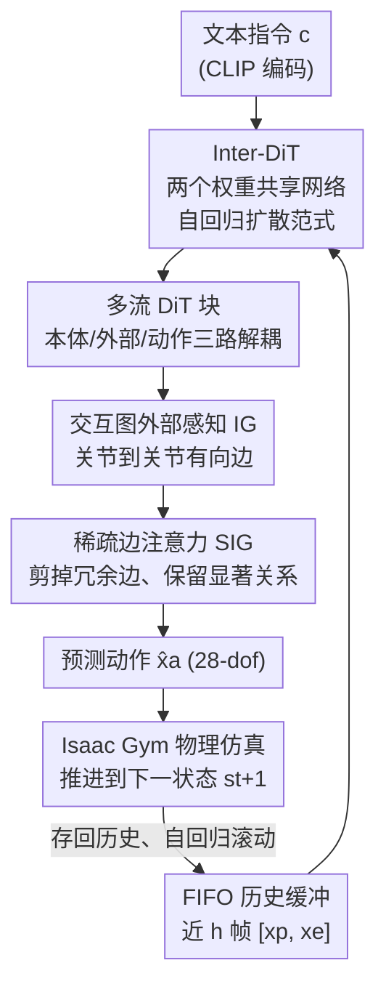

# InterAgent: Physics-based Multi-agent Command Execution via Diffusion on Interaction Graphs

**会议**: CVPR 2026  
**论文**: [CVF Open Access](https://openaccess.thecvf.com/content/CVPR2026/html/Li_InterAgent_Physics-based_Multi-agent_Command_Execution_via_Diffusion_on_Interaction_Graphs_CVPR_2026_paper.html)  
**代码**: 项目页 https://binlee26.github.io/InterAgent-Page （未明确开源代码）  
**领域**: 人体理解 / 物理仿真 / 扩散模型  
**关键词**: 多智能体交互、物理仿真人形控制、文本驱动动作生成、交互图、稀疏注意力

## 一句话总结
InterAgent 是第一个文本驱动、基于物理仿真的**双人形智能体**控制框架，用一个多流的自回归扩散 Transformer（Inter-DiT）把本体感知、外部感知、动作三路解耦建模，并用"交互图 + 稀疏边注意力"刻画关节到关节的细粒度交互关系，从而仅凭一句文本就能生成物理上合理、语义上忠实的双人互动行为。

## 研究背景与动机

**领域现状**：人形智能体动作生成有两条主线。一是**运动学方法**（kinematics-based），用扩散/自回归生成模型直接合成动作序列（如 InterGen、InterMask），语义对齐好但不进物理引擎；二是**物理仿真方法**（physics-based），用强化学习训练跟踪策略（PHC、PULSE）或端到端扩散策略（PDP、UniPhys、Diffuse-CLoC），动作受物理约束。

**现有痛点**：运动学方法忽略物理可行性，常出现肢体穿模、漂浮、脚底打滑等假象；"生成-跟踪"式物理方法（PhysDiff、CLoSD）则受困于运动学先验与物理跟踪之间的不一致，容易摔倒。更关键的是——**几乎所有物理仿真方法都只做单智能体**，把多智能体之间协作、社交这类丰富的交互动态留作空白。

**核心矛盾**：多智能体场景下，每个 agent 的动作不仅由自身动力学（本体感知 proprioception）决定，还被对方的状态与行为（外部感知 exteroception）影响。如果像单 agent 那样只建模自身，或把外部感知朴素地表示为"对方在我坐标系下的相对状态"，就会丢掉协调互动真正依赖的**关节到关节的细粒度空间依赖**（如握手主要靠手臂和手，下半身几乎不参与）。

**本文目标**：构造一个端到端、文本驱动、进物理引擎的双 agent 控制框架，让生成的互动既物理合理又语义忠实。

**切入角度**：把本体感知、外部感知、动作视为**异质的三种模态**分别建模以减少互相干扰；同时把外部感知显式建成"交互图"，并利用真实互动天然稀疏的特性做边剪枝。

**核心 idea**：用一个多流自回归扩散 Transformer 解耦三模态，配合"交互图外部感知 + 稀疏边注意力"显式且选择性地刻画 inter-agent 关系。

## 方法详解

### 整体框架
InterAgent 解决的是"给一句文本指令 → 让两个物理仿真人形完成协调互动"。整体走的是物理仿真领域常见的 **track-then-distill（先跟踪再蒸馏）** 范式：先在 Isaac Gym 里用强化学习训练跟踪策略去模仿 MoCap 参考动作（跟踪奖励中额外加了**交互图奖励**来显式约束两 agent 的空间关系），再用训好的专家策略 rollout 出"含噪状态 + 干净动作"的轨迹数据集（每条动作多次 rollout 取 8 条成功轨迹，噪声 $\sigma=0.01$）。真正的生成模型是 **Inter-DiT**——两个**权重共享、协同**的网络在自回归扩散范式下，输入近 $h$ 帧历史状态 $S=[x_p,x_e]_{n-h:n}$ 与文本条件 $c$，预测未来 $m$ 帧去噪后的行为序列 $\hat{X}^{(0)}=[x_p,x_e,x_a]$，把预测出的动作 $\hat{x}_a$ 送进 Isaac Gym 推进物理状态，再把新状态存进 FIFO 历史缓冲，自回归地滚动下去。

### 关键设计

**1. Inter-DiT：权重共享双网络的自回归扩散 Transformer**

针对"多 agent 场景每个 agent 的动作既受自身动力学又受对方影响"这一核心矛盾，Inter-DiT 借鉴 Diffuse-CLoC 与 UniPhys，在文本条件 $c$ 下建模状态与动作的**联合分布**，从而隐式学到一个动力学转移的世界模型，能连贯地预测未来 state-action 对。它借鉴 InterGen，用**两个协同、权重共享**的网络分别处理两个 agent，天然刻画双人交互的对称性。训练目标是去噪回归：

$$\mathcal{L} = \mathbb{E}_{t,X}\big[\,\lVert X - \Phi(X^{(t)}, t, c, S)\rVert\,\big]$$

其中 $t$ 为扩散时间步，$X^{(t)}$ 为加噪行为序列，$S$ 为历史状态。这样把"生成"和"物理执行"统一到一个端到端策略里，避开了生成-跟踪两阶段的先验/物理不一致问题。

**2. 多流 DiT 块：把本体感知/外部感知/动作当三种异质模态解耦**

针对"把状态和动作揉成一个表示会互相干扰"的痛点，Inter-DiT 不像 Diffuse-CLoC/UniPhys 那样把 state 和 action 合并，而是把**本体感知 $x_p$、外部感知 $x_e$、动作 $x_a$** 当作三种异质模态各走一条独立的流。每个多流块分两阶段注意力：① **inter-stream fusion attention**——三条流的特征投影到共享空间后沿序列维拼接做自注意力，再 split 回各自的投影层，让模态间交换信息又不至于互相污染；② **context-aware conditioning attention**——把三流输出作为 query，依次以"历史观测 $[x_{p},x_{e}]_{n-h:n}$"和"对方 agent 的隐特征"为 key/value 做注意力，注入时序和 inter-agent 上下文，最后每条流过一个 FFN MLP；文本 $c$ 与时间步 $t$ 通过 AdaLN 注入。这种"解耦但协同"的设计保留了每个模态的独特性，又能协调耦合。论文里用了 4 个多流块、隐维 768，每块含 1 个 inter-stream fusion attention + 5 个 context-aware conditioning attention。

**3. 交互图（IG）外部感知：显式刻画关节到关节的空间依赖**

朴素的外部感知表示是把对方的本体状态转到自己坐标系下（relative state, RS），但这会丢掉协调互动真正依赖的细粒度关节关系。受 Zhang et al. 启发，本文把外部感知建成一张**有向交互图**：对一个 agent 的每个关节位置 $p_j\in\mathbb{R}^3$，向对方所有关节 $p_i$ 连有向边，边向量 $e_{ij}=p_i-p_j\in\mathbb{R}^3$ 编码这对关节的空间互动。全连接版（FIG）写成 $x_e=(e_{1,1},\dots,e_{J,J})\in\mathbb{R}^{(J\ast J)\times 3}$，$J$ 为单个人形关节数（论文里每个人形 15 关节、28 自由度）。相比 RS，IG 把 inter-agent 关系显式、结构化地表达出来，更利于网络学习。

**4. 稀疏边注意力（SIG）：按真实互动的稀疏性剪掉冗余边**

全连接 IG 与真实互动"天然稀疏"的特性相矛盾——握手时主要是手臂和手在交互，下半身关节贡献极小。于是在外部感知流上加一个**稀疏注意力**：把 $l_e\ast J\ast J$ 条边均分给若干注意力头，用 Gumbel-Softmax 算注意力图 $A=\text{Gumbel-Softmax}(QK^{\top}/\sqrt{d_f})$（query 来自特征序列、key/value 来自 reshape 后的边），再用 top-$k$ 取二值掩码 $M$ 只保留得分最高的边：

$$M_{ij}=\begin{cases}1,& j\in\arg\text{TopK}_k(A_i)\\ 0,& \text{otherwise}\end{cases},\qquad f' = (M\circ A)V$$

$\circ$ 为 Hadamard 积。处理后的全连接 IG 记为 **Sparse IG（SIG）**。这样模型被强制聚焦最显著的关节级依赖（如手到手），抑制无关连接，提升交互的鲁棒性与合理性。消融显示 edge-based（针对单条关节-关节边）、保留比例 1/2 时效果最好。

### 损失函数 / 训练策略
训练分两块：① RL 跟踪策略用类似 PHC 的课程学习（由易到难），跟踪奖励叠加交互图奖励；② Inter-DiT 用上面的去噪回归损失 $\mathcal{L}$ 端到端训练。文本编码器用冻结的 CLIP-ViT-L/14，采用 classifier-free guidance（训练时 10% CLIP 嵌入置零，采样时 guidance scale 3.5）。预测 horizon $m=4$、历史缓冲 $h=364$（把前 360 帧均匀下采样到 12 帧 + 最近 4 帧）。用 AdamW、cosine 学习率（峰值 $1\times10^{-4}$、5K warm-up），batch 256，在 8 张 RTX 4090 上训 80K 步约 12 小时。

## 实验关键数据

### 主实验
在 InterHuman（带细粒度文本标注的双人 MoCap 数据集）上，按 text-to-motion 通用协议用五个指标评测：R-Precision（文本-动作检索一致性，越高越好）、FID（生成与真实分布距离，越低越好）、MMDist（文本-动作潜空间对齐，越低越好）、Diversity（越接近真实越好）、MModality（同一文本下变化度，越大越好）。Phys-GT 为物理仿真过的真实动作上界。

| 方法 | R-prec Top-3 ↑ | FID ↓ | MMDist ↓ | MModality ↑ |
|------|----------------|-------|----------|-------------|
| Phys-GT（上界） | 0.722 | 0.004 | 3.401 | - |
| InterGen++ [生成+跟踪] | 0.542 | 0.943 | 3.751 | 2.482 |
| InterMask++ [生成+跟踪] | 0.339 | 2.143 | 4.027 | 1.939 |
| PDP（扩展双人） | 0.375 | 1.268 | 3.927 | 2.402 |
| CLoSD（扩展双人） | 0.470 | 1.132 | 3.827 | 1.474 |
| **InterAgent（本文）** | **0.615** | **0.582** | **3.585** | 1.903 |

InterAgent 在 R-Precision、FID、MMDist 上全面领先所有 baseline，文本-动作对齐和整体真实度最好；Diversity/MModality 略逊于运动学的 InterGen，但其余指标稳定胜出。定性上，生成-跟踪类（InterGen++/InterMask++）常无法完成完整动作或不稳定，CLoSD/PDP 的自回归扩展容易丢失细粒度互动细节，而 InterAgent 能产出"紧贴的拥抱""精准打向腹部的出拳"等物理连贯、语义忠实的双人动作。

### 消融实验
外部感知表示 + 多流数量（Table 2，指标 R-prec Top-3 / FID）：

| 外部感知 | DiT 流数 | R-prec Top-3 ↑ | FID ↓ | 说明 |
|----------|----------|----------------|-------|------|
| RS | 3 | 0.588 | 0.676 | 相对状态外部感知 |
| FIG | 1 | 0.523 | 0.828 | 全连接图 + 单流 |
| FIG | 2 | 0.608 | 0.662 | 双流 |
| FIG | 3 | 0.612 | 0.634 | 三流 |
| **SIG（本文）** | 3 | **0.615** | **0.582** | 稀疏图 + 三流 |

IG 注意力方式与稀疏比例（Table 3）：edge-based + 比例 1/2 取得最佳（R-prec 0.615 / FID 0.582）；比例过大（3/4）或过小（1/8）都退化，joint-based 整体略逊于 edge-based。

### 关键发现
- **交互图 > 相对状态**：FIG/SIG 在 FID 和 R-precision 上均超过 RS，说明把外部感知建成图能给出更结构化、更有信息量的 inter-agent 表示。
- **稀疏性确实有用**：SIG 比 FIG 进一步降 FID、升 R-prec，证明稀疏注意力有效利用了交互图天然的稀疏结构；剪枝比例存在甜点（1/2），过度剪枝反而损失关键关系线索。
- **三流解耦优于单流/双流**：三流 Inter-DiT 在所有指标上稳定胜过把三模态揉一起的单流和"状态/动作两分"的双流变体。
- **零训练反应式控制**：推理时引入 inpainting 机制，固定一个 agent 的行为（用 replay 覆盖其预测的本体感知），就能让另一个 agent 生成对应的反应式行为，无需重训。

## 亮点与洞察
- **把"交互"显式建成图**：用关节到关节的有向边向量刻画双人空间关系，比"对方相对状态"更细粒度，是把图结构先验注入物理动作生成的巧思——这套表示可迁移到人-物交互、群体协作等场景。
- **稀疏性来自对真实互动的观察**：握手只用手、出拳只用拳——作者据此设计 top-$k$ 边剪枝，让模型把注意力压在显著关节上，既降冗余又提鲁棒，是"领域先验→网络结构"的好例子。
- **多流解耦缓解跨模态干扰**：把本体/外部/动作当三种异质模态分流，再用两段注意力（流间融合 + 上下文条件）协调，既保模态独特性又能耦合，思路可借给其他多模态扩散策略。
- **第一个文本驱动物理双人控制框架**：把单 agent 的 track-then-distill 范式成功扩展到双 agent，填补了物理仿真多智能体交互的空白。

## 局限与展望
- **只做两个 agent**：框架和实验都聚焦双人交互，三人及以上群体场景（边数随 agent 数平方膨胀，稀疏注意力的可扩展性、计算开销）未验证。
- **依赖 MoCap 与跟踪策略**：track-then-distill 需要先有可靠的 RL 跟踪专家和 MoCap 参考，超出 InterHuman 覆盖范围的新颖互动是否还能学好存疑。
- **Diversity/MModality 偏弱**：相比运动学 InterGen，物理约束下生成的多样性略降，可能是物理可行性与多样性之间的 trade-off。⚠️ 论文未深入分析该权衡来源。
- **改进方向**：把交互图扩展为多 agent 超图、引入层次化稀疏（先选 agent 对再选关节对）、或把反应式 inpainting 升级为在线实时交互，都是自然的下一步。

## 相关工作与启发
- **vs InterGen / InterMask（运动学生成）**：它们做文本到双人动作的运动学生成，语义对齐好但不进物理引擎，会穿模/漂浮；InterAgent 在物理仿真里端到端生成，物理合理且仍保持语义忠实，代价是多样性略降。
- **vs PhysDiff / CLoSD（生成-跟踪两阶段）**：它们先生成运动学动作再用跟踪策略投影到物理轨迹，受运动学先验与物理跟踪不一致之苦、易摔倒；InterAgent 用端到端扩散策略统一生成与执行，且专攻多 agent。
- **vs PDP / UniPhys / Diffuse-CLoC（单 agent 端到端扩散策略）**：它们是单智能体端到端扩散策略；InterAgent 在其基础上加权重共享双网络、多流解耦、交互图与稀疏注意力，把范式推广到双 agent 交互。

## 评分
- 新颖性: ⭐⭐⭐⭐⭐ 首个文本驱动物理仿真双人形控制框架，交互图 + 稀疏边注意力的组合有原创性。
- 实验充分度: ⭐⭐⭐⭐ 主结果 + 多组消融（外部感知/流数/稀疏比例）扎实，但仅单数据集、仅双 agent。
- 写作质量: ⭐⭐⭐⭐ 动机与方法链条清晰，公式与图配合好；个别记号（历史缓冲 $h=364$ 与"近 h 帧"的关系）需对照原文。
- 价值: ⭐⭐⭐⭐ 为物理仿真多智能体交互打开口子，对游戏/VR/具身仿真有实用潜力。

<!-- RELATED:START -->

## 相关论文

- [\[CVPR 2026\] AssistMimic: Physics-Grounded Humanoid Assistance via Multi-Agent RL](assistmimic_physics_grounded_humanoid_assistance.md)
- [\[CVPR 2026\] SyncMos: Scalable Motion Synchronisation for Multi-Agent Scene Interaction](syncmos_scalable_motion_synchronisation_for_multi-agent_scene_interaction.md)
- [\[CVPR 2026\] PAMotion: Physics-Aware Motion Generation for Full-Body Interaction with Multiple Objects](pamotion_physics-aware_motion_generation_for_full-body_interaction_with_multiple.md)
- [\[CVPR 2026\] DyaDiT: A Multi-Modal Diffusion Transformer for Socially Favorable Dyadic Gesture Generation](dyadit_a_multi-modal_diffusion_transformer_for_socially_favorable_dyadic_gesture.md)
- [\[CVPR 2026\] HSI-GPT2: A Dual-Granularity Large Motion Reasoning Model with Diffusion Refinement for Human-Scene Interaction](hsi-gpt2_a_dual-granularity_large_motion_reasoning_model_with_diffusion_refineme.md)

<!-- RELATED:END -->
