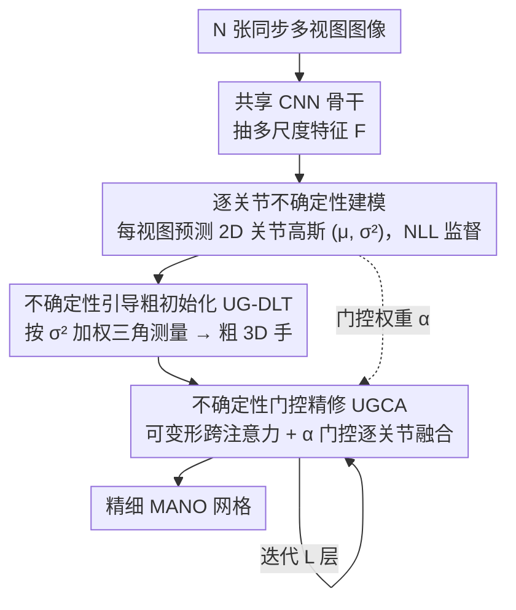

# JUMP-Hand: Learning Joint-wise Uncertainty to Gate Mixture of View Experts for Multi-View 3D Hand Reconstruction

**会议**: CVPR 2026  
**论文**: [CVF Open Access](https://openaccess.thecvf.com/content/CVPR2026/html/Kuang_JUMP-Hand_Learning_Joint-wise_Uncertainty_to_Gate_Mixture_of_View_Experts_CVPR_2026_paper.html)  
**代码**: https://github.com/HaohongKuang/JUMP-Hand  
**领域**: 人体理解（多视图 3D 手部重建）  
**关键词**: 多视图手部重建, 不确定性建模, 专家混合 MoE, 视图门控, 三角测量  

## 一句话总结
JUMP-Hand 把多视图 3D 手部重建重新表述成"每个视图是一个专家"的 MoE 问题，用**逐关节、逐视图的概率不确定性**当显式门控信号——既驱动粗阶段的不确定性加权三角测量，又驱动精修阶段的不确定性门控跨注意力，从而在严重遮挡下自适应地放大可靠视图、压制噪声视图，在三个多视图基准上取得 SOTA。

## 研究背景与动机
**领域现状**：单目 3D 手部重建受深度歧义和遮挡困扰，是病态问题。多视图范式借助跨视图几何更稳定，近期 SOTA（POEM、MLPHand）用 Transformer / GCN 等先进融合策略整合多视图特征。

**现有痛点**：这些方法倾向于**无差别地聚合所有视图**——要么靠隐式黑盒 attention、要么简单池化，把所有视图同等对待。但作者点出一个核心事实：观测可靠性是**逐关节且依赖视图**的。比如大拇指尖在某个视角清晰可见、在另一视角被完全遮挡。无差别融合会把低可靠度的噪声信息混进来，污染融合、拉低性能。

**核心矛盾**：每个相机只看到 3D 手的一个 2D 投影，提供的是**局部但互补**的几何线索；单个视图可能遭遇遮挡/模糊，但多个视图合理组合就能完整重建。难点在于——如何**按每个关节**聚合这些"专家意见"，让可靠视图主导、不可靠视图被抑制？

**本文目标**：找到一个既能量化"每个视图对每个关节有多可靠"、又物理可解释、还能贯穿整个重建流程的门控信号。

**切入角度**：作者借鉴 Mixture-of-Experts（MoE）范式，但做了两处改造——把**每个相机视图当成一个独立专家**（而非传统 MoE 里的不同 FFN 网络），并用**概率化的逐关节不确定性**当门控信号（而非黑盒可学习路由网络）。预测不确定性是天然可学的置信指标：低不确定性对应清晰观测的高质量检测，高不确定性来自遮挡、运动模糊等劣质条件。

**核心 idea**：用逐关节不确定性当显式、物理可解释的门控信号，在"粗三角测量初始化 + 精修融合"的 coarse-to-fine 流程里贯穿始终地路由专家贡献。

## 方法详解

### 整体框架
给定 $N$ 张同步多视图图像 $I=\{I_i\}_{i=1}^N$，模型输出 MANO 格式的 3D 手关节 $J^{3D}\in\mathbb R^{21\times3}$ 与网格顶点 $V^{3D}\in\mathbb R^{778\times3}$。每张视图先经共享 CNN 骨干（ResNet-34）抽多尺度特征。整个流程是一个 coarse-to-fine 的 MoE：① **逐关节不确定性建模**——每个视图独立预测 2D 关节位置及其高斯不确定性，转成显式门控信号；② **不确定性引导的粗初始化（UG-DLT）**——用门控权重做加权三角测量，得到鲁棒的粗 3D 手；③ **不确定性门控的精修（UGCA）**——用不确定性门控的可变形跨注意力，逐关节自适应融合多视图特征，迭代精修出细节网格。不确定性这一个信号同时贯穿粗、精两阶段，保证架构一致性。

### 关键设计

**1. 逐关节不确定性建模：把"每个视图对每个关节有多可靠"变成可学的高斯方差**

针对的痛点是现有方法无差别融合、看不到视图可靠性。对第 $n$ 个视图的第 $j$ 个关节，把它的 2D 观测建模成高斯变量 $p_{j,n}^{2D}\sim\mathcal N(\mu_{j,n},\Sigma_{j,n})$，其中 $\mu_{j,n}$ 是预测的 2D 均值位置，$\Sigma_{j,n}=\mathrm{diag}((\sigma^x_{j,n})^2,(\sigma^y_{j,n})^2)$ 是对角协方差，沿 x/y 两轴独立。低方差=该视图里关节清晰可见，高方差=遮挡/模糊/成像差导致的歧义。具体由一个不确定性估计分支输出：FPN 抽多尺度信息，热图头 $\mathcal H$ 预测均值、方差头 $\mathcal V$ 直接预测方差，$\mu_{j,n}=\mathcal H(\mathrm{FPN}(F_n))$、$\Sigma_{j,n}=\mathcal V(\mathrm{FPN}(F_n))$；方差头用 Softplus 保证为正，标量不确定性 $\sigma^2_{j,n}$ 取 x/y 方向平均。训练用高斯负对数似然（NLL）损失，用真值 2D 关节当观测、最小化其在预测高斯下的 NLL，既学准均值又学好校准的方差。学到的 $\sigma^2_{j,n}$ 一身二用：既给出可解释置信度，又当后续两阶段的软门控信号，把 2D 观测空间和 3D 重建空间连起来。

**2. UG-DLT 不确定性引导三角测量：让粗初始化天生抗遮挡**

针对的痛点是经典 DLT 三角测量给所有视图统一置信度，易被遮挡/低可靠视图污染。JUMP-Hand 从概率视角重构三角测量，把 $\sigma^2_{j,n}$ 当门控来控制每个视图对 3D 点的贡献。先把方差转成归一化权重——高不确定性视图拿到低权重：

$$\alpha_{j,n}=\frac{\exp(-\sigma^2_{j,n})}{\sum_{m=1}^{N}\exp(-\sigma^2_{j,m})},\quad j=1,\dots,21.$$

标准 DLT 解 $A_j J^{3D}_j=0$；JUMP-Hand 把 $\alpha_{j,n}$ 展开成权重向量 $w_j$，对约束矩阵 $A_j$ 做逐元素 Hadamard 乘 $(w_j\circ A_j)J^{3D,(0)}_j=0$，再用 SVD 以**可微**方式求解。这样按关节抑制不可靠视图的影响，得到对遮挡和噪声更鲁棒的粗 3D 关节 $\hat J^{3D,(0)}$，再用可学线性层上采样成粗网格 $\hat V^{3D,(0)}$。消融显示这一步是"主要瓶颈"——去掉粗阶段比去掉精修阶段掉点严重得多。

**3. UGCA 不确定性门控跨注意力：精修阶段逐关节融合多视图特征**

粗初始化只在关节层面、恢复不了表面细节，精修阶段要融合多尺度视觉特征。这里沿用"视图即专家"视角，用 $L$ 层迭代 Transformer 解码器，以粗 3D 关节/顶点当初始 3D query，每层含自注意力（建模关节-顶点结构依赖）、UGCA、FFN。UGCA 是核心：对每个 query 用相机参数投到全部 $N$ 个视图得参考点，在每个视图里用**多尺度可变形注意力**采样参考点周围的信息特征 $y_{j,n}=\sum_{s=1}^{S}\sum_{k=1}^{K}A_{nsk}\cdot\phi(F^s_n,p^{2D}_{j,n}+\Delta p_{nsk})$，可学偏移 $\Delta p_{nsk}$ 决定在每个视图里"去哪采"。然后复用粗阶段的 $\alpha_{j,n}$ 当门控决定"每个视图贡献多少"：$y_j=\sum_{n=1}^{N}\alpha_{j,n}\cdot y_{j,n}$。对顶点 query，则通过 MANO 蒙皮权重矩阵 $W\in\mathbb R^{778\times21}$ 把关节不确定性传播到顶点 $\sigma^2_{v,n}=\sum_{j=1}^{21}W_{v,j}\cdot\sigma^2_{j,n}$，让顶点继承其驱动关节的不确定性，关节和整网用统一门控策略。这套设计同一个不确定性信号贯穿粗（UG-DLT）和精（UGCA）两阶段，符合"每个专家贡献严格正比于其可靠度"的 MoE 哲学。

### 损失函数 / 训练策略
总损失含四项：① 概率 2D 关节监督用高斯 NLL $\mathcal L_{NLL}=\frac1N\sum_n\sum_j\big(\log\sigma_{j,n}+\frac{(\bar J^{2D}_{j,n}-\mu_{j,n})^2}{2\sigma^2_{j,n}}\big)$，平衡"预测准"与"不过度自信"；② 3D 监督 $\mathcal L_{3D}$ 对关节/顶点做 $\ell_1$；③ 2D 重投影一致性 $\mathcal L_{2D}$ 把 3D 预测投回各视图；④ 粗阶段中间监督 $\mathcal L_{DLT}$。总损 $\mathcal L=\lambda_1\mathcal L_{NLL}+\lambda_2\mathcal L_{3D}+\lambda_3\mathcal L_{2D}+\lambda_4\mathcal L_{DLT}$。图像 resize+center-crop 到 $256\times256$，ResNet-34 骨干，两张 RTX 3090 训 100 epoch，Adam，初始学习率 $1\times10^{-4}$，第 60 epoch 衰减 10 倍。

## 实验关键数据

### 指标说明
- **MPVPE / MPJPE（mm）**：平均顶点/关节欧氏误差，越低越好。
- **RR**（root-relative，归一到腕关节，评相对结构）、**PA**（Procrustes-aligned，刚性对齐后评形状精度）。
- **AUC**：PCK 曲线下面积，越高越好。

### 主实验：三基准 SOTA 对比
| 数据集 | 方法 | MPVPE↓ | PA-V↓ | MPJPE↓ | AUC-J↑ |
|--------|------|------|------|------|------|
| HO3D-MV | POEM | 17.20 | 9.97 | 17.28 | 0.63 |
| HO3D-MV | MLPHand | 18.69 | 10.54 | 18.70 | — |
| HO3D-MV | **Ours** | **13.39** | **8.78** | **13.10** | **0.72** |
| DexYCB-MV | POEM | 6.13 | 4.00 | 6.06 | 0.68 |
| DexYCB-MV | **Ours** | **5.45** | **3.77** | **5.31** | **0.72** |
| OakInk-MV | POEM | 6.20 | 4.21 | 6.01 | 0.69 |
| OakInk-MV | **Ours** | **5.94** | **4.13** | **5.72** | **0.71** |

在遮挡最严重的 HO3D-MV 上，MPVPE 相对 POEM（17.20）提升 22.2%、相对 MLPHand（18.69）提升 28.4%；DexYCB-MV / OakInk-MV 上也分别比 POEM 提升 11.1% / 4.2%，AUC 全面领先。

### 困难子集（取各数据集 POEM 2D 误差最大的 10%）
| 子集 | 方法 | MPVPE↓ | AUC-V↑ |
|------|------|------|------|
| HO3D | POEM | 35.52 | 0.04 |
| HO3D | **Ours** | **24.91** (↓10.61) | **0.13** |
| DexYCB | POEM | 13.88 | 0.38 |
| DexYCB | **Ours** | **10.37** | **0.52** |
| OakInk | POEM | 13.85 | 0.42 |
| OakInk | **Ours** | **11.75** | **0.50** |

HO3D 困难子集上 29.9% MPVPE 提升、AUC-V 从 0.04 升到 0.13——验证不确定性建模在严重质量退化下的鲁棒性。

### 消融一：门控信号 + 重建阶段（HO3D-MV，MPJPE/mm）
| ID | 门控 | 粗 C | 精 R | MPJPE↓ |
|----|------|------|------|------|
| (a) | 平均门控 | ✔ | ✔ | 16.31 |
| (b) | 可学门控 | ✔ | ✔ | 15.54 |
| (c) | **不确定性门控（完整）** | ✔ | ✔ | **13.10** |
| (d) | 不确定性门控 | ✔ | ✗ | 16.61 |
| (e) | 不确定性门控 | ✗ | ✔ | 21.55 |

不确定性门控比平均/可学门控分别好 3.21 / 2.44 mm；去掉精修(d) 升到 16.61（+3.51），去掉粗阶段(e) 暴增到 21.55（+8.45）——**鲁棒的几何初始化比后续精修更关键**，初始化坏了误差会一路传播。

### 消融二：硬门控 vs 软门控
| 数据集 | Top-2 硬 | Top-3 硬 | Soft（本文）|
|--------|------|------|------|
| HO3D-MV | 18.16 | 15.47 | **13.10** |
| DexYCB-MV | 6.23 | 5.70(Top-4) | **5.31** |
| OakInk-MV | 6.21 | 5.88 | **5.72** |

硬门控随 $k$ 增大稳步变好，但最优硬门控仍显著差于软门控（HO3D 上差 5.06 mm）——彻底丢弃低可靠视图会不可逆地抹掉有用上下文线索。有趣的是 POEM 的隐式 attention（HO3D 17.28）落在 Top-2 和 Top-3 之间、仍比软门控差 4.18 mm。

### 关键发现
- **场景越难、显式不确定性门控增益越大**：HO3D（遮挡最重）软门控比 POEM 提升 24.2%，DexYCB 12.4%、OakInk 4.8%——遮挡严重时隐式 attention 难以识别并压制不可靠观测。
- **粗初始化是主要瓶颈**：去粗阶段比去精修阶段多掉 4.94 mm。
- **软门控优于硬门控**：按比例降权而非硬丢弃，保住所有部分观测里的互补几何信息。

## 亮点与洞察
- **"视图即专家 + 不确定性即门控"两处改造 MoE**：把每个相机视图当独立专家、用物理可解释的概率方差当门控信号，替掉黑盒路由网络，对每个关节自适应路由，思路干净且可解释。
- **一个不确定性信号贯穿粗+精两阶段**：UG-DLT 加权三角测量和 UGCA 门控融合复用同一组 $\alpha_{j,n}$，架构一致性强，避免两阶段各搞一套门控。
- **顶点门控靠 MANO 蒙皮权重传播**：把关节不确定性按运动学影响传到 778 个顶点，巧妙地让关节和整网共用统一门控，可迁移到任何带 LBS 蒙皮的关节体重建。
- **可微 UG-DLT**：把经典 DLT 的加权约束 + SVD 做成可微，端到端训练里几何初始化与深度特征一起学。

## 局限与展望
- 作者承认：基于**高斯的单峰不确定性建模**虽高效，但无法刻画严重遮挡下复杂的**多峰歧义**（一个关节可能有多个合理位置）。
- 依赖标定好的同步多视图相机与已知相机参数（UGCA 要靠相机投影找参考点），对位姿误差的鲁棒性未深入分析。
- 视图被当成独立专家，未显式建模视图间的相关性/冗余（如两个几乎同向的相机）。
- 评测集中在 hand-object 交互三基准，对极端视角稀疏（如仅 2 视图）或更大规模相机阵列的可扩展性可进一步验证。

## 相关工作与启发
- **vs POEM**：POEM 用 cross-set point attention 隐式黑盒融合、对所有视图一视同仁；JUMP-Hand 用显式逐关节不确定性门控，遮挡越重优势越大（HO3D 上 13.10 vs 17.28）。
- **vs MLPHand**：MLPHand 走 MLP 几何融合，同样未显式建模观测可靠性；本文在三基准全面领先。
- **vs MVP / 传统三角测量（DLT）**：经典 DLT 给所有视图统一置信度，易被噪声视图带偏；UG-DLT 按不确定性加权且可微。
- **vs UPose3D（多视图不确定性）**：它把不确定性当 MLE 优化输入、被动地当后验置信度用；JUMP-Hand 把不确定性当**主动的显式路由信号**贯穿融合全程，是首个这么用的方法。

## 评分
- 新颖性: ⭐⭐⭐⭐⭐ 首个把概率逐关节不确定性当显式门控贯穿多视图手部重建，"视图即专家"的 MoE 重述很到位
- 实验充分度: ⭐⭐⭐⭐⭐ 三基准 + 困难子集 + 门控/阶段/软硬门控多组消融，证据链完整
- 写作质量: ⭐⭐⭐⭐ 动机-方法-实验逻辑清晰、公式与图示到位；OCR 缓存里部分公式排版凌乱但原意可还原
- 价值: ⭐⭐⭐⭐ 对 AR/VR、手物交互、机器人抓取等强遮挡场景的可靠手部重建有直接价值，门控思路可迁移到其他多视图任务

<!-- RELATED:START -->

## 相关论文

- [\[CVPR 2026\] A2P: From 2D Alignment to 3D Plausibility for Occlusion-Robust Two-Hand Reconstruction](from_2d_alignment_to_3d_plausibility_unifying_hete.md)
- [\[CVPR 2026\] Beyond Single-View Sufficiency: CVBench for Cross-View Human Understanding](beyond_single-view_sufficiency_cvbench_for_cross-view_human_understanding.md)
- [\[CVPR 2026\] OpenFS: Multi-Hand-Capable Fingerspelling Recognition with Implicit Signing-Hand Detection and Frame-Wise Letter-Conditioned Synthesis](openfs_multi-hand-capable_fingerspelling_recognition_with_implicit_signing-hand_.md)
- [\[CVPR 2026\] Mocap-2-to-3: Multi-view Lifting for Monocular Motion Recovery with 2D Pretraining](mocap-2-to-3_multi-view_lifting_for_monocular_motion_recovery_with_2d_pretrainin.md)
- [\[ECCV 2024\] UPose3D: Uncertainty-Aware 3D Human Pose Estimation with Cross-View and Temporal Cues](../../ECCV2024/human_understanding/upose3d_uncertainty-aware_3d_human_pose_estimation_with_cross-view_and_temporal_.md)

<!-- RELATED:END -->
