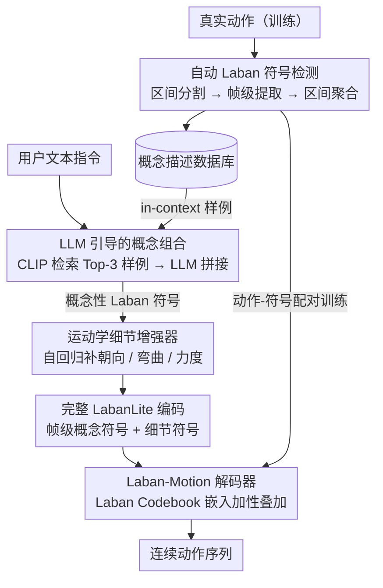

<!-- 由 src/gen_stubs.py 自动生成 -->
# LaMoGen: Language to Motion Generation Through LLM-Guided Symbolic Inference

**会议**: CVPR 2026  
**arXiv**: [2603.11605](https://arxiv.org/abs/2603.11605)  
**代码**: 有 ([项目页](https://jjkislele.github.io/LaMoGen/))  
**领域**: 人体理解  
**关键词**: 文本驱动动作生成, Labanotation, 符号推理, LLM Agent, 可解释动作合成

## 一句话总结

提出 LabanLite 符号动作表示和 LaMoGen 框架，首次让 LLM 通过可解释的 Laban 符号推理自主组合动作序列，在时序精度和可控性上超越传统文本-动作联合嵌入方法。

## 研究背景与动机

**领域现状**：文本驱动人体动作生成（Text-to-Motion）近年取得显著进展，主流方法依赖文本-动作联合嵌入空间（joint embedding），通过扩散模型或自回归 Transformer 生成动作序列。代表工作包括 MDM、ReMoDiff、MoDiff、CoMo、MotionGPT 等。

**现有痛点**：基于联合嵌入的方法在处理**时序精确性**和**细粒度语义**时表现不佳。例如指令 "Walk forward in 5 steps and then walk backward in 3 steps"，现有方法往往生成笼统的"步行前进"动作，无法准确反映步数和动作先后顺序。此外，这些方法缺乏**可解释性**——生成结果是黑盒输出，用户无法理解或编辑中间过程。

**核心矛盾**：语言描述的高层语义结构性（含明确的身体部位、方向、时序、次数）与动作嵌入空间的连续性、不可解释性之间的鸿沟。已有尝试将文本分解为身体部位级 token（如 CoMo 的 Posescript），但这些表示仅编码静态姿态，缺乏对动作过渡过程和时序的表达能力。

**本文目标**：如何建立一个可解释、可编辑的中间符号表示，使得 LLM 能通过符号推理自主组合动作序列，同时保证生成动作在时序、身体部位协调性和语言对齐上的精确性。

**切入角度**：从舞蹈记谱法 Labanotation 体系获得启发——该系统以符号方式编码身体部位、方向、层级、持续时间等运动属性，天然具备可解释性和结构化特征。作者据此设计 LabanLite 作为连接语言与动作的"符号桥梁"。

**核心 idea**：将复杂动作分解为 Laban 符号序列，让 LLM 在符号空间中推理和组合动作计划，再由解码器将符号还原为连续动作轨迹。

## 方法详解

### 整体框架

LaMoGen 想解决的核心问题是：让 LLM 不靠微调、不碰连续动作嵌入，就能"读懂"并组合人体动作。它的做法是在语言和动作之间插一层可解释的符号——LabanLite，把生成拆成 **Text → LabanLite → Motion** 两阶段。第一阶段是高层语义规划：LLM 借助检索到的相似动作样例，把用户的文本指令翻译成一串概念性的 Laban 符号（"哪个身体部位、朝什么方向、用几秒"）。第二阶段是底层运动合成：一个运动学细节增强器（Kinematic Detail Augmentor）把这串只含主干结构的概念符号自回归地补全成完整的 LabanLite 编码（加上朝向、弯曲、力度等细节），最后由 Laban-Motion 解码器（Laban-Motion Decoder）还原成连续动作轨迹。

支撑这条流水线的是两套部件：一套 **Laban-Motion 编码-解码器（Laban-Motion Encoder-Decoder）** 负责动作↔符号的双向转换（训练时也靠它从真实动作里反推出符号标注），一套 **LLM 引导的生成模块** 负责符号的检索、组合与细节补全。

### 关键设计

**1. LabanLite：把舞谱符号改造成 LLM 读得懂的帧级表示**

痛点在于，原版 Labanotation 是给人看的事件级舞谱，既不规整也不好喂给模型；而 CoMo 那类 pose code 又只编码静态姿态，丢了动作的过渡和时序。LabanLite 对它做了三项改造。其一是把符号分成两层——**概念性符号**只管主干运动结构（方向、层级变化），**细节符号**管精细属性（弯曲角度之类），这样 LLM 只需面对与自然语言高度对齐的概念层，繁琐细节交给后面的 Augmentor。其二是把事件级标注改成**帧级标注**，每帧对应一个 Laban 实例，天然适配自回归的 ML 模型。其三是给每个概念符号配一段固定格式的**概念描述**，形如 `<body-part group> <moving semantic> in <time> seconds`，让符号和文本之间能无歧义地互译。

**2. Laban Codebook：用加性组合而非单选 token 来逼近连续动作**

动作是连续的，符号是离散的，怎么用离散符号拼出连续变化？LaMoGen 把所有出现过的帧级 Laban 实例各分配一个 Laban code，汇成一个 Codebook $C=\{c_n\}_{n=1}^{N}$。编码某一帧时，用一个二元指示向量 $v_t$ 标出这帧激活了哪些条目，再把这些条目的嵌入直接相加得到该帧的 latent：

$$z_t=\sum_{n} v_t^n\, c_n$$

解码器是一个 Transformer，从 latent 序列重建出动作。关键区别在于这里和 VQ-VAE 的"每帧选一个最近 token"不同——它允许**同时激活多个条目再线性叠加**，于是能从一小撮简单符号的组合里近似出复杂、连续的运动，而不会被单一码字的离散边界卡住。

**3. 自动 Laban 符号检测：按专业舞谱阈值把动作反标成符号**

要训练编解码器和搭 benchmark，得先有大量"动作 + 对应符号"的配对，纯靠人标不现实。作者设计了一条三步流水线自动从连续动作里抽符号：先做**动态区间分割**，把每帧判为运动或静止，按原子动作切段；再做**帧级符号提取**，用末端执行器相对骨盆的 3D 位移算出方向和层级，用欧拉角算朝向和弯曲，用骨盆速度量化运动力度；最后做**区间级聚合**，给每段时间分配一组有代表性的符号。之所以可信，是因为每一步的离散化阈值都直接沿用 Labanotation 文献里被专业人士认可的标准，而不是随手拍的分界。

**4. LLM 引导的概念组合：靠 RAG 让 LLM 零微调地用 Laban 符号"造句"**

LLM 没见过 Laban 符号体系，直接问它必然乱答。LaMoGen 不去微调模型，而是维护一个**概念描述数据库**，存的是 motion caption → conceptual description 的键值对。推理时先用 CLIP 算用户文本和库里 caption 的语义相似度，检索出 Top-K 条最像的样例当 in-context examples 塞给 LLM；LLM 照着这些范例,推断用户指令对应什么样的符号动作模式，再编辑、拼接出新的概念描述。因为概念描述是固定格式，LLM 的输出能被无歧义地映射回 Laban 符号——这也是为什么不微调也能用的关键。

**5. 运动学细节增强器：补回 LLM 缺失的时序细节**

LLM 擅长规划主干，但对"每一帧朝向偏多少、弯多少、用多大力"这种时序细节力不从心，而这些恰恰是细节符号的内容。Augmentor 专门补这一层：它以文本 $m$ 和已掩码的概念向量 $\hat{v}_{1:t-1}$ 为条件，自回归地预测每帧完整的二元指示向量 $v_t$，把 codebook 里相应的概念和细节条目都激活。训练时对概念向量做随机掩码（实验中 masking ratio = 0.3 最优），逼模型别过度依赖现成的概念线索、自己学会推断细节。经它补全，符号序列的信息量约增加 60%。

### 一个完整示例：生成 "Walk forward in 5 steps and then walk backward in 3 steps"

> ⚠️ 流程为结合方法描述的复盘示例，具体中间数值以原文为准。

这条指令正是传统联合嵌入方法会做砸的典型——它们往往只生成笼统的"向前走"，丢掉步数和先后顺序。看 LaMoGen 怎么逐级把它做对：

1. **检索（RAG）**：CLIP 把这句话和概念描述数据库里的 caption 比相似度，取回 Top-3 最像的样例（如"向前走若干步""转身往回走"对应的概念描述），作为 in-context examples。
2. **LLM 概念组合**：LLM 照着样例，把指令拆成两段概念性 Laban 符号——前一段是下肢"向前、低层、约 5 步时长"的概念描述，后一段是下肢"向后、约 3 步时长"的概念描述，并把先后顺序在时间轴上排好。
3. **细节增强**：Augmentor 接过这串只有主干的概念符号，自回归补出每帧的朝向、弯曲、力度等细节符号，得到完整的 LabanLite 编码。
4. **解码**：Laban-Motion Decoder 把 LabanLite 编码经 codebook 嵌入叠加成 latent 序列，重建出连续动作——前 5 步前进、后 3 步后退，步数和时序都对得上。

整条链路里，符号始终是人类可读、可审查的：如果 LLM 把步数排错，能在第 2 步的概念描述上直接看出来并改掉，而不是面对一团黑盒的连续嵌入。

### 损失函数 / 训练策略

- **Codebook 训练**：联合优化解码器参数 $\theta$ 和 codebook $C$，最小化重建损失 $\mathcal{L}_{rec} = \|X - \hat{X}\|_1 + \lambda\|\dot{X} - \dot{\hat{X}}\|_1$（姿态 L1 + 速度 L1）
- **Augmentor 训练**：二元交叉熵损失 $\mathcal{L}_{gen} = -\sum_{t,n}[v_t^n \log p_t^n + (1-v_t^n)\log(1-p_t^n)]$，预测每帧每个 codebook 条目的激活概率
- **End-of-sequence**：追加 `<EOS>` token，codebook 扩展为 $N+1$ 条目，标记动作终止

## 实验关键数据

### 主实验

**表1：Laban Benchmark 上的定量比较**（Labanotation-based 指标 + R@3 / FID）

| 方法 | avg.SMT↑ | avg.TMP↑ | avg.HMN↑ | R@3↑ | FID↓ |
|------|----------|----------|----------|------|------|
| MDM | 0.338 | 0.298 | 0.201 | 0.180 | 22.81 |
| ReMoDiff | 0.441 | 0.365 | 0.265 | 0.192 | 7.121 |
| MoDiff | 0.466 | 0.366 | 0.274 | 0.196 | 5.701 |
| CoMo | 0.393 | 0.239 | 0.251 | 0.176 | 21.94 |
| MotionGPT | 0.461 | 0.347 | 0.307 | 0.195 | 2.072 |
| **LaMoGen (GPT4.1)** | **0.534** | **0.502** | **0.393** | **0.208** | **1.861** |
| LaMoGen (Human) | 0.626 | 0.628 | 0.462 | 0.211 | 1.769 |

**表2：HumanML3D 标准 benchmark 上的比较**

| 方法 | R@1↑ | R@3↑ | FID↓ | MM-Dist↓ | Diversity→ |
|------|------|------|------|----------|-----------|
| Real data | 0.511 | 0.797 | 0.002 | 2.974 | 9.503 |
| ReMoDiff | 0.510 | 0.795 | **0.103** | **2.974** | 9.018 |
| CoMo | 0.502 | 0.790 | 0.262 | 3.032 | 9.936 |
| MotionGPT | 0.492 | 0.778 | 0.232 | 3.096 | 9.528 |
| **LaMoGen (GPT4.1)** | 0.491 | **0.796** | 0.252 | 3.087 | 9.124 |
| LaMoGen (Human) | **0.513** | **0.813** | 0.206 | 2.993 | 9.635 |

### 消融实验

**LLM 能力影响**：更强的 LLM 带来更好的生成质量。GPT-4.1 > DeepSeek-V3 > Qwen3 > GPT-4.1mini > None（无 LLM），体现在 Laban 指标和 FID 上的一致性提升。

**检索示例数量**：在 HumanML3D 上用 GPT-4.1 测试 Top-K 检索。K=1→3 性能持续提升（LLM 需要足够示例进行模仿）；K=5 或 7 无进一步提升（上下文窗口过长导致 LLM 遗忘关键线索）。默认使用 Top-3。

**掩码比例**：Augmentor 训练中对概念符号的随机掩码比例实验。0.3 为最优平衡点——过低则过度依赖概念线索（泛化差），过高则概念引导信号不足。

**Laban 符号检测精度**（Table 3）：

| 方法 | avg.SMT↑ | avg.TMP↑ | avg.HMN↑ |
|------|----------|----------|----------|
| Ikeuchi et al. | 0.751 | 0.632 | 0.611 |
| **Ours** | **0.871** | **0.852** | **0.786** |

### 关键发现

1. **符号推理显著优于联合嵌入**：在 Laban Benchmark 上，LaMoGen (GPT4.1) 的 SMT/TMP/HMN 指标全面超越所有基于联合嵌入的方法，证明符号推理在时序精度和身体部位协调性上的优势
2. **MotionGPT 在结构化指令理解上的意外表现**：虽然在传统 benchmark 上表现一般，但 MotionGPT 在 Laban Benchmark 上超过 CoMo，说明传统指标无法有效区分动作生成方法的真实能力
3. **FID 的局限性**：LaMoGen 的 FID 略逊于部分方法，原因是 LabanLite 的高层抽象对同一语义下的低层变化（如不同人举手速度差异）使用相同符号，这是符号表示固有的表达力限制
4. **Human composer 上限**：使用真实标注的概念符号（Human）比 LLM composer 效果更好，说明 LLM 符号组合能力仍有提升空间

## 亮点与洞察

- **首个 LLM 自主动作生成框架**：LaMoGen 是第一个让 LLM 无需微调、通过符号推理自主组合动作的框架，开辟了 Agent-based 动作生成的新范式
- **符号表示的双重优势**：LabanLite 既让 LLM 能"理解"动作（通过概念描述），又让人类专家能直接审查和编辑中间结果
- **评测贡献**：提出 SMT/TMP/HMN 三个 Laban 指标，填补了现有评测在时序精度和多部位协调性上的空白
- **层次化设计思想**：概念/细节分离 + LLM/Augmentor 分工的两阶段架构，是一种优雅的"各司其职"设计

## 局限与展望

1. **LabanLite 表达力上限**：符号的离散化不可避免地丢失低层运动细节，导致 FID 偏高。未来可考虑引入连续属性字段或残差补偿机制
2. **LLM 依赖**：框架性能受 LLM 能力制约（弱 LLM 符号组合质量明显下降），且推理需调用 API，增加延迟和成本
3. **数据集局限**：Laban Benchmark 以步行类动作为主，对更复杂的全身动作（如舞蹈、体操）的评估覆盖不足
4. **Laban 符号集固定**：为保持专业性限制在传统 Labanotation 符号集，可能限制了对新兴动作类型的描述能力
5. **检索依赖**：RAG 策略的效果取决于 Conceptual Description Database 的覆盖度，对于训练集未见过的动作模式可能表现受限

## 相关工作与启发

- **CoMo (ECCV 2024)**：用 Posescript 将动作分解为身体部位级 pose code，但仅编码静态姿态缺乏时序表达。LaMoGen 的 Laban 符号同时编码起始/结束姿态和过渡过程，语义更完整
- **MotionGPT (NeurIPS 2024)**：对 LLM 进行微调使其处理动作 token。LaMoGen 不需微调 LLM，而是通过 RAG 让 LLM 在符号空间工作
- **KP (Kinematic Phrase)**：启发式抽象动作信号，但限于低层信号。LabanLite 提供了专业级别的高层抽象
- **启发**：符号中间表示 + LLM 推理的范式可推广到其他跨模态生成任务（如音乐→舞蹈、文本→手语），关键在于找到目标模态的结构化符号体系

## 评分

⭐⭐⭐⭐ — 将 Labanotation 引入 LLM 动作生成是一个巧妙且有说服力的创新，符号推理路线为可解释可控动作生成开辟了新方向；Laban Benchmark 的评测贡献也很扎实。但 FID 偏高和 LLM 依赖是需要后续工作解决的实际瓶颈。

<!-- RELATED:START -->

## 相关论文

- [\[CVPR 2026\] MoLingo: Motion-Language Alignment for Text-to-Human Motion Generation](molingo_motion-language_alignment_for_text-to-motion_generation.md)
- [\[AAAI 2026\] SOSControl: Enhancing Human Motion Generation through Saliency-Aware Symbolic Orientation and Timing Control](../../AAAI2026/human_understanding/soscontrol_enhancing_human_motion_generation_through_saliency-aware_symbolic_ori.md)
- [\[CVPR 2026\] Active Inference for Micro-Gesture Recognition: EFE-Guided Temporal Sampling and Adaptive Learning](active_inference_for_micro-gesture_recognition_efe-guided_temporal_sampling_and_.md)
- [\[CVPR 2026\] Multi-level Causal LLM-based Text-to-Motion Generation with Human Alignment (MoTiGA)](multi-level_causal_llm-based_text-to-motion_generation_with_human_alignment.md)
- [\[ECCV 2024\] CoMo: Controllable Motion Generation Through Language Guided Pose Code Editing](../../ECCV2024/human_understanding/como_controllable_motion_generation_through_language_guided_pose_code_editing.md)

<!-- RELATED:END -->
