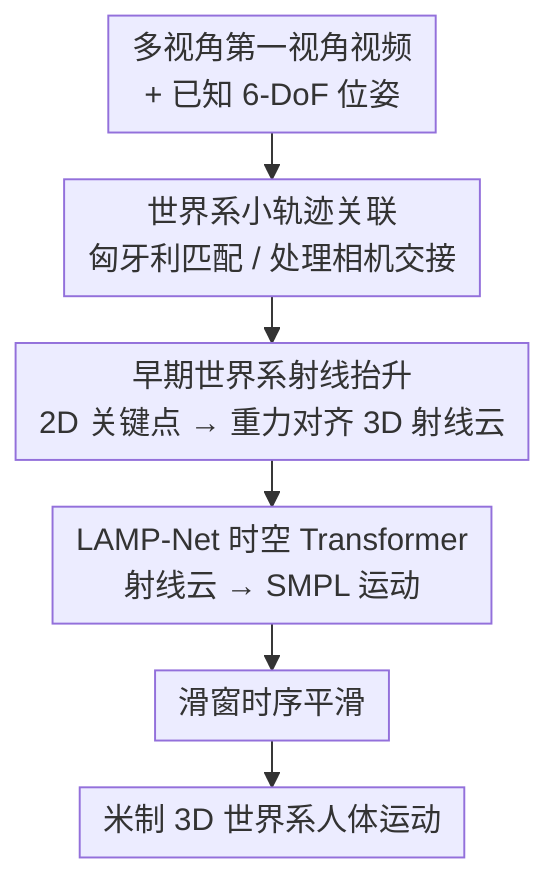

# LAMP: Localization Aware Multi-camera People Tracking in Metric 3D World

**会议**: CVPR 2026  
**arXiv**: [2605.05390](https://arxiv.org/abs/2605.05390)  
**代码**: https://facebookresearch.github.io/LAMP （项目页，承诺开源模型与代码）  
**领域**: 人体理解 / 3D 人体运动追踪 / 第一视角感知  
**关键词**: 多相机头显, 世界系运动追踪, 射线抬升, SMPL, 时空 Transformer

## 一句话总结
LAMP 用头显已知的 6-DoF 位姿，把各相机检测到的 2D 人体关键点早早抬升成统一世界系的 3D 射线云，再用时空 Transformer 直接把人体 SMPL 运动拟合到射线云上——这种"先抬升再拟合"把佩戴者头部运动和被观测者运动彻底解耦，在单目 benchmark 上达到 SOTA，在多相机第一视角场景下大幅甩开基线。

## 研究背景与动机

**领域现状**：从视频里追踪 3D 人体运动已经研究了几十年，主流是用 SMPL 参数化人体，靠单目图像回归或视频时序聚合（时序卷积 / RNN / Transformer）得到逐帧姿态。近年开始关注"世界系"恢复，如 WHAM 用陀螺仪、GVHMR 用重力对齐坐标、TRAM/WHAC/PromptHMR 把现成 SLAM + 单目深度拼起来换算到世界系。

**现有痛点**：这些方法几乎都为单目、未标定、相机静止或缓慢移动的场景设计。一旦搬到现代 AR/智能眼镜这种第一视角头显上就纷纷失效，原因有三：

1. 头显有剧烈的 6-DoF 自我运动（佩戴者频繁快速转头），绝大多数追踪算法假设相机静止或慢动；
2. 头显是多相机阵列，为覆盖超大视场每个相机朝向不同、只有部分立体重叠，一个人可能只被某一个相机部分看到，而且观测会随时在相机之间切换（camera hand-off），单目方法用后融合处理交接很不稳，还带着单目固有的尺度歧义；
3. 带 3D 标注的视频数据稀缺、采集成本极高，而头显每代都换相机配置，几乎不可能为某台设备攒够训练数据。

**核心矛盾**：现有方法试图"同时"估计观测者运动和目标运动——当观测者刻意跟拍目标（运动相关）时还能凑合，但第一视角下两者运动完全不相关、各自独立，这种纠缠让问题本质上更难，还把尺度歧义、部分观测、相机交接全压在一个模型里硬解。

**本文目标**：在剧烈头动 + 多相机 + 数据稀缺这三重约束下，把周围多个人的运动稳定地追踪到带米制尺度的 3D 世界系里。

**切入角度**：现代头显的设备自身定位（VIO/SLAM）已经是"基本解决"的问题，6-DoF 位姿和相机标定本就高精度可得——那为什么还要让网络去学相机运动？不如把这份已知信息当成输入，"早早"用它把自我运动剥离掉。

**核心 idea**：用一个"早期世界系射线抬升"范式——在做任何时空推理**之前**，先用已知 6-DoF 位姿把各相机的 2D 关键点反投影成世界系下的 3D 射线云，让后续网络只专注学"人是怎么动的"这一个先验。

## 方法详解

### 整体框架

LAMP 的输入是一段带已知 6-DoF 位姿 $\{\mathbf{T}_k^t \in \mathbb{SE}(3)\}$ 的多视角第一视角视频（$K$ 个相机、$T$ 个时刻），输出是每个被观测者每个时刻的 SMPL 参数化人体运动 $\mathcal{H}_i^t := \{\boldsymbol{\theta}_i^t, \boldsymbol{\beta}_i^t, \boldsymbol{\omega}_i^t, \boldsymbol{\tau}_i^t\}$（关节角、体型、根关节全局旋转与平移）。整条管线是清晰的串行 pipeline："检测关联 → 射线抬升 → 拟合 → 平滑"，核心是一个"lift-then-fit（先抬升再拟合）"的两步解耦。

第一步把所有相机所有时刻检测到的 2D 关键点，借已知位姿与标定反投影、变换到**统一的世界系**，形成一团时空 3D 射线云——这一步就完成了两个关键解耦：（1）头显 6-DoF 自我运动被剥离，网络不再需要学相机运动；（2）2D 检测与 3D 运动拟合分家，于是可以直接复用现成的 2D 检测器，也可以从任意纯运动数据**模拟**出训练样本。第二步用 LAMP-Net（时空 Transformer）把这团射线云直接拟合成世界系人体运动；它把"找出与给定时空射线云最一致的 3D 人体运动"当成一个逆问题来解，靠人体运动先验把异步、部分、跨相机的观测自然串成"3D 三角化"。

### 关键设计

**1. 早期世界系射线抬升：在时空推理之前就剥离头显自我运动**

这是全文的命脉，直击"观测者与目标运动纠缠"这个核心矛盾。对每个 2D 关键点 $\mathbf{p}_j^t$，先用标定的反投影函数 $\pi^{-1}$ 得到单位射线，再用已知相机位姿 $\mathbf{T}^t_{W\leftarrow C_k}$ 变换到世界系，最后归一化到由首帧相机定义、且经 VIO **重力对齐**的局部坐标系 $L_T$：

$${}^{c}\boldsymbol{\phi}_j^t := \mathbf{T}_{L_T \leftarrow W} \cdot \mathbf{T}^t_{W\leftarrow C_k} \cdot \pi^{-1}(\mathbf{p}_j^t)$$

每条射线连同变换后的相机中心 ${}^{o}\boldsymbol{\phi}^k_t$ 一起，参数化成 6 维 Plücker 射线再拼上 2D 检测器给的置信度，堆成张量 $\boldsymbol{\Phi} \in \mathbb{R}^{T\times K \times J \times 7}$（$J=17$ 个 MSCOCO 关键点，缺失观测置零）。为什么这样有效：因为 6-DoF 位姿是"已知且可信"的输入而不是要学的量，自我运动在进网络前就被减掉了，后续拟合可以心无旁骛地学"人怎么动"，估计出的运动也天然锚定在米制世界系里、不再有单目尺度歧义。这与 GloPro、PromptHMR 这类"先在相机系预测再变换到世界系"的后期合成（late composition）截然不同——LAMP 是 early-lifting，支持因果实时推理

**2. 世界系小轨迹时空关联：让相机交接变成无缝的同一条轨迹**

多相机阵列下，同一个人会在相机之间来回切换观测，单目方法靠后融合接力很容易跟丢。LAMP 把每条人体小轨迹（tracklet）维护在**世界系**里：每个时刻把已有轨迹的 3D 点投影回各相机图像得到预期观测位置，与当前 2D 框算匹配代价，用匈牙利算法解二分匹配；匹配不上就新建轨迹，长时间不被任何相机看到就停用。关键在于轨迹活在世界系，投影回图像这一步**自动补偿了头显运动**——于是"哪个相机看到"不再重要，跨相机交接退化成同一条世界系轨迹上的连续观测，部分观测和换相机都被自然吸收

**3. LAMP-Net 时空 Transformer：多层级 cross-attention 把几何与运动逐层聚合**

把射线云拟合成 SMPL 运动这个映射由 LAMP-Net 实现，它是一个时空 Transformer：编码器在**空间（按关节）**和**时间（按帧）**两个维度做自注意力，联合估计体型与运动动态；可学习的 read-out embedding 加上时间编码作为 query，进入 cross-attention 解码器回归每帧 SMPL 参数（旋转用 6D 表示）。与以往读出只和最后一层编码器交互不同，LAMP-Net 的解码器在**每个编码器 block** 都做一次 cross-attention，让读出嵌入逐层、跨特征层级地反复聚合运动与几何信息。作者实测这种多层级交互显著改善了时序稳定性与收敛速度——直观理由是稀疏射线云里信息分散在不同尺度，单层读出抓不全，逐层抽取才能把"几何约束 + 运动先验"拼完整

**4. 模拟多相机训练：把"先抬升"的副产物变成跨设备的数据引擎**

因为 LAMP-Net 的输入是 3D 射线、不碰原始像素或图像特征，训练数据就可以"凭空模拟"——把任意运动数据集的 3D 真值关节投影进任意虚拟相机配置即可生成 2D 关键点观测。这一招直击第三个痛点（带位姿的多视角设备数据极度稀缺）：可以为任意机位布局合成大规模训练数据，且换新设备只需重新模拟一遍。论文用 Aria Gen1 采集的 Nymeria 数据模拟出 Aria Gen2（约 270° 视场、4 相机）的训练样本，模型从未见过任何真实 Gen2 数据却能直接处理真实 Gen2 序列，证明这套"模拟 + 大量数据增强"把 sim-to-real 鸿沟压得很小

### 损失函数 / 训练策略

训练损失同时约束 SMPL 参数、3D 关节、网格顶点与关节速度四项：

$$\mathcal{L} = \lambda_{\text{SMPL}}\mathcal{L}_{\text{SMPL}} + \lambda_{\text{3D}}\mathcal{L}_{\text{3D}} + \lambda_{\text{V}}\mathcal{L}_{\text{V}} + \lambda_{\text{vel}}\mathcal{L}_{\text{vel}}$$

四项分别是对真值 SMPL 参数、关节位置 $\mathcal{J}$、顶点位置 $\mathcal{V}$、关节速度 $\mathcal{D}$ 的逐帧 L2 误差（速度项做帧间差分）。权重设 $\lambda_{\text{SMPL}}=1.0,\ \lambda_{\text{3D}}=5.0,\ \lambda_{\text{V}}=1.0,\ \lambda_{\text{vel}}=20.0$；作者发现即便稀疏关键点观测下重建精确网格本是病态的，顶点损失 $\mathcal{L}_V$ 仍能改善结果。模型 3 个编码-解码 block、内部维度 512，输入为 4 秒时间窗（30 Hz 即 $W=120$ 帧），在 4 节点 H100 上训 200 epoch 约 19 小时，推理在单张 RTX4090 上实时运行。

**滑窗非因果时序平滑**：严格因果在线推理时每帧会被处理 $T$ 次（窗口每次前移 1 帧），把同一时刻的多份预测**取平均**即可在零额外推理成本下降噪、减抖；代价是最多延迟 $T-1$ 帧，于是平滑量成了一个可调旋钮，在精度与延迟之间权衡。

## 实验关键数据

### 主实验

在 EMDB（缓慢跟拍、零样本，不训练/微调）和 Nymeria（第一视角剧烈头动、长序列）上对比 SOTA。MPJPE 系列、FS 单位为 mm，RTE 为 %，Jitter 为 $10\,m/s^3$。

| 数据集 | 方法 | MPJPE↓ | PA-MPJPE↓ | WA-MPJPE₁₀₀↓ | W-MPJPE↓ | RTE↓ | Jitter↓ | FS↓ |
|--------|------|--------|-----------|--------------|----------|------|---------|-----|
| EMDB | PromptHMR | **68.1** | **40.1** | **63.9** | 278.1 | 0.4 | 16.3 | 3.5 |
| EMDB | LAMP-mono | 82.3 | 46.3 | 77.8 | **165.1** | **0.2** | **4.6** | **3.2** |
| Nymeria | PromptHMR | 109.2 | 66.0 | 101.6 | 246.0 | 0.11 | 114.1 | 7.7 |
| Nymeria | LAMP-mono | 92.3 | 55.5 | 80.4 | 203.4 | 0.09 | 23.8 | **3.2** |
| Nymeria | LAMP-mv | **54.8** | **37.3** | **58.7** | **113.3** | **0.05** | 21.8 | 3.6 |

- 在 EMDB 上，LAMP-mono 在世界系定位类指标（W-MPJPE 165.1 vs 278.1、RTE 0.2 vs 0.4、Jitter 4.6 vs 16.3）大幅领先，但在 MPJPE/PA-MPJPE 等"局部姿态"指标上落后——作者解释这是"把像素塌缩成射线"换取多视角聚合与连续追踪的代价，而这些代价恰恰不被局部指标体现。
- 在更贴近目标场景的 Nymeria 上，LAMP 即使单目也全面超过 PromptHMR，多相机（1 RGB + 2 SLAM 相机）再带来巨幅提升：MPJPE 从 PromptHMR 的 109.2 一路降到 54.8，W-MPJPE 从 246.0 降到 113.3。

### 消融实验

Nymeria 上逐项消融（四个开关：posed=用相机位姿变换射线；smooth=滑窗平均；simulate=用模拟 2D 关键点；multiview=4 相机）：

| 变体 | posed | smooth | simulate | multiview | MPJPE↓ | W-MPJPE↓ | RTE↓ | Jitter↓ | FS↓ |
|------|:----:|:----:|:----:|:----:|--------|----------|------|---------|-----|
| var₀ |  |  |  |  | 98.5 | 296.3 | 0.50 | 93.1 | 6.1 |
| var₁ | ✓ |  |  |  | 98.3 | 209.6 | 0.09 | 91.7 | 5.5 |
| var₂ | ✓ | ✓ |  |  | 92.3 | 203.4 | 0.09 | 23.8 | 3.2 |
| var₃ | ✓ | ✓ | ✓ |  | 60.4 | 199.8 | 0.08 | 21.4 | 3.5 |
| var₄ | ✓ | ✓ |  | ✓ | 54.8 | 113.3 | 0.05 | 21.8 | 3.6 |
| var₅ | ✓ | ✓ | ✓ | ✓ | **52.0** | **111.5** | **0.05** | 21.4 | 3.5 |

### 关键发现

- **射线抬升（posed）贡献最大的是全局定位**：var₀→var₁ 让 W-MPJPE 从 296.3 砍到 209.6、RTE 从 0.50 暴跌到 0.09——印证"早早用已知相机运动"是世界系准确定位的核心。
- **滑窗平滑专治抖动**：var₁→var₂ 把 Jitter 从 91.7 压到 23.8、FS 从 5.5 降到 3.2，几乎零成本去抖。
- **多相机带来质变**：对比 var₂（单目 92.3）与 var₄（多视角 54.8），多视角在几乎所有指标上大幅提升；W-MPJPE 113.3 vs 203.4 尤为明显。
- **多视角能闭合 sim-to-real 鸿沟**：单目时模拟与真实差距大（var₂↔var₃，MPJPE 92.3 vs 60.4），多视角时差距很小（var₄↔var₅，54.8 vs 52.0）——说明多视角 + 数据增强让纯模拟训练几乎逼近真实数据。
- **相机数量直接决定覆盖率**：动态社交场景下平均追踪覆盖率 1 相机 47%、2 相机 65%、4 相机 81%。
- **失败场景**：EMDB 的 `64_outdoor_skateboard` 序列 LAMP 反而更差，作者归因训练数据缺少滑板这类活动。

## 亮点与洞察
- **"已知就别再学"的工程哲学**：现代头显的 6-DoF 定位已被 VIO/SLAM 基本解决，LAMP 干脆把它当输入而非待估量，一举把最难的观测者-目标运动纠缠在进网络前就解开——把"少学一样东西"变成性能与简洁的双赢。
- **early-lifting vs late-composition 的范式之争**：以往世界系方法多是"相机系预测 + 事后变换"，LAMP 证明"先抬升到世界系射线再拟合"不仅更准，还天生支持因果实时与多视角融合，这个先后顺序的调换是真正的"啊哈"点。
- **射线表示顺手解锁数据引擎**：不碰像素只用 3D 射线，训练数据就能从任意运动库 + 任意虚拟机位凭空合成，直接破解"换设备就没数据"的死结——这套思路可迁移到任何"传感器配置频繁变、但几何可标定"的感知任务（如多 LiDAR/多雷达阵列）。
- **多层级 cross-attention 解码**：让读出嵌入在每个编码 block 都聚合一次，是从稀疏射线云里榨取几何与运动信息的实用 trick，可借鉴到其他稀疏输入的回归 Transformer。

## 局限与展望
- **强依赖可信的 6-DoF 输入**：方法以"已知且准确的相机位姿与标定"为前提，因此用不了普通手机单目拍摄或网络视频这类没有可靠位姿的素材——适用面被绑定在现代第一视角设备上。
- **多视角才能完全发挥**：单目配置下虽仍超基线，但相比多相机有明显差距；潜力释放需要多视角输入。
- **局部姿态精度是代价**：把像素塌缩成稀疏射线后，丢失了像素级细节，EMDB 上 MPJPE/PA-MPJPE 落后单目专用方法；作者也承认引入更全面的像素衍生信息有望改善局部姿态。
- **依赖前端 2D 检测与关联质量**：整条管线建立在 2D 检测 + 匈牙利关联之上，密集人群、长时遮挡、罕见活动（如滑板）下可能退化（实验已现端倪）。

## 相关工作与启发
- **vs PromptHMR / TRAM / WHAC（SLAM + 单目深度 → 世界系）**：它们在相机系预测再事后换算尺度，本文直接用已知位姿早早抬升到世界系，避免后期合成与尺度歧义，且支持因果实时；在 Nymeria 第一视角场景全面占优。
- **vs WHAM / GVHMR（端到端世界系）**：WHAM 借陀螺仪、GVHMR 用重力对齐坐标减漂移，仍是单目相机系思路；LAMP 把整组多相机已知位姿当输入做世界系射线拟合，专为多相机头显设计。
- **vs 传统多视角三角化（静态标定相机阵列）**：经典方法靠固定机位 + 充分视场覆盖做三角化，只适用棚拍；LAMP 面向剧烈运动的头戴移动阵列，用人体运动先验把异步、部分观测"软三角化"起来。
- **vs Ray3D / GloPro（射线 / 已知位姿表示）**：Ray3D 限于静态相机、GloPro 虽设已知位姿但仍在相机系预测后变换；LAMP 是真正在世界系做早期射线拟合，这是关键区别。

## 评分
- 新颖性: ⭐⭐⭐⭐⭐ "先抬升再拟合 + 把已知 6-DoF 当输入"的范式转换，干净利落地解开第一视角人体追踪的核心纠缠
- 实验充分度: ⭐⭐⭐⭐ EMDB/Nymeria 双数据集 + 完整四开关消融 + 真实 Aria Gen2 跨设备验证，唯像素级局部姿态指标偏弱被坦诚讨论
- 写作质量: ⭐⭐⭐⭐ 动机层层递进、两个 factorization 主线清晰；个别公式与表述有笔误但不影响理解
- 价值: ⭐⭐⭐⭐⭐ 面向 AR/智能眼镜社交理解的刚需问题，方法简单、实时、可跨设备复用，工程落地性强

<!-- RELATED:START -->

## 相关论文

- [\[CVPR 2026\] Humanoid-GPT: Scaling Data and Structure for Zero-Shot Motion Tracking](humanoid-gpt_scaling_data_and_structure_for_zero-shot_motion_tracking.md)
- [\[CVPR 2026\] MetricHMSR: Metric Human Mesh and Scene Recovery from Monocular Images](metrichmsr_metric_human_mesh_and_scene_recovery_from_monocular_images.md)
- [\[CVPR 2026\] Seeing without Pixels: Perception from Camera Trajectories](seeing_without_pixels_perception_from_camera_trajectories.md)
- [\[CVPR 2026\] OSMO: Open-vocabulary Self-eMOtion Tracking](osmo_open-vocabulary_self-emotion_tracking.md)
- [\[CVPR 2026\] Active Intelligence in Video Avatars via Closed-loop World Modeling](active_intelligence_in_video_avatars_via_closed-loop_world_modeling.md)

<!-- RELATED:END -->
