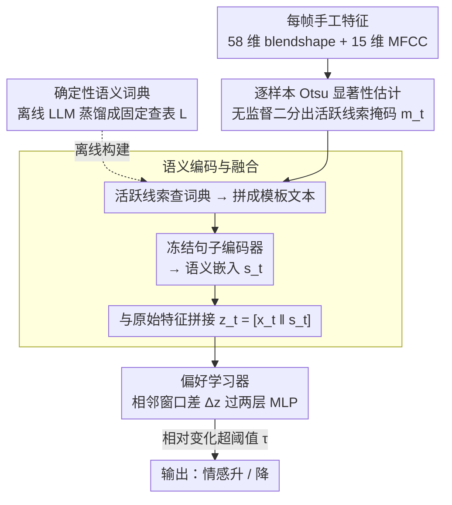

# LaScA: Language-Conditioned Scalable Modelling of Affective Dynamics

**会议**: CVPR 2026  
**arXiv**: [2604.07193](https://arxiv.org/abs/2604.07193)  
**代码**: 无  
**领域**: Affective Computing / 情感计算  
**关键词**: 情感建模, 语言模型, 语义先验, Valence-Arousal, 偏好学习

## 一句话总结

提出 LaScA 框架，利用大语言模型生成确定性语义词典为手工制作的面部和声学特征提供语义先验，通过冻结的句子编码器生成语义嵌入并与原始特征融合，在 Aff-Wild2 和 SEWA 数据集上的情感变化预测中一致性地超越纯特征基线，并在一致性、效率和可解释性上与端到端深度模型持平或更优。

## 研究背景与动机

在非受控环境（in-the-wild）中建模情感行为是情感计算的核心挑战。当前方法面临以下问题：

**端到端深度模型不透明**：CNN/RNN/Transformer 直接从视觉和音频流学习高维潜在表示，但信号提取和情感推理在不透明嵌入中纠缠，难以分析具体行为线索如何影响预测

**手工特征缺乏上下文抽象**：面部几何特征和声学描述符虽然紧凑高效且有领域知识基础，但无法捕获影响情感感知的高级语义关系——例如同一面部动作在不同上下文中的情感含义不同

**标注噪声大**：自然场景下的情感标注具有高度主观性和文化差异，直接预测绝对值不如预测变化方向可靠

LaScA 的核心洞察：手工特征是好的表示基础，但需要语言模型提供的上下文语义增强，而非被深度嵌入替代。

## 方法详解

### 整体框架

LaScA 想回答的问题是：能不能不抛弃紧凑、可解释的手工特征，又补上它们缺的「上下文语义」，从而在不靠端到端黑盒的前提下把情感变化预测做好。它的做法是先从每一帧抽出手工的面部特征（58 个 blendshape 系数）和声学特征（15 个 MFCC），然后用 Otsu 阈值挑出当前这一刻真正活跃的那几个线索，把它们对应的文字描述拼成一段模板文本喂给一个冻结的句子编码器，得到一条语义嵌入；这条语义嵌入再和原始数值特征拼在一起，最后交给一个轻量的偏好学习器判断「相邻两个时间窗里情感是变强还是变弱」。整条链路里只有最后那个 MLP head 是可训练的，前面的词典和编码器全部离线、冻结。

### 关键设计

**1. 确定性语义词典：把 LLM 的语义知识一次性蒸馏成固定查表**

手工特征的痛点是「数值好算但没有语义」——blendshape #12 等于 0.8 到底代表什么情感倾向，模型自己猜不出来。LaScA 没有在推理时反复调 LLM 去解释，而是离线让大模型以「情感计算研究者」的身份，把每个特征的情感含义一次性写成一句固定描述，存成一张静态映射表 $\mathcal{L} = \{(f_i, \ell_i)\}_{i=1}^d$。这样做的好处是 LLM 的随机性和算力开销全被挡在离线阶段：上线后查的是一张确定的表，可复现、零额外推理成本。消融里这张「LLM 写的词典」比单纯拿特征名当描述的词典在 arousal 上要好（详见消融表）。

> ⚠️ 原文记的生成模型名为 ChatGPT 5.2，型号存疑，以原文为准。

**2. 逐样本 Otsu 显著性估计：让每一帧自己决定哪些线索算数**

不同人、不同时刻活跃的行为线索差别很大，固定挑同一批特征会被强烈的个体差异带偏。LaScA 对每个时间片把归一化后的特征值排个序，用 Otsu 方法（最大化类间方差的无监督二分）切出一条阈值，自动把特征分成「显著 / 不显著」两堆，得到一个二值掩码 $\mathbf{m}_t \in \{0,1\}^d$。它的好处是完全无监督、逐样本自适应，不需要再额外学一个门控网络，就能在每一帧只保留当下主导的那几个线索。

**3. 语义编码与融合：把活跃线索的描述拼成文本再编码回向量**

光有掩码还不够，得让「哪些线索同时活跃」这件事进入模型。LaScA 把被掩码选中的那些特征的词典描述，按一个结构化模板拼成一段自然语言，交给冻结的句子 Transformer 编码成语义嵌入 $\mathbf{s}_t$——这条嵌入捕获的是活跃线索之间的上下文关系（比如「皱眉 + 音调下沉」联合起来意味着什么），而不是单个特征的孤立数值。融合方式刻意保持简单，就是把原始数值特征和语义嵌入直接拼接 $\mathbf{z}_t = [\mathbf{x}_t \| \mathbf{s}_t]$。作者横向试了 5 种句子编码器（MPNet、QAMPNet、DistilRoBERTa、MiniLM、DistilBERT），发现融合之后编码器之间差异很小，说明真正起作用的是「融合」这一步而非编码器选型。

**4. 偏好学习器：预测变化方向而不是绝对值**

自然场景下的情感标注主观性强、文化差异大，硬去回归 valence/arousal 的绝对数值会被噪声淹没。LaScA 改成做「相对预测」：把相邻时间窗组成偏好对 $(x_t, x_{t+1})$，只有当相对变化幅度超过阈值 τ 时这个对才保留（变化太小的样本噪声占比高，直接丢掉），然后拿两条嵌入的差 $\Delta\mathbf{z}$ 过一个两层 MLP 加 sigmoid，输出「情感是升还是降」。判断方向比拟合精确数值鲁棒得多，标注偏差只要不翻转方向就不致命，这也是它在标注最吵的 SEWA 上增益最大的原因。

### 一个完整示例

跟着一个 5s 窗口走一遍：先抽出 58 维 blendshape + 15 维 MFCC 的原始特征向量 $\mathbf{x}_t$。Otsu 在这一帧把它们二分，假设只有「嘴角下拉、眉头内收、音高下降」等少数几个特征落在显著一侧，掩码 $\mathbf{m}_t$ 把其余几十维归零。被选中的这几个特征各自去词典 $\mathcal{L}$ 里查出预写好的情感描述，拼进模板得到一段话，句子编码器把它压成语义嵌入 $\mathbf{s}_t$。$\mathbf{s}_t$ 和原始 $\mathbf{x}_t$ 拼成 $\mathbf{z}_t$；下一个窗口 $t{+}1$ 同样得到 $\mathbf{z}_{t+1}$。两者相对变化超过 20% 阈值，于是构成一个有效偏好对，偏好学习器拿 $\Delta\mathbf{z}$ 判出「arousal 上升」。整个过程里需要训练的只有最后这个 MLP（129–230K 参数），前面所有语义都来自冻结组件。

### 损失函数 / 训练策略

- 二元交叉熵损失
- Adam 优化器，最多 25 次迭代
- L2 正则化 α=1，早停 3 次无改善
- 训练窗口：3s 和 5s 两种
- 相对阈值：10% 和 20% 两种
- 15 折交叉验证（SEWA）/ 15 个随机种子（Aff-Wild2）
- 可训练参数仅 129-230K（MLP head），极其轻量

## 实验关键数据

### 主实验（Aff-Wild2 上与 SOTA 对比，5s/20% 配置）

| 模态 | 方法 | Arousal | Valence |
|------|------|---------|---------|
| Visual | VGGFace2 | 0.71 | 0.72 |
| Visual | SwinFace | 0.74 | 0.73 |
| Visual | MAE-Face | 0.72 | 0.71 |
| Visual | **LaScA** | **0.74** | **0.74** |
| Audio | Wav2Vec2 | 0.71 | 0.60 |
| Audio | MAE-Audio | 0.69 | 0.60 |
| Audio | **LaScA** | **0.72** | 0.58 |
| Multimodal | HiCMAE | 0.75 | 0.63 |
| Multimodal | MMA-DFER | 0.75 | 0.63 |
| Multimodal | **LaScA** | 0.74 | 0.61 |

### SEWA DB 上视觉模态最佳结果（5s/20%）

| 方法 | Arousal | Valence |
|------|---------|---------|
| SwinFace | 0.71 | 0.82 |
| MAE-Face | 0.70 | 0.81 |
| **LaScA** | 0.70 | **0.83** |

### 消融实验

| 配置 | Arousal (5s/20%) | Valence (5s/20%) | 说明 |
|------|-----------------|-----------------|------|
| 纯特征 (Features) | 0.55 | 0.52 | 基线最弱 |
| 纯文本 (Sentence Transformer) | 0.60 | 0.67 | 语义本身有价值 |
| 融合 (F) | 0.74 | 0.74 | 融合最优 |
| Feature-based 词典 | 0.74 | 0.61 | 特征名做描述 |
| LLM-based 词典 | 0.74 | 0.63 | LLM 描述更优 |

### 关键发现

1. **融合一致有效**：无论视觉/音频/多模态，融合版本始终优于纯特征和纯文本
2. **SEWA 上增益更大**：会话式交互场景下，语义上下文的补偿作用更明显（纯特征几乎是随机水平 50%）
3. **5s 窗口 > 3s 窗口**：更长的时间上下文对情感建模有益
4. **Arousal 增益 > Valence 增益**：语义先验对情感强度建模帮助更大
5. **编码器选择影响不大**：融合后不同句子编码器的性能差异很小，说明融合策略比编码器选择更重要

## 亮点与洞察

1. **"不要替代手工特征，增强它们"的范式**：与端到端黑盒模型形成鲜明对比，保持了可解释性
2. **确定性词典的优雅设计**：LLM 仅在离线阶段使用一次，推理时完全确定、高效、可复现
3. **极致轻量**：可训练参数仅 129-230K，推理 80-140ms/样本（在笔记本 GPU 上），适合实时部署
4. **跨数据集一致性**：在实验室级（SEWA）和野外级（Aff-Wild2）数据集上均有效
5. **Otsu 阈值选特征**：简单但有效的无监督显著性估计，避免了学习门控的额外复杂度

## 局限与展望

1. 所有编码器完全冻结，选择性微调可能进一步提升性能
2. SEWA 实验受限于预提取声学特征（无原始音频访问），未能评估端到端音频模型
3. 词典固定，跨文化/多语言场景需要适应性词典
4. 仅建模相邻时间窗口的局部变化，缺乏长程时序建模（如序列编码器、时间注意力）
5. 未扩展到离散情感类别或更高维情感表示

## 相关工作与启发

- **情感动态预测范式**：用相对方向（增/减）替代绝对值预测，缓解标注噪声
- **LLM 作为语义先验**：与直接将 LLM 集成到端到端架构不同，LaScA 将 LLM 的知识蒸馏为固定词典
- **Sentence Transformers**：通用句子编码为下游任务提供即插即用的语义表示
- 启发："小模型 + 大模型词典"是一种值得推广的混合范式——利用 LLM 的知识但不引入其计算开销

## 评分

- 新颖性: ⭐⭐⭐⭐ — LLM 语义词典 + 手工特征融合用于情感建模是新颖的
- 实验充分度: ⭐⭐⭐⭐ — 跨数据集、跨模态、跨编码器的评估很全面
- 写作质量: ⭐⭐⭐⭐ — 结构清晰，但表格过多影响阅读流畅性
- 价值: ⭐⭐⭐⭐ — 为可解释情感计算提供了高效实用的解决方案

<!-- RELATED:START -->

## 相关论文

- [\[CVPR 2026\] Sketch2Colab: Sketch-Conditioned Multi-Human Animation via Controllable Flow Distillation](sketch2colab_sketch-conditioned_multi-human_animation_via_controllable_flow_dist.md)
- [\[CVPR 2026\] Sign Language Recognition in the Age of LLMs](sign_language_recognition_llms.md)
- [\[CVPR 2026\] Unleashing Vision-Language Semantics for Deepfake Video Detection](unleashing_vision-language_semantics_for_deepfake_video_detection.md)
- [\[ECCV 2024\] Facial Affective Behavior Analysis with Instruction Tuning](../../ECCV2024/human_understanding/facial_affective_behavior_analysis_with_instruction_tuning.md)
- [\[CVPR 2025\] Homogeneous Dynamics Space for Heterogeneous Humans](../../CVPR2025/human_understanding/homogeneous_dynamics_space_for_heterogeneous_humans.md)

<!-- RELATED:END -->
