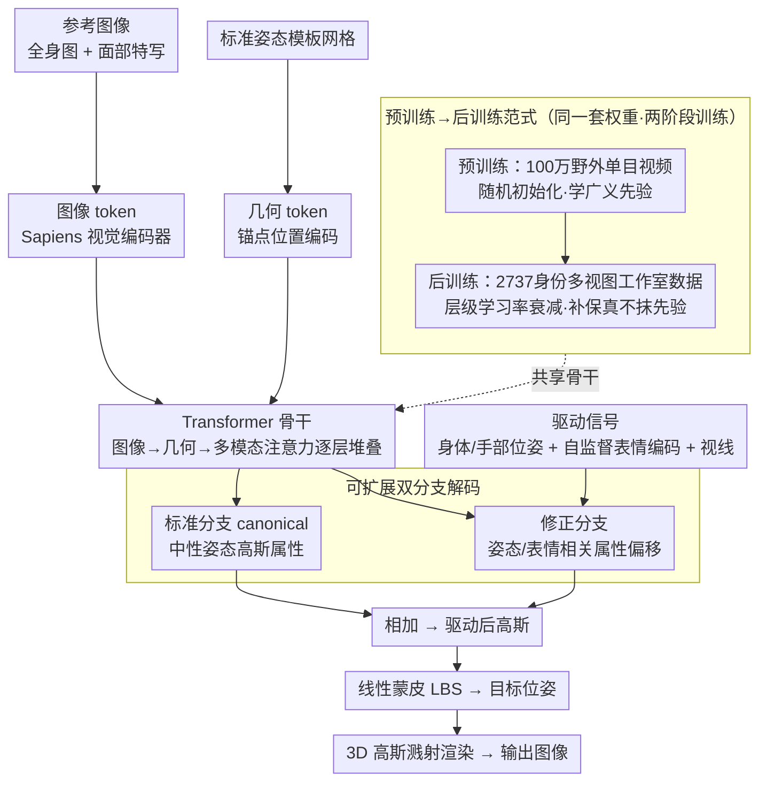

# LCA: Large-scale Codec Avatars - The Unreasonable Effectiveness of Large-scale Avatar Pretraining

**会议**: CVPR 2026  
**arXiv**: [2604.02320](https://arxiv.org/abs/2604.02320)  
**代码**: [https://junxuan-li.github.io/lca](https://junxuan-li.github.io/lca)  
**领域**: 人体理解 / 3D视觉  
**关键词**: 3D头像, 大规模预训练, 前馈生成, 高斯溅射, 表情控制

## 一句话总结

LCA 首次将大规模预训练/后训练范式应用于 3D 头像建模：在 100 万野外视频上预训练学习广泛的外观和几何先验，再在高质量多视图工作室数据上后训练增强精细表情和保真度，打破了泛化性与保真度的固有矛盾。

## 研究背景与动机

高质量 3D 头像建模面临核心权衡：工作室数据可以生成高保真头像，但泛化性差（只适用于拍摄过的人）；野外数据可以泛化到更多人，但质量低（3D 歧义导致畸变）。

**核心洞察**：受 LLM 和视觉基础模型的启发——大规模预训练学习通用先验，少量高质量数据后训练对齐目标任务。首次证明这一范式在 3D 头像领域同样有效。

## 方法详解

### 整体框架

LCA 要回答的问题是：能不能用一个前馈网络，既覆盖海量身份、又保住工作室级的表情保真度。它的做法是把这件事拆成「先在海量野外视频上学通用先验、再在少量高质量数据上对齐质量」两个阶段，但共用同一套可扩展的网络。

推理时，模型吃进若干张参考图像（全身图 + 面部特写）和一个处于标准姿态（canonical pose）的模板体网格：图像经通用视觉编码器（Sapiens）抽成图像 token，模板网格的锚点经位置编码抽成几何 token，二者一起送进一个大 Transformer 骨干——每层依次做图像注意力（逐图像自注意力）、几何注意力、再做多模态注意力把两路 token 融合，这样既能在多张输入图间交换信息、又能容纳可变数量的参考图。融合后的特征分两路解码——标准分支（canonical）输出一套中性姿态下、与姿态无关的高斯属性，修正分支再根据驱动信号（身体/手部位姿 + 自监督表情编码 + 视线方向）预测对这些属性的偏移量。两路相加得到驱动后的高斯，经线性蒙皮（LBS）变换到目标位姿，最后用 3D 高斯溅射（3DGS）渲染成图。两个阶段共用这套网络：预训练在约 100 万野外单目视频上随机初始化训练，后训练换到 2,737 个身份的多视图工作室数据（200 路 4K 相机）上、用层级学习率衰减继续优化，以保住预训练学到的先验。

### 关键设计

**1. 可扩展双分支架构：让工作室数据和野外数据走同一条管线**

野外数据和工作室数据的形态天差地别——前者只有随手拍的视频、没有几何或纹理贴图，后者有标定好的多视图。要把两者灌进同一个模型训练，架构就不能依赖任何「高质量条件输入」。LCA 的图像 token 来自一个通用视觉编码器（Sapiens），几何 token 来自标准姿态的模板体网格，两者都是任何数据源都能现成提供的廉价信号；Transformer 骨干每层依次做图像注意力（逐图像自注意力）、几何注意力、多模态注意力（把图像与几何 token 拼起来融合），这样既能在多张输入图之间交换信息、又能容纳可变数量的参考图。解码端拆成标准分支（canonical，输出与姿态无关的中性高斯属性）和修正分支（在驱动信号下输出属性偏移），正是这种「中性 + 偏移」的分解，让同一套权重既能在静态野外帧上学外观先验，又能在动态工作室序列上学表情。

**2. 预训练→后训练范式：先用规模换泛化，再用质量补保真**

工作室方法保真但只认拍过的人，野外方法泛化但 3D 容易畸变——这对矛盾过去被当成头像建模的固有权衡。LCA 借 LLM 的思路把它拆开：预训练阶段在百万级野外视频上学人类外观与几何的广义先验，让模型先「见过世界上各种人」；后训练阶段再在多视图工作室数据上特化，专门把面部表情的精细度和 3D 一致性顶上去。关键在于后训练是在预训练权重之上继续优化、而非另起炉灶，所以它只往上叠精度，并不覆盖已经学到的泛化能力——这和 LLM 里「预训练给能力、对齐阶段给质量且不抹掉能力」是同一回事。消融里「仅预训练」泛化强但表情糊、「仅后训练」表情准但泛化垮，两阶段合起来才同时拿到泛化、表情、3D 一致性，正说明这个先后顺序不是可有可无的拼接。

**3. 自监督表情编码：给修正分支一个比参数化面部模型更细的驱动信号**

表情是头像最关键的控制维度，但传统参数化面部模型（如 blendshape 系数）粒度偏粗，撑不起工作室级的微表情。LCA 改用自监督方式直接从数据里学一套 128 维面部表情潜在编码（沿用 [69] 的思路），把它作为修正分支的驱动信号；再叠上一个表达性身体模型（SMPL-X 类）提供的 138 维身体与手部位姿、以及视线方向，就能从面部一路控制到手指级别。因为这套编码是自监督学出来的、不被预定义的 blendshape 基底框死，修正分支才能表达出参数化模型覆盖不到的细节偏移。

### 损失函数 / 训练策略

训练目标是渲染损失加高斯正则：渲染损失对标准分支和修正分支两路渲染结果都用 L1 + LPIPS（感知损失）监督，高斯正则用 ACAP（位置）+ ASAP（尺度）约束高斯不乱跑。两阶段共用这套目标——预训练在约 100 万野外单目视频上随机初始化训练，后训练在 2,737 个身份的多视图工作室数据上从预训练权重继续微调（层级学习率衰减保住先验）；动画时固定不透明度以稳住跨姿态/表情的渲染。

## 实验关键数据

### 主实验

| 能力 | LCA | 之前最佳 | 说明 |
|------|-----|---------|------|
| 身份泛化 | 世界级人口覆盖 | 数千身份 | 发型/服装/肤色/配饰 |
| 表情控制 | 精细面部+手指级 | 粗粒度 | 后训练显著增强 |
| 3D一致性 | 强 | 野外方法弱 | 预训练+后训练协同 |
| 前馈推理 | 高效 | 需要优化 | 几张图即可生成 |

### 消融实验

| 配置 | 泛化 | 表情精度 | 3D一致性 | 说明 |
|------|------|---------|---------|------|
| 仅预训练 | 强 | 弱（表情模糊） | 中（3D畸变） | 广泛先验但精度不足 |
| 仅后训练 | 弱 | 强 | 强 | 高质量但泛化差 |
| 预训练+后训练 | 强 | 强 | 强 | 最佳平衡 |

### 关键发现

- 出现了**涌现能力**：在没有直接监督的情况下，模型自发地泛化到可重光照、宽松衣物支持、以及对风格化图像的零样本鲁棒性
- 预训练阶段学到的先验在后训练中不会被覆盖——类似 LLM 中的能力保持
- 100 万视频的规模对泛化能力至关重要

## 亮点与洞察

- **LLM 范式的3D迁移**：首次证明 pre/post-train 在 3D 头像领域同样打破了泛化-保真度权衡
- **涌现能力**：重光照和风格化鲁棒性的涌现说明大规模数据让模型学到了深层的物理/语义理解
- **前馈高效**：只需几张图片即可生成高质量头像，适合实际部署

## 局限与展望

- 100 万视频的预训练计算成本极高（Meta 级别的资源）
- 身体部分的精细度不如面部
- 开源程度不确定，可复现性待验证

## 相关工作与启发

- **vs Codec Avatars 系列**: 传统 Codec Avatars 需要每人优化，LCA 是前馈的
- **vs TRELLIS/Rodin**: 这些方法规模较小，LCA 首次达到百万级预训练
- **vs Real3D-Portrait**: 单张图方法保真度有限，LCA 多张图+大规模预训练更强

## 评分

- 新颖性: ⭐⭐⭐⭐⭐ 预训练/后训练范式在3D头像的首次成功应用
- 实验充分度: ⭐⭐⭐⭐ 展示全面但定量评测可以更标准化
- 写作质量: ⭐⭐⭐⭐⭐ 叙事流畅，洞察深刻
- 价值: ⭐⭐⭐⭐⭐ 对3D数字人产业有变革性意义

<!-- RELATED:START -->

## 相关论文

- [\[ICML 2026\] Efficient, Validation-Free Intrinsic Quality Estimation for Large-Scale Face Recognition Datasets](../../ICML2026/human_understanding/efficient_validation-free_intrinsic_quality_estimation_for_large-scale_face_reco.md)
- [\[CVPR 2026\] Next-Scale Autoregressive Models for Text-to-Motion Generation](next-scale_autoregressive_models_for_text-to-motion_generation.md)
- [\[ICCV 2025\] ImHead: A Large-scale Implicit Morphable Model for Localized Head Modeling](../../ICCV2025/human_understanding/imhead_a_large-scale_implicit_morphable_model_for_localized_head_modeling.md)
- [\[CVPR 2026\] AVATAR: Reinforcement Learning to See, Hear, and Reason Over Video](avatar_reinforcement_learning_to_see_hear_and_reason_over_video.md)
- [\[CVPR 2026\] FlexAvatar: Learning Complete 3D Head Avatars with Partial Supervision](flexavatar_learning_complete_3d_head_avatars_with_partial_supervision.md)

<!-- RELATED:END -->
