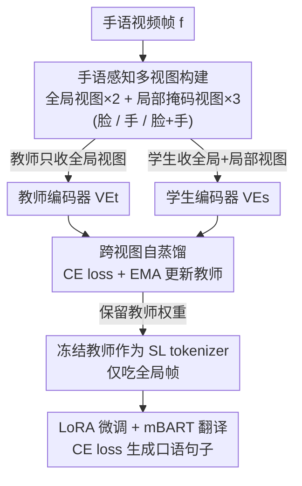

# Learning Effective Sign Features without Text for Gloss-free Sign Language Translation

**会议**: CVPR 2026  
**论文**: [CVF Open Access](https://openaccess.thecvf.com/content/CVPR2026/html/Gan_Learning_Effective_Sign_Features_without_Text_for_Gloss-free_Sign_Language_CVPR_2026_paper.html)  
**代码**: 待确认  
**领域**: 人体理解 / 手语翻译 / 自监督学习  
**关键词**: 无文本预训练, 手语翻译, 自蒸馏, DINO, 局部判别线索

## 一句话总结
本文提出 SignDINO——一种把 DINO 自蒸馏改造成"手语感知"的预训练策略：让教师只看全局帧、学生只看保留手部/面部的局部掩码视图，逼着模型仅凭全局帧就能推断出手语的判别性局部线索，从而在**完全不用 gloss、也不用文本标注**的情况下预训练手语 tokenizer，在四个公开 GFSLT 数据集上达到甚至超过依赖文本预训练的 SOTA。

## 研究背景与动机

**领域现状**：手语翻译（SLT）分两条路线。Gloss-based SLT 先用 gloss 标注在 CTC 约束下预训练视觉编码器（即"手语 tokenizer"），再接 mBART/GPT-2/mT5 等翻译模型生成口语句子；但 gloss 标注昂贵且依赖语言学专家，限制了可扩展性。因此社区转向 Gloss-free SLT（GFSLT），它在预训练阶段不用 gloss，转而**用文本标注**来对齐视觉与文本表征（对比学习、伪 gloss + CTC、文本条件的向量量化、多阶段预训练等）。

**现有痛点**：当前 GFSLT 仍然离不开**文本监督**来预训练 tokenizer，所谓"gloss-free"只是把对 gloss 的依赖换成了对文本的依赖。近期 SHuBERT、SignMusketeers 等虽用 DINO 式无文本预训练，但有两个硬伤：(1) 预训练只盯着手/脸这些局部判别区域，没学全帧表征；(2) 推理时编码器**也只能吃局部区域**（手、脸、骨架）作为输入，需要额外的检测/裁剪流水线，不能直接用全局视频帧。

**核心矛盾**：手语视频的特点是——绝大多数帧的全局内容相似（背景、身体外观几乎不变），而真正承载语义、有判别力的信息高度集中在**手部和面部的细微运动**上。但通用视觉 SSL（MAE、SimSiam、DINO）天生倾向于捕捉全局语义、忽略细粒度局部线索，直接搬到手语域效果很差。

**本文目标**：拆成两个子目标——(1) 把预训练彻底从 gloss/文本标注解耦，只靠原始手语帧，提升可扩展性，让 backbone 能吃未标注视频；(2) 推理时 tokenizer 只依赖**全局视频帧**，不再需要手/脸/骨架等额外输入。

**切入角度**：作者先做实证——把 MAE、SimSiam、DINO 等 SOTA SSL 直接用到手语视频上，发现都不理想，根因正是它们抓全局忽略局部。既然判别线索在局部，那就**在训练时把"全局"和"局部"拆到师生两端**，强迫模型建立"全局帧 → 局部语义"的映射。

**核心 idea**：用一句话概括——**教师看全局、学生看局部掩码视图做自蒸馏**，让教师学会"仅凭全局帧也能脑补出手/脸的判别线索"，于是推理时只喂全局帧即可。

## 方法详解

### 整体框架
SLT 的目标是学习手语视频 $f=\{f_i\}_{i=1}^{\theta}$ 到文本序列 $w=\{w_i\}_{i=1}^{\varsigma}$ 的映射 $p(w|f)$，中间靠一个 SL tokenizer（视觉编码器 $\mathcal{VE}$）把视频抽成视觉特征 $v=\mathcal{VE}(f)$ 喂给翻译模型。SignDINO 把整条管线分成两段：**先做 sign-aware DINO 自蒸馏预训练**得到一个会抓局部线索的 tokenizer，**再冻结教师、接 mBART 做 GFSLT 翻译微调**。关键转折在于预训练阶段对"视图"的非对称构造：教师只拿全局视图，学生额外拿到只保留手/脸的局部掩码视图，二者跨视图自蒸馏，把"局部判别力"蒸进一个全局帧编码器里。

### 关键设计

**1. 手语感知的多视图构建：把全局/局部拆到师生两端**

DINO 原版用 multi-crop 在同一张图上随机裁多个全局/局部 crop，但对手语视频没意义——随机裁出来的局部往往是背景或躯干，恰恰丢掉了手和脸。本文改成**手语感知的数据增强**：对每个手语帧 $x$，构造两类视图。全局视图集 $\{x_1^g, x_2^g\}$ 走标准增强（resize 256、随机裁 224、翻转、灰度、高斯模糊、color jitter）；局部视图集 $\{x_i^l\}_{i=1}^3$ 分别保留 (1) 面部、(2) 双手、(3) 脸+手三种判别区域。关键细节是**局部视图不 resize 回全局尺度**，而是保持原始空间大小、把所有无关区域直接 mask 掉。这样学生看到的就是"只有手/脸、其余全黑"的图，被迫从这点残缺线索里恢复语义。

**2. 师生自蒸馏 + EMA 教师：逼全局编码器学会脑补局部**

学生 $\mathcal{VE}_s$ 同时吃全局和局部视图，教师 $\mathcal{VE}_t$ 只吃全局视图，各自经 DINO head 投到 $K=65536$ 维空间得到分布。学生分布为 $P_s(x)^j = \frac{\exp(\mathcal{VE}_s(x)^j/\tau_s)}{\sum_k \exp(\mathcal{VE}_s(x)^k/\tau_s)}$，教师分布 $P_t$ 同理。优化目标是跨视图的交叉熵自蒸馏：

$$\Theta_{\mathcal{VE}_s}^* = \arg\min_{\Theta_{\mathcal{VE}_s}} \mathbb{E}_{x\sim\mathcal{D}}\Big[\sum_{x\in x^g}\sum_{x'\in x^g,x^l,\, x'\ne x} H(P_t(x), P_s(x'))\Big]$$

其中 $H(a,b)=-a\log b$。教师参数不做梯度更新，而是学生的指数滑动平均 $\Theta_{\mathcal{VE}_t}\leftarrow \lambda\Theta_{\mathcal{VE}_t}+(1-\lambda)\Theta_{\mathcal{VE}_s}$，$\lambda$ 按余弦从 0.996 退到 1。这个设计的精髓在于**非对称信息**：教师只见全局却要给出和"学生看局部"一致的分布，等价于强迫一个**全局帧编码器**去预测局部判别线索——可视化也证实，普通 DINO 注意力散在全身轮廓，而 SignDINO 的注意力精准聚到手和脸。

**3. 全局帧推理 + LoRA + mBART 翻译微调：解耦标注、简化推理**

预训练完，**保留教师权重**作为最终的 SL tokenizer，接上带时序卷积模块的 mBART 翻译模型，在标准交叉熵下做 GFSLT 微调（此阶段才用到文本，和所有 GFSLT 方法一致）。推理时教师**只吃全局手语帧**，不需要任何手/脸/骨架检测，直接产出 SL 特征送翻译模型生成文本。由于显存受限，base 尺寸 backbone（DINOv3-Base 等）用 **LoRA 微调**而非全参训练——总参数 85.8M、可训练仅 0.20M，就能适配 ViT backbone。整段流程实现了两个解耦目标：预训练完全无 gloss/文本、推理完全无额外输入。

### 损失函数 / 训练策略
预训练阶段用式 (5) 的跨视图自蒸馏交叉熵，教师靠 EMA 更新；微调阶段冻结/LoRA 适配 backbone，用翻译交叉熵 $\Theta_{\mathcal{TR}}^*=\arg\min\,\mathbb{E}[-\log p(t\mid \mathcal{TR}(v))]$。DINO head 为三层 MLP + L2 归一化 + 投影层，输出维度 65536。四张 RTX 4090 半精度训练，预训练约 30 min/epoch、微调约 24 min/epoch，推理 1.5 视频/秒（每视频均 250 帧）。

## 实验关键数据

### 主实验
在 Phoenix14T、CSL-Daily、How2Sign、OpenASL 四个数据集上评测，指标为 ROUGE-L F1 与 BLEU-1/2/3/4。下表为 Phoenix14T 测试集与现有 GFSLT 方法的对比（"额外输入"标注该方法是否依赖多阶段 MT、姿态或文本预训练）：

| 方法 (Phoenix14T TEST) | 额外输入 | ROUGE | BLEU-1 | BLEU-4 |
|--------|---------|-------|--------|--------|
| GFSLT-VLP | 文本 | 42.49 | 43.71 | 21.44 |
| Sign2GPT | 文本 | 48.90 | 49.54 | 22.52 |
| SignLLM | 文本 | 47.23 | 45.21 | 23.40 |
| C2RL | 文本 | 50.96 | 52.81 | 26.75 |
| MixSignGraph | 文本 | 51.14 | 50.01 | 24.02 |
| PGG-SLT | MT+文本 | 51.85 | 53.45 | 26.85 |
| **SignDINO（本文）** | **无** | **53.79** | **54.15** | **27.17** |

即便不用任何文本/gloss/姿态/多阶段预训练，SignDINO 的 ROUGE 与 BLEU-4 仍超过所有依赖文本的对手。在 CSL-Daily 测试集上同样领先（ROUGE 52.36、BLEU-1 53.64，对比 MixSignGraph 49.93/50.24）。

### 消融实验
核心消融是验证"手语感知多视图"里各区域的贡献（学生输入视图组合，教师固定全局），Phoenix14T 测试集：

| 学生视图配置 | ROUGE | BLEU-1 | BLEU-4 | 说明 |
|------|-------|--------|--------|------|
| Baseline（端到端无 SSL） | 34.65 | 36.10 | 10.41 | 最差 |
| 仅全局 | 39.26 | 42.25 | 15.48 | 单视图不足 |
| 仅手部 | 40.15 | 38.64 | 15.79 | 手是关键线索 |
| 全局 + 手部 | 49.63 | 51.78 | 25.92 | 显著提升 |
| **全局 + 脸 + 手（Full）** | **53.79** | **54.15** | **27.17** | 三视图最佳 |

另外几组分析（Q1/Q3/Q4）也很有信息量：直接拿通用域预训练的 DINO/MAE 当冻结 tokenizer，BLEU-4 仅 4~5；在 Phoenix14T 上按各自 SSL 范式预训练后 DINO♣ 也只有 15.48，而 SignDINO 达 27.17——证明增益来自"手语感知"而非"换 backbone"。Backbone 消融（PoolFormer/Swin/DINOv2/DINOv3，含 LoRA）BLEU-4 都在 25.6~27.2 之间，说明方法对架构不敏感。

### 关键发现
- **手部视图最关键**：单看"全局+手"就能从 39.26 跳到 49.63 ROUGE，加上脸再升到 53.79，印证手语判别力主要在手、面部补充语义。
- **手语感知 ≫ 换 backbone**：从头训练（scratch）也能拿到 51.46 ROUGE，离用 LVD-1689M 预训练初始化（52.76）很近，说明增益来自训练策略而非大规模预训练。
- **可迁移 + 可扩展**：跨数据集预训练（CSL-Daily 预训练→Phoenix14T 微调）仍有 41.83 ROUGE；预训练数据比例越大 BLEU-4 越高，呈现良好的 scalability。

## 亮点与洞察
- **把"信息非对称"用成监督信号**：教师少看（只全局）、学生多看（含局部），目标却要一致——这种刻意制造的不对称，等价于把"局部判别力"免费蒸进全局编码器，比额外加检测器/局部分支优雅得多。
- **"gloss-free"被进一步推进为"text-free"**：作者诚实地指出现有 GFSLT 只是把 gloss 依赖换成文本依赖，本文真正做到 backbone 预训练零语言标注，这个问题定位本身就很有价值。
- **局部视图不 resize 而是 mask**：保留原始尺度、抠出手/脸其余涂黑，这个小细节避免了把局部强行拉伸破坏空间分布，可迁移到其他"全局相似、局部判别"的视频任务（如细粒度动作识别）。

## 局限与展望
- 作者承认跨数据集预训练仍逊于域内预训练，归因于预训练数据规模有限，需要更大更多样的手语数据才能缓解过拟合。
- ⚠️ 微调阶段**仍然需要文本标注**来训练翻译模型，所谓"text-free"严格说只覆盖 backbone 预训练；端到端零文本的 SLT 仍是开放问题。
- 评测主要在 RGB 正面视角，对多视角、复杂背景、低分辨率手部的鲁棒性未充分验证；局部视图依赖手/脸区域的获取，极端遮挡下质量存疑。

## 相关工作与启发
- **vs SHuBERT / SignMusketeers**：它们也用 DINO 式无文本预训练，但聚焦局部区域、且**推理时也只能吃局部输入**；本文让推理只吃全局帧，省掉检测裁剪流水线，更易部署。
- **vs GFSLT-VLP / C2RL / LLaVA-SLT**：这些靠文本对比预训练对齐视觉-文本；本文 backbone 预训练完全不碰文本，却在 ROUGE/BLEU-4 上反超，说明文本监督对 tokenizer 并非必需。
- **vs 通用 SSL（MAE / SimSiam / DINO）**：直接套用在手语上抓全局忽略局部、效果差；本文用手语感知视图把它们改造得"会看手脸"，是把通用 SSL 适配到细粒度域的范例。

## 评分
- 新颖性: ⭐⭐⭐⭐ 问题定位（gloss-free 实为 text-dependent）犀利，师生非对称视图设计简洁有效，但核心仍是 DINO 自蒸馏的领域适配。
- 实验充分度: ⭐⭐⭐⭐⭐ 四数据集 + 六组消融（SSL 对比、视图、backbone、初始化、跨域、scalability）覆盖全面，结论自洽。
- 写作质量: ⭐⭐⭐⭐ 动机层层推进、图示清晰；公式排版（CVF 文本）略乱但不影响理解。
- 价值: ⭐⭐⭐⭐ 真正把手语 tokenizer 预训练推到零语言标注，且推理简化为全局帧，工程落地与可扩展性都有意义。

<!-- RELATED:START -->

## 相关论文

- [\[CVPR 2026\] BoostSLT: Boosting Sign Language Translation via a Plug-and-Play Diffusion-Based Semantic Enhancer](boostslt_boosting_sign_language_translation_via_a_plug-and-play_diffusion-based_.md)
- [\[CVPR 2026\] Text-Driven 3D Hand Motion Generation from Sign Language Data](text-driven_3d_hand_motion_generation_from_sign_language_data.md)
- [\[CVPR 2026\] Sign Language Recognition in the Age of LLMs](sign_language_recognition_llms.md)
- [\[CVPR 2025\] Lost in Translation, Found in Context: Sign Language Translation with Contextual Cues](../../CVPR2025/human_understanding/lost_in_translation_found_in_context_sign_language_translation_with_contextual_c.md)
- [\[CVPR 2026\] SignPR: A Progressive Vector-Quantized Diffusion Framework for Sign Language Production](signpr_a_progressive_vector-quantized_diffusion_framework_for_sign_language_prod.md)

<!-- RELATED:END -->
