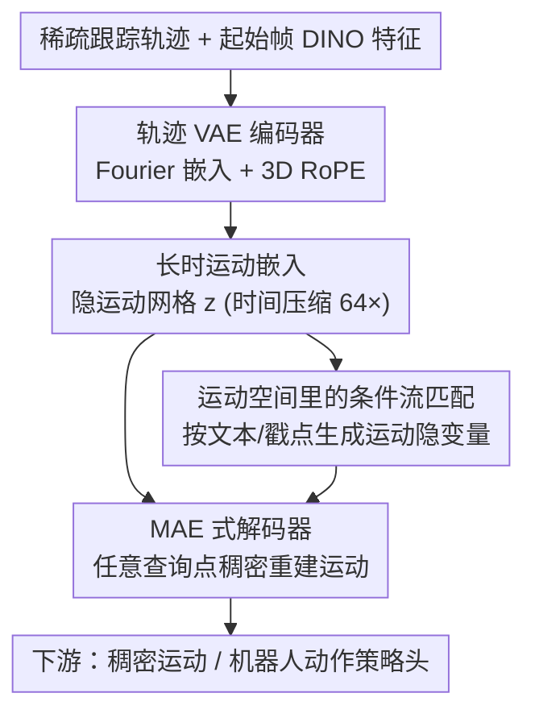

# Learning Long-term Motion Embeddings for Efficient Kinematics Generation

**会议**: CVPR 2026  
**论文**: [CVF Open Access](https://openaccess.thecvf.com/content/CVPR2026/html/Stracke_Learning_Long-term_Motion_Embeddings_for_Efficient_Kinematics_Generation_CVPR_2026_paper.html)  
**代码**: [compvis.github.io/long-term-motion](https://compvis.github.io/long-term-motion)（项目页）  
**领域**: 运动表示学习 / 运动生成 / 具身规划  
**关键词**: 长时运动嵌入、时间压缩、流匹配、目标条件运动生成、轨迹自编码器

## 一句话总结
与其用视频生成模型逐像素同时建模"外观+运动"，本文直接学一个**只编码运动、时间压缩 64× 的长时运动隐空间**：先用轨迹 VAE 把稀疏跟踪轨迹压成稠密可查询的运动网格，再在这个空间里训一个条件流匹配模型按文本/戳点（poke）生成长时目标导向运动，比 SOTA 视频模型快一万倍以上、质量还更好。

## 研究背景与动机

**领域现状**：理解和预测运动是视觉智能的核心。但现有学习方法要么只盯低层运动信息（光流、稀疏轨迹），要么把运动和外观纠缠在视频生成模型里——后者必须逐像素建模随时间的变化，是个高维信号，需要海量算力。

**现有痛点**：① 直接建模视频/光流虽信号丰富，但维度高、算力贵，且**无法在不严重丢信息的前提下做强时间压缩**（视频隐空间自编码器通常只敢压 4×–8×，再高视觉细节就崩）；② 轨迹（tracks）虽紧凑可解释，但缺乏泛化与上下文聚合能力，只能描述跟踪器采到的那些稀疏点；③ 想"探索多种可能的未来"时，跑一遍完整视频合成代价高到不可行。

**核心矛盾**：要做高阶运动推理（多个物体的运动如何聚合、什么样的复杂未来行为是合理的），需要一个既比光流"长"、比轨迹"富"、又比视频"省"的中间抽象——但现有三种表示恰好各缺一块。

**本文目标**：学一个**长时运动嵌入**——紧凑、语义化的隐表示，聚合全局运动学结构、跨轨迹整合信息、刻画运动在长时间跨度上的演化；并能在这个空间里直接做目标条件的运动生成与推理。

**切入角度**：两个洞察支撑全文。第一，有用的运动表示不只要"跟踪什么在动"，更要推理"东西能怎么动、运动如何跨物体聚合、什么复杂未来合理"；第二，轨迹本身低维、与外观解耦，因此**能被强时间压缩而不丢语义**，这正是视频/光流做不到的。

**核心 idea**：把"运动本身"当作生成域——先学一个高度压缩（64×）的运动隐空间，再在其中用条件流匹配按文本/戳点生成运动，彻底绕开逐像素视频合成的开销。

## 方法详解

### 整体框架
方法是一个两阶段框架。**第一阶段**训练一个轨迹 VAE：编码器吃进一组稀疏、部分被遮的跟踪轨迹 $X=\{x_0,\dots,x_{N-1}\}$（每条轨迹是归一化坐标系下随时间的 $[x_t,y_t]$ 序列）外加起始帧的 DINO 特征 $f_0$，输出一个隐运动网格 $z\in\mathbb{R}^{H\times W\times D}$；解码器是 MAE 式设计，能在**任意空间查询点**重建运动，从而把跟踪器只给的稀疏轨迹"补全"成稠密、上下文感知的运动场。**第二阶段**冻结这个运动空间，训一个条件流匹配模型在隐空间里直接生成运动隐变量 $z$，按起始帧 $f_0$ 加文本或戳点（poke）条件控制。生成出的运动隐变量可解码成稠密运动，或喂给下游策略头预测机器人动作。关键支撑是"强时间压缩"：64× 压缩既减少 token 数提升训练/推理效率，又让隐空间更语义化。

### 关键设计

**1. 轨迹 VAE：把稀疏轨迹学成稠密可查询的压缩运动空间**

痛点是稀疏轨迹只覆盖跟踪器采到的点、无法泛化或上下文聚合。本文用一个 $\beta$-VAE $F_\theta=(E_\theta,D_\theta)$ 把"一组轨迹 + 起始帧"映成隐网格 $z$，再从 $z$ 重建运动。编码侧每个轨迹样本 $x_{i,t}$ 先做随机频率的 Fourier 嵌入，并用 **3D 旋转位置编码（RoPE）** 联合编码时间索引 $t$ 与起始位置 $[x_{i,0},y_{i,0}]$（后者锚定该轨迹的身份）：token 与位置编码分别为 $\text{tok}(x_{i,t})=\text{MLP}([F(x_t)\,|\,F(y_t)])$、$\text{PE}(x_{i,t})=[R(x_0)\,|\,R(y_0)\,|\,R(t)\,|\,1]$。隐网格 $z$ 用可学习嵌入广播到 $H\times W$ 初始化、各 token 之间也用 RoPE 区分，且**只部分施加 RoPE**，逼模型多依赖语义信息而非纯位置。所有轨迹 token（共 $N\cdot T$ 个）与隐网格 token 通过全局自注意力交互、并交错地对起始帧特征 $f_0$ 做交叉注意力，编码器输出高斯后验 $q_\theta(z|X,f_0)=\mathcal{N}(\mu_\theta,\text{diag}(\sigma^2_\theta))$。解码器（MAE 式）让每个查询 token 编码自己的时间索引与起始位置、交叉注意 $z$ 与 $f_0$，再用小 MLP 投影回 $(x,y)$ 坐标——**查询点不限于编码时用过的点**，因此能在起始帧任意位置稠密解码运动。这一步把"稀疏轨迹"提升成"稠密、解耦外观、可强压缩的运动瓶颈"。

**2. 强时间压缩 64×：压得越狠、运动质量和语义反而越好**

这是全文最反直觉、也是收益来源的设计。视频隐空间只敢压 4×–8×（再高视觉细节就崩），而本文主张：轨迹与外观解耦、本身低维，**可以承受 64× 的时间压缩**——压缩因子 $t_c$ 意味着 $t_c$ 个连续帧被聚合成一个**无时间维**的隐表示。作者在 $t_c\in\{2,4,8,16,32,64\}$ 下固定算力预算训练，发现运动生成质量随压缩单调变好、推理效率同步大涨，且隐空间语义性增强（在 SSv2 子集上 kNN 检索准确率——衡量"语义相近的运动是否在隐空间里聚得更近"——随压缩单调上升）。作者把增益归因于两点：token 数减少带来训练/推理效率提升，以及隐结构越来越语义化。重建保真度只有轻微下降，换来质量与效率的大幅提升，是非常划算的权衡。

**3. 运动空间里的条件流匹配：按文本/戳点高效生成目标导向运动**

有了紧致语义的运动空间，"在其中生成"就变得高效。本文训一个神经向量场 $v_\theta(z_t,c,t)$，预测样本 $z_t$ 沿连续轨迹从先验 $p_0(z)=\mathcal{N}(0,I)$ 到运动隐变量经验分布 $p_1(z)$ 的瞬时流，目标为 $L_{FM}(\theta)=\mathbb{E}_{t,z_0,z_1}\|v_\theta(z_t,c,t)-v^*_t(z_0,z_1)\|^2_2$，其中 $z_t=(1-t)z_0+tz_1$ 是噪声与数据的线性插值、$v^*_t=z_1-z_0$ 是把样本推向数据流形的目标流场。$v_\theta$ 是 transformer 去噪器，吃噪声隐变量 $z_t$、时间标量 $t$ 与条件 $c$（含起始帧嵌入 $f_0$，可选文本或 poke）。戳点条件下，目标 poke 位置与目标时刻做 Fourier 嵌入、起始位置用 RoPE，poke 与文本都通过交叉注意力注入——这套设计允许**任意数量、任意时刻、每条轨迹任意个数的 poke** 灵活条件化，把"目标在哪、何时到"自然编码进生成过程。

### 损失函数 / 训练策略
第一阶段 $\beta$-VAE 目标 = L1 重建损失（编码点）+ 掩码重建损失（编码器未见的随机留出点 $J_{mae}$，逼模型稠密泛化）+ KL 正则 $\beta D_{KL}[q_\theta(z|\cdot)\,\|\,p(z)]$。第二阶段为流匹配损失 $L_{FM}$。实现：隐网格空间维 $16\times16$、$t_c=64$；VAE 与运动规划器均为 LLaMA 式 transformer，分别 340M / 530M 参数；优化器 AdamW（betas 0.9/0.95）。开放域用 KOALA-36M 训练、TapNext 产伪标签轨迹（只留 64 帧、滤掉不确定轨迹）；闭域用 LIBERO 机器人数据 + CoTracker3 轨迹。

## 实验关键数据

评测在保真度、多样性、条件遵从三方面用三个指标：**Min MSE**（生成样本分布与单一真值运动的最小均方误差，衡量保真——真值在模型分布下越高概率、采样越密、Min 越小）；**Mean MSE**（对所有样本平均的 MSE，衡量多样性——Mean 逼近 Min 说明分布塌缩，Mean 过高说明含不合理离群运动）；**EPE**（端点误差，戳点条件下衡量是否到达指定目标）。机器人场景另报 LIBERO 任务成功率。⚠️ 部分表格数字经 OCR 还原，具体小数以原文为准。

### 主实验

戳点条件运动生成（Table 1，Dense 即最强条件）：

| 方法 | 表示 | 速度(timesteps/s)↑ | Min MSE↓ | Mean MSE↓ | EPE↓ |
|------|------|---------------------|----------|-----------|------|
| Motion-I2V | 光流 | 21 | 46.9 | 71.7 | 8.8 |
| Track2Act | 轨迹 | 180 | 138.7 | 156.1 | 20.9 |
| **本文** | 隐运动 | **2500** | **30.4** | **44.1** | **1.1** |

本文在 1/2/4/8 戳点各稀疏度下全面领先，且速度比光流基线快两个数量级；条件越稀疏（不确定性越大）越能体现"建模一个多模态运动分布"的价值。

与视频生成模型对比（同采样数 vs 同墙钟时间）：

| 设置 | 模型 | 采样耗时/数量 | Min MSE↓ | Mean MSE↓ | EPE↓ |
|------|------|----------------|----------|-----------|------|
| Sample Matched | Wan 14B | 1h | 28.67 | 57.02 | 4.68 |
| Sample Matched | Veo 3 | ? | 36.18 | 94.00 | 6.21 |
| Sample Matched | **本文** | **1s** | **27.08** | **39.53** | **1.17** |
| Time Matched | Wan 14B | 1 个样本 | 64.20 | 64.20 | 5.23 |
| Time Matched | 本文 | **>10k 个样本** | **21.29** | **40.33** | **1.17** |

视频模型须同时合成外观+运动、且要靠 CoTracker3 反跟踪才能拿到可比的轨迹（会引入跟踪漂移/丢失误差）；本文直接生成运动隐变量，全局一致、又快又准。等墙钟时间下本文能采 >10k 样本而视频模型只够 1 个，领先进一步拉大。

### 消融实验

| 维度 | 配置 | 现象 | 说明 |
|------|------|------|------|
| 时间压缩 $t_c$ | 2→64 | 运动质量↑、推理效率↑、kNN 准确率↑ | 压得越狠越好，重建保真仅微降 |
| LIBERO（vs ATM 设定） | ATM | 平均成功率 60.4 | 轨迹策略基线 |
| LIBERO（vs ATM 设定） | **本文** | **79.6** | 由生成运动嵌入预测动作 |
| LIBERO（vs Tra-MoE 设定） | Tra-MoE | 平均 61.4 | 另一基线设定 |
| LIBERO（vs Tra-MoE 设定） | **本文** | **80.3** | 同样大幅领先 |

### 关键发现
- **强压缩是免费午餐里的主菜**：在固定算力下，把时间压到 64× 同时改善了生成质量、推理吞吐和语义结构（kNN 准确率单调升），重建保真只轻微降——这颠覆了"压缩=丢信息"的直觉，原因是轨迹与外观解耦、本可强压。
- **闭域机器人也吃这套**：在 LIBERO 上，策略头只吃"生成的运动嵌入"预测动作（充当逆动力学），真正的任务推理由运动规划器完成；本文在两套基线设定下都把成功率从 ~60 抬到 ~80，说明运动空间确实编码了可执行的场景动态。
- **对视频模型的效率碾压**：等时间下本文采样数比视频模型多 4 个数量级、误差还更低；视频模型（尤其 Veo）倾向生成高幅度运动，真值偏温和时误差大。

## 亮点与洞察
- **把"运动"独立成生成域**：长于光流、富于轨迹、省于视频——这个新抽象层级让"采样多种可能未来"从不可行变成实时，是对"世界模型该建在什么表示上"的有力回答。
- **稀疏训练、稠密解码**：MAE 式查询解码让只用稀疏跟踪轨迹训练的模型能在任意点稠密重建运动，绕开了跟踪器采点的物理限制，trick 可迁移到任何"稀疏监督、稠密推理"的场景。
- **压缩即语义**：用 kNN 检索准确率把"隐空间是否更语义化"量化出来，并把生成质量提升归因于此——这种"压缩→语义→生成质量"的因果叙事，对设计其他模态的隐空间很有启发。
- **解耦外观让强压缩成立**：核心是认识到轨迹与外观解耦因而低维可压，这一观察直接撬动了 64× 这个数量级，是全文的支点。

## 局限与展望
- **依赖现成跟踪器的伪标签质量**：训练监督来自 TapNext/CoTracker3 的伪 GT 轨迹，跟踪器在遮挡、快速运动下的漂移会被学进运动空间；原文虽做了跟踪器选择消融，但对极端场景的鲁棒性正文未深入。⚠️ 跟踪器选择细节在附录。
- **隐网格分辨率固定 16×16**：空间分辨率有限，对极精细的局部运动（如细小物体的微动）可能不足；放大网格与压缩/效率的权衡未在正文充分探讨。
- **评测指标的多模态难题**：开集运动天然多模态，作者明确指出单峰/确定性对应的指标不适用，只能靠 Min/Mean MSE + EPE 联合代理"运动质量"——没有单一指标能独立保证生成有意义，结论需结合定性结果看。

## 相关工作与启发
- **vs 视频生成模型（Wan / Veo 3）**：它们逐像素同时建模外观+运动、只敢压 4×–8×、算力贵，且运动与纹理光照纠缠难以控制；本文只建运动、压到 64×、又快又可控，等时间下采样数多 4 个数量级。
- **vs 轨迹预测器（Track2Act / ATM / Tra-MoE）**：它们直接预测显式轨迹用于下游控制，受限于稀疏采点、缺上下文聚合；本文在统一隐运动空间里生成，既稠密可查询又语义化，LIBERO 成功率显著更高。
- **vs 特征空间世界模型（预测 DINO 特征演化）**：那类方法在隐特征里学动态、但没有显式运动概念，动态仍与外观纠缠、缺可解释/可控性；本文显式以轨迹为基底建运动空间，紧致且语义结构清晰。

## 评分
- 新颖性: ⭐⭐⭐⭐⭐ "把运动独立成可强压缩的生成域 + 64× 压缩反而更好"是对运动表示的实质创新。
- 实验充分度: ⭐⭐⭐⭐ 开域/闭域、戳点/文本、对视频模型与轨迹基线都覆盖；多模态评测靠代理指标，极端场景鲁棒性偏弱。
- 写作质量: ⭐⭐⭐⭐ 两阶段叙事与"压缩→语义→质量"因果清晰，公式到位；部分数字需对照原文（OCR）。
- 价值: ⭐⭐⭐⭐⭐ 把"探索多种未来"做到实时，对世界模型、机器人规划、可控运动生成都有直接价值。

<!-- RELATED:START -->

## 相关论文

- [\[ECCV 2024\] Motion Mamba: Efficient and Long Sequence Motion Generation](../../ECCV2024/human_understanding/motion_mamba_efficient_and_long_sequence_motion_generation.md)
- [\[AAAI 2026\] Robust Long-term Test-Time Adaptation for 3D Human Pose Estimation through Motion Discretization](../../AAAI2026/human_understanding/robust_long-term_test-time_adaptation_for_3d_human_pose_estimation_through_motio.md)
- [\[CVPR 2026\] LLaMo: Scaling Pretrained Language Models for Unified Motion Understanding and Generation with Continuous Autoregressive Tokens](llamo_scaling_pretrained_language_models_for_unified_motion_understanding_and_ge.md)
- [\[CVPR 2026\] MoLingo: Motion-Language Alignment for Text-to-Human Motion Generation](molingo_motion-language_alignment_for_text-to-motion_generation.md)
- [\[CVPR 2026\] Geometric Neural Distance Fields for Learning Human Motion Priors](geometric_neural_distance_fields_for_learning_human_motion_priors.md)

<!-- RELATED:END -->
