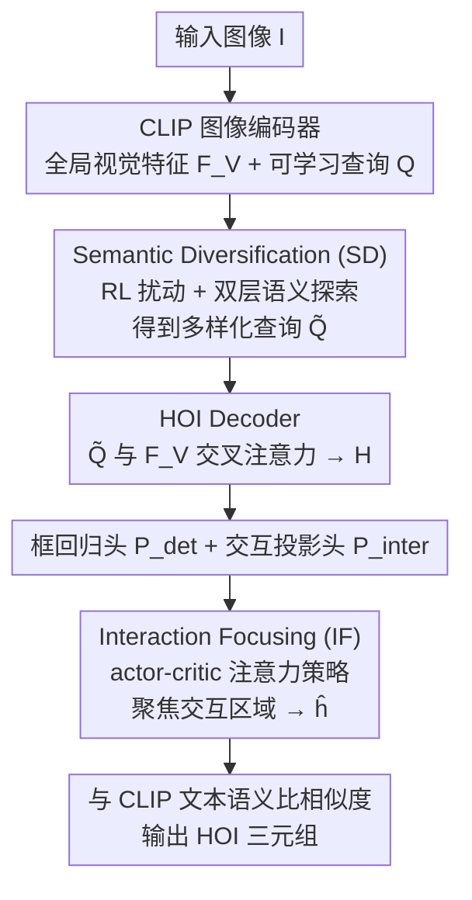

# Learning to Diversify and Focus: A Reinforcement Framework for Open-Vocabulary HOI Detection

**会议**: CVPR 2026  
**论文**: [CVF Open Access](https://openaccess.thecvf.com/content/CVPR2026/html/Xu_Learning_to_Diversify_and_Focus_A_Reinforcement_Framework_for_Open-Vocabulary_CVPR_2026_paper.html)  
**代码**: 待确认  
**领域**: 人体理解 / 开放词表HOI检测  
**关键词**: 开放词表HOI检测, 强化学习, 语义多样化, Actor-Critic, CLIP

## 一句话总结
针对开放词表人-物交互（OV-HOI）检测里"查询过拟合已见类、CLIP 注意力发散"两大顽疾，本文提出 SD-IF 框架：用强化学习驱动的语义扰动让查询主动"跳出"已见语义簇，再用 actor-critic 把注意力"聚焦"到真正发生交互的区域，在 HICO-DET 与 SWIG-HOI 上未见类 mAP 大幅领先此前 SOTA。

## 研究背景与动机
**领域现状**：开放词表 HOI 检测要识别训练集之外的新交互类别。主流做法（THID、CMD-SE、INP-CC、SGC-Net）几乎都是一阶段范式——用 CLIP 抽全局视觉表征，再让一组可学习 query 在 Transformer decoder 里与全局特征做 cross-attention，直接定位"人-物对"并分类交互，且不依赖预训练检测器、不在训练时使用未见类名。

**现有痛点**：作者指出两个被忽视的结构性缺陷。其一是**已见-未见偏置（Seen-unseen Bias）**：由于二分图匹配（Hungarian）只对已见 HOI 提供监督，可学习 query 被持续推向训练集里的交互类别，严重过拟合已见类，已见与未见类之间 mAP 差距超过 5%。其二是**交互感知受限（Limited Interaction Awareness）**：开放词表设定下没有预训练检测器给出区域提议，而 CLIP 视觉编码器主要在图像级监督下训练、偏重全局语义、缺乏区域级空间线索，导致注意力散落在物体周边的无关区域，而非交互发生的关键部位。

**核心矛盾**：一阶段范式同时承担"语义泛化"与"空间定位"两个目标，但它的优化信号（已见类的匹配监督 + CLIP 的全局语义）天然偏向已见、偏向全局，于是 query 既被锁死在已见语义簇里、又看不清交互细节。

**本文目标**：在不引入预训练检测器、不泄露未见类名的前提下，同时（1）扩大 query 的语义覆盖以泛化到未见类；（2）把注意力收敛到交互关键区域以增强空间判别。

**切入角度**：作者注意到这两件事都属于"在间接监督下做自适应探索/决策"——正好是强化学习擅长的场景：语义该往哪扩、注意力该往哪聚，都没有直接的逐像素标签，但可以用代理奖励来引导。

**核心 idea**：把 query 当作 agent，用 RL 驱动的随机语义扰动让它"主动多样化（Diversify）"以跳出已见语义簇；再用 actor-critic 学一个注意力策略让它"聚焦（Focus）"到交互区域——即 Semantic-Diversified and Interaction-Focused 框架（SD-IF）。

## 方法详解

### 整体框架
SD-IF 建立在一个 CLIP 一阶段 OV-HOI 基线上：输入图像先经 CLIP 图像编码器 $E_v$ 得到全局视觉特征 $F_V$，初始化 $N_q$ 个可学习 query $Q$ 作为"人-物原型"，经 $L$ 层 Transformer decoder $D_V$（query 作 query，$F_V$ 作 key/value）得到 HOI 表征 $H$，再接框回归头 $P_{det}$（预测置信度 $c$ 与人/物框 $b_h,b_o$）和线性投影头 $P_{inter}$（把 $H$ 映射到视觉-文本联合空间 $\tilde H$，与 CLIP 文本编码器给出的交互语义做相似度分类）。

SD-IF 在这条基线上插入两个 RL 模块：在 query 进入 decoder 之前，**Semantic Diversification（SD）模块**对 query 施加 RL 驱动的语义扰动、扩大语义覆盖；在 decoder 之后，**Interaction Focusing（IF）模块**用 actor-critic 重新分配注意力、把交互原型聚焦到关键区域。两者一前一后，分别在"语义层"和"空间层"补齐基线的短板。

### 关键设计

**1. Semantic Diversification（SD）模块：把每个 query 当 agent，用 RL 扰动跳出已见语义簇**

这一模块直接针对"已见-未见偏置"。痛点在于：query 在训练中只被已见类的匹配监督拉扯，越训越聚集在已见语义簇中心，对未见类无能为力。SD 的做法是给每个 query $q_i$ 配一个**条件高斯策略**：先对全局特征做平均池化得到视觉上下文 $\bar F_V=\text{AvgPool}(F_V)$，策略网络 $g_\theta$ 输出均值与协方差 $[\mu_i,\Sigma_i]=g_\theta(q_i,\bar F_V)$，从中采样语义扰动 $a_i\sim\mathcal N(\mu_i,\Sigma_i)$，更新查询 $\tilde q_i=q_i+\kappa a_i$（$\kappa$ 控制扰动幅度）。

扰动不是乱加，而是**双层语义探索**：① *局部一致性（Local Consistency）*——扰动以 $\bar F_V$ 为条件，保证 $\tilde q_i$ 不偏离全局视觉语境、视觉上仍合理；② *全局扩张（Global Expansion）*——用正则项 $\mathcal L_{global}=-\frac1{N_q}\sum_i\log\big(1-\text{sim}(\tilde q_i,\mu_c^{seen})\big)$ 把 $\tilde q_i$ 推离由 CLIP 文本嵌入算出的已见簇中心 $\mu_c^{seen}$，鼓励 query 探索已见类别的语义"外围"。由于未见类训练时不可见，作者设计**代理语义奖励** $r_i=\underbrace{\text{KL}(p_{\text{text}}(q_i)\,\|\,p_{\text{text}}(\tilde q_i))}_{\text{语义偏移}}-\gamma\underbrace{\text{KL}(p_{\text{visual}}(\tilde q_i)\,\|\,p_{\text{visual}}(q_i))}_{\text{特征一致}}$：第一项奖励"在文本空间里偏离已见语义"，第二项惩罚"在视觉空间里偏得太离谱"，$\gamma$ 平衡二者。策略以策略梯度优化 $\mathcal L_{local}=-\mathbb E_{a_i\sim\pi_\theta}[(r_i-\hat r_i)\log\pi_\theta(a_i|q_i)]$（$\hat r_i$ 是历史奖励的滑动平均，降方差），总损失 $\mathcal L_{sd}=\mathcal L_{local}+\beta\mathcal L_{global}$。这样 query 流形被持续推向语义空间未探索的区域，同时保持视觉连贯，才有可能泛化到未见交互。

**2. Interaction Focusing（IF）模块：用 actor-critic 学注意力策略，把交互原型聚焦到关键区域**

这一模块补的是"交互感知受限"。痛点在于：CLIP 全局表征让注意力散落在无关区域，看不清细粒度交互线索。IF 把"聚焦"建模成 actor-critic 强化框架。**状态**由多样化 query、检测上下文、交互表征拼成 $s_i=\phi_s(\tilde q_i, p_i^{det}, \tilde h_i)$，其中 $p_i^{det}=\{\hat b_i^h,\hat b_i^o,\hat c_i\}$ 是框回归头的检测预测——这一步把"视觉定位"与"交互推理"桥接起来。**动作**由 actor 网络给出自适应注意力 $A_i=\pi_\phi(s_i)=\text{Softmax}(f_\phi(s_i,\tilde H))$（$f_\phi$ 是多头 cross-attention + 轻量 FFN，以 $s_i$ 为 query、$\tilde H$ 为 key/value），再据此重加权交互原型得到精炼表征 $\hat h_i=\sum_i A_i\tilde h_i$，从而突出交互关键模式、抑制背景语义。

奖励是**混合奖励**：① 可微的*空间聚焦奖励* $R_i^{spatial}=\frac{\sum_{x,y}A_i(x,y)\cdot M_{ho}(x,y)}{\sum_{x,y}A_i(x,y)}$，衡量注意力图与由检测框 $(b_h,b_o)$ 导出的人-物区域掩码 $M_{ho}$ 的重叠，鼓励注意力落在交互区域内；② *语义一致性奖励* $R_i^{semantic}=\text{sim}(\hat h_i,\tilde q_i)$，保证聚焦后的表征仍与查询语义对齐；合成为 $R_i=R_i^{spatial}+\eta R_i^{semantic}$。actor-critic 对 $(\pi_\phi,C_\psi)$ 联合优化：$\mathcal L_{if}=-\mathbb E_{A_i\sim\pi_\phi}[(R_i-C_\psi(s_i))\log\pi_\phi(A_i|s_i)]+\|R_i-C_\psi(s_i)\|_2^2$（前项是带 baseline 的策略梯度，后项是 critic 的值回归）。这样注意力策略会逐步收敛到"语义连贯且空间关键"的区域，把 CLIP 的视觉-语言关联能力真正用在交互细节上。

### 损失函数 / 训练策略
总目标把监督检测损失与两个 RL 辅助损失加权相加：$\mathcal L=\mathcal L_{det}+\lambda_{sd}\mathcal L_{sd}+\lambda_{if}\mathcal L_{if}$，其中 $\mathcal L_{det}=\lambda_b\sum_{i\in\{h,o\}}\mathcal L_b^i+\lambda_{iou}\sum_{i\in\{h,o\}}\mathcal L_{iou}^i+\lambda_{cls}\mathcal L_{cls}$ 沿用 query-based 方法的二分图匹配（Hungarian）。**推理时 RL 模块转为确定性**：SD 用均值扰动 $\tilde q_i=q_i+\kappa\mu_i$ 得到稳定的多样化查询，IF 的 actor 直接输出注意力、不再走 critic；最终得分 $\hat f_i'=\hat f_i\cdot\hat c_i^{\xi}$（$\xi>1$ 抑制过自信的检测框）。超参：$\lambda_{sd}=1,\lambda_{if}=2$，$\kappa=0.2,\gamma=0.5,\beta=0.5,\eta=0.2$；CLIP ViT-B/16，AdamW，学习率 $10^{-4}$，80 epoch，batch 128，2×A100。

## 实验关键数据

### 主实验
评测两个标准基准 HICO-DET 与 SWIG-HOI，指标为 mAP；OV 设定区分未见（Unseen）/已见（Seen）/全部（Full）或非稀有（Non-rare）/稀有（Rare）/未见/全部。

| 数据集 | 指标 | SD-IF | 此前 OV-HOI SOTA（SGC-Net） | 提升 |
|--------|------|-------|------|------|
| HICO-DET | Unseen mAP | 28.01 | 23.27 | +4.74 |
| HICO-DET | Seen mAP | 30.09 | 28.34 | +1.75 |
| HICO-DET | Full mAP | 29.63 | 27.22 | +2.41 |
| SWIG-HOI | Unseen mAP | 15.57 | 12.46 | +3.11（相对 +25.0%） |
| SWIG-HOI | Rare mAP | 18.86 | 16.55 | +2.31（相对 +14.0%） |
| SWIG-HOI | Full mAP | 19.48 | 17.20 | +2.28 |

在 HICO-DET 上，SD-IF 把已见与未见类的 mAP 差距从 5.07% 缩到 2.08%；即使对比有预训练检测器的零样本方法（如 HOICLIP 未见 23.48），SD-IF 在未见类（28.01）上仍更高，说明优势来自语义泛化而非检测器先验。

### 消融实验
均在 SWIG-HOI 上进行（指标为 mAP，列出 Full）。

| 配置 | Non-rare | Rare | Unseen | Full | 说明 |
|------|----------|------|--------|------|------|
| Base（CMD-SE 式基线） | 15.75 | 11.51 | 7.35 | 11.47 | 仅 CLIP + decoder |
| + SD | 21.39 | 16.23 | 14.01 | 16.89 | 加语义多样化（未见 +6.66） |
| + IF | 24.55 | 16.49 | 13.50 | 17.64 | 加交互聚焦 |
| Full（SD+IF） | 25.01 | 18.86 | 15.57 | 19.48 | 完整模型 |

更细粒度的拆解（同样在 SWIG-HOI）：

| 拆解维度 | 关键对比 | Full mAP | 结论 |
|----------|---------|---------|------|
| SD 双层探索（Table 5） | 仅 LC → 仅 GE → LC+GE | 18.03 / 18.88 / 19.48 | GE（全局扩张）对未见类增益更大，LC 主要稳住非稀有类 |
| IF 奖励（Table 6） | 仅 SFR → 仅 SCR → 两者 | 19.32 / 17.67 / 19.48 | 空间聚焦奖励（SFR）是主力，语义一致奖励（SCR）锦上添花 |
| RL vs 非 RL（Table 7） | SD: 高斯噪声 13.58 vs RL 16.89；IF: 监督注意力 16.20 vs RL 17.64 | — | RL 探索显著优于简单噪声注入/直接注意力回归 |
| RL 算法（Table 8） | IF 用 PPO 18.32 / SAC 18.48 / 本文 AC 19.48 | — | 本文的 actor-critic 设计优于通用 PPO/SAC |

### 关键发现
- **SD 模块贡献最大的是未见类泛化**：单加 SD 让 SWIG-HOI 未见 mAP 从 7.35 飙到 14.01（接近翻倍），印证"语义多样化能直接缓解对已见类的过拟合"。
- **"多样化"与"聚焦"互补**：SD 在语义层扩边界、IF 在空间层抓细节，合起来才到 19.48；任一单独都不够。
- **RL 不是花架子**：把 SD 换成简单高斯噪声、把 IF 换成监督式注意力回归，性能明显回落（13.58 / 16.20），说明带奖励引导的探索才是关键。
- **损失权重**：$\lambda_{sd}{:}\lambda_{if}=1{:}2$ 最优，说明略微偏重 IF 损失能得到更具判别力的交互特征。

## 亮点与洞察
- **把"该往哪探索"交给 RL**：OV-HOI 的核心困难是没有未见类标签可学，本文用代理奖励（文本空间偏移 − 视觉空间漂移）把"无监督的泛化"转成"有奖励的探索"，这个把检测 query 当 agent 的视角很值得借鉴。
- **空间聚焦奖励可微且无需额外标注**：$R^{spatial}$ 直接用检测框导出的人-物掩码与注意力图做重叠比，免去像素级监督，是一个轻量却有效的"自监督式"注意力引导信号。
- **训练随机、推理确定**：训练时从策略采样以探索，推理时退化为均值扰动 + 无 critic 的确定性 actor，既享受探索红利又保证可复现，这种 train-stochastic/infer-deterministic 的切换可迁移到其它"探索型"检测任务。
- **SD/IF 即插即用**：两个模块都挂在标准一阶段 OV-HOI 基线上、不改主干，理论上可嫁接到其它 CLIP-based 检测框架。

## 局限与展望
- 论文未给开源代码（"代码: 待确认"），且 SWIG-HOI 的绝对 mAP 仍偏低（Full 19.48），说明开放词表 HOI 整体仍是难题，提升幅度虽显著但远未饱和。
- 引入两套 RL 优化（策略梯度 + actor-critic）增加了训练复杂度与超参（$\kappa,\gamma,\beta,\eta,\lambda_{sd},\lambda_{if}$ 等），论文做了若干消融但对训练稳定性/收敛代价的分析主要放在正文之外，⚠️ 具体训练开销以原文/附录为准。
- 代理语义奖励依赖 CLIP 文本嵌入定义的"已见簇中心"，当已见类本身稀疏或语义重叠严重时，"推离已见簇"的方向是否一定指向有意义的未见语义，仍需更多验证。
- 改进思路：把 SD 的高斯策略换成更结构化的语义先验（如基于 LLM 的概念图），或让 IF 的奖励显式利用部件级（human part）线索，可能进一步提升细粒度交互识别。

## 相关工作与启发
- **vs CMD-SE / INP-CC / SGC-Net（CLIP-based OV-HOI）**：它们分别靠多级解码+人体部件描述、交互感知提示+概念校准、多粒度视觉+LLM 层级文本比对来增强交互表征，但都未正面解决一阶段范式对已见类的过拟合；SD-IF 直接用 RL 扰动 query 来扩语义、用 actor-critic 来聚焦注意力，从优化机制层面动刀。
- **vs GEN-VLKT / MP-HOI（带预训练检测器的零样本方法）**：它们依赖预训练检测器提供区域先验，但难以扩展交互类别、在 SWIG-HOI 上表现不佳；SD-IF 完全弃用预训练检测器，反而在所有开放词表指标上更优。
- **vs 视觉中的 RL（PPO/SAC）**：本文延续"RL 适合需自适应探索/结构化决策/间接监督的视觉问题"这一思路，但定制的 actor-critic 设计在 IF 上优于直接套用 PPO（18.32）或 SAC（18.48）。

## 评分
- 新颖性: ⭐⭐⭐⭐½ 把 RL 的"探索-聚焦"双视角系统地引入 OV-HOI，代理奖励设计有巧思
- 实验充分度: ⭐⭐⭐⭐½ 两个基准 + 8 张消融表，RL/非 RL、算法对比都覆盖到了
- 写作质量: ⭐⭐⭐⭐ 动机与公式清晰，但部分训练细节与数据集描述被压到附录
- 价值: ⭐⭐⭐⭐ 未见类 mAP 大幅领先，SD/IF 模块化思路有迁移潜力，但绝对精度仍有限

<!-- RELATED:START -->

## 相关论文

- [\[CVPR 2026\] OSMO: Open-vocabulary Self-eMOtion Tracking](osmo_open-vocabulary_self-emotion_tracking.md)
- [\[CVPR 2026\] Open the Motion Door: Atomic Motion Decomposition and Recomposition for Open-Vocabulary Motion Generation](open_the_motion_door_atomic_motion_decomposition_and_recomposition_for_open-voca.md)
- [\[CVPR 2026\] AVATAR: Reinforcement Learning to See, Hear, and Reason Over Video](avatar_reinforcement_learning_to_see_hear_and_reason_over_video.md)
- [\[CVPR 2026\] RegFormer: Transferable Relational Grounding for Efficient Weakly-Supervised HOI Detection](regformer_transferable_relational_grounding_for_weakly-supervised_hoi_detection.md)
- [\[CVPR 2026\] IMU-HOI: A Symbiotic Framework for Coherent Human-Object Interaction and Motion Capture via Contact-Conscious Inertial Fusion](imu-hoi_a_symbiotic_framework_for_coherent_human-object_interaction_and_motion_c.md)

<!-- RELATED:END -->
