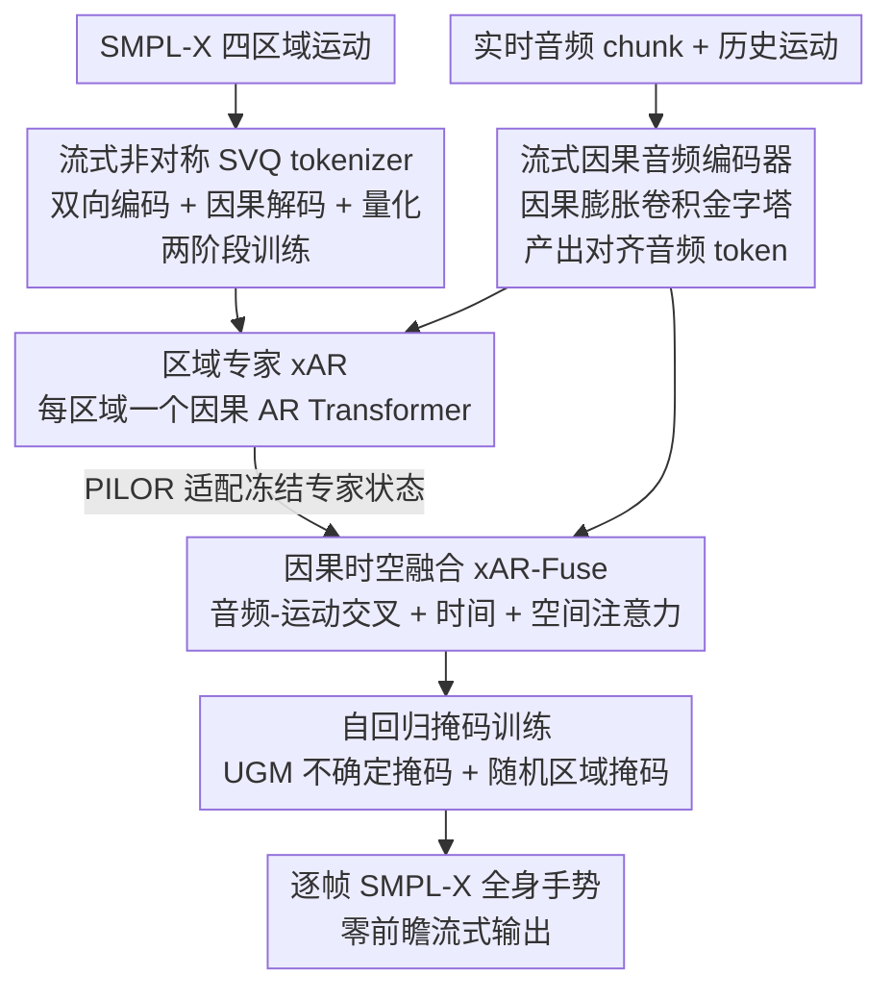

# LiveGesture: Streamable Co-Speech Gesture Generation Model

**会议**: CVPR 2026  
**论文**: [CVF Open Access](https://openaccess.thecvf.com/content/CVPR2026/html/Saleem_LiveGesture_Streamable_Co-Speech_Gesture_Generation_Model_CVPR_2026_paper.html)  
**代码**: 待确认（项目页 m-usamasaleem.github.io）  
**领域**: 人体理解 / 协同语音手势生成 / 流式自回归  
**关键词**: 流式生成, 零前瞻, 协同语音手势, 自回归, 区域专家

## 一句话总结
本文提出 LiveGesture——据称第一个**完全流式、零前瞻（zero look-ahead）**的语音驱动全身手势生成框架：用一个流式向量量化运动 tokenizer（SVQ，非对称的双向编码 + 因果解码）把每个身体区域离散成因果运动 token，再用分层自回归 Transformer（区域专家 xAR + 因果时空融合 xAR-Fuse）边收音频边逐帧生成 SMPL-X 全身手势，在 BEAT2 上以严格流式约束达到甚至超过离线 SOTA。

## 研究背景与动机

**领域现状**：协同语音手势生成（co-speech gesture）要从语音合成贴合节奏的全身动作。主流方法用连续轨迹或离散运动 token 表示，近年大量采用扩散模型（DiffSHEG、SynTalker、GestureLSM）或自回归解码器（CaMN、EMAGE）。这些方法在虚拟人、VR/AR avatar、远程呈现等场景需求旺盛。

**现有痛点**：几乎所有现有方法都是**离线**的——它们假设能拿到完整语句或长段音频/文本上下文才开始生成，延迟高、无法真正交互。即便 GestureLSM 走轻量架构提速，仍**不可流式**：必须等到完整语音段、无法随音频到达增量更新。此外，多数方法的区域表示要么把各身体部位**完全解耦**（丢失部位间细粒度依赖、缺乏全身协调），要么把所有关节**纠缠**进单一模型（难以建模各区域不同的运动分布）。

**核心矛盾**：实时交互要求**严格因果 + 零前瞻**（时刻 $t$ 只能看历史运动和当前音频，不能偷看未来），但高质量全身手势又需要**跨区域协调**（手臂-躯干耦合、左右手镜像）和**细粒度区域动态**（上肢大幅动作 vs 双手高频精细动作）。流式因果与全身协调天然冲突：常见的运动 token 解码器是双向的，未来 token 会影响当前解码，根本不能流式。

**本文目标**：构建一个零前瞻、可处理任意长度序列、低延迟（<50 ms/200 ms chunk）的流式全身手势生成器，同时保住区域协调与多样性。

**切入角度**：从"运动表示"层面就为流式而生——先做一个**严格因果可解码**的运动 tokenizer，再在其上做分层自回归：底层每个区域一个"专家"建模局部动态，顶层一个因果时空融合模块补全跨区域协调。

**核心 idea**：用一句话概括——**非对称 tokenizer（双向编码、因果解码）+ 区域专家自回归 + 因果时空融合**，把"流式因果"和"全身协调"在分层结构里各司其职地同时拿下。

## 方法详解

### 整体框架
问题设定为严格因果：时刻 $t$ 模型只收最近运动历史 $S_t=[q_{t-H+1},\dots,q_{t-1}]$、当前音频 token $a_t$、可选文本 token $w_t$，预测下一帧全身姿态 $\hat{q}_t=f_\Theta(S_t,a_t,w_t)$。LiveGesture 由两大模块串成：先用 **SVQ 运动 tokenizer** 把四个 SMPL-X 区域（上肢、下肢、双手、面部）各自的连续运动离散成因果、时间同步的运动 token；再用**分层自回归 Transformer（HAR）**：每个区域一个 xAR 专家建模局部动态、xAR-Fuse 做跨区域因果时空融合，两者都条件于流式因果音频编码器产出的音频 token。最后辅以自回归掩码训练对抗流式噪声与误差累积。

### 关键设计

**1. 流式非对称 SVQ 运动 tokenizer：让"双向质量"与"因果流式"两全**

直接训因果运动 tokenizer 质量差，因为因果解码看不到未来；但双向 tokenizer 又不能流式。本文用**非对称架构**化解：编码器 $E$ 是**双向**的 1D 卷积，聚合过去与未来上下文、并用步长卷积把帧率降 4 倍得到紧凑低速潜表示 $z^{region}=E(\{\theta_t^{region}\}),\ T=T_f/4$；而对应的因果流式解码器 $D_{CS}$ 是**严格因果**的，只能从历史潜码重建当前帧。训练分**两阶段**避免 token/embedding 坍缩：阶段一只训非对称自编码器（重建损失 $\mathcal{L}_{AE}=\lambda_{AE}\mathcal{L}_{recon}$）、学到稳定可流式的潜空间；阶段二**冻结编码器和解码器**，只加一个区域专属码本 $C^{region}=\{c_k\}_{k=1}^K$ 和投影头 $W^{region}$（小 MLP）做向量量化，$\tilde{z}_\tau=W^{region}(\hat{z}_\tau)$ 把离散码映回解码器期望的潜空间。投影头充当"学得的适配器"，吸收量化伪影、让码本更新不破坏 $D_{CS}$ 里的时序结构。阶段二损失为 $\mathcal{L}_{stage2}=\lambda_{rec}\lVert\theta^{region}-D_{CS}(W^{region}(\hat{z}^{region}))\rVert_1+\lambda_{cb}\mathcal{L}_{cb}$，码本用 EMA 更新 + 偶发重置保持良态。消融证实"冻得越多越好"：只训 Quantizer+MLP（解码器全冻）FGD 最低 4.557。

**2. 区域专家自回归（xAR）：各区域分头建模不同运动分布**

不同身体区域的运动分布差异巨大——上肢常做大幅动作、双手做高频精细手势——用单一模型纠缠所有关节难以兼顾。本文把全身分成 $\mathcal{R}=\{$上肢、下肢、双手、面部$\}$ 四区域，**每区域一个 xAR 专家**：在时刻 $t$，该专家收一段因果窗口的历史区域 token $\{x_{t-h}^r,\dots,x_{t-1}^r\}$ 和音频 token $\{a_{t-h},\dots,a_t\}$，运动 token 经 MLP 投影 + 旋转位置编码后，过一小叠因果 Transformer 块，块内交替 (i) **因果音频-运动交叉注意力**（区域 token 只能注意过去和当前音频/文本，实现节奏-手势对齐）与 (ii) **因果时间自注意力**（捕捉区域内 token 相关性），输出经 token 分类器建模 audio-condition 的离散运动分布。各专家独立训练但**共享同一音频编码器**，学会对同一音频表征做响应。

**3. 因果时空融合 xAR-Fuse + PILOR 适配器：补回全身协调**

区域专家学到丰富的局部分布，但**不显式强制全身协调**。xAR-Fuse 是一个**因果时空 Transformer**，跑在冻结的专家之上建模跨区域时空相关。由于各专家是独立训练的、隐状态 $\{h_t^r\}$ 并不天然对齐，先用轻量残差适配器 PILOR：$\Delta h_t^r=W_r h_t^r,\ \tilde{h}_t^r=h_t^r+\Delta h_t^r$，以极少参数把不同专家的输出温和地对齐到共享融合空间。融合 Transformer 每块因式分解成三层注意力：**因果音频-运动交叉注意力**（每区域 query 当前音频/文本，强化逐步的节拍与语义对齐）、**因果全局时间注意力**与**跨区域空间注意力**（显式高效地捕捉手臂-躯干耦合、镜像手势等全身时空协调）。最后用**区域专属**分类器（而非共享 MLP）输出，增强各区域细粒度表达。消融显示时间注意力最关键（去掉 FGD 4.57→15.52），空间注意力和 PILOR 各有贡献。

**4. 自回归掩码训练（UGM + RM）：抵抗流式噪声与误差累积**

流式推理时模型看到的是自己生成的、可能带错的历史，与训练时的 teacher-forcing 干净历史不匹配（exposure bias）。阶段一局部专家训练用标准自回归交叉熵 $\mathcal{L}_{local}=-\sum_r\sum_t\log p_\phi^r(x_t^r\mid x_{1:t-1}^r,a_{1:t},w_{1:t})$，并以小概率向历史 token 注入高斯噪声让专家适应轻微污染。阶段二训融合模块用**混合掩码**：**不确定性引导 token 掩码（UGM）**——按余弦退火比例 $\lambda_{UGR}(s)$ 把预测概率最低（最不自信）的 $M_{eff}(s)=\lambda_{UGR}(s)M_{max}$ 个 token mask 掉，训练早期 $\lambda\approx0$ 用干净输入学跨专家依赖、后期逐渐加重污染；**随机区域掩码（RM）**——以小概率 $p_{drop}$ 把某区域 $r_{drop}$ 的整条 token 轨迹 mask 掉，逼融合器仅凭音频和其余区域重建被掩区域。另加**分类器无关 logits 引导（CFG）**：训练随机丢音频/文本学无条件先验，推理用 $\ell_{guided}^r=\ell_{uncond}^r+\gamma(\ell_{cond}^r-\ell_{uncond}^r)$ 强化对齐。消融证实 UGM 默认调度 $\tau\in\mathcal{U}(0,0.5)$ 取得最佳折中。

### 损失函数 / 训练策略
整体两阶段：先训四个区域 xAR 专家（自回归 CE + 可选姿态重建 + 历史噪声注入）并冻结；再训 xAR-Fuse（$\mathcal{L}_{fuse}$ 在 UGM+RM 掩码下的下一 token 负对数似然）。总自回归损失 $\mathcal{L}_{AR}=\lambda_{local}\mathcal{L}_{local}+\lambda_{fuse}\mathcal{L}_{fuse}$，消融显示 $\lambda_{local}=0.3$ 最佳（专家作轻引导先验、融合器收尾协调）。流式音频编码器仅 0.5M 参数即够用。

## 实验关键数据

### 主实验
在 BEAT2 语料（EMAGE 引入，60 小时 SMPL-X 全身动作 + 25 说话人语音，1762 段对话，均长 65.66s）上评测。指标：FGD（真实性，↓）、BC（节拍一致性，→ 越接近 GT 越好）、Diversity（多样性，↑）、面部 MSE（↓）。下表对比近期 SOTA（LiveGesture 是**唯一流式**方法）：

| 方法 | 会议 | 流式 | FGD↓ | BC→ | Div.↑ | MSE↓ |
|------|------|------|------|-----|-------|------|
| TalkShow | CVPR'23 | ✗ | 6.209 | 0.695 | 13.47 | 7.791 |
| EMAGE | CVPR'24 | ✗ | 5.512 | 0.772 | 13.06 | 7.680 |
| MambaTalk | NeurIPS'24 | ✗ | 5.366 | 0.781 | 13.05 | 7.680 |
| SynTalker | MM'24 | ✗ | 4.687 | 0.736 | 12.43 | – |
| GestureLSM | ICCV'25 | ✗ | **4.247** | 0.729 | 13.76 | **1.021** |
| **LiveGesture（本文）** | Ours | **✓** | 4.57 | **0.794** | **13.91** | 1.241 |

在严格零前瞻流式约束下，LiveGesture 取得**最佳 BC（0.794）与最高多样性（13.91）**、FGD 4.57 接近离线最优 GestureLSM 的 4.25、面部 MSE 第二低。首 token 延迟仅 **250 ms**（收到首个音频 token 后生成第一帧的时间）。

### 消融实验
核心组件消融（BEAT2，去掉某模块后的退化）：

| 配置 | FGD↓ | BC→ | Div.↑ | 说明 |
|------|------|-----|-------|------|
| **完整 LiveGesture** | **4.57** | **0.794** | 13.97 | — |
| w/o 时间注意力 | 15.52 | 0.712 | 10.40 | 掉点最惨，因果时序建模必需 |
| w/o 空间注意力 | 6.64 | 0.732 | 11.56 | 跨区域协调受损 |
| w/o PILOR | 4.89 | 0.774 | 13.41 | 专家对齐不稳 |
| w/o UGR | 4.98 | 0.723 | 13.64 | exposure bias 加剧、BC 最差 |
| w/o text cues | 4.60 | 0.796 | 13.96 | 音频才是节奏主驱动 |

辅以多组分析：区域专家单独用 FGD 6.458，加 xAR-Fuse 升到 4.57（验证分层设计）；SVQ 阶段二只训 Quantizer+MLP（解码器全冻）FGD 最低 4.557；流式音频编码器仅 0.5M 参数即与 103M 的 Magic-Codec（FGD 4.51）近乎持平、且 BC 最佳。

### 关键发现
- **因果时间注意力是命门**：去掉它 FGD 从 4.57 暴涨到 15.52，说明流式场景下"沿时间的因果建模"远比局部专家本身重要。
- **音频 > 文本**：去文本几乎不掉点（FGD 4.60、BC 反升 0.796），证明节奏主要由音频驱动、文本只做轻微语义/风格点缀。
- **冻得越多越稳**：SVQ 两阶段中冻结的部分越多 FGD 越低，印证"先学稳定可流式潜空间、再轻量量化适配"的设计哲学。

## 亮点与洞察
- **非对称 tokenizer 是关键招**：编码用双向拿质量、解码用因果保流式，再两阶段冻结防坍缩——这套"双向编码 + 因果解码"范式可迁移到任何需要"高质量表示 + 实时因果生成"的序列任务（语音、视频流）。
- **分层让"流式"与"协调"解耦**：底层区域专家专注局部高频动态、顶层因果融合补全全身时空协调，避免单模型既要因果又要协调的两难，是处理"局部细粒度 vs 全局一致性"的优雅范式。
- **不确定性引导掩码对抗误差累积**：UGM 专挑模型最不自信的 token mask、模拟流式时真实会出错的历史，比随机掩码更对症，给所有自回归流式生成提供了抗 exposure bias 的可复用思路。

## 局限与展望
- ⚠️ 部分公式（如 $M_{eff}$、各损失项）在 CVF 文本中排版破碎，细节以原文为准；FGD/BC 按 $10^{-1}$、MSE 按 $10^{-7}$ 缩放呈现，跨表比较需注意量纲。
- 面部 MSE（1.241）逊于 GestureLSM（1.021），FGD 也略高于离线最优——流式因果约束在真实性上仍有一定代价，并非全面碾压离线方法。
- 仅在 BEAT2 单一语料评测，跨说话人风格、多语言、长时间漂移下的稳健性未充分验证；分层 + 四专家 + 融合的多阶段训练流程较重，复现成本不低。

## 相关工作与启发
- **vs GestureLSM（ICCV'25）**：同样追求快速推理，但 GestureLSM 仍需完整语音段、**不可流式**；LiveGesture 是真正零前瞻、可增量更新，虽 FGD 略高但延迟与交互性显著占优。
- **vs EMAGE / CaMN**：用 GPT 式解码器做统一面部+身体建模，但离线且区域纠缠；本文用区域专家 + 因果融合显式拆分局部动态与全身协调。
- **vs T2M-GPT / BAMM 等自回归运动模型**：它们 token 解码器是双向的（未来影响当前），无法流式；本文的非对称因果解码 SVQ 正是为打破这一限制而设计。

## 评分
- 新颖性: ⭐⭐⭐⭐⭐ 首个零前瞻全流式全身手势框架，非对称 tokenizer + 分层区域专家 + 因果融合的组合设计针对性强。
- 实验充分度: ⭐⭐⭐⭐ BEAT2 主对比 + 六组消融（组件/架构/tokenization/音频编码/loss 权重/掩码调度）扎实，但仅单数据集。
- 写作质量: ⭐⭐⭐⭐ 动机与模块职责讲得清楚、图示到位；CVF 版公式排版较乱影响细节核对。
- 价值: ⭐⭐⭐⭐⭐ 真正打通实时交互（250ms 首帧、可接 VITA-Audio 做人-avatar 对话），对虚拟人/VTuber/远程呈现落地意义大。

<!-- RELATED:START -->

## 相关论文

- [\[CVPR 2026\] CoordSpeaker: Exploiting Gesture Captioning for Coordinated Caption-Empowered Co-Speech Gesture Generation](coordspeaker_exploiting_gesture_captioning_for_coordinated_caption-empowered_co-.md)
- [\[ICCV 2025\] SemGes: Semantics-aware Co-Speech Gesture Generation using Semantic Coherence and Relevance Learning](../../ICCV2025/human_understanding/semges_semantics-aware_co-speech_gesture_generation_using_semantic_coherence_and.md)
- [\[AAAI 2026\] Streaming Generation of Co-Speech Gestures via Accelerated Rolling Diffusion](../../AAAI2026/human_understanding/streaming_generation_of_co-speech_gestures_via_accelerated_rolling_diffusion.md)
- [\[CVPR 2026\] Stability-Driven Motion Generation for Object-Guided Human-Human Co-Manipulation](stability-driven_motion_generation_for_object-guided_human-human_co-manipulation.md)
- [\[CVPR 2026\] HandDreamer: Zero-Shot Text to 3D Hand Model Generation](handdreamer_zero_shot_text_to_3d_hand_model_generation.md)

<!-- RELATED:END -->
