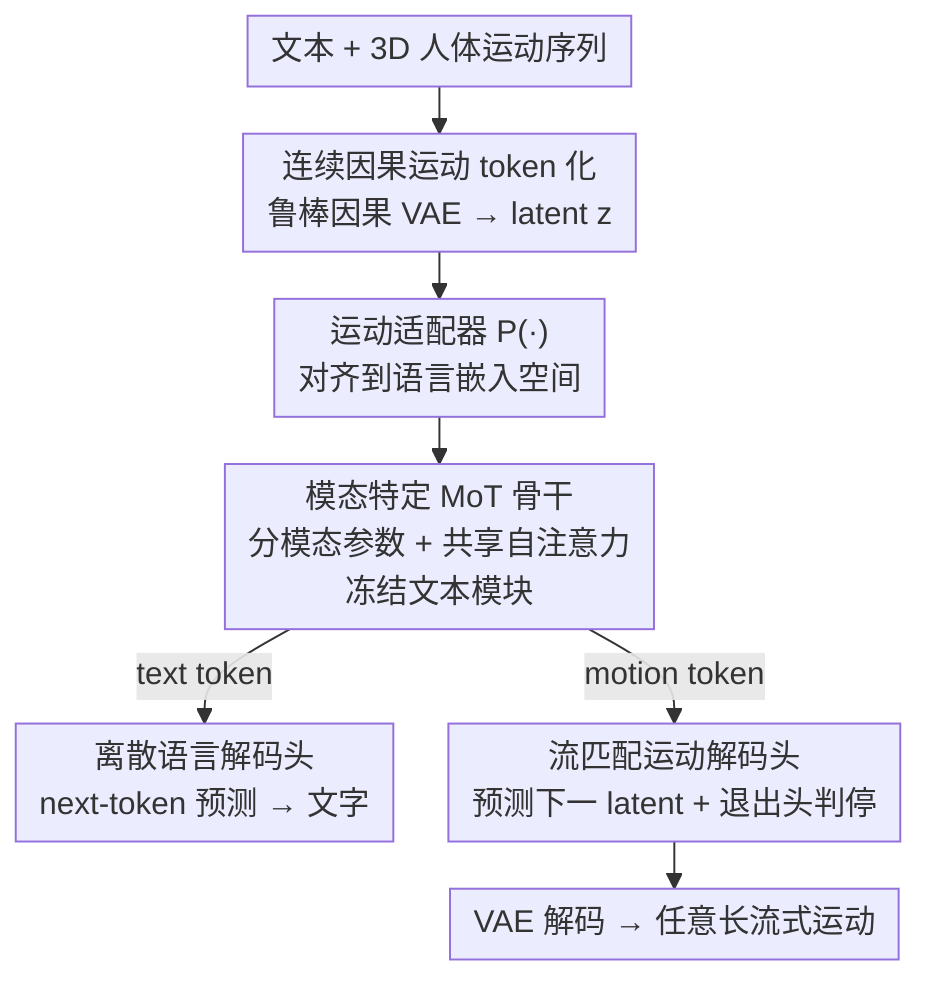

# LLaMo: Scaling Pretrained Language Models for Unified Motion Understanding and Generation with Continuous Autoregressive Tokens

**会议**: CVPR 2026  
**论文**: [CVF Open Access](https://openaccess.thecvf.com/content/CVPR2026/html/Li_LLaMo_Scaling_Pretrained_Language_Models_for_Unified_Motion_Understanding_and_CVPR_2026_paper.html)  
**代码**: https://kunkun0w0.github.io/project/LLaMo/ (项目主页)  
**领域**: 人体理解 / 运动生成与理解  
**关键词**: 人体运动, 统一多模态, Mixture-of-Transformers, 连续自回归, 流匹配

## 一句话总结
LLaMo 用"按模态分参数的 Mixture-of-Transformers + 连续因果运动 token + 流匹配解码头 + 退出头"把预训练 LLM 扩成既能"看懂动作（motion-to-text）"又能"生成动作（text-to-motion）"的统一大模型，关键是**冻结文本模块从而不损伤 LLM 原有语言能力**，并支持实时（≥30 FPS）流式、任意长度的运动生成。

## 研究背景与动机
**领域现状**：图像/视频/音频领域的统一多模态模型（UMM）已能在一个端到端框架里同时做理解与生成，靠的是海量配对数据做跨模态对齐 + 海量纯文本语料保住语言能力。

**现有痛点**：把这套搬到"人体运动-语言"上有两个硬伤。其一是**灾难性遗忘**：高质量配对的运动-文本数据（如 Mocap）远比图文稀缺昂贵，直接在这点数据上微调 LLM 的文本参数，会让模型的语言/推理能力显著退化——而后训练阶段恰恰需要强语言能力来支撑跨模态推理（prompt 改写、多模态对话等下游运动任务）。其二是**运动 token 化两难**：现有统一运动-语言模型要么用矢量量化把运动离散化（带来抖动伪影 jitter），要么用连续 token 但失去自回归生成任意长序列的能力（只能生成预设固定时长）。而人体运动本就是连续、变长的，两种方案都不理想。

**核心矛盾**：要"扩展 LLM 到运动模态"，就得动它的参数和 token 空间；可一旦动文本参数就丢语言能力，一旦用离散 token 就丢运动保真度与变长能力。

**本文目标**：在**保住 LLM 前沿纯文本性能**的前提下，让它既能理解又能自回归地生成**高保真、任意长**的 3D 人体运动。

**切入角度**：把"保语言"和"连续变长运动"拆成两条独立的工程约束分别解决——前者用按模态隔离参数的架构，后者用连续因果 latent + 流匹配的自回归头。

**核心 idea**：用模态特定 MoT 冻结文本、只更新运动参数（不忘语言），用连续因果运动 latent + 流匹配头做 next-token 预测（无量化损失、可变长），再加一个二分类"退出头"决定何时停止生成（替代离散的 [EOM] token）。

## 方法详解

### 整体框架
LLaMo 以 decoder-only 的 Llama 为骨干。输入是文本与运动交错的序列，按 `[BOS]{Text}[BOM]{Motion}[EOM]{Text}…[EOS]` 组织（[BOM]/[EOM] 是标记运动嵌入边界的特殊文本 token）。运动侧先由**因果 VAE** 把 272 维运动表征编码成连续因果 latent，再经运动适配器 $P(\cdot)$ 对齐到语言嵌入空间；文本侧照常嵌入。两类 token 一起喂进若干层 **MoT block**——每层按 token 模态选择各自的 RMSNorm/QKV/FFN 参数，但共享同一套自注意力做跨模态交互。最后接两个输出头：文本走原 LLM 的离散语言解码头（next-token 预测），运动走流匹配头（预测下一运动 token 的连续 latent），外加一个退出头判断运动序列何时结束。理解任务（motion→text）用语言头自回归出文字，生成任务（text→motion）用流匹配头自回归出运动 latent、再经 VAE 解码器还原成动作。

### 关键设计

**1. 模态特定 Mixture-of-Transformers：分参数保语言，共享注意力做对齐**

这一设计直接解决"灾难性遗忘"。痛点是：在稀缺运动-文本数据上微调 LLM 文本参数必然损伤语言能力。LLaMo 让每一层 Transformer 按输入 token 的模态走不同参数——归一化、QKV 投影、注意力输出投影、FFN 全部分成文本组（下标 T）与运动组（下标 M），但**自注意力本身是共享的**，从而保留跨模态交互。形式上，给定输入嵌入 $h$，下一层输出按模态分流：$h_{in}=\text{RMSNorm}_{T/M}(h[i])$、$h_Q,h_K,h_V=\text{QKV}_{T/M}(h_{in}[i])$、注意力后 $h_{mid}=h_O+h$、再 $h'=\text{FFN}_{T/M}(h_O[i])+h_{mid}[i]$（按 $h[i]$ 是文本还是运动选 T 或 M）。

关键在于**冻结所有文本相关模块、只训练运动相关参数**：这样语言侧的权重原封不动，LLM 的纯文本能力被完整保住，而运动能力作为"新增模态"被挂上去。作者强调这套设计是模型无关的——任何 LLM 都能这样被扩展出运动能力而不退化语言性能，这正是 LLaMo 相比"全量微调"或"参数高效微调文本参数"类方法（都会掉语言分）的根本区别。

**2. 连续因果运动 token 化 + 流匹配解码头：无量化损失地自回归生成任意长运动**

这一设计解决"运动 token 化两难"。痛点是：离散 VQ 带抖动伪影，固定长度连续 token 不能变长自回归。LLaMo 改用**因果 CNN VAE** 把运动编码进连续因果 latent（保严格时间因果、流式编码、高时间下采样率），并用 272 维运动表征（含根线/角速度、关节位置/速度/旋转，公式见原文 Eq.1）减轻逆运动学误差。但连续自回归有个隐患：流匹配采样在稠密 latent 空间里，微小偏差会逐步累积传播，要求解码器对采样噪声高度鲁棒。为此作者**不让 VAE 预测方差**，而是从均匀分布手动采样方差：$\mu=\text{Enc}_\phi(m)$，$z=\mu+\sigma\odot\epsilon,\ \epsilon\sim\mathcal N(0,I),\ \sigma\sim\mathcal U(0,C_\sigma)$（$C_\sigma=0.01$），$\hat m=\text{Dec}_\psi(z)$，得到对采样不完美鲁棒的因果 VAE；latent 维度取 $z=32$（更高维会让 MLP 流匹配头训练不稳）。

生成侧，运动解码头用**流匹配**建模"下一运动 token"的连续分布：以骨干输出的运动隐状态 $\hat h_i^{motion}$ 作为条件，轻量流匹配头 $f_\theta$ 预测速度 $v_t=\frac{dx_t}{dt}$。用 rectified flow 线性插值 $x_t=(1-t)\epsilon+t x_0$（$x_0=z$ 为干净 latent），最优传输路径 $v_t=x_0-\epsilon$，目标 $\mathcal L_{FM}=\mathbb E_{t\in[0,1]}\|f(x_t,t,\hat h_i^{motion})-v_t(x)\|$；训练时对同一 $\hat h_i^{motion}$ 把时间步 $t$ 重采样 $k=4$ 次以稳住因条件分布漂移带来的不稳定。文本侧保留原 LLM 采样：$P(x_i^{text}|x_{<i})=\text{softmax}(\hat h_i^{text}W_{text})$，理解任务用 next-token 预测损失 $\mathcal L_{NTP}$。连续表征因此既避免量化抖动、又保住高频微动态语义。

**3. 运动生成退出头：让连续自回归知道"什么时候停"**

这一设计补的是连续 token 的一个工程缺口。痛点是：离散运动 token 可以靠生成出 [EOM] token 来终止，但 LLaMo 用的是连续 latent，没有可采样的离散终止符。借鉴 TransformerTTS/SpeechT5，作者在 decoder 输出上加一个**全连接二分类器**，对"运动是否结束"做预测，并用二元交叉熵 $\mathcal L_{End}$ 训练。有了它，模型才能生成**任意长**而非预设时长的运动，支撑流式/交互场景。训练时还在输入运动 latent 上加随机噪声 $\eta\sim\mathcal N(0,0.01)$（teacher forcing 下模拟训练-推理的 token 分布差距）。三个头合起来的总损失为 $\mathcal L=\mathcal L_{FM}+\lambda_1\mathcal L_{NTP}+\lambda_2\mathcal L_{End}$。

### 损失函数 / 训练策略
为稳住这个多模态多目标大模型，作者用**三阶段训练**（配方见下）：

- **Stage 1 特征对齐**：只训运动适配器 $P(\cdot)$ + 流匹配头，把运动嵌入对齐到 LLM 表征空间，稳住后续训练；Base LR $10^{-4}$，10 万步，文/运任务比 0.5:0.5。
- **Stage 2 AR 与 FM 联合**：训练全模型（冻结因果 VAE 与文本参数）。此阶段流匹配头易出 loss spike、而运动理解目标收敛太快会主导优化，作者通过（i）降低 motion-to-text 数据采样率、（ii）text-to-motion 任务里每个运动 token 采 4 个时间步、（iii）各模块用不同 LR 调度来缓解失衡；20 万步，任务比 0.8:0.2。
- **Stage 3 运动头退火**：只精修运动预测头 + 退出头（冻结其余），提升输出质量、抑制联合训练的不稳定；5 万步，仅 text-to-motion，Head LR 走 cosine 退火到 $10^{-5}$。

数据上，作者构建超 **300 万条运动序列（3,076 小时）** 的大规模运动-文本数据集：聚合 HumanML3D、Motion-X、100-Style、BABEL、FineDance 等公开集，再用 GVHMR 从自有人体视频做 HMR 估计运动、用 Gemini-2.5Pro 生成多样运动描述（因 MotionMillion 的 LLM 改写 caption 有严重幻觉）。HumanML3D 仅占训练数据不到 1%。

## 实验关键数据

### 主实验
在 HumanML3D 上评测 text-to-motion 与 motion-to-text（尽管它 <1% 训练数据）。指标：R@k（R-Precision，越高越好）、FID（越低越好）、MM-D（MMDist，越低越好）、Div（Diversity，越接近真实越好）；caption 侧用 BLEU/ROUGE/CIDEr/BERTScore。

| 任务 / 指标 | LLaMo-3B | 代表性基线 | 备注 |
|------|------|------|------|
| Text→Motion R@1 ↑ | 0.606 | MotionMillion-7B 0.616 / MotionStreamer 0.631 | 与大规模/专家模型相当 |
| Text→Motion R@3 ↑ | 0.839 | MotionStreamer 0.859 / MoMask 0.846 | 语义对齐有竞争力 |
| Text→Motion FID ↓ | 22.491 | MotionMillion-7B 23.582 / MotionStreamer 11.790 | ⚠️ FID 在 HumanML3D 上不可靠（主要反映数据集 gap） |
| Motion→Text CIDEr ↑ | 100.8 | MotionGPT3 28.7 / MoTe 31.5 | 大幅领先（关键信息描述强） |
| Motion→Text BERTScore ↑ | 34.8 | MotionGPT3 35.2 | 句级语义高度相似 |

文本→运动上，作者观察到与 MotionMillion 一致的"规模涌现"：模型从 1B 扩到 3B 时生成质量显著提升（LLaMo-1B FID 53.942、R@1 0.541 → LLaMo-3B FID 22.491、R@1 0.606）。运动→文本上，LLaMo 是唯一不微调底座 LLM 文本参数的方法，CIDEr 却远超专家模型，但理解任务不像生成那样随规模线性变好（1B CIDEr 104.7 略高于 3B 100.8）。

### 消融实验

| 配置 | MPJPE ↓ | MPJRE ↓ | sJPE ↓ | 压缩比 Comp. ↓ | 说明 |
|------|---------|---------|--------|------|------|
| FSQ-z512-c64000（离散 VQ） | 41.9 | 6.31 | 0.710 | ×94.1% | 需 6.4 万码本仍低保真 |
| CausalTAE-z16（本文连续） | 32.3 | 6.07 | 0.738 | ×1.47% | 维度太低 |
| CausalTAE-z32（本文采用） | 10.1 | 2.58 | 0.586 | ×2.94% | 保真/稳定折中最佳 |
| CausalTAE-z64（本文连续） | 3.86 | 0.68 | 0.389 | ×5.88% | 最高保真但流匹配头不稳 |

其中 MPJPE/MPJRE 是平均关节位置/旋转误差，sJPE（Symmetric Jerk Percentage Error）用 jerk 衡量欠重建与帧级噪声，Comp. 是运动 latent 相对输入表征的存储比。

### 关键发现
- **连续因果 VAE 完胜离散 VQ**：CausalTAE-z32 的 MPJPE 仅 10.1，远低于 FSQ 的 41.9，且压缩比 ×2.94% vs ×94.1%——离散码本受限于有限码字，难以在高时间下采样下捕捉细粒度时序变化，而连续 latent 轻松压成紧凑向量。
- **latent 维度是保真-稳定的权衡**：z64 重建最好（MPJPE 3.86）但会让 MLP 流匹配头训练不稳，故取 z32。
- **"保语言"是核心卖点**：通过冻结文本模块，LLaMo 在扩出运动能力的同时维持底座 LLM 的纯文本性能，这是相对全量/文本参数微调类方法的结构性优势。
- **涌现行为**：零样本 text-to-motion 能对未见的复杂组合描述生成合理动作，甚至出现"训练从未见过非英语文本却能据此生成运动"的初步涌现。

## 亮点与洞察
- **把"保语言"做成架构约束而非训练技巧**：模态分参数 + 冻结文本，从结构上杜绝灾难性遗忘，比"加纯文本语料对冲遗忘"更干净、且模型无关，可迁移到把 LLM 扩展到任何新连续模态。
- **流匹配头 + 退出头补齐"连续自回归变长生成"**：流匹配解决连续 next-token 预测，退出头解决"何时停"，两者配合让连续 latent 也能像离散 token 那样自回归出任意长序列，是连续运动建模的关键工程拼图。
- **鲁棒 VAE 的"手动采样方差"**：不预测方差而从 $\mathcal U(0,0.01)$ 采样，强迫解码器容忍流匹配的采样噪声——一个简单却针对"误差累积"的对症设计，值得连续自回归生成借鉴。
- **诚实对待 FID**：作者明确指出 FID 在 HumanML3D 上不可靠（捕捉的是数据集分布差而非真实质量），并据此更看重 R-Precision，这种对指标局限的清醒判断对读者很有参考价值。

## 局限与展望
- **理解任务不随规模提升**：motion-to-text 上 3B 未必优于 1B（CIDEr 100.8 vs 104.7），说明"规模涌现"主要体现在生成侧，理解侧的瓶颈尚未解决。
- **FID 偏高且依赖私有数据**：HumanML3D 上 FID（22.491）显著高于在该集上专训的 MotionStreamer（11.790），虽有"FID 不可靠"的解释，但绝对生成质量在该协议下仍逊于专家模型；且核心训练数据为 300 万条自有数据集（含 Gemini 生成 caption、视频 HMR），可复现性与数据质量 ⚠️ 以原文/附录为准。
- **训练复杂**：三阶段配方 + 多 LR 调度 + 采样率/时间步调节，调参成本不低，loss spike 等不稳定问题靠工程技巧缓解。
- 改进思路：为理解任务引入更强的运动-语义对齐目标，或在 Stage 2 用更原则化的多任务平衡（而非启发式降采样），可能让理解侧也吃到规模红利。

## 相关工作与启发
- **vs MotionGPT / TM2T（微调 LLM 文本参数的统一运动模型）**：它们靠离散运动码本 + 全量或参数高效微调文本参数，会掉语言性能；LLaMo 冻结文本、用连续 latent，既保语言又免量化抖动。
- **vs MotionGPT3 [94]（MoT + 连续 latent，与本文最像）**：该工作也用 MoT 与连续运动 latent，但既不保底座语言能力、也不支持流式生成——它用 padding 预设数量的 `<motion out>` token 一次前向生成固定长度，且用非因果 VAE 限制了自回归能力；LLaMo 用因果 VAE + 退出头支持实时变长流式生成。
- **vs MotionMillion [12]（大规模 text-to-motion 专家）**：两者都验证"规模带来生成涌现"，但 MotionMillion 用离散 FSQ-VAE 且不做统一理解；LLaMo 是统一理解+生成且用连续 token，在 R-Precision 上与之相当。

## 评分
- 新颖性: ⭐⭐⭐⭐½ "冻结文本 MoT + 连续因果 token + 流匹配 + 退出头"的组合是运动-语言统一建模里少见的完整方案
- 实验充分度: ⭐⭐⭐⭐ 覆盖重建/生成/理解/零样本，但理解侧规模分析与部分细节放在附录
- 写作质量: ⭐⭐⭐⭐ 动机与设计讲得清楚，且对 FID 局限诚实；公式排版略密
- 价值: ⭐⭐⭐⭐½ 首个"扩 LLM 不损语言"的统一运动大模型，CIDEr 大幅领先、支持实时流式生成，奠基性较强

<!-- RELATED:START -->

## 相关论文

- [\[CVPR 2026\] Next-Scale Autoregressive Models for Text-to-Motion Generation](next-scale_autoregressive_models_for_text-to-motion_generation.md)
- [\[CVPR 2026\] HandX: Scaling Bimanual Motion and Interaction Generation](handx_scaling_bimanual_motion_and_interaction_generation.md)
- [\[CVPR 2026\] Humanoid-GPT: Scaling Data and Structure for Zero-Shot Motion Tracking](humanoid-gpt_scaling_data_and_structure_for_zero-shot_motion_tracking.md)
- [\[CVPR 2026\] Towards Decompositional Human Motion Generation with Energy-Based Diffusion Models](towards_decompositional_human_motion_generation_with_energy-based_diffusion_mode.md)
- [\[CVPR 2026\] Unified Number-Free Text-to-Motion Generation Via Flow Matching](unified_number-free_text-to-motion_generation_via_flow_matching.md)

<!-- RELATED:END -->
