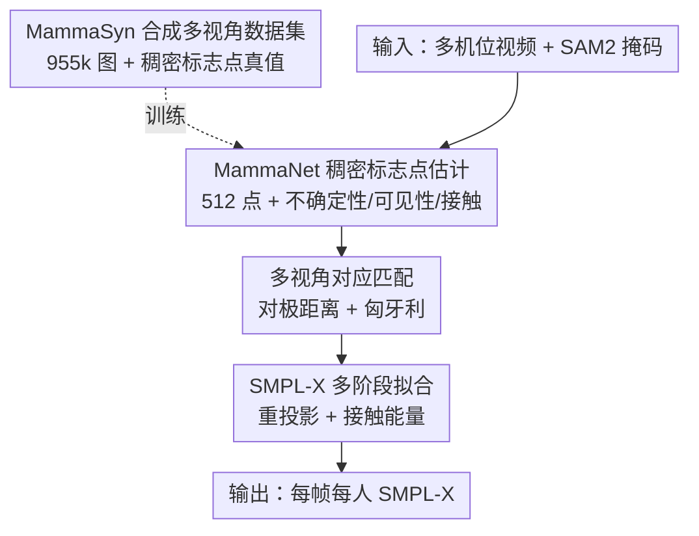

# MAMMA: Markerless Accurate Multi-person Motion Acquisition

**会议**: CVPR 2026  
**论文**: [CVF Open Access](https://openaccess.thecvf.com/content/CVPR2026/html/Velasquez_MAMMA_Markerless_Accurate_Multi-person_Motion_Acquisition_CVPR_2026_paper.html)  
**代码**: https://mamma.is.tue.mpg.de/ （项目主页）  
**领域**: 人体理解 / 多人动作捕捉  
**关键词**: 无标记动捕, SMPL-X, 稠密表面标志点, 多视角对应, 人际近距离交互

## 一句话总结
MAMMA 是一套无标记多人动作捕捉流水线：从多视角视频出发，用一个为每个标志点学独立 query 的 Transformer（MammaNet）预测 512 个接触感知、可见性感知的稠密 2D 表面标志点，再据此拟合 SMPL-X，在近距离双人交互场景下达到与商用 marker-based 系统（Vicon）仅差 0.862mm 的精度，却省掉了繁琐的贴标记和人工清洗。

## 研究背景与动机
**领域现状**：传统 marker-based 动捕（Vicon、OptiTrack、Qualisys）是精度"金标准"，但要贴光学标记、专人配置、还要花数分钟到数小时人工清洗噪声/缺失/错配的标记数据，再额外转换成 SMPL/SMPL-X 这类参数化人体模型。无标记方案想替代它，可商用无标记系统大多不开源、不报标准 benchmark、也不直接产出参数化人体。

**现有痛点**：学术界的无标记方法多为**单人**设计，或依赖**稀疏关键点**，或在遮挡与人际接触时崩溃。单目方法有深度歧义；多视角方法多只标注稀疏关键点、停在骨架层、还要再接一个带强先验的拟合阶段。更关键的是，标志点检测器通常在"人物孤立"的图上训练，遇到两人近距离交互时根本分不清"这个标志点属于谁"，也拿不到真实数据里的接触/可见性这类细粒度信息。

**核心矛盾**：精度（marker-based 金标准）与易用性/可扩展性（无标记、无人工清洗）之间长期对立；而近距离双人交互（拥抱、武术、舞蹈）这类日常但高遮挡的动作，恰恰在现有数据集里严重欠采样。

**本文目标**：做一套"自己也能搭"的无标记系统，输入多机位视频、输出每帧每人的 SMPL-X，且精度逼近商用 marker-based，重点攻克双人近距离接触场景。分解为：(i) 在重遮挡下做到 person-specific 的稠密对应；(ii) 用合成数据补齐交互/接触/可见性标注；(iii) 不靠位姿先验也能稳定拟合。

**切入角度**：基于视觉的系统相比 marker-based 有个独特优势——能利用更丰富的像素级监督信号（分割掩码、可见性、接触）来消歧。作者用 SAM2 分割掩码条件化标志点检测，并让网络直接吐出可见性与接触概率。

**核心 idea**：两阶段"先估虚拟标志点、再拟合人体"，但把稠密标志点检测器改造成**逐标志点独立 query 的 Transformer**，并附带不确定性/可见性/接触预测，使其在重遮挡与极端姿态下仍能把标志点正确归属到每个人。

## 方法详解

### 整体框架
MAMMA 输入多机位（多视角）视频，输出每帧每人的 SMPL-X 人体。整条流水线是两阶段：先在每个视角用 **MammaNet** 检测 512 个稠密 2D 表面标志点（同时输出每点的坐标、不确定性、可见性、人际接触与地面接触概率），用 SAM2 掩码条件化以区分近距离的两个人；再做**多视角对应**把各视角同一人匹配起来；最后用 L-BFGS 把 SMPL-X 投影到各标定相机、最小化重投影误差，分阶段优化出 pose/shape/translation。训练 MammaNet 所用的稠密标志点真值，则来自作者新造的合成数据集 **MammaSyn**。

### 关键设计

**1. MammaSyn 合成多视角数据集：补齐交互/接触/可见性真值**

针对"真实数据拿不到接触/可见性、且双人交互严重欠采样"的痛点。作者扩展合成数据集 BEDLAM 成 **MammaSyn**，含约 2.5M 个 crop、955k 张图，把渲染从单/少机位扩到 **32 相机虚拟多视角**配置，并专门补采两段 marker-based(Vicon) 交互数据（Latin-Dance 2 人 10 段、Interacting Couples 2 人 48 段）来填 BEDLAM 缺的高质量交互。所有人体统一为 SMPL-X 格式，保存逐人分割掩码、深度图、逐顶点可见性，并用符号距离函数（SDF）+ 表面法向算出**逐顶点的地面/人际接触标签**。稠密标志点真值用最远点采样（FPS）从 SMPL-X body 取 512 个顶点、并给手/脚/头加权多采，以照顾这些小而灵活的部位。数据集分三个子集：MammaSyn-S（单人，含 MOYO 扩位姿）、MammaSyn-I（交互，含 Hi4D/Harmony4D/Inter-X）、MammaSyn-H（手部，含 SignAvatars/Interhand2.6M 经 SMPL-X 拟合融合）。

**2. MammaNet 与 landmark queries：逐标志点独立 query 的稠密估计**

针对"标志点检测器分不清近距离两人的归属、且重遮挡下不稳"的痛点。MammaNet 用 ViT-Base 提图像特征、外加一个 CNN 处理掩码，再用 Transformer decoder 解码 $N=512$ 个表面标志点。和 CameraHMR 用**单个**可学习 embedding 一次出全部标志点不同，MammaNet 为**每个标志点学一个独立 embedding（landmark query）**：cross-attention 让每个 query 去匹配最相关的图像 patch，self-attention 则学标志点之间的两两关联。图像特征与掩码特征被编码到同一空间后**逐元素相加**完成掩码条件化。对每个标志点 $i$，网络预测像素坐标 $\mu_i=[x_i,y_i]$、不确定性 $\sigma_i$、可见性概率 $p_i$，以及人际接触 $pc_i$ 和地面接触 $fl_i$。训练用 Gaussian 负对数似然损失监督坐标+不确定性、二元交叉熵监督可见性、focal loss 监督接触（因为无接触的标志点更多、类别不均衡），各项带逐标志点权重 $\lambda_*$。作者发现可见性与接触估计对处理近距离人际交互、防止互相穿插至关重要。

**3. 多视角对应匹配：用稠密标志点几何把同一人跨视角连起来**

针对"多人多视角时谁是谁、跨视角如何一致"的痛点。先用 **SAM2** 在某帧初始化（自动检测/边界框/手点几下皆可）并沿序列传播分割来跟踪每个人，把 SAM2 的跟踪标签也赋给每个标志点预测，于是每个视角每人每帧都有 $x\in\mathbb{R}^{F\times N\times2}$ 的 2D 标志点。跨视角两两比较时，用**对称对极距离** $D_g$ 定义几何亲和度 $A_g(x_a,x_b)=\exp(-D_g/\lambda)\in[0,1]$：

$$D_g=\frac{1}{2FN}\sum_{i=1}^{FN}\big(d(x_b^i,F_{ba}x_a^i)+d(x_a^i,F_{ab}x_b^i)\big)$$

其中 $F_{ba}$ 是两视角间基础矩阵、$d(x,l)$ 是点到极线的像素距离；为避免不可见标志点带来错误，只在两视角都可见的标志点上算亲和度，可见标志点过少或 $D_g$ 超阈值则亲和度置零。各视角对之间用**匈牙利算法**在代价 $1-A_{ab}$ 上求一对一匹配，再把所有高亲和匹配跨视角对连成一张环一致（cycle-consistent）对应图，其连通分量即跨视角同一人。该设计让对应**完全靠稠密标志点的几何**完成，无需外接身份特征网络。

**4. SMPL-X 多阶段拟合：靠稠密标志点直接优化、无需位姿先验**

针对"稀疏关键点信息不足、要靠强先验初始化"的痛点。MAMMA 用 L-BFGS 把 SMPL-X 中性体 $M(\beta,\theta,t)$（16 个 shape 系数）拟合到一两个人的多视角序列，且**不用任何回归方法初始化 pose/shape**——稠密标志点本身已携带足够的人物与场景信息。优化分阶段：① 先靠重投影能量 $E_{ldmks}=\frac1C\sum_{t,c,l}\rho\big(\frac{\|\mu_{t,c,l}-\Pi(V_{t,l},Q_c)\|}{\sigma_{t,c,l}}\big)p_{t,c,l}$ 求平移与旋转（$\rho$ 为 Geman-McClure 鲁棒函数、按可见性 $p$ 加权）；② 再加 shape 先验正则 $E_{shape}$ 优化 pose/shape/translation；③ 用重投影误差 $e_i$ 反过来给不确定性降权 $\sigma_i'=\sigma_i\cdot\min(\max(\frac{e_i}{\tau},0),1)$（$\tau=10$px），处理"位置对但网络不自信"的点，并加大关节加速度惩罚 $E_{temp}$ 保时序平滑；④ 最后优化接触能量 $E_{cont}=E_p+E_c$：排斥项 $E_p$ 惩罚插入对方身体的顶点（$\delta$ 容许少量软组织形变），吸引项 $E_c$ 把接近表面的点按预测接触概率拉到接触。总能量 $E=E_{ldmks}+E_{shape}+E_{temp}+E_{cont}$；SDF 用自研 CUDA kernel 全 GPU 加速。

### 损失函数 / 训练策略
MammaNet 仅用合成数据 MammaSyn 训练，输入分辨率 $512\times384$。损失：标志点坐标+不确定性用 Gaussian NLL、可见性用 BCE、人际/地面接触用 focal loss，均带逐标志点权重。推理侧拟合用 L-BFGS、四阶段能量优化，假设相机标定已知。

## 实验关键数据

评测覆盖单人（RICH、MOYO、MammaEval-S）与双人交互（Harmony4D、CHI3D、Hi4D、MammaEval-D），并与 marker-based Vicon+MoSh++ 做独立 held-out marker 对比。

### 主实验：2D 稠密标志点误差（像素，越低越好）

| 模型 | RICH(单) | MOYO(单) | MammaEval-S(单) | Harmony4D(双) | CHI3D(双) | MammaEval-D(双) |
|------|---------|---------|-----------------|---------------|-----------|-----------------|
| Look-Ma* | 13.26 | 22.43 | 10.25 | 31.45 | 8.77 | 15.01 |
| CameraHMR | 8.84 | 12.53 | 6.32 | 32.84 | 6.30 | 10.21 |
| MammaNet (ours) | 8.55 | 11.40 | 6.09 | 31.96 | 6.22 | 9.87 |
| MammaNet +SAM2 掩码 | 8.83 | 11.04 | 6.16 | **18.33** | **4.36** | **7.70** |

掩码条件化在单人场景只带来边际增益，但在**双人交互上提升巨大**（Harmony4D 从 31.96→18.33），印证掩码主要价值在于"在重叠时区分目标个体"。双人评测限定两人 IoU>0.5 的图。

### 3D 拟合误差与穿插

| 数据集 / 指标 | SMPLify-X | Look-Ma* | CameraHMR | MAMMA | MAMMA-C |
|--------------|-----------|----------|-----------|-------|---------|
| MammaEval-D MPJPE↓ | 53.92 | 27.98 | 20.41 | **17.71** | 17.73 |
| MOYO MPJPE↓ | 62.15 | 60.15 | 33.75 | **22.95** | **22.95** |
| Harmony4D MPJPE↓ | – | 59.37 | 58.59 | 45.26 | 45.35 |
| Hi4D MPJPE↓（19 关节） | – | – | – | – | **12.44** |
| 平均穿插深度(mm)↓ | – | 13.73 | 13.41 | 10.50 | **8.46**（GT 9.84） |

注：MAMMA 即便不做接触优化也已优于此前方法；加上接触优化的 MAMMA-C 把穿插深度从 10.50 降到 8.46，甚至**低于 GT 的 9.84mm**，穿插顶点数也从 456→378。在 Hi4D 上（网络已剔除 Hi4D 训练序列）MPJPE 12.44mm，大幅超越 AvatarPose(32.10) 等多视角方法。

### 关键发现
- **掩码对双人交互是关键变量**：单人几乎不变、双人大幅提升，说明 MammaNet 的瓶颈不在"看不看得见标志点"，而在"标志点该归给谁"，SAM2 掩码正好补上这一歧义。
- **对应匹配 100% 准**：仅凭稠密标志点+可见性，跨视角身份匹配做到 100% 准确，无需外接身份特征网络——稠密标志点本身几何信息足够丰富。
- **接触优化只对人际有用**：优化人际接触能降穿插、提质量；但优化**地面**接触没带来提升，说明网络标志点本身已足够鲁棒。
- **逼近金标准**：held-out marker 上 Vicon+MoSh++ 误差 21.619mm、MAMMA 22.481mm，仅差 0.862mm，作者据此主张无标记方案可替代传统 pipeline，并把"采集→SMPL-X"全流程从约 72 小时压到 26 小时（消费级 GPU，约快 3 倍）。⚠️ "72→26 小时""快近 3 倍"为论文正文数字，细节在补充材料。

## 亮点与洞察
- **逐标志点 query 的设计很巧**：把 CameraHMR 的"单 token 出全部点"换成"每点一个 query"，让 cross-attention 天然学到"点↔patch"对齐、self-attention 学点间关联，是其在极端姿态（如从未训练过的 MOYO 瑜伽）也能泛化的关键。
- **像素级监督消歧的思路可迁移**：用 SAM2 掩码条件化 + 把跟踪标签赋给标志点，既区分了近距离两人、又顺手给多视角对应提供了身份线索，这种"分割驱动的对应"可复用到任何多人多视角任务。
- **接触建模反超 GT**：用 SDF 排斥+吸引能量把穿插压到比 ground truth 还低，揭示了"金标准"本身也带穿插噪声，对评测指标提出了 caveat。
- **不确定性反向降权这一招**：用第二阶段已接近最优的重投影误差去校正网络过高的不确定性，是个实用的"自洽"技巧。

## 局限与展望
- **依赖标定与多视角**：假设相机标定已知，且对应/拟合都需多视角，单帧/单目无法恢复全局平移旋转（作者也据此不与单帧方法比较）。
- **SAM2 掩码会缺块**：两人太近时 SAM2 可能漏掉部分身体，导致标志点预测次优；虽然作者称方法仍鲁棒，但这是误差来源之一。
- **纯合成训练的域差**：MammaNet 只在合成 MammaSyn 上训练，真实复杂场景的域差风险需更多真实评测验证。
- **手部等关键数值在补充材料**：body/hand 分开的误差、不同相机数/优化阶段的消融均在 SupMat，正文给出的"约 3 倍提速"等数字 ⚠️ 以原文与补充材料为准。

## 相关工作与启发
- **vs CameraHMR**：同 ViT-Base 骨干，但 CameraHMR 用单个 learnable token 出全部标志点；MAMMA 改成逐标志点 query，遮挡/极端姿态更鲁棒，2D 误差更低。
- **vs Look-Ma\*（Hewitt et al. 复现）**：去掉 pose/shape 头只留标志点头作公平对比，MammaNet 在单/双人、2D/3D 上全面更准。
- **vs 多视角骨架方法（MvP/4DAssociation/AvatarPose）**：它们多停在稀疏骨架、需额外强先验拟合；MAMMA 直接预测稠密表面标志点，足以无先验地解出 SMPL-X body+hand，Hi4D 上 MPJPE 大幅领先。
- **vs marker-based Vicon+MoSh++（金标准）**：held-out marker 误差仅差 0.862mm、动画视觉上无法区分，却省掉贴标记与人工清洗，主张可作为新的"伪 ground truth"来源。

## 评分
- 新颖性: ⭐⭐⭐⭐ 逐标志点 query + 接触/可见性感知稠密标志点 + 分割驱动对应，组合新颖且针对性强
- 实验充分度: ⭐⭐⭐⭐⭐ 单/双人、2D/3D、接触、对应、对标 Vicon 金标准，benchmark 与消融都很扎实
- 写作质量: ⭐⭐⭐⭐ 动机—方法—实验逻辑清晰，能量项与对应公式交代明确
- 价值: ⭐⭐⭐⭐⭐ 让无标记动捕逼近金标准并大幅提效，配套合成数据与双 benchmark，落地价值高

<!-- RELATED:START -->

## 相关论文

- [\[CVPR 2026\] HUM4D: A Dataset and Evaluation for Complex 4D Markerless Human Motion Capture](hum4d_markerless_motion_capture.md)
- [\[CVPR 2026\] EgoPoseFormer v2: Accurate Egocentric Human Motion Estimation for AR/VR](egoposeformer_v2_accurate_egocentric_human_motion_estimation_for_arvr.md)
- [\[AAAI 2026\] Spatiotemporal-Untrammelled Mixture of Experts for Multi-Person Motion Prediction](../../AAAI2026/human_understanding/spatiotemporal-untrammelled_mixture_of_experts_for_multi-person_motion_predictio.md)
- [\[CVPR 2026\] MFEN: Multi-Frequency Expert Network for Visible-Infrared Person Re-ID](mfen_multi-frequency_expert_network_for_visible-infrared_person_re-id.md)
- [\[CVPR 2026\] GazeOnce360: Fisheye-Based 360° Multi-Person Gaze Estimation with Global-Local Feature Fusion](gazeonce360_fisheye-based_360deg_multi-person_gaze_estimation_with_global-local_.md)

<!-- RELATED:END -->
