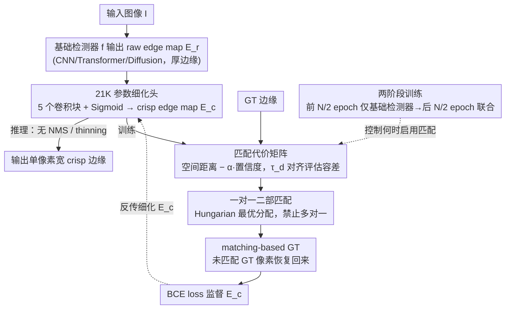

# MatchED: Crisp Edge Detection Using End-to-End, Matching-based Supervision

**会议**: CVPR 2026  
**arXiv**: [2602.20689](https://arxiv.org/abs/2602.20689)  
**代码**: [https://cvpr26-matched.github.io](https://cvpr26-matched.github.io)  
**领域**: 人体理解 / 边缘检测  
**关键词**: 边缘检测, crisp edges, 二部匹配, 即插即用, 端到端训练

## 一句话总结

MatchED 提出一种轻量（约21K参数）plug-and-play 模块，通过在训练时对预测边缘和 GT 边缘进行基于空间距离+置信度的 one-to-one 二部匹配来生成 crisp（单像素宽）边缘图，可附加到任何边缘检测器端到端训练，首次在不依赖 NMS+thinning 后处理的情况下匹配或超越标准后处理方法。

## 研究背景与动机

**领域现状**：边缘检测是计算机视觉的基础问题，支撑深度估计、语义分割、图像生成等下游任务。现代深度学习边缘检测器（HED、RCF、PiDiNet、RankED、SAUGE 等）在检测精度上取得了显著进展，但几乎所有方法都依赖一套标准后处理流程来产生最终的单像素宽边缘图：先做 Non-Maximum Suppression (NMS)，再做 skeleton-based thinning。

**现有痛点**：NMS 和 skeleton thinning 是手工设计的非可微算法，完全阻断了端到端优化路径。这导致三个核心问题：(i) 训练时优化的是"厚"边缘概率图，测试时用后处理得到"薄"边缘，训练-测试协议不一致；(ii) 后处理的超参数（NMS 窗口大小、边界衰减等）需要额外调参且无法通过梯度优化；(iii) 少数尝试直接生成 crisp 边缘的方法（LPCB、CATS、DiffusionEdge、CPD 等）仍然在加入后处理后才能达到满意性能。

**核心矛盾**：边缘标注本身存在空间不精确性（人工标注偏差），导致预测和 GT 之间存在位置偏移。模型为了覆盖这种偏移，倾向于输出较厚的边缘响应以"对冲"标注噪声。唯一尝试解决此问题的 GLR 方法在训练前用固定的 Canny 引导来细化标签，但无法随训练过程动态适应模型的演化预测。

**本文目标** (a) 如何让边缘检测器直接输出单像素宽的 crisp 边缘？(b) 如何让训练目标与测试评估保持一致？(c) 如何设计一个通用模块可以附加到任何现有检测器？

**切入角度**：作者从目标检测中的匹配思想（如 DETR 的二部匹配）获得灵感——如果能在每次训练迭代中，对预测边缘像素和 GT 边缘像素建立 one-to-one 的最优匹配，那么每个预测像素只被分配给一个 GT 像素，自然就不会产生"多个响应对应同一个 GT"的厚边缘问题。匹配中同时考虑空间距离和置信度，且距离阈值与评估协议一致，确保训练-测试一致性。

**核心 idea**：用可微的匹配式监督替代不可微的后处理，通过训练时的预测-GT 二部匹配直接产生 crisp 边缘。

## 方法详解

### 整体框架

MatchED 的 pipeline 非常简洁：给定任意边缘检测器 $f$（CNN/Transformer/Diffusion-based），其输出 raw edge map $\mathbf{E}_r = f(I; \theta_r)$，MatchED 作为一个轻量 CNN 附加在 $f$ 的最后一层之后，将 raw edge map 细化为 crisp edge map $\mathbf{E}_c = \text{MatchED}(\mathbf{E}_r; \theta_c)$。训练时，MatchED 在每个 iteration 执行预测和 GT 之间的二部匹配，生成 matching-based GT，然后用 BCE loss 优化。推理时直接输出 crisp edge map，无需 NMS 或 thinning。

### 关键设计

**1. 匹配代价矩阵：把"距离"和"置信度"一起编码进代价**

要让匹配真正消除厚边缘，关键是匹配代价怎么算。MatchED 在每次训练迭代里，为每对（预测像素 $\mathbf{p_c}$、GT 像素 $\mathbf{p_g}$）算一个代价：只有同时满足三个条件——预测置信度达到阈值 $\tau_c$、该 GT 位置确实是边缘、两者曼哈顿距离在 $\tau_d$ 之内——代价才是有限值，否则记为无穷大（不允许匹配）。有限代价取

$$\text{cost}(\mathbf{p_c}, \mathbf{p_g}) = d(\mathbf{p_c}, \mathbf{p_g}) - \alpha \cdot \mathbf{E}_c(\mathbf{p_c})$$

即"空间距离减去置信度加权项"。这三个条件各管一件事：置信度门槛把低响应噪声挡在匹配之外，GT 边缘条件保证只往真实边缘上配，距离阈值 $\tau_d$ 把匹配限制在局部邻域。最关键的是 $\tau_d$ 直接对齐评估协议里判定"命中"的容差半径——训练时认可的偏移范围和测试时打分的范围一致，从源头上保证了训练-测试一致性。而代价里减去置信度项，意味着越自信的预测代价越低、越容易被选中，从而鼓励模型把响应集中到少数高置信像素上。

**2. 一对一二部匹配：用最优分配从机制上禁止"多个响应抢同一个 GT"**

厚边缘的本质是多个预测像素同时对同一段 GT 边缘做出响应。MatchED 在上面的代价矩阵上用 Hungarian 算法求最优排列，使总代价最小，得到一组 one-to-one 分配，再据此构造 matching-based GT。一对一是消除膨胀的核心：当好几个预测像素都想配同一个 GT 像素时，最优分配只会留下代价最低的那一个，其余像素在这一轮就被当作非边缘监督。模型被反复这样监督后，自然学会把响应收窄到单像素宽，而不是靠"加厚"来对冲标注偏移。举个直观的过程：某段 GT 边缘附近这一轮有 3 个高置信预测像素竞争，匹配只保留最贴近的 1 个、把另外 2 个压成背景；下一轮模型在这 2 个位置就不再乱发响应——边缘逐步被"逼"到一条线上。对于那些在 $\tau_d$ 范围内暂时没有任何预测响应的 GT 边缘像素，MatchED 会把它们直接恢复进 matching-based GT，避免这些位置因无人匹配而被永久丢弃，保证后续迭代里模型有机会重新覆盖它们。

**3. 21K 参数的细化头：轻到可以挂在任何检测器后面**

要做到"附加到任何边缘检测器"，这个细化模块本身必须几乎没有开销。MatchED 就是一个极小的 CNN，由 5 个标准卷积块（Conv2D + ReLU + Normalization）串成、末端接 Sigmoid，总参数量约 21K——挂到轻量的 PiDiNet 上只增加约 3% 参数，挂到大模型上增幅不到 0.02%。它本身并不"聪明"，真正驱动它把 raw edge map 细化成 crisp edge map 的是上面那套匹配式监督；架构刻意保持简单，是为了让它名副其实地即插即用，而不引入新的调参负担或显著推理成本。

**4. 两阶段训练：先让基础模型站稳，再上匹配监督**

匹配监督有个前提——只有当基础检测器已经能输出大致合理的边缘响应时，预测和 GT 之间的最优匹配才有意义；若一开始预测全是噪声，匹配出来的目标也是噪声。为此 MatchED 把训练切成两段：前 $N/2$ 个 epoch 只训练基础检测器，让它先学会"边缘大概在哪"；后 $N/2$ 个 epoch 再把检测器和 MatchED 联合训练，此时匹配建立在可靠响应之上，细化头才能稳定地把厚边缘收成单像素宽。

### 损失函数 / 训练策略

总损失为基础模型损失和 MatchED 损失的加权组合：

$$\mathcal{L}_{\text{total}} = \beta \cdot \mathcal{L}_{\text{MatchED}} + \mathcal{L}_f$$

MatchED 损失是预测边缘图和 matching-based GT 之间的二元交叉熵。$\beta$ 控制权重。基础检测器使用其原始损失函数（PiDiNet 用加权 BCE，RankED 用 ranking loss 等），MatchED 对此完全透明。

## 实验关键数据

### 主实验

四个数据集（BSDS500/NYUDv2/BIPED-v2/Multi-Cue），四种基础模型，CEval 为无后处理评估：

| 数据集 | 模型 | CEval ODS | CEval OIS | CEval AC | 提升 vs 原模型 |
|--------|------|-----------|-----------|----------|------------|
| BSDS | PiDiNet+MatchED | .800 | .811 | .866 | ODS +0.222, AC +0.717 |
| BSDS | RankED+MatchED | .789 | .795 | .600 | ODS +0.188, AC +0.438 |
| BSDS | SAUGE+MatchED | .809 | .813 | .818 | ODS +0.156, AC +0.631 |
| BSDS | DiffEdge+MatchED | .830 | .839 | .875 | ODS +0.084, AC +0.474 |
| NYUDv2 | PiDiNet+MatchED | .736 | .749 | .930 | ODS +0.337, AC +0.757 |
| NYUDv2 | RankED+MatchED | .775 | .784 | .886 | ODS +0.298, AC +0.740 |
| NYUDv2 | DiffEdge+MatchED | .759 | .762 | .937 | ODS +0.032, AC +0.074 |
| BIPED-v2 | PiDiNet+MatchED | .900 | .905 | .971 | 超过后处理版本 |

与 crisp edge detection SOTA 对比（AC 指标）：

| 方法 | BSDS AC | Multi-Cue AC | BIPED AC |
|------|---------|-------------|----------|
| PiDiNet+Dice | .306 | .208 | .340 |
| DiffusionEdge | .401 | .498 | .879 |
| **MatchED** | **.875** | **.846** | **.971** |

### 消融实验

在 BSDS 上用 PiDiNet 分析超参数（baseline ODS=.789, OIS=.803）：

| 超参数 | 设置 | ODS | OIS | AP | 说明 |
|--------|------|------|------|----|------|
| 置信度阈值 | 0.01 | .800 | .811 | .866 | 最优 |
| 置信度阈值 | 0.10 | .799 | .808 | .836 | 仍优于 baseline |
| 置信度阈值 | 0.30 | .761 | .771 | .803 | 过高时下降 |
| 距离阈值 | 2 | .797 | .807 | .856 | 较鲁棒 |
| 距离阈值 | 4 | .800 | .811 | .866 | 最优 |
| 置信度权重 | 5 | .630 | .639 | .653 | 过低 |
| 置信度权重 | 25 | .800 | .811 | .866 | 最优范围 |

运行时间对比（NYUD 测试集 654 张，CPU）：

| 方法 | 时间(s) |
|------|---------|
| NMS | 25.69 |
| NMS + Thinning (x100) | 1875.57 |
| **MatchED** | **32.98** |

### 关键发现

- **AC 提升 2-4 倍**：MatchED 显著提升边缘锐度，BSDS 上 PiDiNet 的 AC 从 0.149 到 0.866
- **首次匹配或超越标准后处理**：SAUGE+MatchED 在 BSDS 的 CEval ODS .809 超过 SEval .808
- **对 MatchED 输出再做后处理无改善反而降低性能**，证明输出已是 crisp 的
- **跨四种架构（CNN/Transformer/Diffusion/SAM）均有效**，验证通用性
- **21K 参数开销极低**，推理时间远低于完整后处理流程

## 亮点与洞察

- **匹配式监督是核心创新**。将二部匹配从目标检测迁移到像素级边缘检测，用 one-to-one 约束自然消除边缘膨胀。匹配代价编码空间距离+置信度且距离阈值与评估协议对齐，实现训练-测试一致性
- **真正的 plug-and-play 设计**。只需附加 21K 参数 CNN 和匹配损失，不修改原模型架构或损失。验证了 CNN/Transformer/Diffusion 三种范式的通用性
- **"后处理杀手"**。边缘检测数十年标配 NMS+thinning，MatchED 首次证明可以不用。对所有依赖非可微后处理的像素级预测任务都有参考意义
- **未匹配 GT 恢复策略**。保留无预测响应的 GT 边缘到匹配 GT 中，防止信息丢失，确保后续迭代可学习

## 局限与展望

- **GPU 显存开销**：320x320 输入时匹配矩阵达 28.32 GB，需 patch-wise 处理，高分辨率可扩展性有限
- **需要重新训练**：超参调整需重训，不如 NMS 可即时调整
- **RankED 下采样问题**：0.25x 分辨率产生的插值伪影影响匹配效果
- **仅四个标准数据集**：缺乏复杂真实场景评估（自动驾驶、工业检测等）
- **Hungarian 算法复杂度**：极密集边缘场景下 $O(n^3)$ 可能成为瓶颈

## 相关工作与启发

- **vs DiffusionEdge**: 最强 crisp edge SOTA，但仍需后处理。MatchED 作为 plug-in 进一步提升其 AC (+0.474 on BSDS)
- **vs LPCB (Dice loss)**: 通过损失改进鼓励 crisp 边缘，但仍产生厚预测。MatchED 从匹配层面根本解决多对一问题
- **vs GLR**: 训练前固定标签细化，无法动态适应。MatchED 每个 iteration 动态匹配
- **vs DETR**: 匹配思想源自 DETR，但从实例级扩展到像素级，代价矩阵设计完全不同

## 评分

- **新颖性**: ⭐⭐⭐⭐ 将二部匹配从目标检测迁移到像素级边缘检测，首次实现无后处理 crisp 边缘
- **实验充分度**: ⭐⭐⭐⭐⭐ 四数据集四架构、详细消融、运行时间/参数量分析、定性可视化
- **写作质量**: ⭐⭐⭐⭐ 问题定义清晰，方法简洁，contribution 明确
- **价值**: ⭐⭐⭐⭐ post-processing-free 端到端方案，匹配式监督可推广到其他像素级任务

<!-- RELATED:START -->

## 相关论文

- [\[CVPR 2026\] UniLS: End-to-End Audio-Driven Avatars for Unified Listening and Speaking](unils_end-to-end_audio-driven_avatars_for_unified_listening_and_speaking.md)
- [\[CVPR 2025\] CryptoFace: End-to-End Encrypted Face Recognition](../../CVPR2025/human_understanding/cryptoface_end-to-end_encrypted_face_recognition.md)
- [\[CVPR 2025\] WiLoR: End-to-end 3D Hand Localization and Reconstruction in-the-wild](../../CVPR2025/human_understanding/wilor_end-to-end_3d_hand_localization_and_reconstruction_in-the-wild.md)
- [\[CVPR 2026\] FlexAvatar: Learning Complete 3D Head Avatars with Partial Supervision](flexavatar_learning_complete_3d_head_avatars_with_partial_supervision.md)
- [\[CVPR 2026\] FMPose3D: monocular 3D pose estimation via flow matching](fmpose3d_monocular_3d_pose_estimation_via_flow_matching.md)

<!-- RELATED:END -->
