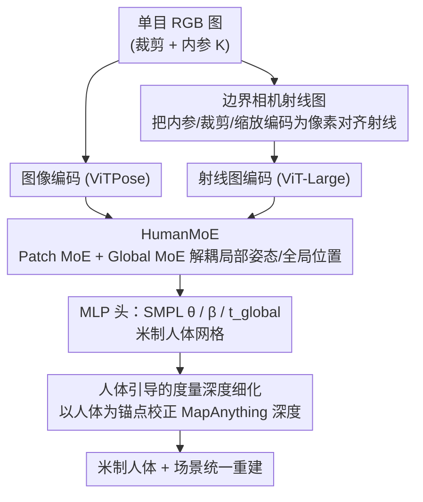

# MetricHMSR: Metric Human Mesh and Scene Recovery from Monocular Images

**会议**: CVPR 2026  
**论文**: [CVF Open Access](https://openaccess.thecvf.com/content/CVPR2026/html/Song_MetricHMSR_Metric_Human_Mesh_and_Scene_Recovery_from_Monocular_Images_CVPR_2026_paper.html)  
**代码**: [项目页](https://Metaverse-AI-Lab-THU.github.com/MetricHMSR)（论文给出，⚠️ 链接以原文为准）  
**领域**: 3D视觉 / 人体理解  
**关键词**: 人体网格恢复, 度量尺度, 单目深度, Mixture-of-Experts, 相机射线图

## 一句话总结
MetricHMSR 用一张单目图像同时恢复带真实物理尺度（米制）的人体 SMPL 网格和 3D 场景：核心是用「边界相机射线图」把相机内参和裁剪信息显式编码进网络、用 HumanMoE 把局部姿态与全局位置解耦，再以恢复出的度量人体为几何锚点去校正单目深度，从而在人体网格恢复和度量人-场景重建两个任务上都达到 SOTA。

## 研究背景与动机

**领域现状**：从单图恢复人体网格（HMR）是经典任务，自 HMR 以来主流方法不断提升 2D 对齐和局部姿态的精度，但大多停留在「看起来合理」的层面。

**现有痛点**：真正的**度量级**重建——人有多高、站在离相机多少米的位置——很少被认真对待。早期方法用弱透视假设简化相机投影，根本无法恢复绝对尺度；后续工作即便改进相机建模，也要么偏离真实成像条件，要么把局部姿态和全局平移**耦合**在同一套特征里难以拆开。另一条路是外挂额外的轨迹估计模块或直接调用单目度量深度估计（MMDE），但前者堆复杂度、后者把精度上限锁死在外部深度预测器上。

**核心矛盾**：单目存在尺度歧义，而裁剪 + 缩放（HMR 标准预处理）又进一步破坏了网络感知米制信息的能力；同时 ViT 把所有 patch 一视同仁地整体处理，无法区分不同身体区域对度量恢复的不同贡献。

**本文目标**：在不引入专用外部模块的前提下，用一个统一网络同时回归局部姿态、米制体型、米制位置，并进一步把场景深度也拉到同一物理尺度。

**切入角度**：作者的三点洞察——(1) 相机内参和边界框信息其实和人的 3D 位置强相关；(2) 近期基座模型（如 MapAnything/VGGT）证明所有 3D 属性可由统一架构学到，不必加专用模块；(3) 特征解耦是有益的。

**核心 idea**：用「边界相机射线图」给网络喂显式米制线索、用 MoE 把局部姿态和全局位置解耦，再让恢复出的度量人体当几何锚点去校正单目深度。

## 方法详解

### 整体框架
MetricHMSR 由两大件串联：**MetricHMR**（恢复米制人体网格）+ **人体引导的度量深度细化模块**（恢复米制场景）。给定一张 RGB 图，先把裁剪后的人体图像与其对应的「边界相机射线图」分别用 ViTPose、ViT-Large 编码并拼接，送入 HumanMoE（含 Patch MoE 与 Global MoE），再由三个 MLP 头分别预测 SMPL 姿态 $\theta \in \mathbb{R}^{72}$、体型 $\beta \in \mathbb{R}^{10}$、全局平移 $t_{global} \in \mathbb{R}^3$，得到处于米制 3D 空间的人体网格。随后把 MapAnything 预测的初始深度交给一个 UNet–ViT 混合骨干，以投影后的人体网格深度作为稀疏锚点做逐像素仿射校正，输出几何一致的米制深度，最终得到人体与场景统一在真实尺度下的重建。

### 关键设计

**1. 边界相机射线图：把内参与裁剪显式编码成像素级米制线索**

针对「裁剪缩放破坏米制感知、网络又用不好焦距-2D位置-3D位置的关联」这个痛点，作者引入一张与图像像素对齐的相机射线表示。对原图内参 $K$（焦距 $f_x,f_y$、主点 $c_x,c_y$），像素 $(u,v)$ 对应的相机射线为 $d = K^{-1}[u,v,1]$。关键在于：当图像被裁剪到边界框左上角 $(u_{bbox}, v_{bbox})$、并按因子 $s$ 缩放时，变换后图像的内参可写成闭式

$$K' = \begin{bmatrix} f_x/s & 0 & (c_x-u_{bbox})/s \\ 0 & f_y/s & (c_y-v_{bbox})/s \\ 0 & 0 & 1 \end{bmatrix}$$

再用 $K'$ 算出每个像素的射线束，作为一张与裁剪图同分辨率的「射线图」喂进网络。这样裁剪偏移、缩放比例、相机内参全都被隐式打包进同一张图里，缓解了 CLIFF 等方法因裁剪带来的位置歧义。内参未知时用 AnyCalib 估计，或用图像长边近似焦距、主点取图心。

**2. HumanMoE：用混合专家把局部姿态与全局位置解耦**

传统 HMR 用单一稠密 MLP/Transformer 解码器，既难以同时表达「局部姿态 / 米制体型 / 米制位置」在不同场景下的变化，也难以解耦层级化的图像特征。HumanMoE 把稠密 Transformer 块里的 FFN 换成 **Soft MoE**：每个专家收到的是 token 的加权组合（而非硬性 top-K 路由），训练更稳、专家更易扩展。MoE 输出为 $\mathrm{MoE}(x)=\sum_{i=0}^{K} g_i(x)\,e_i(x)$，其中 $g_i$ 是路由门控权重。结构上设 4 个**路由图像专家**学专门视觉知识、1 个**共享图像专家**学通用知识（避免各专家重复学通用模式）、再加 1 个**射线专家**专门处理射线 token。

HumanMoE 进一步拆成 **Patch MoE**（按 patch 语义把不同身体区域路由到不同专家，实现显式特征级解耦）和 **Global MoE**（聚合全图、捕捉整体上下文）两条互补支路。作者在 3DPW 上统计最深一层 MoE 的路由热力图，发现不同身体关节稳定地被分到不同专家、跨图像的同一部位又倾向同一专家，说明出现了**涌现的语义专门化**。为防路由塌缩，加了软负载均衡辅助损失 $\mathcal{L}_{aux} = \lambda K \sum_{i=1}^{K} p_i^2$（$p_i$ 是专家 $i$ 在 batch 内的平均路由概率），当各专家被均匀使用即 $p_i=1/K$ 时取最小，仅作用于路由图像专家。

**3. 人体引导的度量深度细化：用米制人体当几何锚点校正单目深度**

已有工作（如把人 inpaint 进图再用 HMR2.0 估网格当尺度参考）受限于 HMR2.0 既不恢复米制体型也不恢复全局 3D 位置，只能做全局缩放。MetricHMR 恢复出的是处在米制 3D 空间的人体网格，因此能当**逐像素**的几何参照。具体地，给定 MapAnything 预测的初始深度 $z_{in}(x)$，用 UNet–ViT 混合骨干预测空间变化的仿射场 $(s(x), b(x))$ 来校正：$\hat{z}(x)=s(x)\,z_{in}(x)+b(x)$，仿射场局部自适应但被正则化得全局平滑。为把解锚定到绝对米制，把人体网格投影到图像、取可见表面的逐像素深度构成稀疏锚点图 $z_{hmr}(x)$ 及掩码 $M_a(x)$，训练时在这些像素上施加锚点一致性损失。总损失 $\mathcal{L} = \lambda_d \mathcal{L}_{depth} + \lambda_a \mathcal{L}_{anchor} + \lambda_{tv}\mathcal{L}_{tv} + \lambda_{var}\mathcal{L}_{var}$，分别是有效像素深度回归、锚点一致性、$(s,b)$ 的全变分平滑、以及让 $(s,b)$ 贴近全局均值的方差正则。

### 损失函数 / 训练策略
MetricHMR 的训练目标是一个**过完备（over-complete）损失**：$\mathcal{L} = \lambda_{J_{2D}}\mathcal{L}_{J_{2D}} + \lambda_{J_{3D}}\mathcal{L}_{J_{3D}} + \lambda_{V_{3D}}\mathcal{L}_{V_{3D}} + \lambda_\theta \mathcal{L}_\theta + \lambda_\beta \mathcal{L}_\beta + \lambda_h \mathcal{L}_h$，依次监督 2D 关键点、3D 关节、顶点、SMPL 姿态、SMPL 体型、身高。借鉴 VGGT「训练时预测冗余/闭式相关变量反而能涨点」的观察：身高与体型本就耦合，但额外加身高监督 $\mathcal{L}_h$ 能提升网格回归精度。训练用 BEDLAM、AIC、COCO、MPII、3DPW 共 40 epoch，AdamW、batch 64、单张 A100、学习率 $1\times10^{-5}$；深度细化网络额外在 PROX RGB-D 上训练。

## 实验关键数据

### 主实验
**全局轨迹估计（EMDB-2，动态相机，预测外参）**：MetricHMSR 在线方法里全面领先，并追平离线 SOTA。

| 方法 | 范式 | WA-MPJPE↓ | W-MPJPE↓ | RTE(%)↓ | ERVE↓ |
|------|------|-----------|----------|---------|-------|
| TRAM | 离线 | 76.4 | 222.4 | 1.4 | 10.3 |
| Human3R | 在线 | 112.2 | 267.9 | 2.2 | - |
| WHAM | 在线 | 133.3 | 343.9 | 4.6 | 14.7 |
| **MetricHMSR** | 在线 | **72.1** | **199.5** | 1.4 | 10.6 |

> WA-MPJPE/W-MPJPE 为世界坐标系下对齐/未对齐的 100 帧根关节平均误差（mm）；RTE 为根平移误差（%）；ERVE 为自我中心帧根速度误差（mm/帧）。

**局部姿态（3DPW）**：三项指标全部最优。

| 方法 | PA-MPJPE↓ | MPJPE↓ | PVE↓ |
|------|-----------|--------|------|
| CameraHMR | 35.1 | 56.0 | 65.9 |
| PromptHMR | 35.5 | 56.9 | 67.3 |
| TRAM | 35.6 | 59.3 | 69.6 |
| **MetricHMSR** | **33.6** | **53.0** | **62.7** |

**度量深度（PROX）**：以人体为锚点细化后大幅优于直接用 MapAnything。

| 方法 | AbsRel↓ | MAE↓ | δ1↑ |
|------|---------|------|-----|
| Unidepth | 0.24 | 0.73 | 0.56 |
| MapAnything | 0.18 | 0.58 | 0.83 |
| **Ours** | **0.13** | **0.46** | **0.91** |

> AbsRel = 绝对相对误差 $|d^*-d|/d$；MAE = 平均绝对误差；δ1 = 满足 $\max(d/d^*, d^*/d)<1.25$ 的像素占比。

### 消融实验

| 配置 | 3DPW PA-M↓ | 3DPW MPJPE↓ | EMDB-2 W-M↓ | 说明 |
|------|-----------|-------------|-------------|------|
| Image only | 35.6 | 57.2 | 191.8 | 仅图像，无射线图无 MoE |
| 0 Route Experts | 34.6 | 54.4 | 162.9 | 有射线图但无路由专家 |
| 2 Route Experts | 34.3 | 53.8 | 153.0 | 路由专家数偏少 |
| **4 Route Experts（完整）** | **33.6** | **53.0** | **152.5** | Ray + HumanMoE 全配置 |
| 8 Route Experts | 33.9 | 53.7 | 152.8 | 专家过多无额外收益 |
| 32 Route Experts | 34.2 | 53.9 | 154.8 | 反而略降 |

> 完整模型 W-M 数值取自全局轨迹表（GT 外参下 152.5）；⚠️ 消融表跨设置数值以原文 Tab.6 为准。

### 关键发现
- **射线图贡献最大**：从 Image only 到加入边界射线图，EMDB-2 的 W-MPJPE 从 191.8 骤降到 162.9，说明显式米制线索对全局位置最关键。
- **Patch MoE 与 Global MoE 互补**：论文报告「仅 Global MoE」「仅 Patch MoE」都不如完整 HumanMoE，二者捕捉局部/全局上下文相辅相成。
- **专家数有甜点**：路由专家 4 个最优，8、32 个不升反降，说明容量不是越大越好、过多专家反而稀释了专门化。

## 亮点与洞察
- **把相机内参 + 裁剪偏移 + 缩放统一塞进一张像素对齐射线图**，用闭式 $K'$ 推导，省去了对额外相机回归头或轨迹模块的依赖——这种「用输入表示替代专用模块」的思路可迁移到任何受裁剪预处理困扰的几何任务。
- **MoE 的语义专门化在人体部位上自然涌现**：路由热力图显示同一关节稳定走同一专家，这给「特征级解耦」提供了可解释证据，而非空喊解耦。
- **让恢复出的 3D 人体反过来当深度锚点**形成闭环：人体提供绝对尺度，深度细化把场景拉进同一米制空间，把 HMR 和单目深度两个任务互相增益。

## 局限与展望
- 作者承认：当前**不支持多人交互感知**，且在**严重遮挡**下可能失效。
- 方法是**单帧在线**范式，全局轨迹靠逐帧独立预测拼接，缺乏跨帧时序优化（这也是它能追平但难全面超越离线方法的原因）。
- 度量深度细化依赖 MapAnything 作为初始深度，虽然以人体锚点校正，但初始深度质量差的区域（无人体覆盖处）仍受基座限制。
- 展望：把生成的伪 GT 人体网格 + 3D 场景标注流程推广到大规模互联网数据，以提升泛化。

## 相关工作与启发
- **vs CLIFF**：CLIFF 首次显式考虑边界框对人体旋转和全局位置的影响，但用的是粗糙的边界框-焦距标量关系；本文用像素级射线图把内参与裁剪完整编码，位置歧义更小。
- **vs TRAM / BLADE（外挂 MMDE）**：它们直接调用 ZeoDepth/DepthAnythingV2 估深度来定尺度，精度被外部深度器锁死；本文反过来用恢复的米制人体去校正深度，不被深度器上限约束。
- **vs Human3R**：同为统一人-场景重建，但 Human3R 建在 CUT3R 之上做 4D 重建；本文证明恢复米制人体网格**无需**额外专用模块，单一 MoE 网络即可，且在 3DPW 局部姿态上全面更优。

## 评分
- 新颖性: ⭐⭐⭐⭐ 射线图 + HumanMoE + 人体引导深度的组合很自洽，但单个组件（射线表示、Soft MoE、深度细化）多为已有思想的巧妙拼装。
- 实验充分度: ⭐⭐⭐⭐ 覆盖局部姿态、全局轨迹、度量深度三任务，动态/静态相机和内参已知/估计都测了，消融到位；缺多人与重遮挡评测。
- 写作质量: ⭐⭐⭐⭐ 动机清晰、洞察明确，但部分消融表数值排版零散、个别符号需对照原文。
- 价值: ⭐⭐⭐⭐ 为 in-the-wild 数据生成米制伪 GT 提供了实用管线，对具身/物理 AI 的度量重建有直接价值。

<!-- RELATED:START -->

## 相关论文

- [\[CVPR 2026\] SAM 3D Body: Robust Full-Body Human Mesh Recovery](sam_3d_body_robust_full-body_human_mesh_recovery.md)
- [\[CVPR 2026\] Natural Human Motion Recovery by Aligning High-Order Temporal Dynamics from Monocular Videos](natural_human_motion_recovery_by_aligning_high-order_temporal_dynamics_from_mono.md)
- [\[CVPR 2026\] Mocap-2-to-3: Multi-view Lifting for Monocular Motion Recovery with 2D Pretraining](mocap-2-to-3_multi-view_lifting_for_monocular_motion_recovery_with_2d_pretrainin.md)
- [\[CVPR 2026\] M4Human: A Large-Scale Multimodal mmWave Radar Benchmark for Human Mesh Reconstruction](m4human_a_large-scale_multimodal_mmwave_radar_benchmark_for_human_mesh_reconstru.md)
- [\[CVPR 2026\] SceMoS: Scene-Aware 3D Human Motion Synthesis by Planning with Geometry-Grounded Tokens](scemos_scene-aware_3d_human_motion_synthesis_by_planning_with_geometry-grounded_.md)

<!-- RELATED:END -->
