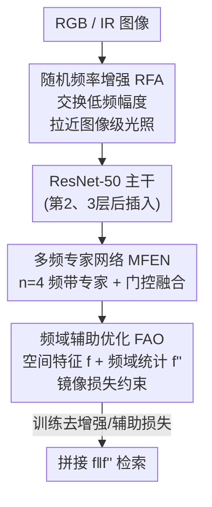

# MFEN: Multi-Frequency Expert Network for Visible-Infrared Person Re-ID

**会议**: CVPR 2026  
**论文**: [CVF Open Access](https://openaccess.thecvf.com/content/CVPR2026/html/Li_MFEN_Multi-Frequency_Expert_Network_for_Visible-Infrared_Person_Re-ID_CVPR_2026_paper.html)  
**代码**: 未公开  
**领域**: 人体理解 / 跨模态行人重识别  
**关键词**: 可见光-红外 ReID, 频域学习, 混合专家, 数据增强, 跨模态对齐

## 一句话总结
针对可见光-红外行人重识别中"光照差异跨多个频带、且最优频带随样本而变"的痛点，MFEN 用多个频带专家 + 门控的混合专家结构按样本自适应融合频域线索，再配合图像级的随机频率增强（RFA）和优化级的频域辅助损失（FAO），在三个 VI-ReID 数据集上刷新或逼近 SOTA。

## 研究背景与动机
**领域现状**：可见光-红外行人重识别（VI-ReID）要在白天的 RGB 图像和夜间的红外（IR）图像之间匹配同一个人。除了 RGB-IR 本身的模态鸿沟，IR 图像内部还有很大的类内差异。近来一批工作转向**频域**：把图像变换到傅里叶域，用幅度谱/相位谱把"和身份相关的轮廓细节"与"和光照颜色相关的无关信息"分开，取得了明显进展。

**现有痛点**：作者指出模态差异很大程度来自**光照条件不同**——既有光波长差异（RGB 三通道 vs IR 单通道）带来的颜色差，也有**光源类型**差异带来的亮度差（IR 监控相机只靠自身光源，经常欠曝/过曝）。而身份相关与光照相关的线索其实**分散在多个频带**上：严重过曝的样本需要压制占主导的低频光照，模糊低对比的样本则更依赖中高频细节。现有频域方法要么对整段频谱做统一调制，要么只盯固定的高频区域，无法做这种"按样本自适应"的选频。

**核心矛盾**：最优频带是**样本相关**的，而现有方法用的是固定先验（全谱 or 单一固定频带），二者天然错配。

**本文目标**：(1) 在特征层做按样本、跨多频带的自适应频域融合；(2) 在数据层缩小图像级的光照差异；(3) 在优化层引入频域约束进一步压模态差。

**切入角度**：既然不同频带对不同样本各有用处、且彼此互补（低频管光照校正、高频管边界恢复），那就为每个频带配一个"专家"，再用门控按样本动态加权，让模型自己决定"这张图该信哪几个频带"。

**核心 idea**：用"多频带专家 + 门控自适应融合"取代"固定频带先验"，并在数据增强（RFA）和优化（FAO）两端配套，从数据/模型/优化三个层面把频域信息用足。

## 方法详解

### 整体框架
MFEN 把频域思想贯穿到三个层面：**图像层**先用随机频率增强（RFA）把两个模态的光照模式拉近；**特征层**在 ResNet-50 的第 2、3 层后插入多频专家网络（MFEN 模块），按样本自适应融合多频带线索；**优化层**用频域辅助优化（FAO）把频域统计量作为空间特征的互补视图施加损失约束。训练时三者协同；推理时去掉增强和辅助损失，把空间特征 $f$ 与互补频域统计量 $f''$ 拼接起来做检索。

### 关键设计

**1. 随机频率增强 RFA：在图像层只交换低频幅度来模拟另一模态的光照**

RFA 针对的是"IR 图像频繁欠曝/过曝、即便灰度化也和灰度 RGB 差距很大"这个图像级痛点。由于颜色和亮度主要编码在傅里叶幅度谱里，最直接的想法是把 RGB 和 IR 的整段幅度谱互换。但作者发现整段幅度还含有应当与原相位对齐的高频结构能量，整体互换会产生严重伪影、扭曲身份结构。于是 RFA 用高斯低/高通滤波把幅度拆成低频 $A_l$ 和高频 $A_h$，**只交换低频幅度**：$A_s(x)=A_l(x')+A_h(x)$（$x'$ 是另一模态随机选的图），再保留**原相位** $P(x)$ 重组频域 $F_s(x)=A_s(x)\cdot e^{jP(x)}$，最后逆 FFT 回图像。增强后还从 RGB 图随机取一个通道复制三份以压残余色偏，IR 图保持不变。这样增强后的 RGB/IR 光照模式变得接近，又不破坏结构细节，降低了后续跨模态特征学习的难度。

**2. 多频专家网络 MFEN：用门控混合专家按样本自适应选频带**

MFEN 是全文的核心贡献，针对"最优频带随样本变、固定频带先验不够"的矛盾。给定特征图 $X$，每个专家先用 $1\times1$ 卷积投影出 $Q,K$（通道压到 64 保持轻量），做 FFT 得 $Q_F,K_F$；再用一个二值带通掩码 $M_b$ **只对 $K_F$** 滤出目标频带 $K_{Fb}=M_b\odot K_F$，而 $Q_F$ 保持全谱作为"内容锚"，让每个专家学习"完整内容如何与某个目标频带交互"——若把 $Q_F,K_F$ 都掩码，会把专家困死在窄带、削弱跨带互补性。频带按**八度（octave）**划分（默认 4 个专家，阈值 $\{0,\frac{1}{2^{n-1}},\dots,\frac14,\frac12,1\}$），契合"低频粗建模、高频细划分"的需求。各专家输出 $A_b=\mathrm{BN}_b(F^{-1}(Q_F\odot K_{Fb}))$ 经门控加权求和 $A=\sum_j \mathrm{Gate}(X)_j A_j$，其中 $\mathrm{Gate}(X)=\mathrm{sigmoid}(W_g(X))$。

值得注意的是它**不做 top-k 选择、也不对门控权重归一化**：因为目标是让模型同时从所有频带学习，而非互斥竞争——非重叠的频带让专家天然互补（同一样本可能既要低频校光照又要高频补边界），top-k 会强加稀疏、归一化会引入专家间竞争。最后用 $A$ 调制空间特征 $X_{out}=W(A\odot W_V(X))$。

**3. 频域辅助优化 FAO：把频域统计量作为互补视图施加镜像损失**

FAO 解决"只在空间域算 ReID 损失、没用上频域约束"的问题。它先对主干输出特征图 $F$ 做 FFT 得 $F'$，池化得一阶频域表示 $f'=\mathrm{GAP}(F')$，再补上二阶矩 $f''=f'+\sqrt{\mathrm{GAP}((F'-f')^2)}$——二阶项度量频响的离散程度，是对一阶均值的"能量感知"补充，让 $f''$ 不仅刻画哪些频率被激活，还刻画它们响应有多强。关键在于 FAO **不把频域当孤立分支**，而是让 $f''$ 作为互补统计视图去**正则**主空间特征 $f$：用频率身份损失 $L_{fid}=\mathbb{E}_i[-y_i\log\frac{p_i+p_i''}{2}]$ 替换常规身份损失（$p_i,p_i''$ 分别是 $f,f''$ 的预测概率）；用频率 KL 损失 $L_{fkl}$ 拉近跨模态正样本的分类分布；用频率欧氏损失 $L_{feu}$（margin $\rho=0.6$）在嵌入空间拉近正样本、推开负样本。总损失 $L_{total}=L_{fid}+L_{fkl}+L_{feu}$，端到端训练。

> ⚠️ **框架↔关键设计一致**：整体框架图里的 RFA / MFEN / FAO 三个组件，分别对应上面三个关键设计；ResNet-50 主干属脚手架，不单列设计点。

### 损失函数 / 训练策略
主干为 ImageNet 预训练的 ResNet-50（末层 stride 设 1，加 BNNeck），MFEN 插在第 2、3 层后，专家数 $n=4$。图像 resize 到 $384\times192$，随机裁剪/水平翻转/随机擦除。SGD 训练 120 epoch，batch 64（含 8 个身份），学习率 0.02、warm-up + cosine decay，margin $\rho=0.6$。总损失即 FAO 的三项之和 $L_{fid}+L_{fkl}+L_{feu}$。

## 实验关键数据

### 主实验
在 SYSU-MM01、RegDB、LLCM 三个数据集上评测，报告 CMC（rank-k）和 mAP，结果为 10 次随机划分平均。

| 数据集 / 设置 | 指标 | MFEN | 之前 SOTA | 提升 |
|--------|------|------|----------|------|
| SYSU-MM01 All-Search | R-1 / mAP | 80.93 / 76.56 | DSSF3 79.12 / 75.27 | +1.81 / +1.29 |
| SYSU-MM01 Indoor-Search | R-1 / mAP | 87.88 / 88.12 | DSSF3 85.01 / 86.75 | +2.87 / +1.37 |
| RegDB（两方向均值） | R-1 / mAP | 94.48 / 90.16 | DSSF3 ≈91.2 / 85.7 | ≈+3.30 / +4.48 |
| LLCM（两方向均值） | R-1 / mAP | 63.5 / 67.6 | DNS ≈61.8 / 66.4 | ≈+1.7 / +1.2 |

作者强调：All-Search 同时含室内外、光照与杂乱更多样，MFEN 在此增益更大，正好印证"多频带建模 + 按样本融合"的动机；RegDB 两个检索方向都涨，说明不是 SYSU 上的数据集特定 trick；LLCM 夜景更复杂仍稳定提升，佐证频域建模在强复杂光照下的鲁棒性。

### 消融实验
均在 SYSU-MM01 All-Search 下进行（baseline = ResNet-50 + 身份/KL/欧氏三损失，但去掉所有频域分量）。

| 配置 | R-1 / mAP | 说明 |
|------|---------|------|
| Baseline | 71.85 / 68.95 | 无任何频域组件 |
| + RFA | 75.01 / 71.23 | 图像级，+3.16 / +2.28 |
| + RFA + MFEN | 78.42 / 74.85 | 特征级，+3.41 / +3.62 |
| + RFA + MFEN + FAO（完整） | 80.93 / 76.56 | 优化级，再 +2.51 / +1.71 |
| MFEN→SE | 76.90 / 71.55 | 换 SE，掉 4.03 / 5.01 |
| MFEN→CBAM | 75.45 / 70.33 | 换 CBAM，掉 5.48 / 6.23 |
| 1 Expert（全谱） | 79.87 / 75.61 | 单专家不如多频带 |
| 2 Experts | 80.22 / 75.93 | 仍逊于 4 专家 |
| 仅高频专家 / 仅低频专家 | 79.63 / 78.52 | 单一频带漏信息 |

### 关键发现
- **MFEN 模块贡献最大**：在三段递进里它单独带来 +3.41 R-1 / +3.62 mAP，是核心贡献；RFA 与 FAO 分别在数据端和优化端提供互补增益。
- **不选 top-k、不归一化是关键设计选择**：消融显示单专家（全谱）、双专家、单一高/低频专家都次优，验证"身份线索与光照干扰分散在多频带、且有用频带随样本变"的假设。
- **插入位置敏感**：MFEN 放在 ResNet-50 第 2、3 层后最佳（R-1 79.95 / 80.11），放第 4 层后反而掉到 76.42——中间层特征更适合抽判别性频域信息。
- **频域增强对各类损失普遍有效**：FAO 中 $L_{fid}/L_{fkl}/L_{feu}$ 相比去掉频域分量的 $L_{id}/L_{kl}/L_{eu}$ 都一致提升，说明频域统计是通用的辅助约束而非绑定某一种监督形式。

## 亮点与洞察
- **"只换低频幅度 + 保原相位"的增强很巧**：直接定位到"颜色/亮度编码在幅度低频、结构在相位与高频"这一物理事实，既模拟了另一模态的光照又不毁结构，比纯灰度/亮度抖动（CAJ 等）更贴近真实欠曝/过曝。
- **MoE 去掉 top-k 和归一化是反直觉但有道理的取舍**：因为频带互补而非竞争，强行稀疏化或归一化反而损害互补性——这个"什么时候不该用标准 MoE 套路"的判断可迁移到其他"多视图互补"的融合任务。
- **二阶矩做频域互补统计 $f''$**：用 $\sqrt{\mathrm{GAP}((F'-f')^2)}$ 捕捉频响"有多强"，是把"能量分布"显式编码进检索特征的轻量做法，可复用到其他需要刻画响应强度的表示学习。

## 局限与展望
- 论文未公开代码，专家数固定为 4、八度划分阈值固定，没有探讨更细或自适应的频带划分是否进一步增益。
- ⚠️ 三个数据集仍是相对受控的 VI-ReID 基准；真实开放场景下更极端的光照/遮挡是否同样有效，文中未直接验证。
- FAO 的三项损失（fid/fkl/feu）权重均为等权相加，未做权重敏感性分析；不同数据集是否需要重新平衡值得探究。
- 自己发现的局限：方法增益主要来自 SYSU/RegDB 这类带明显光照差的场景，对光照差较小、主要靠姿态/遮挡区分的难例增益可能有限。

## 相关工作与启发
- **vs FDMNet / FDNM / DSSF3（频域 VI-ReID）**：它们大多依赖统一的频域变换或全谱融合，MFEN 显式把特征图分解成互不重叠的频带、再用门控做按样本自适应融合，把"选频"的灵活性交给模型而非固定先验。
- **vs FDConv**：FDConv 分解的是卷积核用于稠密预测；MFEN 分解的是空间特征图，直接对齐 VI-ReID 里跨模态的空间频率差异。
- **vs CAJ / DMT / RLE（数据增强类）**：它们主要改颜色和整体亮度，RFA 通过交换频域幅度能产生局部亮度变化，更好地模拟过曝/欠曝等真实光照。
- **vs SE / CBAM / Non-local（注意力）**：MFEN 在频域做逐元素乘后逆变换回空间域，能让不同位置特征交互（CBAM 等逐元素乘做不到），又比 Non-local 的二次复杂度高效。

## 评分
- 新颖性: ⭐⭐⭐⭐ 把 MoE 引入频域选频、并刻意去掉 top-k/归一化的取舍有洞见，但频域+ReID 已是较成熟方向
- 实验充分度: ⭐⭐⭐⭐ 三数据集 + 数据/模型/优化逐层消融 + 专家数/插入位置细致分析，较扎实
- 写作质量: ⭐⭐⭐⭐ 动机—方法—消融逻辑清晰，公式完整，三层框架表述明确
- 价值: ⭐⭐⭐⭐ 在 VI-ReID 上稳定提升且各组件即插即用，频带专家思路可迁移到其他跨模态融合

<!-- RELATED:START -->

## 相关论文

- [\[CVPR 2026\] Spatial-Frequency Collaborative Learning for Occluded Visible-Infrared Person Re-Identification](spatial-frequency_collaborative_learning_for_occluded_visible-infrared_person_re.md)
- [\[CVPR 2026\] BIT: Matching-based Bi-directional Interaction Transformation Network for Visible-Infrared Person Re-Identification](bit_matching-based_bi-directional_interaction_transformation_network_for_visible.md)
- [\[CVPR 2026\] Towards Cross-Modal Preservation, Consistency and Alignment for Privacy-Preserving Visible-Infrared Person Re-Identification](towards_cross-modal_preservation_consistency_and_alignment_for_privacy-preservin.md)
- [\[CVPR 2026\] COPE: Consistent Occlusion and Prompt Enhancement Network for Occluded Person Re-identification](cope_consistent_occlusion_and_prompt_enhancement_network_for_occluded_person_re-.md)
- [\[ICCV 2025\] Weakly Supervised Visible-Infrared Person Re-Identification via Heterogeneous Expert Collaborative Consistency Learning](../../ICCV2025/human_understanding/weakly_supervised_visible-infrared_person_re-identification_via_heterogeneous_ex.md)

<!-- RELATED:END -->
