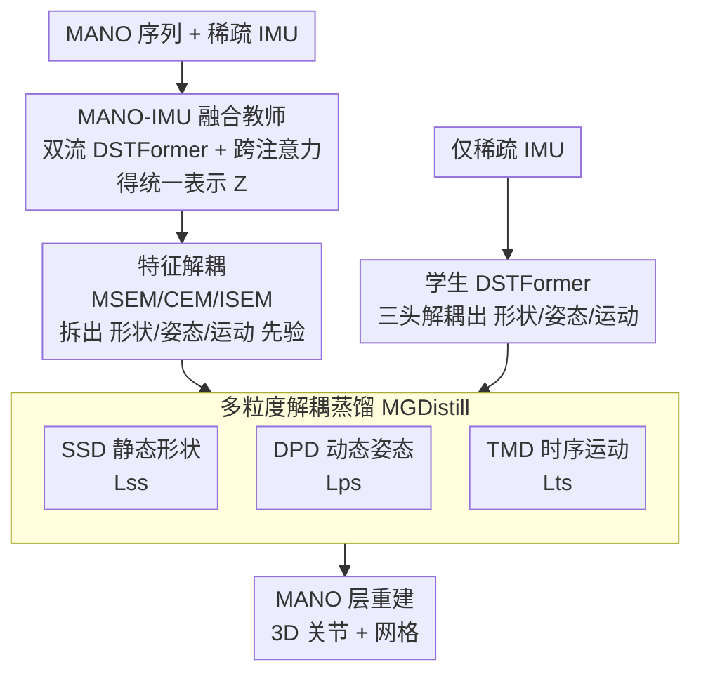

# MGDHand: Multi-Granularity Prior-to-Inertial Distillation Framework for Sequential 3D Hand Pose Estimation from Sparse IMUs

**会议**: CVPR 2026  
**论文**: [CVF Open Access](https://openaccess.thecvf.com/content/CVPR2026/html/Wang_MGDHand_Multi-Granularity_Prior-to-Inertial_Distillation_Framework_for_Sequential_3D_Hand_Pose_CVPR_2026_paper.html)  
**代码**: 未公开  
**领域**: 人体理解 / 3D 手部姿态估计  
**关键词**: 稀疏 IMU, 手部姿态估计, 知识蒸馏, MANO, 多粒度解耦

## 一句话总结
针对"从稀疏 IMU 直接回归稠密手部姿态因语义鸿沟而高度病态"的问题，MGDHand 先预训练一个 MANO-IMU 融合教师把先验编码成静态形状/动态姿态/时序运动三类，再用多粒度解耦蒸馏（SSD/DPD/TMD）把这三类先验在各自语义域分别迁移给只用 IMU 的学生，在 VIHand 上相比无蒸馏学生 MPJPE 降低 40.7%。

## 研究背景与动机
**领域现状**：3D 手部姿态估计（HPE）主流靠视觉（RGB/深度/RGB-D），精度高但受遮挡、隐私、视场（FoV）限制。**IMU**（可塞进手表/智能戒指/数据手套的可穿戴惯性传感器）抗遮挡、不依赖视场、低功耗，越来越受关注。早期用密集配置（10–18 个 IMU）效果稳但硬件笨重、佩戴不便；近来转向**稀疏配置（2–7 个 IMU）**以求日常可用。

**现有痛点**：稀疏 IMU 只给出局部的动态运动信号（旋转/加速度/角速度），缺少显式的关节位置和外观语义，与手的全局形态结构之间存在巨大的**信息密度差**。直接从稀疏 IMU 回归稠密手姿态因此高度**病态**，常出现关节错位和形态扭曲。为缓解这点，VIFNet 尝试把视觉特征蒸馏进 IMU 学生，确有提升，但只蒸馏静态视觉特征没用上复杂运动信息，导致时序不连贯、对快速手势鲁棒性差。

**核心矛盾**：教师的知识丰富但**纠缠**（形状、关节位置、动作混在一起），加上视觉-惯性间固有的**语义错配 + 信息密度差**，直接蒸馏纠缠特征会让学生优化困难——粗粒度的跨模态蒸馏迁移质量受限。

**本文目标**：(1) 造一个先验既丰富又对学生"可解读"的强教师；(2) 把纠缠先验按语义解耦后分粒度迁移，降低学生学习难度。

**切入角度**：手的知识天然可按 **形状（静态、时不变）— 姿态（逐帧高自由度关节运动）— 运动（速度/加速度等快变趋势）** 三个粒度拆分；与其让学生硬学一团纠缠特征，不如把先验拆开、在各自语义域分别对齐。

**核心 idea**：用 MANO-IMU 融合教师把先验显式编码到 MANO 参数空间，再用"多粒度解耦蒸馏"把形状/姿态/运动三类互补先验分别在匹配的粒度上迁移给纯 IMU 学生，协同重建稠密手部结构。

## 方法详解

### 整体框架
MGDHand 是两阶段的师生蒸馏框架。**第一阶段**预训练一个 MANO-IMU 融合教师 $T$：它同时吃带掩码的 MANO 序列和稀疏 IMU 序列，用双流 DSTFormer 分别抽形态分支 $F^m_T$ 和运动分支 $F^k_T$，经跨注意力融合成统一表示 $Z$，回归 MANO 参数并把 $Z$ 解耦成形状/姿态/运动三类先验。**第二阶段**冻结教师，训练只用 IMU 的学生 $S$：学生同样把 IMU 隐特征解耦成三粒度表示，与教师对应先验做匹配粒度的蒸馏（SSD/DPD/TMD），推理时只用 IMU。

### 关键设计

**1. MANO-IMU 融合教师：把稀疏惯性显式映射到 MANO 形态空间**

教师针对"教师知识对学生不可解读"的痛点。它的关键是引入参数化手模型 **MANO** 当桥：给定 IMU 序列 $I\in\mathbb{R}^{T\times S\times C_{imu}}$ 和带掩码的 MANO 序列 $\tilde\Theta=(\tilde\theta,\beta)$，把 MANO 姿态参数线性投影成关节级姿态特征、形状参数广播成形状特征，拼成 $F_{init}$ 加位置编码得 MANO 嵌入 $F$；IMU 投影对齐得嵌入 $G$。双流 DSTFormer 分别从 $G$ 抽运动隐特征 $F^k_T$、从 $F$ 抽形态隐特征 $F^m_T$。再做**逐帧跨注意力**：以 MANO 特征为 query 去注意 IMU 特征（K,V），得残差融合的统一表示 $Z$（即 $\tilde F^m_T$），它同时编码形状先验和时序动态。双路回归头从 $Z$ 预测逐帧姿态 $\hat\theta$ 和（经时空池化的）全局形状 $\hat\beta$，送进 MANO 层显式重建 3D 关节 $\hat J$ 与网格 $\hat V$。这样教师学到一个把稀疏 IMU 显式关联到关节形态空间的"可辨识映射"，远比 RGB-IMU 教师 VIFNet-T 更适合指导 IMU 学生。

**2. 特征解耦：用 Z 引导的跨注意力 + 三个增强模块拆出形状/姿态/运动先验**

这一步解决"统一表示 $Z$ 把形状、关节位置、动作纠缠在一起、直接蒸馏会语义模糊"的问题。先以 $Z$ 为 query 对两个分支做 Z 引导的跨注意力，得到精化特征 $\hat F^m_T,\hat F^k_T$；再用三个模块按运算把它们重组成互补先验：**MSEM（形态特异增强）**结合两分支的差与交（$(\hat F^m_T-\hat F^k_T)\oplus(\hat F^m_T\odot\hat F^k_T)$）强化 MANO 主导成分，得静态形状先验 $Z^{sh}_T$（再全局池化成 $\mathbb{R}^D$，因为形状时不变）；**CEM（一致性增强）**用逐元素积与和（$(\hat F^m_T\odot\hat F^k_T)\oplus(\hat F^m_T\oplus\hat F^k_T)$）强调两分支共有成分，得动态姿态先验 $Z^{po}_T$；**ISEM（惯性特异增强）**镜像 MSEM 抽出 IMU 强、MANO 弱的运动主导线索，得时序运动先验 $Z^{tm}_T$。三类先验各用辅助头以 MANO 标签监督（形状头回归 $\beta$、姿态头回归逐帧 $\theta$、时序头回归由真值关节差分 $d^{gt}_t=(\Delta J^{gt}_t,\Delta^2 J^{gt}_t)$ 得到的速度 $v$、加速度 $\alpha$），从而真正"专精"各自语义。学生侧同样三头解耦出 $\{Z^{sh}_S,Z^{po}_S,Z^{tm}_S\}$（形状用通道注意力、姿态用关节轴空间注意力、运动用时间轴时序注意力）。

**3. 多粒度解耦蒸馏 MGDistill：在匹配粒度上分别对齐三类先验**

这是把"解耦先验真正迁移到学生"的环节，所有蒸馏损失都在 $\ell_2$ 归一化特征上算。**静态形状蒸馏 SSD**：因手形时不变可用单个全局描述子概括，直接对齐教师/学生全局形状特征，$L_{ss}=\|\hat Z^{sh}_S-\hat Z^{sh}_T\|_2^2$，让学生继承稳定的全局形状与骨长比例。**动态姿态蒸馏 DPD**：姿态逐帧连续变化且高自由度，做逐帧对齐 $L_{ps}=\frac1T\sum_t\|\hat Z^{po}_{S,t}-\hat Z^{po}_{T,t}\|_2^2$，迁移细粒度关节配置先验、桥接稀疏-稠密鸿沟。**时序运动蒸馏 TMD**：IMU 对动态变化敏感，蒸馏强调速度/加速度趋势的运动特征 $L_{ts}=\frac1T\sum_t\|\hat Z^{tm}_{S,t}-\hat Z^{tm}_{T,t}\|_2^2$，让学生编码与教师一致的惯性动态、对快速含糊动作更鲁棒。总蒸馏损失 $L_{distill}=\lambda_{sh}L_{ss}+\lambda_{po}L_{ps}+\lambda_{tm}L_{ts}$。

> ⚠️ **框架↔关键设计一致**：框架图里的教师、特征解耦（MSEM/CEM/ISEM）、MGDistill（SSD/DPD/TMD）分别对应上面三个设计点；学生 DSTFormer 与 MANO 层属脚手架，不单列。

### 损失函数 / 训练策略
两阶段训练。**教师**：$L_T=L_{recon}+\alpha_{sh}L^{sh}_T+\alpha_{po}L^{po}_T+\alpha_{tm}L^{tm}_T$，训到收敛后冻结全部参数。**学生**：$L_S=L_{recon}+L_{distill}$，在教师固定的前提下学习稳定且结构化的三类先验。实现细节：PyTorch + 单卡 RTX 4090，AdamW，初始学习率 1e-4 + cosine decay，80 epoch，batch 32；DSTFormer 深度 $N=5$、头数 8、特征维 512、序列长 $T=32$。

## 实验关键数据

### 主实验
全部在公开多模态手姿数据集 **VIHand**（140 万+ 多模态帧、15 名被试，ROM01–12 训练 / ROM13–15 测试）上评测，指标为 MPJPE 和 MPVPE（预测与真值关节/顶点位置的平均欧氏距离，单位 mm，越低越好）。

| 方法 | 输入 | 蒸馏 | #IMU | MPJPE | MPVPE |
|------|------|------|------|-------|-------|
| WiLoR†（视觉） | RGB | ✗ | - | 10.49 | 11.74 |
| VIFNet-T（RGB-IMU 教师） | RGB+IMU | ✗ | 7 | 7.86 | 8.94 |
| VIFNet（IMU） | IMU | ✗ | 7 | 16.93 | 19.41 |
| VIFNet-S（全局特征蒸馏） | IMU | ✓ | 7 | 13.69 | 16.53 |
| MGDHand（无蒸馏学生） | IMU | ✗ | 7 | 15.40 | 17.15 |
| **MGDHand（MGDistill）** | IMU | ✓ | 7 | **9.13** | **10.46** |

关键对比：MGDHand 的 **MANO-IMU 教师** 比 VIFNet-T（RGB-IMU 教师）MPJPE 提升 25.7%（5.84 vs 7.86mm）、MPVPE 提升 33.2%；**MGDistill 学生** 比 VIFNet-S（粗粒度全局蒸馏）MPJPE 降 33.3%（9.13 vs 13.69mm）、MPVPE 降 36.7%；比自身无蒸馏学生 MPJPE 降 40.7%（9.13 vs 15.40mm）。纯 IMU 的它甚至逼近主流视觉方法。

### 消融实验
均在 VIHand 7-IMU 配置下。

| 配置 | $L_{ss}$ | $L_{ps}$ | $L_{ts}$ | MPJPE | MPVPE |
|------|------|------|------|-------|-------|
| w/o SSD | ✗ | ✓ | ✓ | 9.87 | 12.58 |
| w/o DPD | ✓ | ✗ | ✓ | 12.39 | 13.90 |
| w/o TMD | ✓ | ✓ | ✗ | 9.65 | 10.74 |
| MGDistill（全） | ✓ | ✓ | ✓ | 9.13 | 10.46 |

不同蒸馏方法对比（7-IMU）：

| 方法 | MPJPE | MPVPE |
|------|-------|-------|
| SimKD | 13.78 | 15.89 |
| DKD | 11.92 | 13.37 |
| SCJD（最强 baseline） | 11.24 | 13.50 |
| **MGDistill** | **9.13** | **10.46** |

### 关键发现
- **DPD（动态姿态蒸馏）贡献最大**：去掉它 MPJPE/MPVPE 分别恶化 35.7%/32.9%，说明逐帧动态姿态先验是桥接稀疏-稠密鸿沟的主驱动。
- **SSD 主要稳住几何**：去掉它 MPVPE 涨 20.3%（对顶点几何影响大于关节），印证静态形态先验稳定全局形状与骨长。
- **TMD 提供更小但一致的增益**：去掉它 MPJPE/MPVPE 各涨 5.7%/2.7%，主要减少时序漂移与抖动。
- **对传感器稀疏化优雅退化**：IMU 从 7 减到 3 / 2 时，MGDistill 相比无蒸馏仍分别降 MPJPE/MPVPE 40.7%/39.0%（7）、25.0%/29.7%（3）、22.5%/26.7%（2），说明分粒度迁移先验让模型在更稀疏输入下仍稳。
- **优于通用蒸馏**：MGDistill 比最强通用蒸馏 SCJD 再降 2.11/3.04mm——通用方法在纠缠的全局特征空间迁移、没显式解决学生优化难，增益受限。

## 亮点与洞察
- **用 MANO 当"可解读桥"造教师**：把稀疏惯性显式映射进 MANO 参数空间，让教师知识天然带形状/姿态语义，是"先把知识变得可解读、再蒸馏"的好范例，可迁移到其他有参数化模型（人体 SMPL、人脸 3DMM）的跨模态蒸馏。
- **按 差/交/积/和 显式解耦三类先验**：MSEM 取差强化模态特异、CEM 取交强化共有、ISEM 镜像取惯性特异——用简单的逐元素运算实现语义解耦，轻量且可解释。
- **"匹配粒度蒸馏"是核心洞见**：形状用全局单描述子、姿态逐帧对齐、运动蒸趋势——不同物理量在其自然时空粒度上对齐，比"一刀切全局蒸馏"有效得多，这个思路对任何"多语义粒度纠缠"的蒸馏都有借鉴价值。

## 局限与展望
- 论文未公开代码，且只在 VIHand 单一数据集评测（作者也承认是目前唯一带精确 3D 关节 + MANO 标注的公开视觉-惯性数据集），跨数据集/跨被试泛化未验证。
- ⚠️ 教师重建损失 $L_{recon}$ 及网络细节放在补充材料，正文未给完整定义，复现需依赖补充材料。
- 三个蒸馏权重 $\lambda_{sh},\lambda_{po},\lambda_{tm}$ 与教师辅助损失权重 $\alpha$ 均为手调超参，文中未做敏感性分析。
- 自己发现的局限：教师仍需 MANO 序列 + IMU 配对数据预训练，这类带 MANO 标注的惯性数据稀缺，限制了方法向新场景/新手型扩展的便利性。

## 相关工作与启发
- **vs VIFNet（跨模态蒸馏）**：VIFNet 用 RGB-IMU 教师、只蒸馏纠缠的全局视觉特征，忽视语义错配与信息密度差；MGDHand 换成 MANO-IMU 教师并把先验解耦成形状/姿态/运动分粒度蒸馏，迁移质量显著更高。
- **vs DWPose（两阶段蒸馏）**：DWPose 先传全局结构再细化局部关节，是"先后顺序"上的两阶段；MGDHand 是"按语义粒度并行解耦"，三类先验在各自语义域同时对齐。
- **vs 密集 IMU 方法（GESTO 等）**：它们靠 10–18 个 IMU 换取鲁棒但硬件笨重；MGDHand 在 2–7 个稀疏 IMU 下通过先验蒸馏弥补信息缺失，更适合日常可穿戴。
- **vs 视觉/视觉-惯性融合方法（HaMeR/WiLoR/VIST）**：视觉法受遮挡与视场限制、融合法增加部署成本；MGDHand 推理只用 IMU 却逼近视觉精度，抗遮挡、不依赖视场。

## 评分
- 新颖性: ⭐⭐⭐⭐ "MANO 桥 + 多粒度解耦蒸馏"组合新颖，把蒸馏粒度与物理语义对齐有洞见
- 实验充分度: ⭐⭐⭐ 主实验 + 组件/稀疏配置/蒸馏方法对比较完整，但仅单数据集、关键损失细节在补充材料
- 写作质量: ⭐⭐⭐⭐ 动机—解耦—蒸馏逻辑清晰，公式与符号体系完整
- 价值: ⭐⭐⭐⭐ 把纯 IMU 手姿做到逼近视觉，对可穿戴/VR/AR 交互有实际价值，解耦蒸馏思路可迁移

<!-- RELATED:START -->

## 相关论文

- [\[CVPR 2026\] JUMP-Hand: Learning Joint-wise Uncertainty to Gate Mixture of View Experts for Multi-View 3D Hand Reconstruction](jump-hand_learning_joint-wise_uncertainty_to_gate_mixture_of_view_experts_for_mu.md)
- [\[CVPR 2026\] HandDreamer: Zero-Shot Text to 3D Hand Model Generation](handdreamer_zero_shot_text_to_3d_hand_model_generation.md)
- [\[CVPR 2026\] Sketch2Colab: Sketch-Conditioned Multi-Human Animation via Controllable Flow Distillation](sketch2colab_sketch-conditioned_multi-human_animation_via_controllable_flow_dist.md)
- [\[CVPR 2026\] Ultra Diffusion Poser: Diffusion-Based Human Motion Tracking From Sparse Inertial Sensors and Ranging-Based Between-Sensor Distances](ultra_diffusion_poser_diffusion-based_human_motion_tracking_from_sparse_inertial.md)
- [\[CVPR 2026\] A2P: From 2D Alignment to 3D Plausibility for Occlusion-Robust Two-Hand Reconstruction](from_2d_alignment_to_3d_plausibility_unifying_hete.md)

<!-- RELATED:END -->
