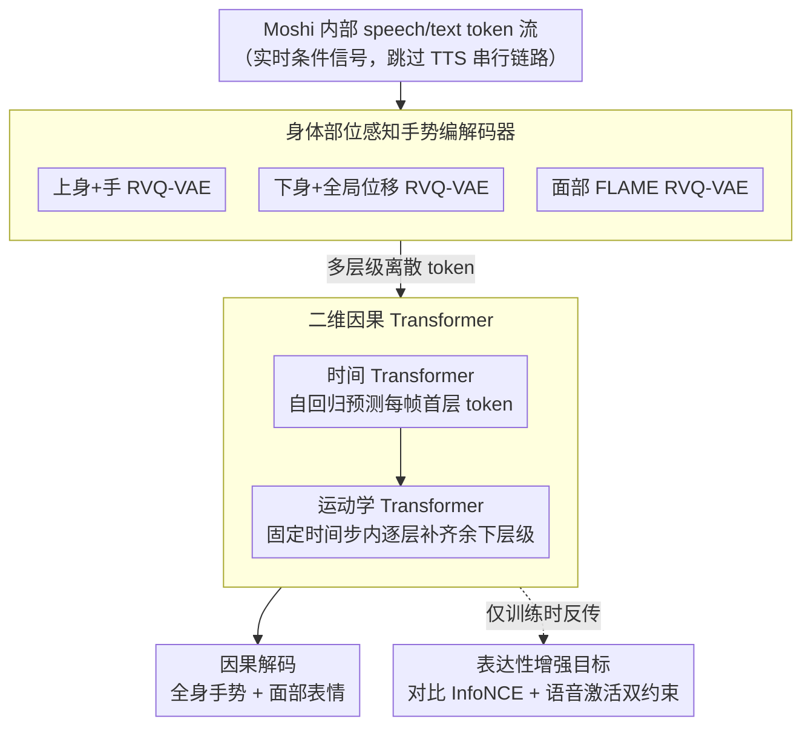

# Miburi: Towards Expressive Interactive Gesture Synthesis

**会议**: CVPR 2026  
**arXiv**: [2603.03282](https://arxiv.org/abs/2603.03282)  
**代码**: [项目主页](https://vcai.mpi-inf.mpg.de/projects/MIBURI)  
**领域**: 人体理解  
**关键词**: 共语手势生成, 具身对话代理, 因果自回归, 实时生成, 残差向量量化

## 一句话总结

提出 Miburi，首个在线因果框架，通过直接利用语音-文本大模型 Moshi 的内部 token 流和二维因果 Transformer，实现实时同步的全身手势与面部表情生成。

## 研究背景与动机

当前 LLM 对话代理缺乏具身能力和表达性手势。现有的共语手势生成方法分两类：(1) 生成式方法（扩散/Transformer）产生自然表达性手势，但需要未来语音上下文，无法实时运行；(2) 实时系统（规则/简单网络）可在线运行但手势生硬、多样性低。关键矛盾是：**因果**（仅依赖过去输入）和**实时**（低延迟）两个需求同时满足非常困难。传统 pipeline 将 LLM 输出→语音合成→音频编码→手势生成串行处理，引入大量延迟。

## 方法详解

### 整体框架

Miburi 要让对话代理一边说话一边实时打出自然、有表达力的全身手势和面部表情，难点是「因果」（只能看过去）和「实时」（低延迟）必须同时满足。它把自己直接搭在语音-文本基础模型 Moshi 之上，拿 Moshi 内部的 speech/text token 流当条件信号，跳过传统 LLM→TTS→音频编码的串行链路；动作先经身体部位感知的编解码器量化成多层级离散 token，再由一个二维因果 Transformer（时间维 + 运动学维）自回归地生成手势 token，训练时再加一组表达性增强目标逼出「该动时才动」。

### 关键设计

**1. 身体部位感知手势编解码器：按身体区域分别量化，保住精细运动学细节**

不同身体部位和语音的关联差异很大，一锅炖会丢手指这类精细动作。Miburi 把全身动作拆成三个区域——上身+手 $\mathbf{x}^u$、下身+全局位移 $\mathbf{x}^l$、面部表情（FLAME 参数）$\mathbf{x}^f$，每个区域独立用 **Residual VQ-VAE** 编码。编码器是下采样 1D 卷积 + 因果自注意力 Transformer，输出经残差向量量化为多层级 token $\mathbf{g}^b \in \mathbb{R}^{T \times K^b}$（$K^u=K^l=8, K^f=4$ 层级），每个 token 代表 2 帧（0.08 秒）动作，刻意与 Moshi 的 token 率对齐。相比普通 VQ-VAE，RVQ 的多层级残差结构能更好保留精细运动学细节。

**2. 二维因果 Transformer：解耦时间与运动学维度，把上下文长度和延迟压下来**

如果朴素地把 $T \cdot K$ 个 token 当一条流处理，注意力上下文太长、延迟扛不住。Miburi 把预测拆成两维：时间 Transformer $\mathcal{T}_{\text{temporal}}$（4 层 2 头）用因果自注意力（上下文 25 tokens）+ 双因果交叉注意力（speech/text，上下文 50 tokens），自回归预测每帧第一层级 token $\mathbf{g}_{(t,1)}$，$K$ 个层级的嵌入求和成单一输入；运动学 Transformer $\mathcal{T}_{\text{kinematic}}$（2 层 1 头）则在固定时间步 $t$ 内自回归预测后续层级 $\mathbf{g}_{(t,k)}$，以时间上下文 $\mathbf{h}_t$ 和 speech/text 嵌入为条件。这种分解把注意力上下文长度和推理延迟都大幅压低，是实时的关键。

**3. 表达性增强目标：用对比学习和语音激活双约束，逼出「该动时才动」**

只靠交叉熵容易生成平淡甚至「幽灵手势」。Miburi 加两条目标：对比 InfoNCE 损失先把预测 token 经 Gumbel-Softmax 重参数化成可微潜在表示 $\mathbf{z} = \sum_k \text{GumbelSoftmax}(\tilde{\mathbf{o}}_k) \mathbf{C}_k$，再在时间片段上推高匹配的 GT-预测对相似度、压低不匹配对，从而桥接离散采样与连续损失；语音激活损失则在 $\mathbf{h}_t$ 上挂一个二分类头区分聆听/说话状态（BCE 损失），防止聆听时乱动、强制说话时打出与语音对齐的表达性手势。

### 损失函数 / 训练策略

总损失 $\mathcal{L} = \mathcal{L}_{\text{CE}} + \alpha \mathcal{L}_{\text{con}} + \beta \mathcal{L}_{\text{va}}$，其中 $\alpha=0.1, \beta=0.01$。推理时用 top-p 核采样（时间 Transformer $p=0.8$，运动学 Transformer $p=0.95$，温度 0.9）保持多样性，并用 classifier-free guidance（单说话人 CFG=1.5，多说话人 CFG=2.3）。KV-Cache 实现高效因果推理，下身 token 屏蔽 speech/text 交叉注意力以节省运行时间。

## 实验关键数据

### 主实验

| 方法 | FGD↓ | BeatAlign→ | L1-Div→ | 因果 | 实时 |
|------|------|------------|---------|------|------|
| CaMN | 0.736 | 0.176 | 6.73 | ✗ | ✗ |
| RAG-Gesture | 0.515 | 0.648 | 10.09 | ✗ | ✗ |
| GestureLSM | 0.537 | 0.481 | 8.41 | ✗ | ✓ |
| GestureLSM (Causal) | 2.792 | 0.684 | 9.11 | ✓ | ✓ |
| MambaTalk | 1.375 | 0.080 | 3.73 | ✗ | ✓ |
| **Miburi (+Face)** | **0.480** | **0.461** | **10.44** | **✓** | **✓** |

### 消融实验

| 配置 | 关键指标 | 说明 |
|------|---------|------|
| Moshi tokens vs wav2vec | FGD 0.480 vs 0.665, BeatAlign 0.461 vs 0.363 | Moshi 内部特征显著优于标准音频编码 |
| 二维 Transformer vs 单流 | FGD/BeatAlign/Diversity 均更优，延迟近半 | 分解时间和运动学维度至关重要 |
| 单说话人 vs 多说话人 | 多说话人 FGD 从 0.753 降至 0.480 | 模型从更大数据受益明显 |
| 延迟对比 | Miburi 34.9ms vs GestureLSM 144.7ms | 最低延迟（A100） |

### 关键发现

- Miburi 是唯一同时满足因果、实时、表达性三个条件的方法
- 在 23 说话人多说话人设置下取得 SOTA（FGD 0.480，BeatAlign 0.461），超越所有非因果基线
- 朴素将现有方法改为因果版本（GestureLSM Causal, MambaTalk Causal）性能显著下降，说明专用因果架构的必要性
- 用户研究表明 Miburi 在动作自然度和语音适配性上优于 EMAGE 和 GestureLSM

## 亮点与洞察

- **新范式**: 跳过传统 LLM→TTS→audio encoder→gesture 的串行 pipeline，直接利用语音模型内部 token 流，消除延迟瓶颈
- **二维因果 token 预测**: 巧妙解耦时间和运动学维度，类似 RQ-Transformer 的思路应用于动作生成
- **RVQ 分层编码**: 区分粗粒度大幅运动和精细手指手势，多体区独立编码尊重不同身体部位与语音的关联差异
- **Gumbel-Softmax 桥接离散采样与连续损失**: 使对比学习可在离散 token 空间上端到端训练

## 局限与展望

- 用户研究显示与真实动作数据相比仍有差距
- 面部表情质量（Facial-MSE 7.77）相较专用模型还有提升空间
- 下身动作与语音关联较弱，当前直接屏蔽交叉注意力可能过于粗糙
- 依赖 Moshi 模型，推理时需同时运行 Moshi + Miburi，整体系统资源需求较高
- 评估仅在 BEAT2 数据集上，泛化到其他域（如手语、虚拟主播）有待验证

## 相关工作与启发

- **Moshi**: 全双工语音对话模型，Miburi 利用其内部 token 流作为条件信号
- **Audio2Photoreal**: 扩散+VQ 生成双人互动手势，但离线且非因果
- **GestureLSM**: 流匹配实时框架，但非因果，朴素因果化后性能大幅下降
- **RQ-Transformer**: 残差量化自回归的思路启发了 Miburi 的二维 Transformer 设计
- 启发：利用大模型内部表征而非输出做下游任务条件是一种值得推广的范式

## 评分

- **新颖性**: ⭐⭐⭐⭐⭐ 首个合格的因果+实时+表达性手势生成系统，新范式开创性强
- **实验充分度**: ⭐⭐⭐⭐ 多说话人/单说话人评估、用户研究、丰富消融，但仅一个数据集
- **写作质量**: ⭐⭐⭐⭐ 问题定义准确（区分因果与实时），图示清晰
- **价值**: ⭐⭐⭐⭐⭐ 对具身对话代理领域有重大推动，技术路线有高度可扩展性

<!-- RELATED:START -->

## 相关论文

- [\[CVPR 2026\] ParTY: Part-Guidance for Expressive Text-to-Motion Synthesis](party_part-guidance_for_expressive_text-to-motion_synthesis.md)
- [\[CVPR 2026\] CoordSpeaker: Exploiting Gesture Captioning for Coordinated Caption-Empowered Co-Speech Gesture Generation](coordspeaker_exploiting_gesture_captioning_for_coordinated_caption-empowered_co-.md)
- [\[CVPR 2026\] Avatar Forcing: Real-Time Interactive Head Avatar Generation for Natural Conversation](avatar_forcing_real-time_interactive_head_avatar_generation_for_natural_conversa.md)
- [\[CVPR 2026\] SyncDreamer: Controllable and Expressive Avatar Generation Beyond the Talking Head](syncdreamer_controllable_and_expressive_avatar_generation_beyond_the_talking_hea.md)
- [\[CVPR 2026\] LiveGesture: Streamable Co-Speech Gesture Generation Model](livegesture_streamable_co-speech_gesture_generation_model.md)

<!-- RELATED:END -->
