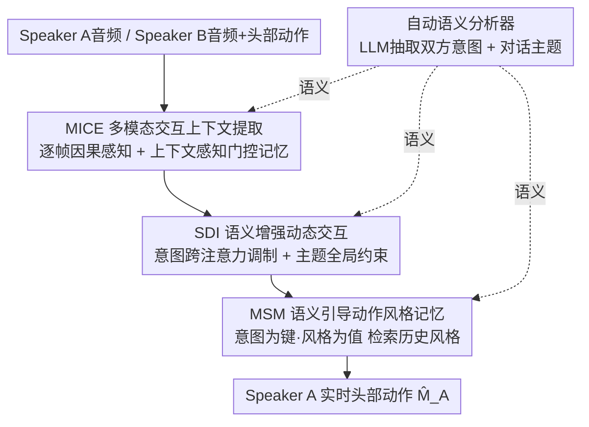

# MimicTalker: A Multimodal Interactive and Memory-Enhanced Framework for Real-Time Dyadic 3D Head Generation

**会议**: CVPR 2026  
**论文**: [CVF Open Access](https://openaccess.thecvf.com/content/CVPR2026/html/Wang_MimicTalker_A_Multimodal_Interactive_and_Memory-Enhanced_Framework_for_Real-Time_Dyadic_CVPR_2026_paper.html)  
**代码**: 项目页 https://nuo1wang.github.io/MimicTalker （代码待确认）  
**领域**: 人体理解 / 数字人 / 3D说话头生成  
**关键词**: 双人交互头部生成, 实时, 多模态, 语义记忆, 动作风格一致性

## 一句话总结
MimicTalker 面向"双人实时对话"的 3D 头部动作生成：用逐帧因果处理 + 门控多尺度记忆（MICE）实现零延迟感知对方、用 LLM 抽取的意图/主题语义动态调制说话方特征（SDI）、再用"意图为键、风格为值"的外部记忆库（MSM）在长对话中保持动作风格一致，从而能在 25 秒短片段和 6 分钟长对话上都生成自然、连贯、风格一致的实时反应，比 DualTalk 等方法在多数指标上提升 10%–30%。

## 研究背景与动机

**领域现状**：让数字人在面对面对话中既"说"又"反应"是人机交互的关键。已有研究分两支：**说话头生成**（talking head）让头部动作与输入音频同步，但完全忽略对对方的回应；**听者头生成**（listening head）关注双人交互，但只生成点头、微笑等非言语反馈。把两者简单拼接无法建模交互双方的动态，也做不到说/听角色的平滑切换。于是**双人交互头生成**（dyadic interactive head generation）成为更实用的统一范式。

**现有痛点**：作者归纳出真实场景的三条硬要求与现有方法的缺口——（1）**实时性**：应能整合对方的多模态信号（音频、动作、语义）并实时生成回应，但多数方法是**离线**的、按 clip 批量生成，必须拿到整段未来信息才能出结果，天然有延迟；（2）**深层语义对齐**：应理解对话主题和说话人意图，但实时方法要么低估了交互复杂度、要么忽视了对话的深层理解，导致反应不自然；（3）**长期一致性**：真实对话冗长，交互头应在整段对话里保持自己的个人风格，但现有方法对长序列生成过度简化，时间一久风格就漂移。

**核心矛盾**：实时性要求"逐帧因果、不依赖未来"，而深层理解和长期一致又需要"全局上下文与历史记忆"——前者天然缺乏长程信息，后者又容易破坏实时性。如何在因果约束下同时拿到瞬时反应、深层语义和长期风格记忆，是本文要破的局。

**本文目标**：在实时（因果）框架下，分别解决"多模态瞬时+长期感知""深层语义注入""长期风格一致"三个子问题。

**切入角度**：作者观察到最相关的工作 ARIG 只用底层音频/动作信号、忽略了对话语义的深层理解和长期一致性，而这两点恰恰是生成真实连贯头动的关键。于是引入 LLM 自动抽取意图/主题作为高层语义，并用外部记忆库显式存取历史风格。

**核心 idea**：把"语义"和"记忆"两件武器装进一个因果实时网络——MICE 做因果多模态感知与记忆，SDI 把意图/主题动态注入，MSM 用语义检索历史风格做引导，三者由一个 LLM 语义分析器并行供给语义。

## 方法详解

### 整体框架
网络 $f$ 输入 Speaker A 的音频 $A_A$、Speaker B 的音频 $A_B$ 和头部动作 $M_B$，输出 Speaker A 的头部动作 $\hat{M}_A = f(A_B, M_B, A_A)$——既与 A 自己的音频同步，又实时回应 B 的言语（音频）与非言语（动作）线索。整个网络以**因果结构**保证 A 对 B 的实时响应，由四大组件构成：MICE（多模态交互上下文提取）逐帧因果感知 B 并存入记忆；SDI（语义增强动态交互）把 A 的意图与对话主题动态注入并与 B 实时交互；MSM（语义引导动作风格记忆）用外部记忆库维持长期风格一致；以及一个并行运行的 LLM 自动语义分析器，为前三者持续供给意图与主题语义。最后把交互特征经风格调制后送 MLP 预测 $\hat{M}_A$。

### 关键设计

**1. MICE 多模态交互上下文提取：逐帧因果感知 + 门控多尺度记忆**

针对"离线方法依赖未来上下文、有固有延迟"的痛点，MICE 把对方 B 的特征**逐帧**处理而非按时间窗批量处理，从根上消除延迟。先用 MLP 把 B 的音频（经 MFCC）和头部动作投影到共享空间 $H_B, M'_B$，再用带因果掩码 $M$ 的交叉注意力+自注意力融合，得到瞬时帧级特征 $Z_B = \mathrm{SelfAttn}(\mathrm{CrossAttn}(H_B, M'_B, M), M)$，对齐音视频线索。但瞬时特征只含极短时窗信息，于是设计**上下文感知记忆**：用一个大小为 $K$ 的多尺度记忆 $m^{(t)} \in \mathbb{R}^{K \times d}$，由 B 的意图 $I_B$ 语义引导更新，并用输入门 $g_i^{(t)}$ 和遗忘门 $g_f^{(t)}$ 控制记忆/遗忘：

$$m^{(t+1)} = g_i^{(t)} \mathrm{MLP}(h^{(t)}) + g_f^{(t)} m^{(t)}, \quad h^{(t)} = \mathrm{Concat}(i_B, z_B^{(t)}, m^{(t)})$$

这样网络既有零延迟的瞬时感知，又能跨多尺度子空间聚合与当前对话流相关的长期历史交互，让反应既及时又契合上下文。

**2. SDI 语义增强动态交互：意图跨注意力调制 + 主题全局约束**

光有底层信号还不够，网络不知道"何时该用意图驱动头动"。SDI 先用 Whisper 编码 A 的音频得 $H_A$，经卷积+因果自注意力对齐到帧级 $Z_A$。关键在于建模"意图—音频"的相关性：用交叉注意力（$H_A$ 作 query、A 的意图 $I_A$ 作 key/value）得到逐帧相关特征 $C_A = \mathrm{CrossAttn}(H_A, I_A)$——某帧相关度越高，说明该帧头动越可能被意图影响。再用 adaLN 把 $C_A$ 注入音频特征：$(\gamma_A, \beta_A) = \mathrm{MLP}(C_A),\ F_A = (1+\gamma_A) H_A + \beta_A$，得到被语义动态增强的 A 特征。随后用 Interaction Block（交叉注意力+adaLN）把 B 的瞬时特征 $Z_B$ 与长期记忆 $m^{(t)}$ 融进 $F_A$，得到交互特征 $F_{AB}$。而**对话主题**因为是全局氛围而非帧级精确指导，被当作全局条件——把主题特征 $T$ 与 $F_{AB}$ 拼接后用因果自注意力让网络去关注它：$F = \mathrm{SelfAttn}(\mathrm{Concat}(T, F_{AB}), M)$。意图走"帧级精调"、主题走"全局约束"，按特性分别注入，生成更社交得体的头动。

**3. MSM 语义引导动作风格记忆：意图为键、风格为值的外部记忆库**

针对"长对话风格漂移"的痛点，MSM 用一个外部记忆库存下 Speaker A 过去**所有**的动作风格，从而不受序列长度限制地维持一致性。每个长度为 $w$ 的片段，用对比损失训练的风格编码器抽取 A 的动作风格，并把**意图作为键、动作风格作为值**存入记忆库。推理时以当前意图为 query，检索库中最相似的历史意图，取其对应风格作引导；若没有相似意图（对话刚开始记忆为空，或所有相似度都低于阈值），就喂一段全零动作给风格编码器得到默认风格码。检索到的风格 $s$ 再经 adaLN 调制：$(\gamma_s, \beta_s) = \mathrm{MLP}(s),\ F' = (1+\gamma_s) F + \beta_s$，最后 $F'$ 过 MLP 预测 $\hat{M}_A$。相比"分段无连接"或"只condition于上一段"的旧法，MSM 存的是高度压缩、有代表性的信息，能高效检索任意历史，兼顾效率与长期一致。

**4. 自动语义分析器：用 LLM 把对话抽成意图与主题**

现有工作只用对话的底层信息，过度简化了交互复杂度，常导致生成动作与音频情绪不符。本文用 LLM 在更高层自动分析对话：先用现成工具把 A、B 双方音频转写成文本，每 $k$ 轮对话让 LLM（GPT-4o）推断双方意图和对话主题；推不出时（如对话刚开始数据不足）相应信息置为默认句。再用 RoBERTa 抽取语义特征，得到 $I_A, I_B, T$（A 意图、B 意图、对话主题），分别注入上面三个组件。分析器与主网络**并行运行**（半分钟片段的转写+意图主题分析+特征抽取在 3 秒内完成），不拖累实时性，却给整网灌入了对社交互动的语义级理解。

### 损失函数 / 训练策略
全部方法在 DualTalk 数据集上训练，Adam 优化器、batch 32。意图和主题由 GPT-4o 自动抽取，风格更新片段长 $w=20$ 秒、意图/主题更新轮次 $k=3$。为保证鲁棒性：训练时以 0.1 概率把风格参考序列置全零（模拟无有效风格检索），同样以 0.1 概率给意图和主题独立赋默认句。训练目标等细节见原文补充材料。

## 实验关键数据

> 评测指标说明：**FD/P-FD** 为(配对) Fréchet 距离衡量动作真实度（越低越好）；**MSE** 衡量表情准确度（越低越好）；**SID** 为多样性指标（越高越好）；**rPCC** 为残差皮尔逊相关系数衡量交互同步性（越低越好）。各指标按 EXP(表情)/JAW(下颌)/POSE(头姿) 三路报告。

### 主实验
DualTalk 数据集测试集 vs OOD 集（取 POSE 一路代表，×不同量纲见原表）：

| 方法 | FD↓ EXP | P-FD↓ EXP | MSE↓ EXP | SID↑ EXP | rPCC↓ EXP |
|------|------|------|------|------|------|
| L2L | 24.61 | 24.99 | 5.68 | 2.86 | 8.52 |
| DualTalk | 11.14 | 11.88 | 3.59 | 3.48 | 4.73 |
| **MimicTalker** | **7.12** | **8.20** | **3.09** | **3.63** | **4.16** |

表情和头姿的 FD/P-FD 在测试集和 OOD 集上相对提升均超 30%，MSE 表情整体约 20% 提升，SID/rPCC 也有超 10% 改善——说明动作更真实、表情更准、交互更同步且多样。OOD 集上同样领先，验证泛化性。

### 消融实验
DualTalk 测试集逐模块叠加（取 EXP 一路代表，baseline 为去掉所有语义/记忆组件的版本）：

| 配置 | FD↓ EXP | P-FD↓ EXP | MSE↓ EXP | rPCC↓ EXP | 说明 |
|------|------|------|------|------|------|
| Baseline | 7.95 | 9.08 | 3.23 | 4.58 | 无语义无记忆 |
| + MICE | 7.45 | 8.58 | 3.21 | 4.24 | 加因果记忆，rPCC 同步性显著改善 |
| + SDI | 7.69 | 8.79 | 3.19 | 4.43 | 加语义注入，表情更准 |
| + MSM | 7.39 | 8.49 | 3.15 | 4.22 | 加风格记忆，整体头动更优 |
| **MimicTalker（全量）** | **7.12** | **8.20** | **3.09** | **4.16** | 三者协同最佳 |

### 关键发现
- **MICE 对同步性贡献突出**：加入后 rPCC 明显下降，凸显长期历史交互的重要性与因果记忆的有效利用。
- **SDI 让表情更准更得体**：FD/MSE/rPCC 的提升说明把意图/主题动态嵌入说话方特征，能生成更契合语境的头动。
- **MSM 主管长期一致**：显著改善整体头动质量，源于它对跨时间风格一致性的保持；在 5–11 分钟的 Seamless Interaction 长序列（比 DualTalk 最长 clip 长 10–20 倍）上 MimicTalker 整体最优，验证长程泛化。
- **实时性达标**：单张 RTX 5000 上 >300 fps，远超实时所需的 30 fps；语义分析器并行运行、半分钟片段 3 秒内完成，不阻塞主网络。⚠️ "RTX 5000" 型号以原文为准。

## 亮点与洞察
- **"逐帧因果 vs 批量窗口"是实时性的命门**：MimicTalker 通过逐帧处理对方特征消除固有延迟，相比需要等满一段输入才响应的旧法，这个改动直接决定了能否真正实时——是可迁移到任何流式交互生成的思路。
- **意图走帧级、主题走全局**：把两类语义按"精度需求"区别对待（意图用交叉注意力做帧级调制、主题当全局条件拼接），是很务实的设计，避免了把粗粒度主题硬塞进帧级监督。
- **"意图为键、风格为值"的记忆检索**：把长期一致性问题转成"相同意图复用相同风格"的检索问题，存储压缩且不受序列长度限制，比 condition-on-previous 的递推式更抗漂移。
- **LLM 当离线语义供给、与主网络解耦并行**：既拿到深层语义又不牺牲实时性，这种"重模型旁路供语义、轻网络主干跑实时"的拆分值得借鉴。

## 局限与展望
- 训练主数据 DualTalk 片段偏短（平均 25 秒），片段内主题/意图基本恒定，作者只能用"跨片段同身份风格"来近似构造风格记忆库——这与真实长对话里风格随对话演化的设定有 gap。
- 强依赖外部 LLM（GPT-4o）和 ASR 转写质量，转写错误或意图误判会直接污染下游语义注入；离线 LLM 调用的成本与可控性在产品化时需考量。
- MSM 的"相似意图→复用风格"假设当对话出现全新意图时只能退回默认风格，新意图的风格如何冷启动仍是开放问题。
- 评测以动作统计指标（FD/MSE/rPCC 等）为主，"反应是否社交得体/自然"更依赖定性与用户研究，⚠️ 指标领先不完全等同主观体验更好。

## 相关工作与启发
- **vs ARIG（最相关）**：ARIG 用轻量扩散网络、给定双方音频+对方头动生成头动，但忽略对话语义的深层理解和长期一致性；MimicTalker 正是补上这两块（LLM 语义 + MSM 记忆），本文实验证明它们是真实连贯头动的关键。
- **vs DualTalk（主基线）**：DualTalk 等离线方法按 clip 批量生成、需全序列前置信息；MimicTalker 因果逐帧、可实时，且在其数据集上各指标全面更优。
- **vs AV-Flow / OmniResponse**：AV-Flow 从文本转录生成音频+头动但没捕捉深层交互；OmniResponse 微调 LLM 生成音频+头动响应，但受模态鸿沟影响、头动与对话音频难同步。MimicTalker 直接对头动建模并用语义/记忆增强，规避了这些问题。
- **vs 说话头/听者头生成**：前者只单向同步音频、后者只生成非言语反馈；本文统一了说与听并支持平滑角色切换。

## 评分
- 新颖性: ⭐⭐⭐⭐ 把 LLM 语义 + 外部风格记忆装进因果实时框架，针对实时双人交互头生成是较新组合，但各组件（记忆门控、adaLN、检索）多为成熟模块。
- 实验充分度: ⭐⭐⭐⭐ 短/长两种时长、测试/OOD 双集、逐模块消融都齐；但缺用户主观研究，长序列仅 20 条样本。
- 写作质量: ⭐⭐⭐⭐ 三大组件动机-机制讲得清楚，公式与图完整；部分实现细节推到补充材料。
- 价值: ⭐⭐⭐⭐ 实时、语义感知、长期一致三者兼顾，对数字人/虚拟客服等交互场景有实用价值。

<!-- RELATED:START -->

## 相关论文

- [\[CVPR 2026\] Avatar Forcing: Real-Time Interactive Head Avatar Generation for Natural Conversation](avatar_forcing_real-time_interactive_head_avatar_generation_for_natural_conversa.md)
- [\[CVPR 2026\] Real-Time Multimodal Fingertip Contact Detection via Depth and Motion Fusion for Vision-Based Human-Computer Interaction](real-time_multimodal_fingertip_contact_detection_via_depth_and_motion_fusion_for.md)
- [\[CVPR 2026\] ReMoGen: Real-time Human Interaction-to-Reaction Generation via Modular Learning from Diverse Data](remogen_real-time_human_interaction-to-reaction_generation_via_modular_learning_.md)
- [\[CVPR 2026\] OpenDance: Multimodal Controllable 3D Dance Generation with Large-scale Internet Data](opendance_multimodal_controllable_3d_dance_generation_with_large-scale_internet_.md)
- [\[CVPR 2026\] DyaDiT: A Multi-Modal Diffusion Transformer for Socially Favorable Dyadic Gesture Generation](dyadit_a_multi-modal_diffusion_transformer_for_socially_favorable_dyadic_gesture.md)

<!-- RELATED:END -->
