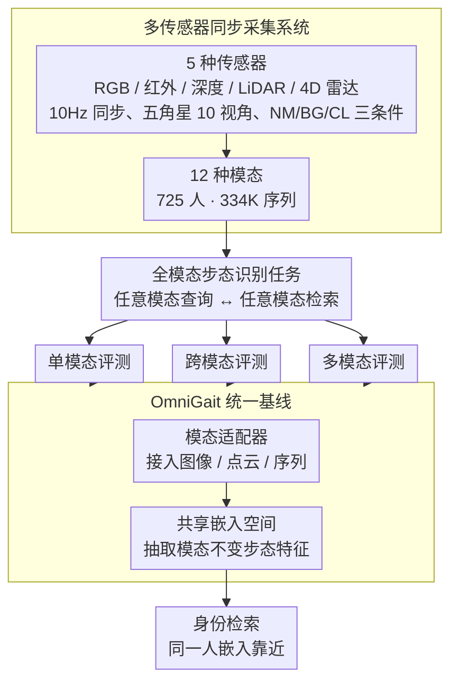

# MMGait: Towards Multi-Modal Gait Recognition

**会议**: CVPR 2026  
**arXiv**: [2604.15979](https://arxiv.org/abs/2604.15979)  
**代码**: [https://github.com/BNU-IVC/MMGait](https://github.com/BNU-IVC/MMGait)  
**领域**: 人体理解  
**关键词**: 步态识别, 多模态基准, 多传感器融合, 跨模态检索, 全模态识别

## 一句话总结

MMGait 构建了目前最全面的多模态步态识别基准数据集（5 种传感器、12 种模态、725 人、334K 序列），并提出全模态步态识别新任务和统一基线模型 OmniGait。

## 研究背景与动机

**领域现状**：步态识别作为远距离非接触式生物特征识别技术，近年来取得了显著进展。主流方法集中在 RGB 衍生模态（轮廓图、姿态序列），在室内外场景中表现良好。

**现有痛点**：RGB 衍生模态缺乏 3D 感知能力，在遮挡、雨雾、低光照等恶劣条件下性能严重下降。现有多模态数据集（如 LidarGait、FreeGait）仅包含 RGB 和 LiDAR 两种传感器，无法支持异构模态交互和统一跨传感器检索的研究。

**核心矛盾**：实际部署环境通常配备多种传感器（RGB、红外、深度、LiDAR、4D 雷达），但缺乏覆盖多传感器的步态基准限制了统一多模态系统的研究。每种模态有独特的优缺点——RGB 信息丰富但受光照影响，LiDAR 精确但稀疏，红外适应暗光但缺少纹理，4D 雷达穿透性强但分辨率有限。

**本文目标**：构建涵盖 5 种传感器的多模态步态基准，系统研究各模态特性，并提出统一的全模态识别框架。

**切入角度**：从单模态、跨模态、多模态三个维度全面评估各模态的识别能力、迁移性和互补性。

**核心 idea**：建立大规模多传感器步态数据集，提出 Omni Multi-Modal Gait Recognition 新任务——用单一模型接受任意模态输入并在任意模态中检索目标。

## 方法详解

### 整体框架

MMGait 包含三个层次：（1）数据集层——5 种传感器同步采集，处理为 12 种模态；（2）基准评估层——在单模态/跨模态/多模态三个范式下系统评估；（3）OmniGait 模型——学习跨模态共享嵌入空间，统一三种识别范式。这三层逐级递进：先用同步采集系统把异构传感器的数据搬到同一时间轴、产出对齐的多模态数据集，再在其上系统评测各模态特性，最后用全模态任务定义和 OmniGait 基线把割裂的三种识别范式收编进一个统一模型。

### 关键设计

**1. 多传感器同步采集系统：把 5 种传感器的步态搬到同一时间轴上**

现有多模态步态数据集（LidarGait、FreeGait）最多只有 RGB+LiDAR 两种传感器，根本没法研究异构模态之间怎么交互、怎么统一检索。MMGait 直接把传感器谱系拉满：RGB 相机（1280×800）、红外相机（940nm 窄带，特意避开 LiDAR 的工作波长防止干扰）、ToF 深度相机、128 线 LiDAR 和 4D FMCW 雷达，五种传感器全部 10Hz 同步采样，其中 RGB 与深度共享同一相机模组、天然帧对齐。采集时让 725 人沿五角星路线行走，一圈覆盖 0°–360° 共 10 个视角，每人都在正常（NM）、背包（BG）、换衣（CL）三种条件下走一遍，原始数据再处理成 12 种模态。这样一套配置把可见光到红外、2D 到 3D、低成本到高成本的传感器都串在了同一批受试者、同一组动作上，研究者才第一次能在严格对齐的条件下比较各模态的优劣。

**2. 全模态步态识别任务（Omni Multi-Modal Gait Recognition）：一个模型吃任意模态、在任意模态里检索**

实际部署的多传感器系统里，不同传感器在不同天气、光照下各自可用或失效，可如果给每一对「查询模态 ↔ 检索模态」都单独训一个模型，组合爆炸根本养不起。这篇把目标重新定义成：训练单一模型，查询端可以是任意一种模态（RGB 轮廓、LiDAR 点云、红外图像……），检索库里也可以是任意一种模态，只要是同一个人，嵌入就该靠近。换句话说，它逼着模型学到的是模态不变的步态表示，而不是某一种传感器专属的特征。任务这么定，就把过去割裂的单模态、跨模态、多模态三种评测收编进了同一个框架。

**3. OmniGait 统一基线：用共享嵌入空间证明全模态任务真能跑通**

新任务提出来还需要一个能站住的基线来说明它不是空中楼阁。OmniGait 学一个跨所有异构模态的共享嵌入空间：前端用模态适配器把图像、点云、序列这些格式各异的输入分别接进来，再统一抽取模态不变的步态特征；训练时把所有可用模态混在一起、共享同一套特征空间，而不是各练各的。结构上它刻意保持简单，但实验显示这样一个统一模型在多数模态上就能逼近甚至超过为单模态专门训练的模型，足以证明全模态识别的可行性和上限。

### 损失函数 / 训练策略

基于 triplet loss 和交叉熵损失的组合，遵循标准步态识别训练范式。200 人训练集、525 人测试集，gallery 使用 NM-01，query 使用 NM-02/BG-01/CL-01。

## 实验关键数据

### 主实验（单模态，GaitBase 框架）

| 模态 | NM R1 | BG R1 | CL R1 |
|------|-------|-------|-------|
| RGB 轮廓 | 98.5 | 96.4 | 61.0 |
| RGB 图像 | 98.4 | 95.3 | 51.7 |
| 红外轮廓 | 92.1 | 82.3 | 52.0 |
| 深度 | 93.5 | 89.1 | 59.1 |
| LiDAR 点云 | 82.7 | 78.2 | 58.5 |
| 4D 雷达点云 | 23.6 | 14.4 | 15.2 |

### 消融实验（OmniGait vs 单独模型）

| 设置 | 性能 |
|------|------|
| 各模态单独模型 | 各模态最优 |
| OmniGait 统一模型 | 多数模态达到可比甚至超越单独模型的性能 |

### 关键发现

- **红外模态在换衣条件下优势明显**：红外固有的纹理/颜色抑制特性使其在换衣场景中表现突出
- **深度和 LiDAR 等结构模态也有换衣鲁棒性**：3D 结构信息天然不受衣服颜色/纹理影响
- **4D 雷达性能显著落后**：点云稀疏性和低分辨率限制了其步态表征能力
- **RGB 和红外轮廓的性能差距主要源于分割器的领域偏移**：轮廓提取器在 RGB 上训练，直接应用于红外会降低 mask 质量
- **OmniGait 展示了全模态统一的可行性**：单一模型在多种模态上达到与专门模型可比的性能

## 亮点与洞察

- **数据集的全面性无可比拟**：5 种传感器、12 种模态、10 视角、3 条件的组合提供了前所未有的研究维度
- **全模态任务定义有前瞻性**：统一模型处理任意模态的目标直接对应实际部署需求
- **系统性分析的价值**：横跨 12 种模态的全面评估首次揭示了各模态在步态任务中的具体优劣，如红外的换衣鲁棒性和 4D 雷达的局限性

## 局限与展望

- 数据采集在受控环境中进行，与真实户外场景仍有差距
- 725 人的规模虽然在多模态中较大，但与 GREW（26K 人）等 RGB-only 数据集相比仍较小
- OmniGait 作为基线模型设计较简单，更复杂的跨模态对齐策略可能带来更好性能
- 4D 雷达的潜力未充分发掘，需要专门的网络设计

## 相关工作与启发

- **vs SUSTech1K**: SUSTech1K 只有 RGB+LiDAR 两种传感器，MMGait 扩展到 5 种传感器 12 种模态
- **vs CASIA-B**: CASIA-B 是经典基准但仅有 RGB，且规模较小（124 人）；MMGait 在多模态维度上有质的飞跃
- **vs FreeGait**: FreeGait 也是 RGB+LiDAR 但仅 1 个视角，MMGait 提供 10 视角完整覆盖

## 评分

- 新颖性: ⭐⭐⭐⭐⭐ 首个 5 传感器 12 模态步态基准，全模态识别任务定义有开创性
- 实验充分度: ⭐⭐⭐⭐⭐ 单模态/跨模态/多模态三个维度系统评估，多方法对比
- 写作质量: ⭐⭐⭐⭐ 数据集描述详细，评估逻辑清晰
- 价值: ⭐⭐⭐⭐⭐ 为多模态步态识别领域提供了里程碑式的基准资源

<!-- RELATED:START -->

## 相关论文

- [\[CVPR 2026\] Text-guided Feature Disentanglement for Cross-modal Gait Recognition](text-guided_feature_disentanglement_for_cross-modal_gait_recognition.md)
- [\[CVPR 2026\] EventGait: Towards Robust Gait Recognition with Event Streams](eventgait_towards_robust_gait_recognition_with_event_streams.md)
- [\[CVPR 2026\] HyperGait: Unleashing the Power of Parsing for Gait Recognition in the Wild via Hypergraph](hypergait_unleashing_the_power_of_parsing_for_gait_recognition_in_the_wild_via_h.md)
- [\[CVPR 2026\] Unlocking Motion from Large Vision Models with a Semantic and Kinematic Duality for Gait Recognition](unlocking_motion_from_large_vision_models_with_a_semantic_and_kinematic_duality_.md)
- [\[CVPR 2026\] DyaDiT: A Multi-Modal Diffusion Transformer for Socially Favorable Dyadic Gesture Generation](dyadit_a_multi-modal_diffusion_transformer_for_socially_favorable_dyadic_gesture.md)

<!-- RELATED:END -->
