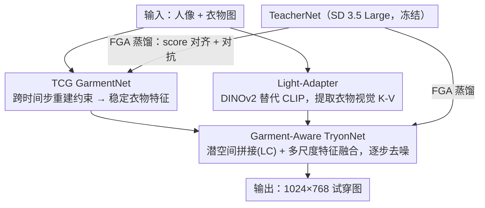

# Mobile-VTON: High-Fidelity On-Device Virtual Try-On

**会议**: CVPR 2026  
**arXiv**: [2603.00947](https://arxiv.org/abs/2603.00947)  
**代码**: 有 ([https://zhenchenwan.github.io/Mobile-VTON/](https://zhenchenwan.github.io/Mobile-VTON/))  
**领域**: 人体理解  
**关键词**: 虚拟试穿, 移动端部署, 知识蒸馏, 扩散模型, 隐私保护  

## 一句话总结
首个全离线移动端扩散式虚拟试穿框架，基于TeacherNet-GarmentNet-TryonNet (TGT)架构，通过特征引导对抗蒸馏(FGA)将SD3.5 Large的能力迁移到415M参数的轻量学生网络，在VITON-HD和DressCode上以1024×768分辨率匹配甚至超越服务器端基线，端到端推理时间约80秒（小米17 Pro Max）。

## 背景与动机
虚拟试穿(VTON)技术在时尚电商领域非常实用，但现有高质量方法几乎全部依赖云端GPU：用户必须上传个人照片到服务器做推理，不仅有延迟和能耗问题，更带来严重的隐私风险（尤其在严格数据保护法规下）。将扩散式VTON部署到移动端面临三大挑战：(1) 模型参数量大、内存和延迟远超移动NPU/GPU能力；(2) 衣物表征在扩散时间步间会发生语义漂移，导致纹理扭曲和细节丢失；(3) 现有方法严重依赖大规模预训练（如ImageNet或大规模文生图），轻量架构无法直接从任务数据学到足够好的生成能力。

## 核心问题
如何在不上传用户数据、仅用一张人像和一张衣物图作为输入的条件下，在普通手机上实现高保真虚拟试穿？核心矛盾是：模型要足够小以在移动端运行，同时生成质量要追平参数量大5-17倍的服务器端方法。

## 方法详解

### 整体框架

Mobile-VTON 要回答的问题是：能不能把一个本来跑在云端、参数量 2B+ 的扩散试穿模型塞进手机，还不掉质量。它的答案是一套模块化的 TGT 架构——一个冻结的 TeacherNet（SD 3.5 Large）当知识源，两个轻量学生 GarmentNet 和 TryonNet 分别负责「提取一致的衣物特征」和「把人体与衣物融合成试穿图」。输入只有一张人像加一张衣物图，先由 GarmentNet 把衣物编码成跨时间步稳定的特征，再喂给 TryonNet 逐步去噪生成 1024×768 的试穿结果；衣物的视觉语义则由一个用 DINOv2-base 替换 CLIP 的 Light-Adapter 注入。整个系统从任务数据直接训练，不依赖任何外部大规模预训练，全靠 TeacherNet 的 FGA 蒸馏把容量补回来。

### 关键设计

**1. FGA 蒸馏：让 415M 的学生追上 2B+ 的教师**

轻量学生最大的难处是容量不够、从头学根本收敛不了（消融里去掉蒸馏后 FID 从 10.2 暴涨到 113.6，完全崩溃）。FGA（Feature-Guided Adversarial Distillation）用两个互补目标把教师的能力搬过来：一是特征级蒸馏，在每个扩散时间步上对齐 TeacherNet 与学生的 score function，$\mathcal{L}_{feature} = \mathbb{E}_t[\|s_{true} - s_{fake}\|^2]$，走的是 DMD2 式的 score matching 而不是逐像素回归，让学生学到的是教师的分布行为而非某张图的像素；二是对抗增强，加一个轻量判别器 $D$ 区分真实图与 TryonNet 生成图，用标准 GAN 损失 $\mathcal{L}_{GAN}$ 把真实感和细节清晰度顶上去。分布对齐保证「像」，对抗损失保证「清晰」，两者合起来才让小模型逼近教师级质量。

**2. TCG：用跨时间步重建约束摁住衣物的语义漂移**

扩散模型在不同时间步对同一件衣物的理解会漂移，导致颜色、纹理、logo 在去噪过程中扭曲。TCG（Trajectory-Consistent GarmentNet）的做法很直接：在每个时间步 $t$ 都要求 GarmentNet 能重建回原始衣物图，$\mathcal{L}_{cons} = \mathbb{E}_t[\|\hat{X}_g(t) - X_g\|^2]$。这条时序正则化把衣物特征钉在整条扩散轨迹上保持一致，结构简单却有效——消融里加上 TCG 后 LPIPS 从 0.119 降到 0.111，logo 和条纹明显更清晰、颜色定位也更准。

**3. Garment-Aware TryonNet：在无预训练前提下学会衣物-身体对齐**

没有大规模预训练打底，TryonNet 很难凭空学到衣物该怎么贴合身体。这里靠两个手段补偿：一是 Latent Concatenation（LC），把人像和衣物图在高度维度拼接后一起编码进 latent space，并额外引入「目标人像+衣物」的参考条件输入，给模型显式的几何与外观线索（消融里 LC 在 TCG 基础上把 LPIPS 从 0.111 进一步压到 0.088）；二是多尺度特征融合，TryonNet 每层 self-attention 都拼接 GarmentNet 对应层的特征，cross-attention 同时吃文本和 Light-Adapter 的视觉 K-V，让衣物语义在多个层次注入。

**4. Light-Adapter：用 DINOv2 换掉 CLIP 换效率**

CLIP 的大型视觉编码器在移动端太重。Light-Adapter 用 DINOv2-base 替代，把衣物图像特征投影成 K、V 张量，通过解耦 cross-attention 注入 TryonNet。这是一次效率-质量的权衡：DINOv2 提供的语义足够丰富，同时编码器更轻，契合手机端的算力预算。

### 损失函数 / 训练策略
- GarmentNet总损失：ℒ_GarmentNet = λ₁·ℒ_featureG + λ₂·ℒ_cons
- TryonNet总损失：ℒ_TryonNet = ℒ_Diff + λ₁·ℒ_featureT + λ₃·ℒ_GAN（其中ℒ_Diff为衣物感知重建损失）
- 超参数：λ₁=1e-2, λ₂=0.5, λ₃=5e-3
- 两阶段训练：Stage 1在DressCode+VITON-HD合并集上训练140 epochs（lr=1e-4），Stage 2在DressCode上微调100 epochs（lr=5e-5）
- 8×A100 80GB，batch size=256，AdamW优化器

## 实验关键数据

| 数据集 | 指标 | 本文(Mobile-VTON) | 之前SOTA | 对比说明 |
|--------|------|------|----------|------|
| VITON-HD | LPIPS↓ | 0.088 | 0.102 (IDM-VTON) | 超越服务器端最优(mask-based) |
| VITON-HD | SSIM↑ | 0.893 | 0.890 (SD-VITON) | 最佳 |
| DressCode | LPIPS↓ | 0.053 | 0.0513 (BooW-VTON) | 接近最优 |
| DressCode | SSIM↑ | 0.935 | 0.928 (BooW-VTON) | 最佳 |
| VITON-HD In-Wild | LPIPS↓ | 0.133 | 0.137 (IDM-VTON) | 最佳 |
| 内存占用 | GPU Memory | 2.84 GB | 5.80-18.47 GB | 减少51%-85% |
| 部署 | 移动端 | ✓ (小米17 Pro Max, ~80s) | 全部✗ | 唯一可移动端运行的方法 |

### 消融实验要点
- **TCG的贡献**：加入TCG后LPIPS从0.119降到0.111，SSIM从0.874升到0.879，CLIP-I从0.798升到0.805。视觉上可见logo和条纹更清晰、颜色定位更准确
- **LC的贡献**：在TCG基础上加LC，LPIPS进一步从0.111降到0.088，SSIM升到0.893，CLIP-I升到0.833。LC提供了显式衣物几何和外观线索，弥补无预训练的劣势
- **蒸馏的关键性**：去除蒸馏后FID从10.2暴涨到113.6，完全崩溃——说明轻量模型在无教师引导下从头训练根本无法收敛
- **数据集质量影响**：DressCode微调优于VITON-HD微调（轻量模型对数据质量更敏感，DressCode分辨率更统一、视觉更清晰）

## 亮点
- 技术上最大的亮点是FGA蒸馏：score-based distillation + GAN的组合让415M参数学生网络达到了2B+参数教师级别的生成质量
- TCG的设计非常简洁高效——只是一个跨时间步的重建一致性约束，但有效解决了扩散模型中衣物语义漂移的核心问题
- 全系统从任务数据直接训练、不依赖大规模预训练，对资源有限的场景很有参考价值
- DINOv2-base替代CLIP做视觉编码器的选择值得关注——在移动端场景下是一个好的效率-质量trade-off
- 在真实手机上跑通了完整pipeline并给出了实际推理时间（80s），不是纸上谈兵

## 局限与展望
- 80秒的端到端推理时间对用户体验来说仍然偏长，未使用步数缩减、剪枝或系统级加速
- 无法准确生成带文字的衣物（logo、品牌名、口号），因为缺乏文字感知预训练且训练数据中文字衣物较少
- 仅支持上半身试穿，未扩展到全身、裙装等类别
- 作为mask-free方法，需要合成整张图（含背景和身体），FID/KID指标上天然不如mask-based方法公平
- INT8量化在Android NPU上执行，但未报告量化带来的精度损失具体数据

## 与相关工作的对比
- **vs IDM-VTON (18.47GB)**：IDM-VTON是mask-based方法中最强的服务器端基线，在VITON-HD上CLIP-I达0.875。Mobile-VTON在LPIPS和SSIM上超越它，CLIP-I略低(0.833 vs 0.875)，但内存仅需2.84GB且可移动端运行——本质是不同维度的方法。
- **vs CatVTON**：同为mask-free方法，CatVTON也用latent拼接策略。Mobile-VTON在LPIPS/SSIM全面超越CatVTON(0.088 vs 0.161, 0.893 vs 0.872)，说明TGT架构+FGA蒸馏的组合远优于单纯使用CatVTON的拼接策略。
- **vs BooW-VTON**：BooW-VTON是mask-free方法中最强的服务器端基线，在FID/KID上最优。Mobile-VTON在DressCode上SSIM超越它(0.935 vs 0.928)，LPIPS接近(0.053 vs 0.051)，但内存仅需2.84GB vs 18.47GB。

## 启发与关联
- FGA蒸馏策略（score-based + 对抗）可迁移到其他需要部署在边缘设备的扩散模型任务
- TCG的时序一致性约束思路可借鉴到视频生成、3D一致生成等时序/多视角任务
- "数据质量对轻量模型比大模型更重要"这一发现值得在其他蒸馏研究中验证
- 关联idea: `20260316_convnet_dit_hybrid_distill.md`（扩散模型蒸馏相关）

## 评分
- 新颖性: ⭐⭐⭐⭐ [TGT架构设计和FGA蒸馏策略具有系统性创新，首个移动端扩散VTON有实际工程价值]
- 实验充分度: ⭐⭐⭐⭐⭐ [三个数据集、多个基线、详细消融、真实手机部署、数据集质量分析，非常全面]
- 写作质量: ⭐⭐⭐⭐ [结构清晰，图表丰富，方法描述详尽]
- 价值: ⭐⭐⭐⭐ [移动端部署扩散模型是重要工程方向，FGA蒸馏策略具有较好的通用性]

<!-- RELATED:START -->

## 相关论文

- [\[CVPR 2026\] RefTon: Reference Person Shot Assist Virtual Try-on](refton_reference_person_shot_assist_virtual_try-on.md)
- [\[CVPR 2025\] VTON 360: High-Fidelity Virtual Try-On from Any Viewing Direction](../../CVPR2025/human_understanding/vton_360_high-fidelity_virtual_try-on_from_any_viewing_direction.md)
- [\[CVPR 2026\] MOFA-VTON: More Fashion Possibilities with Fine-Grained Adaptations in Virtual Try-On](mofa-vton_more_fashion_possibilities_with_fine-grained_adaptations_in_virtual_tr.md)
- [\[CVPR 2026\] 4DSurf: High-Fidelity Dynamic Scene Surface Reconstruction](textit4dsurf_high-fidelity_dynamic_scene_surface_reconstruction.md)
- [\[CVPR 2026\] Reference-Free Image Quality Assessment for Virtual Try-On via Human Feedback](reference-free_image_quality_assessment_for_virtual_try-on_via_human_feedback.md)

<!-- RELATED:END -->
