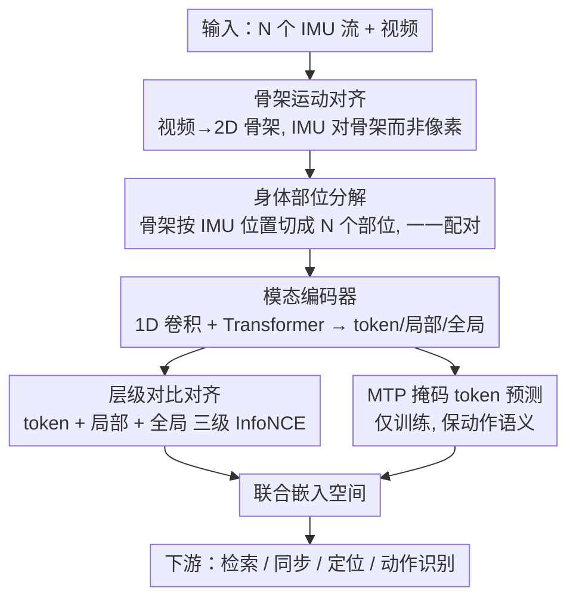

# MoBind: Motion Binding for Fine-Grained IMU-Video Pose Alignment

**会议**: CVPR 2026  
**论文**: [CVF Open Access](https://openaccess.thecvf.com/content/CVPR2026/html/Nguyen_MoBind_Motion_Binding_for_Fine-Grained_IMU-Video_Pose_Alignment_CVPR_2026_paper.html)  
**代码**: https://github.com/bbvisual/MoBind  
**领域**: 人体理解 / 多模态对比学习 / IMU-视频对齐  
**关键词**: IMU、骨架运动、层级对比学习、时序同步、跨模态检索、人体动作识别

## 一句话总结
MoBind 用层级对比学习把可穿戴 IMU 信号与视频提取的 2D 骨架运动对齐——先把 IMU 对到"骨架运动"而非原始像素以滤掉无关背景、再把全身分解成各身体部位与对应 IMU 配对、最后在 token/局部/全局三个层级做对比并配一个掩码 token 预测辅助任务——从而在跨模态检索、亚秒级时序同步、人物/部位定位、动作识别四个下游任务上全面超越强基线。

## 研究背景与动机

**领域现状**：理解人体运动对动作识别、运动分析、康复监测都很关键，但单模态都有短板：视频有丰富语义却受遮挡、视角、帧率限制；IMU 时序密集精确却缺视觉上下文、难解读。把两者对齐成一个联合表征，能解锁免标定时序同步、跨模态检索、把 IMU 关联到正确人物等能力。已有 IMU-视觉工作（IMU2CLIP、ImageBind、UniMTS、DeSPITE）多沿用 CLIP 式对比，把一整段 clip 压成一个全局向量再配对。

**现有痛点**：全局单向量设计擅长粗粒度语义区分（动作类别），却**抹掉了细粒度时序结构**——只差一个相位偏移、短延迟或重复周期边界的片段会被压到相近的码上，导致表征对真正的时序同步不敏感，无法支撑免标定同步、亚秒级跨模态检索和空间定位。

**核心矛盾**：直接照搬音视频亚秒对齐方法也不行，因为 IMU 与音频本质不同：① 音频常关联场景里多个视觉实例、提供场景级线索，而 IMU 是**局部、严格以运动为中心**的，大部分视觉背景对它无关；② IMU 常是**多传感器**部署、每个贴在不同身体部位，朴素拼接会丢掉空间与时序特异性；③ 人体运动**高度连续重复**（如行走周期），产生大量却高度相似的同步线索，容易造成歧义对齐。

**本文目标**：学一个既保粗粒度动作语义、又显式建模 IMU 与视频间细粒度（亚秒）时序动态的联合表征，并同时支撑检索/同步/定位/识别四类任务。

**切入角度**：不对原始像素、而对视频提取的**骨架运动序列**做对齐（天然滤掉无关背景），把骨架按 IMU 安装位置分解成各身体部位、与对应 IMU 一一配对，再用层级对比捕捉从 token 到全身的多粒度对应。

**核心 idea**：用"骨架运动对齐 + 身体部位分解 + token/局部/全局三级层级对比 + 掩码 token 预测保语义"四件套，把细粒度时序同步和粗粒度动作语义统一进一个联合嵌入空间。

## 方法详解

### 整体框架
MoBind 是端到端框架：从视频抽 2D 骨架关节序列，同时处理 $N$ 个体上 IMU 原始流。IMU 模块和姿态模块各自把输入编码成"每传感器/每部位"的局部表征，再聚合成全局表征；对比损失同时作用在 token、局部、全局三个层级；另有一个仅训练时启用的掩码 token 预测（MTP）模块作用于 IMU 流，防止模型过度偏向细粒度对齐而丢掉动作语义。学到的联合表征支持跨模态检索、时序同步、人物/部位定位、动作识别四个下游任务。

### 关键设计

**1. 骨架运动对齐 + 身体部位分解：把 IMU 对到运动语义、按部位结构化配对**

针对"原始像素含大量无关背景"和"多传感器朴素拼接丢空间特异性"两个痛点。MoBind 不让 IMU 去对视频像素，而是对视频用 MMPose/RTMPose 提取的 2D 骨架运动序列——IMU 是局部、运动中心的信号，骨架正好剥离了与运动无关的视觉背景。进一步，根据 IMU 已知的佩戴位置把全身骨架分解成 $N$ 个部位段 $X^{\text{part}}_n\in\mathbb{R}^{F\times 2J_n}$（各含 $J_n$ 个关节），每个部位段与它对应的 IMU 配成一对，实现有语义依据的多传感器对齐。两条流（IMU、姿态）都用"1D 卷积块 + Transformer 层"编码：把帧序列切成 $T$ 个非重叠时序 patch、投影后过 Transformer 得到 $T$ 个 token，再对时序维均值池化得到单传感器/单部位的局部表征 $Z\in\mathbb{R}^D$；把 $N$ 个局部向量拼接后过 `LayerNorm→MLP` 聚合块得到全局表征 $G\in\mathbb{R}^{D'}$。两模态强制 token 数 $T$ 一致以便对齐。

**2. 层级对比对齐：token / 局部 / 全局三级 InfoNCE 同时建模多粒度对应**

针对"全局单向量抹掉细粒度时序"的核心痛点。MoBind 在三个层级做对比：(i) **token 级**——逐个时序 token 跨模态匹配（$Z^{\text{imu}}_t$ 对 $Z^{\text{part}}_t$），促进沿时间轴的细粒度（亚秒）对应；(ii) **局部级**——每个 IMU 传感器 $n$ 与其对应身体部位对齐（$Z^{\text{imu}}_n$ 对 $Z^{\text{part}}_n$）；(iii) **全局级**——聚合后的 IMU 表征 $G^{\text{imu}}$ 与全局骨架表征 $G^{\text{part}}$ 对齐。三级都用 InfoNCE，以余弦相似度 $s(\cdot,\cdot)$、可学习温度 $\tau$ 定义，且做双向（IMU↔Pose）平均，例如全局项

$$L^{A\to B}_{\text{global}}=-\frac{1}{K}\sum_{i=1}^{K}\log\frac{\exp(s(G_{A,i},G_{B,i})/\tau)}{\sum_{j=1}^{K}\exp(s(G_{A,i},G_{B,j})/\tau)},$$

token 级在此基础上再对 $T$ 个时刻求和归一。最终对齐损失加权融合三级：$L_{\text{align}}=\lambda_g L_{\text{global}}+\lambda_l L_{\text{local}}+\lambda_t L_{\text{token}}$。这样细粒度目标抓亚秒、肢体级线索，全局目标聚合全身运动，二者互补——消融证实每加一级都带来一致提升。

**3. MTP 掩码 token 预测：保住动作语义、防止只顾细粒度对齐**

针对"层级对比偏向细粒度同步、会欠表达对动作识别有用的高层语义"。MTP 是仅训练期、作用于 IMU 流的辅助任务：把 IMU token 序列 $Z\in\mathbb{R}^{N\times T\times D}$ 随机采一组掩码位置 $\mathcal{M}$（$|\mathcal{M}|=\lfloor\alpha NT\rfloor$）替换成可学习查询向量 $q_{\text{mask}}$，用一个轻量 Transformer $D_{\text{mtp}}$ 借未掩码上下文预测被掩 token，损失为掩码位置的均方误差

$$L_{\text{mtp}}=\frac{1}{|\mathcal{M}|}\sum_{(n,t)\in\mathcal{M}}\big\|Z^{\text{pred}}_{n,t}-Z_{n,t}\big\|_2^2.$$

总损失 $L=L_{\text{align}}+\lambda_{\text{mtp}}L_{\text{mtp}}$。MTP 起正则作用，让嵌入在强调时序细粒度的同时保留类别级语义——消融显示它在 TotalCapture 上把动作识别拉高近 20%。

### 损失函数 / 训练策略
固定 5s 窗口、每段 $T=25$ 个 token，局部/全局嵌入维度均为 256。损失权重 $\lambda_g=1.0,\lambda_l=1.0,\lambda_t=0.5,\lambda_{\text{mtp}}=0.3$，MTP 掩码比 $\alpha=0.75$。全程用 RTMPose 估计的 2D 关键点（贴近真实部署）。Adam 优化（学习率 $1\times10^{-4}$，batch size 1356），按验证集 R@1 早停（patience 500 epoch），单卡 RTX 5090 约 2.5 小时/次。检索用多正样本机制：一段姿态可对应多个 IMU 传感器，最终 IMU 嵌入取各传感器表征平均。

## 实验关键数据

### 主实验
三个多模态数据集 mRi、TotalCapture、EgoHumans（含多人场景），全用估计的 2D 关键点。跨模态检索用 Recall@k（$k\in\{1,5,10\}$），双向 IMU→Video / Video→IMU。下表取 R@1 摘要（完整表含 R@5/R@10）。

| 数据集 | 方向 | IMU2CLIP | DeSPITE | SyncNet | **MoBind** |
|--------|------|----------|---------|---------|------------|
| mRi | IMU→Video R@1 | 0.67 | 0.57 | 0.77 | **0.94** |
| mRi | Video→IMU R@1 | 0.38 | 0.32 | 0.75 | **0.92** |
| TotalCapture | IMU→Video R@1 | 0.06 | 0.03 | 0.51 | **0.87** |
| TotalCapture | Video→IMU R@1 | 0.07 | 0.03 | 0.54 | **0.68** |
| EgoHumans | IMU→Video R@1 | 0.29 | 0.54 | 0.74 | **0.83** |

时序同步（20s 视频，随机偏移 $[-7,7]$s，top-5 检索；MAE 单位秒、Acc 为 200ms 容差内准确率）：

| 方法 | mRi MAE↓ | mRi Acc↑ | TotalCapture MAE↓ | TotalCapture Acc↑ | EgoHumans MAE↓ | EgoHumans Acc↑ |
|------|----------|----------|-------------------|-------------------|----------------|----------------|
| SyncWISE | 3.31 | 0.04 | 4.07 | 0.02 | 3.68 | 0.02 |
| IMU2CLIP | 1.17 | 0.70 | 2.32 | 0.13 | 3.13 | 0.44 |
| IMUSync | 0.72 | 0.75 | 0.96 | 0.71 | 1.01 | 0.82 |
| **MoBind** | **0.47** | **0.88** | **0.05** | **0.98** | **0.04** | **1.00** |

人物定位（EgoHumans，判断谁戴 IMU）：MoBind Acc 0.9812 / F1 0.9801，优于 DeSPITE (0.9759)、SyncNet (0.9749)、VIPL (0.9014)。动作识别（mRi/TotalCapture，Finetune 与 1-NN）：MoBind 在四项设置均最佳，如 TotalCapture 1-NN 达 0.71。

### 消融实验

| 配置 | mRi R@1 (I→V) | mRi R@1 (V→I) | 同步 Acc | 定位 |
|------|----------------|----------------|----------|------|
| 仅 global | 0.34 | 0.31 | 0.81 | 0.22 |
| global + local | 0.77 | 0.78 | 0.86 | 0.75 |
| global + local + token | 0.94 | 0.92 | 0.88 | 0.81 |

| 配置 | mRi Finetune | mRi 1-NN | TotalCapture Finetune | TotalCapture 1-NN |
|------|--------------|----------|------------------------|---------------------|
| MoBind w/o MTP | 0.97 | 0.76 | 0.55 | 0.53 |
| MoBind | 0.98 | 0.86 | 0.72 | 0.71 |

### 关键发现
- **层级对比每级都管用**：只用 global 时检索 R@1 仅 0.34，加 local 升到 0.77，再加 token 升到 0.94，定位也从 0.22→0.75→0.81——细粒度 token 抓亚秒/肢体线索，全局聚合全身运动，互补。
- **MTP 对保语义关键**：去掉 MTP，TotalCapture 动作识别 1-NN 从 0.71 掉到 0.53、Finetune 从 0.72 掉到 0.55（近 20% 跌幅），印证它在保留类别语义上的正则作用。
- **基线为何输**：在 mRi 的 R@1 错误中，top-1 干扰项与真值同属一个动作类的比例高达 0.75–0.79，说明全局单向量只编码粗语义、做不了实例级对齐；TotalCapture 上基线的"硬负样本余量中位数"为负（-0.14 ~ -0.11，即最难干扰项比真匹配还相似），而 MoBind 为 +0.10。
- **长输入更准、抗传感器失效**：mRi 上 2 分钟片段同步准确率达 97%、3 分钟达 100%；随机丢传感器时检索性能虽下降但仍稳健，体现模块化设计对真实部署的鲁棒性。

## 亮点与洞察
- "对骨架而非像素"是个朴素却关键的决定：IMU 本就是局部运动信号，骨架天然剥离了无关视觉背景，比硬对像素更省力也更准——这个对齐目标选择本身就值得借鉴。
- token/局部/全局三级层级对比把"亚秒同步"和"动作语义"两个尺度统一进一个嵌入空间，消融数字（0.34→0.77→0.94）清楚说明三级互补、缺一不可。
- 把"按身体部位分解 + 每部位配对应 IMU"做成结构化多传感器对齐，既能定位"谁戴了 IMU"又能定位"戴在哪个部位"，比只做人物级关联多了一层粒度。
- MTP 这种"掩码重建当语义正则"的 trick 可迁移：当对比学习过度偏向细粒度对齐而丢语义时，加一个掩码 token 预测分支即可把高层语义拉回来。

## 局限与展望
- 依赖 2D 骨架估计质量（RTMPose），在严重遮挡、极端视角或姿态估计失败时对齐质量会受连带影响（作者用估计关键点贴近部署，但未深入分析估计误差传导）。
- 需已知 IMU 的佩戴位置来做部位分解配对，对佩戴位置未知/错配的场景适用性受限。
- 重复性运动（如 mRi 的康复动作）产生大量近重复片段、硬负样本多，同步在短片段上误差偏大（需 2–3 分钟长片段才达 97–100%）。
- 部位定位准确率在不同数据集差异大（mRi 0.81、TotalCapture 0.57、EgoHumans 0.63），多人/高动态场景仍有提升空间。

## 相关工作与启发
- **vs IMU2CLIP / ImageBind / UniMTS / DeSPITE（CLIP 式全局对齐）**: 它们把 clip 压成单全局向量、面向 HAR 的粗语义，缺亚秒级时序精度；MoBind 用层级对比保留细粒度时序，检索/同步大幅领先（TotalCapture 同步 MAE 从 2.32s 降到 0.05s）。
- **vs SyncNet / DiVAS / IMUSync（音视频/偏移分类同步）**: 音视频同步线索既有瞬时也有连续型，方法直接迁到 IMU-视频不佳；本文针对 IMU 局部、运动中心、重复性强的特性定制层级对比，同步 Acc 全面更高。
- **vs SyncWISE（相关性法）/ VIPL（人物关联）**: SyncWISE 靠 IMU 与光流导数的相关性估偏移、需手势或启发式；VIPL 只做人物级匹配。MoBind 在统一学习框架内同时解决时序同步与空间（人物+部位）关联，人物定位 F1 0.98 优于 VIPL 的 0.89。

## 评分
- 新颖性: ⭐⭐⭐⭐ 首个直击细粒度 IMU-视频对齐的工作，层级对比 + 部位分解 + MTP 组合清晰，但各组件多为已有思想的巧妙重组
- 实验充分度: ⭐⭐⭐⭐⭐ 三数据集 × 四下游任务 + 双消融 + 传感器失效鲁棒性，覆盖全面、对比详尽
- 写作质量: ⭐⭐⭐⭐⭐ 动机层层递进（为何不能照搬音视频）、方法与实验对应紧密，叙事清晰
- 价值: ⭐⭐⭐⭐ 免标定同步 + 隐私友好检索 + 多人定位等能力实用，代码开源，对可穿戴+视频多模态有推动

<!-- RELATED:START -->

## 相关论文

- [\[CVPR 2026\] MOFA-VTON: More Fashion Possibilities with Fine-Grained Adaptations in Virtual Try-On](mofa-vton_more_fashion_possibilities_with_fine-grained_adaptations_in_virtual_tr.md)
- [\[CVPR 2026\] MoLingo: Motion-Language Alignment for Text-to-Human Motion Generation](molingo_motion-language_alignment_for_text-to-motion_generation.md)
- [\[AAAI 2026\] CLIP-FTI: Fine-Grained Face Template Inversion via CLIP-Driven Attribute Conditioning](../../AAAI2026/human_understanding/clip-fti_fine-grained_face_template_inversion_via_clip-driven_attribute_conditio.md)
- [\[AAAI 2026\] Improving Sparse IMU-based Motion Capture with Motion Label Smoothing](../../AAAI2026/human_understanding/improving_sparse_imu-based_motion_capture_with_motion_label_smoothing.md)
- [\[CVPR 2026\] IMU-HOI: A Symbiotic Framework for Coherent Human-Object Interaction and Motion Capture via Contact-Conscious Inertial Fusion](imu-hoi_a_symbiotic_framework_for_coherent_human-object_interaction_and_motion_c.md)

<!-- RELATED:END -->
