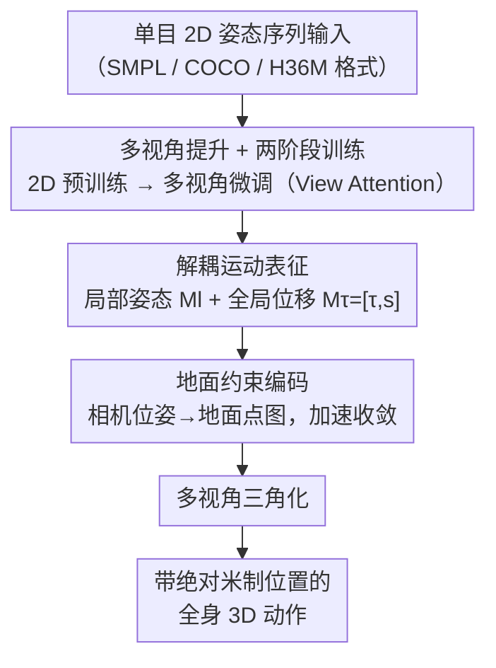

# Mocap-2-to-3: Multi-view Lifting for Monocular Motion Recovery with 2D Pretraining

**会议**: CVPR 2026  
**论文**: [CVF Open Access](https://openaccess.thecvf.com/content/CVPR2026/html/Wang_Mocap-2-to-3_Multi-view_Lifting_for_Monocular_Motion_Recovery_with_2D_Pretraining_CVPR_2026_paper.html)  
**代码**: https://wangzhumei.github.io/mocap-2-to-3/ (项目页)  
**领域**: 人体理解 / 单目人体动作恢复 / 扩散模型  
**关键词**: 单目动作捕捉, 多视角提升, 2D 预训练, 绝对位姿, 扩散模型

## 一句话总结
Mocap-2-to-3 把"从单目 2D 姿态恢复 3D 动作"重新表述成多视角合成问题：先用海量 2D 数据预训练一个单视角运动扩散模型、再在少量 3D 数据上做多视角微调，配合解耦的局部姿态/全局位移表征与地面点图约束，从单目输入恢复出带米制绝对位置的全身动作，在 RICH/AIST++ 上同时打败了相机空间与世界坐标的 SOTA。

## 研究背景与动机

**领域现状**：无标记动作捕捉要支撑与物理世界交互的下游任务（游戏、运动分析、多人交互、具身智能），就必须恢复**世界坐标下的绝对位置**。单目方案相比多相机系统硬件少、约束少、更实用。现有 SOTA（WHAM、GVHMR、TRAM 等）大多严重依赖在受控环境采集的精确 3D 动捕数据训练。

**现有痛点**：(1) 高质量 3D 数据昂贵、需专业设备和受控环境，限制了对**分布外（OOD）场景**的泛化，下游任务往往还得在领域专用数据上微调才准；(2) 多数单目方法只恢复**相对**全局位置（靠和真值首帧对齐），无法直接部署到需要环境感知和空间推理的真实交互；(3) 从单目观测估计**米制尺度**位姿本身就病态——深度（Z 轴）无法从 2D 直接推断。

**核心矛盾**：2D 数据海量易得（互联网视频、估计/标注的 2D 骨架）且动作多样，但缺 3D 监督；3D 数据有精确绝对定位、协调动力学和一致骨骼比例，但稀缺且受控。如何"两头通吃"——既借 2D 的多样性提泛化、又借 3D 的几何约束保精度？

**本文目标**：从单目 2D 姿态序列恢复带绝对米制位置、且动作细节精细的全身 3D 动作，并对 OOD 动作有强泛化。

**切入角度**：受 Motion-2-to-3 启发，不再"直接回归 3D"，而是把 3D 动作**重新表述为多视角合成过程**——从单目输入合成其它虚拟视角的 2D 动作，再三角化成 3D。这样就能让训练拆成"2D 预训练 + 3D 多视角微调"两段，把 2D 数据的多样性注入进来。

**核心 idea**：用"多视角提升"替代"直接 3D 回归"，配合解耦运动表征和地面点图约束，从单目恢复米制绝对位姿。

## 方法详解

### 整体框架
Mocap-2-to-3 是一个把单目 2D 姿态提升为全局一致 3D 动作的扩散框架。训练分两段：先用大量 2D 数据预训练一个**任意单视角**的 2D 运动扩散模型 $\mathcal{D}_{2D}$ 建立运动先验；再用公开 3D 数据投影出的多视角 2D 监督做微调，插入 View Attention 层强制跨视角一致性，得到多视角扩散模型 $\mathcal{D}_{mv}$。为恢复世界坐标下的绝对位置，作者用一种解耦的运动表征把局部姿态和全局位移分开学习，并把相机位姿算出的地面方程编码成点图（pointmaps）作为条件输入以加速收敛。推理时给定单目 2D 输入，模型为各虚拟视角生成 2D 动作、经三角化重建带绝对位置的 3D 动作。

### 关键设计

**1. 多视角提升 + 两阶段训练：用 2D 数据的多样性弥补 3D 数据的稀缺**

痛点是只用受限的 3D 数据训练会导致 OOD 泛化差。作者把 3D 动作重写成多视角合成：第一阶段训一个 Transformer 扩散模型 $\mathcal{D}_{2D}$，输入随机噪声 $\epsilon$、输出 2D 运动序列 $M\in\mathbb{R}^{T\times J\times2}$（$T$ 帧、$J$ 关键点），学会从任意相机视角生成 2D 动作——这一步用真实/公开 2D 视频建立跨视角的运动先验，并加速后续收敛。第二阶段把 $\mathcal{D}_{2D}$ 权重初始化到多视角模型 $\mathcal{D}_{mv}$，视角数 $V=4$（一个主相机 $V_0$ 用于推理 + 三个虚拟相机，位姿从预训练见过的相机位姿随机采样），把 3D 动作投影到各视角得到几何一致的 2D 监督。因为无需图像对作输入，可对已有 3D 动作做旋转/平移/视角增强（pitch/yaw/roll/距离），从少量样本生成大规模虚拟训练数据。$\mathcal{D}_{mv}$ 用 View Attention 层强制跨视角一致，输入主视角 2D 嵌入 $M_0$ 和相机内外参 $K,RT$，生成各虚拟视角 2D 动作后三角化为 3D。扩散架构相比确定性回归骨干更擅长建模复杂分布、产出跨视角多样而连贯的样本。

**2. 解耦运动表征：让位置不再压过动作细节**

直接从给定视角预测投影后的全局坐标会失败：位置对 loss 的影响远大于骨架结构，网络会偏向位置线索而牺牲动作细节。作者提出把**局部姿态**和**全局位移**解耦独立优化。局部姿态 $M_l\in\mathbb{R}^{T\times(J-1)\times2}$（不含根关节位置）通过在包围盒内裁剪 2D 姿态、归一化到 $[-1,1]$、把根关节中心化得到，去除根位置影响；全局位移 $M_\tau=[\tau,s]\in\mathbb{R}^{T\times2\times2}$ 由根轨迹 $\tau$（包围盒中心的像素坐标）和运动尺度 $s$（水平/垂直方向的包围盒尺度）组成。多视角模型预测 $M_v\in\mathbb{R}^{V\times T\times(J+1)\times2}$，含根中心化局部姿态 $M_v^l$ 和全局位移 $M_v^\tau$。从局部到全局坐标的变换为 $\mathcal{M}_{v,\{1:J\}}^{g}=M_v^l\cdot s_v+\tau_v$，再与根坐标拼接 $\mathcal{M}_v^g=[\tau_v,\mathcal{M}_{v,\{1:J\}}^{g}]$；多视角 $\mathcal{M}_v^g$ 经相机参数和三角化重建绝对 3D 位姿。这样动作和轨迹各学各的，既全局一致又保留细节。

**3. 地面约束编码：用点图把物理世界几何灌进网络、加速收敛**

单目下深度有歧义，从源视角 $V_0$ 学其它视角的 2D 运动位置即便给了相机嵌入也收敛很慢。作者引入显式几何约束：用已知相机位姿计算**地面平面**，表示成点图 $P\in\mathbb{R}^{W\times H\times3}$——把图像每个像素 $(u,v)$ 映射到世界坐标 3D 点 $(x_w,y_w,z_w)$，每点是相机中心射线与地面的交点，形成视角相关的地面点云。注意只取地面而非完整环境点云，因为点图可直接由相机内外参算出、无需额外传感器或真值扫描，便于真实部署。点图先经 ResNet-18 编码成特征，再通过 View Attention 层（学跨视角相关）和 Cross Attention 层（引导运动 $M_v$ 生成）整合进 $\mathcal{D}_{mv}$。它给网络提供了自然的 2D-到-3D 跨视角对应，是即插即用模块，可加速任意多视角全局估计任务的位置学习收敛。

### 损失函数 / 训练策略
2D 预训练用两类数据：HumanML3D 投影的 2D 关节（每批单随机视角）+ 与测试集同源的 2D 数据（如 RICH 训练集）；多视角微调用 HumanML3D、BEDLAM、Human3.6M。推理为 $N$ 步去噪：每步 $\mathcal{D}_{mv}$ 输入 $[\epsilon,M_0,K,RT,P]$ 预测 $M_v^n$，经 Eq.(1) 变换到 $\mathcal{M}_v^{gn}$、三角化得 3D 绝对位姿 $W_{3d}^n$，再投影回各视角重算 $M_v^{ln}/M_v^{\tau n}$ 更新下一步，强制多视角一致；末步得带全局位置的 $W_{3d}^0$。如需 SMPL 参数，可用 SMPLify 作后处理拟合。

## 实验关键数据

训练用 HumanML3D（含 HumanAct12、AMASS）、BEDLAM、Human3.6M；评测用 RICH（户外）和 AIST++（室内舞蹈），含坐、躺、倒立等训练集少见动作，专测泛化。

**指标说明**：相机坐标系用根对齐 MPJPE 与 Procrustes 对齐 PA-MPJPE 评姿态精度；世界坐标用 W-MPJPE（前两帧对齐）、WA-MPJPE（全序列对齐）评全局轨迹；因本文预测绝对位置，还用 **Abs-MPJPE**（无任何对齐）；另有根平移误差 $T_{root}$、运动平滑度 Accel/Jitter、脚部滑动 FS。位置误差单位 mm，均越低越好。

### 主实验

RICH 上 SMPL 关键点提升（用真值 2D 关键点输入做公平比较）：

| 方法 | PA-MPJPE↓ | MPJPE↓ | W-MPJPE↓ | WA-MPJPE↓ | Abs-MPJPE↓ | Accel↓ | FS↓ |
|------|-----------|--------|----------|-----------|-----------|--------|-----|
| SMPLify* | 83.8 | 155.3 | 284.4 | 165.7 | 406.2 | 28.6 | 57.9 |
| WHAM* | 40.1 | 74.4 | 182.5 | 106.1 | – | 4.9 | 3.5 |
| GVHMR* | 33.6 | 58.9 | 110.0 | 68.4 | – | 3.8 | 2.5 |
| TRAM*† | 36.3 | 67.1 | 169.3 | 107.9 | 533.8 | 4.3 | 27.6 |
| GVHMR+SMPLify*† | 30.7 | 58.7 | 109.4 | 68.6 | 430.4 | 3.7 | 5.6 |
| **Ours†** | **26.2** | **39.6** | **82.6** | **50.1** | **156.8** | **2.5** | 3.5 |

相比当前最强范式 GVHMR+SMPLify，本文 PA-MPJPE 降 4.5mm（动作细节更强），世界坐标带时间对齐的全局轨迹也更优；和同样用标定相机位姿的方法（†）比，Abs-MPJPE 大幅领先（156.8 vs 430.4），且**无需 SA-HMR 那样的场景扫描**。⚠️ FS（脚滑）3.5 略高于 GVHMR 的 2.5，因为本文没像 GVHMR 那样做脚滑后处理优化（作者列为 future work）。

AIST++ 上 COCO 关键点提升（用 ViTPose 检测器输入）：

| 方法 | PA-MPJPE↓ | MPJPE↓ | Troot↓ |
|------|-----------|--------|--------|
| MotionBERT | 108.6 | 134.0 | 101.6 |
| WHAM* | 75.1 | 104.8 | 164.3 |
| GVHMR+SMPLify*† | 62.2 | 102.8 | 112.3 |
| MVLift | 79.2 | 110.7 | 67.6 |
| **Ours†** | **60.1** | **90.9** | **61.8** |

在动作精度（PA-MPJPE）和全局轨迹（$T_{root}$）上同时优于纯 2D 训练的 MVLift 和 GVHMR+SMPLify，证明框架可泛化到 COCO 骨架与高难度舞蹈动作。

### 消融实验（RICH）

| 配置 | PA-MPJPE↓ | MPJPE↓ | Abs-MPJPE↓ | W-MPJPE↓ | Epoch |
|------|-----------|--------|-----------|----------|-------|
| w/o decouple | 65.1 | 121.3 | 544.2 | 161.2 | – |
| w/o pointmaps | 45.8 | 85.6 | 373.9 | 121.8 | 3.5k |
| w/o pointmaps | 33.4 | 52.3 | 182.5 | 103.7 | 8k |
| w/ pointmaps | 30.5 | 45.3 | 157.9 | 88.6 | 3.5k |
| w/ 2D RICH | **26.2** | **39.6** | **156.8** | **82.6** | 3.5k |

### 关键发现
- 解耦表征是地基：去掉解耦（第 1 行）PA-MPJPE 飙到 65.1、Abs-MPJPE 544.2，因为位置信号压过了动作细节学习。
- 点图主要加速收敛：同为 3.5k epoch，有点图（30.5）远好于无点图（45.8）；但把无点图训到 8k epoch 能追到相当水平（33.4）——说明点图非必需，却能**省一半以上训练时间**。
- 2D 域内数据小补一刀就显著提质：预训练时仅加入 175 段域内 RICH 2D 序列，PA/MPJPE 进一步从 30.5/45.3 提到 26.2/39.6；即便不加，本文也已超过 GVHMR+SMPLify，印证了"2D 数据增强 3D 估计"的有效性。

## 亮点与洞察
- 把 3D 回归改写成多视角合成，是个换框架的巧思：一举把"海量 2D 数据"接入了 3D 动捕训练，OOD 泛化的根因（3D 数据稀缺）被绕开。
- 解耦"局部姿态 vs 全局位移"直击 loss 失衡：位置量纲大会淹没骨架细节，分开优化让两者各得其所，这个观察对任何同时预测轨迹+姿态的任务都通用。
- 地面点图是即插即用的几何先验：只用相机位姿就能算、不需扫描或额外传感器，把"加速收敛"和"易部署"统一在一个轻量条件模块里。
- 格式无关：同框架重训即可提升 SMPL/COCO/H36M 任意 2D 骨架格式，工程通用性强。

## 局限与展望
- 依赖 2D 输入质量：从原始视频估的不准 2D 骨架会拖累 3D 重建——作者强调这非框架本身缺陷（给可靠 2D 即工作良好），并计划在训练中引入检测置信度提升鲁棒性。
- 脚滑（FS）略逊于做了后处理的 GVHMR，作者计划补脚滑约束等几何项。
- ⚠️ 主实验为公平比较多用真值 2D 关键点（SMPL 部分）或 ViTPose 检测（COCO 部分），端到端从原始视频的整体精度未在主表充分展开。
- 需要标定的相机位姿（†），在完全无标定的野外场景适用性受限。

## 相关工作与启发
- **vs GVHMR/WHAM（世界对齐 HMR）**：他们多从视频恢复全局轨迹但缺米制绝对定位，本文目标是带米制尺度的绝对位置，Abs-MPJPE 与 PA-MPJPE 双双更优。
- **vs SA-HMR（环境感知绝对位姿）**：SA-HMR 靠预扫描场景解尺度歧义，本文只用相机位姿算地面点图，更易部署且全局定位/身体尺度误差更小。
- **vs MVLift（纯 2D 训练）**：MVLift 证明仅 2D 也能恢复全局运动，但精度受限于缺 3D 监督；本文用 2D 预训练 + 3D 多视角微调结合，精度与泛化都更强。
- **vs TRAM/MetricHMR（SLAM 估相机）**：它们用 SLAM 估相机做绝对恢复但易引偏置和漂移，本文用标定相机位姿减小系统偏差、定位更可靠。

## 评分
- 新颖性: ⭐⭐⭐⭐⭐ "多视角合成替代 3D 回归 + 解耦表征 + 地面点图"三件套组合出一个能从单目恢复米制绝对位姿的新范式。
- 实验充分度: ⭐⭐⭐⭐ RICH/AIST++ 双数据集、相机/世界/绝对三套坐标、SMPL/COCO 双格式、消融清晰；端到端原始视频整体精度展开略少。
- 写作质量: ⭐⭐⭐⭐ 动机层层递进、表征与点图讲得透；部分推理/相机配置细节放在补充材料。
- 价值: ⭐⭐⭐⭐⭐ 解决了"米制绝对定位 + OOD 泛化"的真实痛点，且用易得 2D 数据降低 3D 依赖，对游戏/具身交互很有用。

<!-- RELATED:START -->

## 相关论文

- [\[CVPR 2026\] Natural Human Motion Recovery by Aligning High-Order Temporal Dynamics from Monocular Videos](natural_human_motion_recovery_by_aligning_high-order_temporal_dynamics_from_mono.md)
- [\[CVPR 2026\] MetricHMSR: Metric Human Mesh and Scene Recovery from Monocular Images](metrichmsr_metric_human_mesh_and_scene_recovery_from_monocular_images.md)
- [\[CVPR 2026\] JUMP-Hand: Learning Joint-wise Uncertainty to Gate Mixture of View Experts for Multi-View 3D Hand Reconstruction](jump-hand_learning_joint-wise_uncertainty_to_gate_mixture_of_view_experts_for_mu.md)
- [\[CVPR 2026\] CLEP: Contrastive Language-Pose Pretraining](clep_contrastive_language-pose_pretraining.md)
- [\[CVPR 2026\] SyncMos: Scalable Motion Synchronisation for Multi-Agent Scene Interaction](syncmos_scalable_motion_synchronisation_for_multi-agent_scene_interaction.md)

<!-- RELATED:END -->
