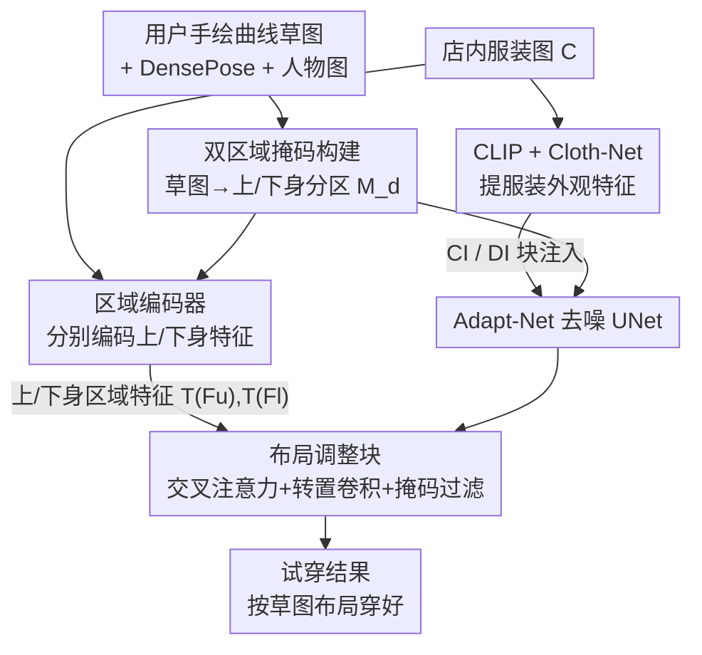

# MOFA-VTON: More Fashion Possibilities with Fine-Grained Adaptations in Virtual Try-On

**会议**: CVPR2026  
**arXiv**: [2606.11148](https://arxiv.org/abs/2606.11148)  
**代码**: 待确认  
**领域**: 人体理解 / 虚拟试穿 / 扩散模型  
**关键词**: 虚拟试穿、可控生成、双区域掩码、布局调整、用户草图交互  

## 一句话总结
MOFA-VTON 让用户用一条手绘曲线草图控制虚拟试穿中"上下装如何搭配"（塞进 / 露出 / 各种下摆造型），通过把草图转成"双区域掩码"提供布局引导、再用"布局调整块"在特征层把上下身特征摆到正确空间位置，在 VITON-HD / DressCode 上既刷到 SOTA 画质又解锁了传统方法做不到的多样穿搭。

## 研究背景与动机
**领域现状**：图像虚拟试穿（virtual try-on）的目标是把一张店内平铺的服装图穿到指定人体上。早期方法基于 GAN，分"服装变形 + 试穿合成"两阶段；近年主流转向扩散模型（StableVITON、IDM-VTON、CAT-DM 等），借助其强生成能力做到了越来越高的画质和服装保真度。

**现有痛点**：几乎所有方法都只做"把目标服装直接覆盖到身体上"这一件事——严格复刻原图里服装的穿法。结果是：同一件衣服永远以固定的下摆位置、固定的版型呈现，输出单调，无法反映现实里"塞进裤腰显利落 / 露出来显随意"这种因人因场合而异的多样穿搭。

**核心矛盾**：作者把无法多样化归结为两点：(1) 传统的 **clothing-agnostic mask**（服装无关掩码）把人物原服装区域整块抹掉、其余照搬，这迫使新服装只能长在原来的版型里，从源头锁死了布局自由度；(2) 模型没有"动态调整服装特征空间位置"的机制，即使想改也无处下手。

**本文目标**：在保持高画质的前提下，让用户能精细、直观地控制上下装之间的交互布局，且控制要做到像素级精确。

**切入角度**：现有的多样化尝试要么是 point-based（COTTON、Wear-Any-Way 用稀疏控制点，但每个点的影响范围模糊、自由度有限），要么是 text-based（PromptDresser、UP-VTON 用自然语言，但做不到像素级、还可能引入语义偏差导致服装外观不匹配）。作者认为一条**手绘曲线**天然就是"上下身分界线"，比离散点更连续、比文字更空间精确。

**核心 idea**：把用户画的曲线转成一张能分别表示上身 / 下身的"双区域掩码"替代传统的服装无关掩码，再用一组布局调整块在特征层把上下身服装特征各自摆到掩码指定的位置——用"草图 → 双区域布局引导 → 特征层空间调整"这条链，把固定版型变成可控版型。

## 方法详解

### 整体框架
输入是：人物图 $I$、用户手绘曲线草图、DensePose 图 $P$、店内服装图 $C$；输出是按草图布局穿好服装的试穿结果。整条流程分两步走：先把草图转成**双区域掩码** $M_d$ 提供布局引导，再用**掩码引导的布局调整**在扩散去噪过程中把服装特征摆到正确区域。

生成主干是一个去噪 UNet，称作 **Adapt-Net**，它吃进 $\mathcal{E}(I)$（加噪人物图）、$\mathcal{E}(P)$（DensePose）、$\mathcal{E}(I_m)$（掩码后人物图）和 $M_d$ 的拼接，对 $\mathcal{E}(I)$ 做去噪。为了保住目标服装外观，CLIP 图像编码器、预训练的 Cloth-Net、以及一个新设计的区域编码器（region encoder）从服装图里抽取不同层级的特征，分别通过 Adapt-Net 内部的粗注入块（CI block）、细节注入块（DI block）和布局调整块（LA block）注入主干。其中 CLIP/Cloth-Net 经 CI/DI 块负责"服装长什么样"，区域编码器经 LA 块负责"服装摆在哪儿"。

### 关键设计

**1. 双区域掩码构建：把一条曲线变成可分上下身的布局引导**

传统服装无关掩码只把原服装区整块挖掉，下身（裤 / 裙）完全暴露，于是新服装只能照搬原版型——这是单调的根因。MOFA-VTON 改用一条草图生成**双区域掩码** $M_d$：先把常规服装无关掩码按其最低点向下扩张，得到能覆盖上下身交互区的初始掩码 $M_i$；再用 DensePose 图 $P$ 作干净的人体轮廓（不受衣服干扰），去掉手臂得到躯干图 $P'$；把用户曲线在与躯干交点处截断、采样重拟合成平滑曲线（不够长就延伸到躯干边界），用这段精修曲线裁切 $P'$ 取出只含下身的区域，二值化后与 $M_i$ 求交得到下身掩码 $M_l$。最后把上下身按不同权重融合：

$$M_d = \beta M_i * (1 - M_l) + \gamma M_l,$$

其中上 / 下区权重 $\beta=1$、$\gamma=0.5$。$M_d$ 不再是"挖一块"的二值掩码，而是一张能同时编码"哪是上身、哪是下身、分界在哪"的连续布局图——这正是后续能分区调整的前提。

**2. 区域编码器：分别编码上下身特征并把影响力向边界扩散**

光有 CLIP/Cloth-Net 抽的服装特征，缺乏明确的布局归属，生成出来的服装没法和其它区域正确交互。区域编码器用对称结构分头处理：上身分支用堆叠卷积的 UpperNet 编码 $\mathrm{Concat}(C, M_d)$，再拼上 CLIP 文本编码器对预定义上身 prompt $p_u$ 的嵌入，得到 $F_u = \mathrm{Concat}(E_u(\mathrm{Concat}(C, M_d), \phi(p_u)))$；下身分支同理用 LowerNet 处理 $\mathrm{Concat}(B, M_d)$（$B$ 是经人体解析得到的人物下身内容）得 $F_l$。关键巧思在于输出前加一层**转置卷积** $\mathcal{T}$：它的上采样能把区域特征向四周传播、扩大影响范围，同时促使模型自适应学习上下身边界处的特征交互，最终输出 $\mathcal{T}(F_u)$ 和 $\mathcal{T}(F_l)$。这样上下身就有了各自带空间扩散性的特征，可被精确指派到目标位置。

**3. 布局调整块：用交叉注意力把上下身特征摆到草图指定的空间位置**

这是把"布局引导"真正落到生成特征上的执行环节。LA block 含两路交叉注意力，以 Adapt-Net 里 DI 块输出的特征图 $F_s$ 作 query，分别以 $\mathcal{T}(F_u)$、$\mathcal{T}(F_l)$ 作 key/value：

$$Attn_u = \mathrm{softmax}\!\left(\frac{F_s W_q \cdot (\mathcal{T}(F_u) W_{ku})^T}{\sqrt{d_k}}\right) \cdot \mathcal{T}(F_u) W_{vu},$$

下身 $Attn_l$ 同理。注意力学到的对应关系把上下身区域信息注入主干早期特征，实现布局调整。注意力后再过一层转置卷积 $\mathcal{T}$ 扩散，然后用双区域掩码做**掩码过滤**——把传播出的特征约束在各自区域内、防止上下身互相串味。最终融合写成：

$$F'_s = F_s + \mathcal{T}(Attn_u) \cdot M + \mathcal{T}(Attn_l) \cdot M',$$

其中 $M' = \beta + \gamma - M$ 是把上下身权重对调后的掩码。因为 $\beta \neq \gamma$，掩码在边界处实现了平滑的权重过渡，让上下身衔接自然、避免硬边。$F'_s$ 逐层优化后解码出最终试穿图。

### 损失函数 / 训练策略
延续 Stable Diffusion 的潜空间扩散框架：自编码器把图编到潜空间 $z_0 = \mathcal{E}(x)$，前向过程逐步加噪 $z_t = \sqrt{\alpha_t} z_{t-1} + \sqrt{1-\alpha_t}\,\epsilon$，去噪网络 $\epsilon_\theta$ 用 LDM 噪声预测损失训练：$\mathcal{L}_{\text{ldm}} = \mathbb{E}_{z_0, \epsilon, t}\big[\|\epsilon - \epsilon_\theta(z_t, c, t)\|_2^2\big]$。双区域掩码替代服装无关掩码后，仍可用配对数据做自监督训练（默认下把曲线设成与原图一致的版型来对齐评测）。

## 实验关键数据

### 主实验
在 VITON-HD（13,679 对人物-服装图）上与一众扩散 / GAN 基线对比，paired 设置评 SSIM/LPIPS/FID/KID，unpaired 评 FID/KID：

| 数据集 | 方法 | FID(P)↓ | KID(P)↓ | SSIM↑ | LPIPS↓ | FID(U)↓ | KID(U)↓ |
|--------|------|---------|---------|-------|--------|---------|---------|
| VITON-HD | StableVITON | 6.05 | 1.09 | 0.8867 | **0.0605** | 9.14 | 1.31 |
| VITON-HD | IDM-VTON | 6.45 | 1.46 | 0.8635 | 0.0700 | 9.37 | 1.58 |
| VITON-HD | GP-VTON | 6.41 | 1.04 | 0.8839 | 0.0669 | 9.34 | 1.23 |
| VITON-HD | **MOFA-VTON** | **5.97** | **0.92** | **0.8870** | 0.0632 | **8.61** | **1.17** |
| D.C. Upper | IDM-VTON | 7.36 | 1.09 | 0.9362 | 0.0291 | 11.73 | 1.68 |
| D.C. Upper | GP-VTON | 7.60 | 0.85 | 0.9434 | 0.0323 | 12.48 | 1.35 |
| D.C. Upper | **MOFA-VTON** | **6.41** | **0.72** | **0.9452** | 0.0316 | **9.17** | **1.06** |

MOFA-VTON 在绝大多数指标上拿到最佳，只有 LPIPS 是次优（VITON-HD 上 0.0632 vs StableVITON 0.0605）。值得注意的是：评测时它把曲线设成与原图一致的"默认版型"来公平对比试穿质量，说明可控性是额外收益、并未牺牲基础画质。

### 消融实验
三个变体分别砍掉双区域掩码、布局调整块、特征扩展与过滤（转置卷积 + 掩码操作）：

| 配置 | FID(P)↓ | KID(P)↓ | SSIM↑ | LPIPS↓ | FID(U)↓ | 说明 |
|------|---------|---------|-------|--------|---------|------|
| MOFA-VTON* (去双区域掩码) | 7.79 | 1.59 | 0.8697 | 0.0826 | 11.10 | 退回服装无关掩码，连区域编码器+LA块一并失效，只能固定版型 |
| MOFA-VTON† (去布局调整块) | 6.52 | 1.23 | 0.8717 | 0.0661 | 9.06 | 掩码只能拼进输入，复杂姿态下调整失败 |
| MOFA-VTON‡ (去转置卷积+掩码过滤) | 6.10 | 1.01 | 0.8818 | 0.0649 | 8.78 | 能粗略贴合曲线，但下摆细节不够精细 |
| MOFA-VTON (完整) | **5.97** | **0.92** | **0.8870** | **0.0632** | **8.61** | — |

### 关键发现
- **双区域掩码贡献最大**：去掉它 paired FID 从 5.97 恶化到 7.79（最大跌幅），且彻底丧失多样化能力——它既是画质来源也是可控性来源，是整个方法的地基。
- **布局调整块负责"复杂姿态下也能调"**：去掉后简单情形还能微调，复杂姿态（如交叉手臂）就失败，说明交叉注意力学到的区域对应关系在难例上才显价值。
- **转置卷积 + 掩码过滤管"细节精修"**：去掉后能大致贴合草图但下摆细节糙，是从"能调"到"调得精"的最后一公里。
- 35 人 A/B 用户研究（每对比 200 组）显示 MOFA-VTON 在质量和多样性（fitness/usability/functionality/fineness 四项）的绝大多数对比中胜出。

## 亮点与洞察
- **用"曲线"作交互媒介是这篇最妙的选择**：相比离散控制点（影响范围模糊）和文字（做不到像素级、易语义漂移），一条曲线天然就是连续的上下身分界，既直观又精确——把交互形态选对了，后面整套机制才顺理成章。
- **双区域掩码把"控制信号"和"自监督训练"统一了**：它替换服装无关掩码后仍能用配对数据自监督训练，没有额外标注成本，工程上很干净。
- **转置卷积当"特征扩散器"用得很巧**：不是用来上采样恢复分辨率，而是借其上采样把区域特征向边界扩散、让模型自学上下身衔接，再配掩码过滤收束——"先扩散再过滤"这套组合可迁移到任何需要"分区特征+边界平滑"的可控生成任务。
- **权重对调掩码 $M'=\beta+\gamma-M$ 的小技巧**：用一个加减就让同一张掩码在上下身分别给出互补权重，在边界形成平滑过渡，避免硬拼接的接缝感。

## 局限与展望
- **依赖用户手动画曲线**：虽比控制点省事，但仍需人交互；批量 / 自动化场景下没有"自动推荐合理版型"的能力，可考虑加一个布局先验模型生成候选曲线。
- **主要针对上下身分界这一类布局**：双区域掩码本质是"上 / 下"二分，对更复杂的多层叠穿（如外套+内搭+腰带的多重交互）能否扩展到多区域掩码，文中未验证。
- **评测公平性的 caveat**：为公平对比，定量指标都在"默认版型"下测，多样性主要靠定性图和用户研究佐证；缺乏一个量化"可控精度"（生成下摆与草图曲线的吻合度）的客观指标。
- **LPIPS 仍次优**：感知相似度略逊于 StableVITON，说明在极细纹理保真上还有空间。

## 相关工作与启发
- **vs COTTON / Wear-Any-Way（point-based 多样化）**：它们用稀疏控制点引导，每个点影响范围模糊、自由度有限、需逐点手调；MOFA-VTON 用连续曲线 + 双区域掩码做像素级布局调整，控制更精细、交互更省力，DressCode 上对比 COTTON 能贴合更复杂下摆且无边界畸变。
- **vs PromptDresser / UP-VTON（text-based 多样化）**：文字控制做不到像素级、易引入语义偏差导致服装外观不匹配；本文用空间草图直接约束布局，外观保真和位置精确两头都抓。
- **vs StableVITON / IDM-VTON（高画质但固定版型）**：这些扩散方法专注服装保真与画质，但只做"覆盖式"试穿、版型锁死；MOFA-VTON 在不输画质（多数指标反超）的前提下额外解锁了版型可控，把"试穿"从复刻升级为可定制。

## 评分
- 新颖性: ⭐⭐⭐⭐⭐ 用曲线草图+双区域掩码切入"试穿多样性"这一被忽视维度，交互形态和机制都新颖
- 实验充分度: ⭐⭐⭐⭐ 两数据集主对比+三变体消融+35人用户研究较完整，但缺可控精度的量化指标
- 写作质量: ⭐⭐⭐⭐ 动机清晰、pipeline 和公式交代到位，图示丰富
- 价值: ⭐⭐⭐⭐ 直接提升电商虚拟试穿的实用性与个性化，落地场景明确

<!-- RELATED:START -->

## 相关论文

- [\[CVPR 2026\] Mobile-VTON: High-Fidelity On-Device Virtual Try-On](mobile_vton_ondevice_virtual_tryon.md)
- [\[CVPR 2026\] Reference-Free Image Quality Assessment for Virtual Try-On via Human Feedback](reference-free_image_quality_assessment_for_virtual_try-on_via_human_feedback.md)
- [\[CVPR 2026\] RefTon: Reference Person Shot Assist Virtual Try-on](refton_reference_person_shot_assist_virtual_try-on.md)
- [\[CVPR 2025\] VTON 360: High-Fidelity Virtual Try-On from Any Viewing Direction](../../CVPR2025/human_understanding/vton_360_high-fidelity_virtual_try-on_from_any_viewing_direction.md)
- [\[CVPR 2026\] MoBind: Motion Binding for Fine-Grained IMU-Video Pose Alignment](mobind_motion_binding_for_fine-grained_imu-video_pose_alignment.md)

<!-- RELATED:END -->
