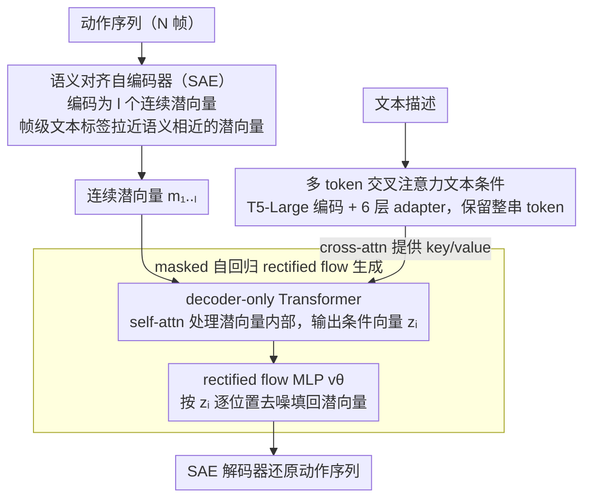

# MoLingo: Motion-Language Alignment for Text-to-Human Motion Generation

**会议**: CVPR 2026  
**arXiv**: [2512.13840](https://arxiv.org/abs/2512.13840)  
**代码**: [https://hynann.github.io/molingo/MoLingo.html](https://hynann.github.io/molingo/MoLingo.html)  
**领域**: 人体理解  
**关键词**: 文本驱动动作生成, 语义对齐潜空间, 交叉注意力条件注入, 自回归扩散, 连续潜空间

## 一句话总结

MoLingo 通过语义对齐的运动自编码器（SAE）和多 token 交叉注意力文本条件注入，在连续潜空间上执行 masked 自回归 rectified flow，在文本到人体动作生成任务上取得了 FID、R-Precision 和用户研究的全面 SOTA。

## 研究背景与动机

**领域现状**：文本驱动的人体动作生成是计算机动画、AR/VR 和人机交互的关键技术。当前主流方法分为两类：(1) 直接在姿态空间做扩散（MDM 等），(2) 先编码到潜空间再做扩散（MLD、MARDM 等）。后者又分为将整个序列压缩为单个潜向量和自回归生成多个潜向量两种路线。

**现有痛点**：直接在姿态空间扩散难以处理复杂的关节分布，且容易保留 mocap 噪声产生伪影。单向量潜空间扩散会丢失重要的时序细节。VQ-based 方法将连续动作映射到有限 codebook 引入量化误差，降低了精细动作的真实感。此外，现有的文本条件注入方式（单 token 条件或 AdaLN 调制）表达能力不足，限制了文本-动作对齐精度。

**核心矛盾**：如何构建一个"对扩散友好"的潜空间，使语义相近的动作在潜空间中也相近？如何更有效地注入文本条件使生成的动作更忠实于文本描述？

**本文目标** (1) 什么样的潜空间最适合动作扩散？(2) 如何最有效地注入文本条件？

**切入角度**：受图像生成领域 REPA 等工作启发，利用帧级文本标签训练语义对齐的运动编码器，使语义相似的潜向量在空间中更近。同时发现多 token 交叉注意力比单 token 条件显著更好。

**核心 idea**：用帧级文本标签对齐运动潜空间的语义结构，配合多 token 交叉注意力条件注入，在连续潜空间上做 masked 自回归 rectified flow 生成动作。

## 方法详解

### 整体框架

MoLingo 包含两个核心组件：(1) 语义对齐运动编码器（SAE），将 $N$ 帧动作序列编码为 $l = N/h$ 个连续潜向量 $m_{1:l} \in \mathbb{R}^{l \times d}$；(2) masked 自回归 Transformer + rectified flow MLP，以 T5 编码的多 token 文本为条件，逐步去噪潜向量并解码回动作序列。训练分两阶段：先训 SAE，再训自回归生成模型。

### 关键设计

**1. 语义对齐自编码器（SAE）：让语义相近的动作在潜空间里也相近**

直接在姿态空间扩散会被复杂关节分布和 mocap 噪声拖累，而普通 VAE 潜空间虽然连续，却没有把"语义"这件事编进几何结构里——两个意思相近的动作可能落在潜空间相距很远的地方，扩散模型得额外学一套复杂映射才能对上文本。SAE 的做法是在标准 VAE 重建目标之外，加一条帧级文本语义对齐约束。它借用 BABEL 数据集的帧级文本标签：对每个运动潜向量 $m_j$，把时间上对齐的那些文本标签用冻结文本编码器编码、取平均再投影，得到一个 class token $\kappa_j$ 作为该潜向量的语义锚点，然后用软余弦损失把潜向量拉向自己的语义锚点：

$$\mathcal{L}_\text{sem} = \frac{1}{|\mathcal{I}|}\sum_{i \in \mathcal{I}}\left(1 - \frac{m_i \cdot \kappa_i}{\|m_i\| \|\kappa_i\|}\right)$$

这里有个细节：BABEL 里大量帧的标签是重复的（连续几秒都标"walk"），如果照单全收会把这些潜向量过度拉到一起、压垮多样性。所以 SAE 会算相邻 class token 的余弦相似度 $\Delta_i$，把相似度超过阈值 $\tau$ 的样本从对齐集合 $\mathcal{I}$ 里滤掉，只对真正有语义区分的帧施加约束。选软余弦而不是 InfoNCE 这类硬对比，是因为人体动作本身连续而模糊（"慢走"和"散步"没有清晰边界），InfoNCE 强行把非同类样本推开的刚性约束在这里反而有害——消融里 InfoNCE 的 FID 0.129 远差于余弦损失的 0.066 就是证据。

**2. 多 token 交叉注意力文本条件：别把整句话压成一个向量**

很多前作（如 MARDM）把文本条件用单个 token 经 AdaLN 调制注入，等于把"一个人先蹲下再向左跳"这种结构化描述压缩成一个全局向量，细粒度的动作-词对应关系全丢了。MoLingo 改用 T5-Large 编码文本，再过 $l_\text{adapter}=6$ 层 Transformer encoder adapter 做跨模态增强，保留一整串多 token 表示 $\mathbf{w} = \{w_1, ..., w_{l_\text{text}}\}$。在 decoder-only Transformer 里，self-attention 和 MLP 只在运动潜向量内部运作，而 cross-attention 以运动潜向量为 query、文本 token 为 key/value，让每个潜向量都能按需"查阅"文本里相关的那几个词。这一改动的收益在消融里非常直接：把 AdaLN 单 token 换成多 token cross-attention，FID 从 0.077 降到 0.049，R-Precision Top-1 也随之上台阶——文本忠实度的提升主要来自这里。

**3. masked 自回归 rectified flow 生成：连续潜空间上的逐帧去噪**

有了语义对齐的连续潜空间，还要选一个既能保住时序细节、又不引入量化误差的生成方式。把整段动作压成单个潜向量再扩散会丢时序细节，VQ 离散化又会带来量化误差，所以 MoLingo 走连续潜向量的自回归路线，把序列联合分布按链式法则分解：

$$p(m_1,...,m_l) = \prod_i p(m_i \mid c, m_1,...,m_{i-1})$$

训练时随机 mask 掉一部分潜向量，让 decoder-only Transformer 根据文本条件和已知潜向量产出每个位置的条件向量 $z_i$，再喂给一个 MLP $v_\theta$ 用 rectified flow 目标去逼近逆向分布：

$$\mathcal{L} = \mathbb{E}\big[\|v_\theta(m_i^t, t, z_i) - (\epsilon - m_i)\|^2\big]$$

推理时从全 mask 出发逐步去噪填回所有潜向量，并用 CFG（scale=5.5）放大文本条件的引导强度。相比标准扩散，rectified flow 把噪声到数据的路径拉直，采样步数更省；相比 VQ 自回归，连续潜空间保留了动作的精细幅度，不会被有限 codebook 钳制。

### 损失函数 / 训练策略

SAE 总损失 $\mathcal{L}_\text{SAE} = \mathcal{L}_\text{recon} + \lambda_\text{sem}\mathcal{L}_\text{sem} + \lambda_\text{KL}\mathcal{L}_\text{KL}$，其中 $\mathcal{L}_\text{recon}$ 包含特征重建、关节位置和关节速度三项。SAE 训练 5000 epochs，batch=256。自回归模型训练约 800 epochs，使用 EMA 稳定训练，10% 文本替换为 null prompt 做 CFG。4 张 H100 GPU 训练约 10 小时。

## 实验关键数据

### 主实验

| 方法 | FID ↓ | R-Precision Top-1 ↑ | CLIP-Score ↑ | MModality ↑ |
|------|-------|---------------------|-------------|-------------|
| MDM | 0.518 | 0.440 | 0.578 | **3.604** |
| MLD | 0.431 | 0.461 | 0.610 | 3.506 |
| MoMask | 0.116 | 0.490 | 0.637 | 1.309 |
| ACMDM-XL | 0.058 | 0.522 | 0.652 | 2.077 |
| DisCoRD | 0.053 | 0.506 | 0.645 | 1.303 |
| MoLingo (VAE) | **0.049** | 0.528 | 0.672 | 1.414 |
| MoLingo (SAE) | 0.066 | **0.544** | **0.686** | 1.226 |

MARDM-67 评估协议下，MoLingo (VAE) 取得最优 FID，MoLingo (SAE) 取得最优文本-动作对齐（R-Precision 和 CLIP-Score）。

### 消融实验

| 条件机制 | 文本编码器 | 自编码器 | FID ↓ | R-Precision Top-1 ↑ |
|----------|-----------|---------|-------|---------------------|
| AdaLN | CLIP | AE | 0.114 | 0.500 |
| AdaLN | T5 | AE | 0.077 | 0.508 |
| CrossAttn | T5 | VAE | **0.049** | 0.528 |
| CrossAttn | T5 | AE | 0.051 | 0.533 |
| CrossAttn | T5 | SAE | 0.066 | **0.544** |

### 关键发现

- **CrossAttn vs AdaLN**：多 token cross-attention 将 FID 从 0.077 降至 0.049，R-Precision Top-1 从 0.508 提升至 0.528-0.544，提升巨大
- **SAE 的文本对齐效果**：SAE 在 R-Precision 和 CLIP-Score 上全面超越 AE 和 VAE，但 FID 略高（0.066 vs 0.049），说明语义对齐牺牲了少量分布匹配度换取了更强的文本忠实度
- **余弦损失 vs InfoNCE**：InfoNCE 的 FID 为 0.129 远差于余弦损失的 0.066，因为人体动作连续性使得硬对比约束过于刚性
- **用户研究**：用户在 83.75%（vs DisCoRD）、77.70%（vs MoMask）、84.70%（vs MotionStreamer）的情况下更偏好 MoLingo
- 4× 时间下采样 + 16 维潜空间是最优配置；增加潜向量维度反而有害

## 亮点与洞察

- **语义对齐潜空间的思路**：用帧级文本标签引导运动潜空间结构，使"语义相近的动作在潜空间中也相近"。这个思路可以迁移到其他序列生成任务（如音频、轨迹生成），只要有对齐的语义标签
- **软余弦 vs 硬对比的选择**：在动作这种连续模糊的信号上，软约束优于硬对比，这个洞察对其他连续信号的表示学习也有启发
- **多 token 交叉注意力的显著优势**：单 token 丢失太多信息，多 token 保留了文本的结构化语义。这在 T2I 领域已被验证（如 DALL-E 3），本文将此洞察成功迁移到 T2M

## 局限与展望

- 只生成主体动作，不包括手部精细动作，这是真实应用的重要缺陷
- SAE 依赖 BABEL 数据集的帧级标注，标注覆盖有限且重复性高，扩展到更大规模数据可能需要自动标注方案
- FID 和 R-Precision 存在 trade-off（SAE 在 R-Precision 最优但 FID 不是最优），能否同时优化两者？
- 评估指标本身存在争议（不同评估协议结果不一致），需要更鲁棒的评估框架

## 相关工作与启发

- **vs MARDM**：MARDM 使用 CLIP 单 token + AdaLN 条件，MoLingo 使用 T5 多 token + CrossAttn + SAE，这三个改进分别贡献不同程度的提升
- **vs MotionStreamer**：MotionStreamer 使用 272D 表示避免 IK 伪影，MoLingo 在 263D 和 272D 表示上都能工作且更优
- **vs VQ-based 方法（MoMask, DisCoRD）**：VQ 方法在多样性（MModality）上更好，但连续潜空间方法在真实感（FID）和文本对齐上优势明显
- 受 REPA（图像生成中的表示对齐）启发，将语义对齐思想引入运动生成

## 评分

- 新颖性: ⭐⭐⭐⭐ SAE 的帧级语义对齐是核心创新，多 token 条件虽在图像领域已有先例但迁移有效
- 实验充分度: ⭐⭐⭐⭐⭐ 四种评估协议（MARDM-67, TMR-263, MS-272, 用户研究），广泛消融
- 写作质量: ⭐⭐⭐⭐ 问题驱动的写作方式清晰，两个核心问题层层推进
- 价值: ⭐⭐⭐⭐ SOTA 结果+可迁移的潜空间设计思路，对动作生成领域有实际推动

<!-- RELATED:START -->

## 相关论文

- [\[CVPR 2026\] Multi-level Causal LLM-based Text-to-Motion Generation with Human Alignment (MoTiGA)](multi-level_causal_llm-based_text-to-motion_generation_with_human_alignment.md)
- [\[CVPR 2026\] Text-Driven 3D Hand Motion Generation from Sign Language Data](text-driven_3d_hand_motion_generation_from_sign_language_data.md)
- [\[CVPR 2026\] LaMoGen: Language to Motion Generation Through LLM-Guided Symbolic Inference](lamogen_language_to_motion_generation_through_llm-guided_symbolic_inference.md)
- [\[CVPR 2026\] Next-Scale Autoregressive Models for Text-to-Motion Generation](next-scale_autoregressive_models_for_text-to-motion_generation.md)
- [\[CVPR 2026\] MotionMaster: Generalizable Text-Driven Motion Generation and Editing](motionmaster_generalizable_text-driven_motion_generation_and_editing.md)

<!-- RELATED:END -->
