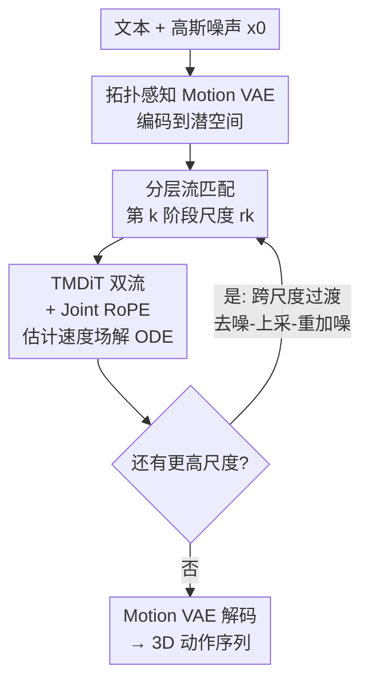

# MotionHiFlow: Text-to-Motion via Hierarchical Flow Matching

**会议**: CVPR2026  
**arXiv**: [2604.23264](https://arxiv.org/abs/2604.23264)  
**代码**: https://github.com/ai-lh/MotionHiFlow  
**领域**: 人体动作生成 / 文本到动作 / 流匹配  
**关键词**: text-to-motion、分层流匹配、跨尺度过渡、扩散 Transformer、关节位置编码  

## 一句话总结
MotionHiFlow 把文本到 3D 人体动作的生成拆成"由粗到细、从低时间尺度到高时间尺度"的多阶段流匹配过程，用一个保持噪声一致性的跨尺度过渡把各尺度的流串起来，再配合双流的 Text-Motion Diffusion Transformer（TMDiT）和关节感知的 Joint RoPE，在 HumanML3D / KIT-ML 上取得 SOTA（FID 0.032 / 0.135）。

## 研究背景与动机
**领域现状**：文本到动作生成（text-to-motion）要从一句自然语言描述生成既语义对齐、又物理合理、还要有细粒度肢体动作的 3D 人体姿态序列。近年来扩散类、自回归、掩码生成等方法把动作的复杂度和自然度做得越来越好，但它们几乎都在**单一时间尺度**上同时建模"语义对齐"和"动作细节"。

**现有痛点**：在单一时间尺度上一把抓，会让模型在"全局轨迹结构"（需要粗粒度时间视角）和"细粒度肢体动作"（需要细粒度时间视角）之间顾此失彼，难以同时兼顾长时连贯性、自然度和与文本的精确对齐。

**核心矛盾**：人类认知系统里复杂动作本来就是**分层**构想的——先搭一个由关键姿势组成的高层框架（coarse motion），再补上动态过渡和细粒度肢体动作（fine motion）。现有方法不走这个"先粗后细"的过程，因而过度强调细节反而干扰了语义学习。作者用一个实验佐证这一点：把动作线性降采样到只保留 20% 帧（0.2×），文本-动作的 R-precision 依然稳定，说明粗粒度动作已经保住了文本里的大部分语义；只在粗尺度上训练的模型有时语义对齐甚至更强。

**本文目标**：设计一个由粗到细的分层生成策略，先在低时间尺度上生成捕捉高层语义结构的粗动作，再在更高时间尺度上逐级补充细粒度动作细节。

**切入角度**：用流匹配（flow matching）作为每个尺度内"噪声→数据"的传输工具，并把多个尺度的流接力起来；关键难点在于**跨尺度衔接**时不能简单上采样含噪数据（会破坏噪声一致性、损害生成质量）。

**核心 idea**：用"低→高时间尺度的多阶段流匹配 + 保持噪声一致性的跨尺度过渡"替代"单尺度一把抓"，在潜空间里把动作从粗到细逐级生成。

## 方法详解

### 整体框架
MotionHiFlow 在一个拓扑感知 Motion VAE 编码出的潜空间里工作，把生成切成 $K$ 个阶段，第 $k$ 阶段在时间尺度 $r_k\in(0,1]$ 上、在时间区间 $[t_{k-1}, t_k]$ 内细化动作表示。早期阶段（低尺度）主抓高层语义和粗动作结构，后续阶段（高尺度）逐步补细节。每个阶段内部用流匹配学一个把"较噪起点"传到"较净终点"的速度场，由 TMDiT（带 Joint RoPE）来估计；阶段之间用**跨尺度过渡**（去噪—上采样—重加噪三步）把上一阶段的干净结果接到下一阶段更高尺度的起点上，并保持噪声一致性。整条链路构成一条从初始噪声 $\bm{x}_0$ 确定性地走向数据分布的 ODE 轨迹，最后由 VAE 解码器把干净潜变量还原成 3D 动作序列。实现里取 $K=3$、尺度 $r_k\in\{1/3, 2/3, 1\}$。

### 关键设计

**1. 分层流匹配：把"先粗后细"做成多阶段的流接力**

针对"单尺度一把抓导致语义与细节互相牵制"的痛点，本文把生成分成 $K$ 个尺度逐级递进。在第 $k$ 阶段，终点状态定义为该尺度下噪声与干净数据的线性插值 $\bm{x}_{t_k}^{(k)} = (1-t_k)f(\bm{x}_0, r_k) + t_k f(\bm{x}_1, r_k)$，其中 $f(\bm{x}, r)$ 是按因子 $r$ 的时间重采样（$r<1$ 降采样、$r>1$ 上采样）。起点状态 $\bm{x}_{t_{k-1}}^{(k)}$ 则精心设计为同时纳入上一阶段的信息 $f(\bm{x}_1, r_{k-1})$ 和初始噪声 $\bm{x}_0$，以便跨阶段保持噪声一致性。把各阶段的流 $S_k$ 串起来就定义了从噪声到数据的整条生成路径，训练目标是分层流匹配损失

$$\mathcal{L}_{HFM}(\theta) = \mathbb{E}_{k,t}\left\|v_\theta(\bm{x}_t^{(k)}, t) - (\bm{x}_{t_k}^{(k)} - \bm{x}_{t_{k-1}}^{(k)})\right\|^2$$

让网络在每个阶段去逼近"终点减起点"这个速度向量。之所以有效，是因为低尺度阶段帧数少、强迫模型先把文本对应的高层语义骨架学对，高尺度阶段再在已对齐的骨架上补细节，避免了细节噪声淹没语义信号

**2. 跨尺度过渡：用去噪—上采—重加噪保持噪声一致性**

如果像一些工作那样直接对低尺度的含噪数据上采样到高尺度，噪声分布会错位（noise inconsistency），从而拉低生成质量。本文为相邻阶段设计了三步过渡：先**去噪**，用外推从含噪终点反解出当前尺度的干净数据 $\hat{\bm{x}}_1^{(k)} = [\hat{\bm{x}}_{t_k}^{(k)} - (1-t_k)\bm{x}_0^{(k)}]/t_k$；再**上采样**，把干净数据按比例 $r_{k+1}/r_k$ 升到更高尺度 $\hat{\bm{x}}_1'^{(k+1)} = f(\hat{\bm{x}}_1^{(k)}, r_{k+1}/r_k)$；最后**重加噪**，在高尺度上用该尺度的新噪声重新构造下一阶段的起点 $\hat{\bm{x}}_{t_k}^{(k+1)} = (1-t_k)\bm{x}_0^{(k+1)} + t_k\hat{\bm{x}}_1'^{(k+1)}$。关键在于"上采样只发生在干净数据上、噪声在各尺度独立采样后再插值进来"，这样每个阶段起点的噪声都符合该尺度的分布，整条轨迹仍是一条不需要在阶段间额外注噪的确定性 ODE，从而跨阶段衔接平滑、推理鲁棒

**3. TMDiT 与拓扑感知 VAE：让文本和关节结构都被讲清楚**

传统做法（如普通 Transformer + 单一句级文本嵌入 $c_{\text{vec}}$）只把整句话压成一个向量喂给动作，文本与动作之间细粒度的互动被压没了。TMDiT 借鉴 MMDiT / Flux，对动作特征 $\bm{x}$ 和**词级**文本特征 $\bm{c}$（CLIP 编码）走**两条独立的流**：各自有独立的线性变换与 FFN，靠自注意力交换信息；时间步 $t$、句级嵌入 $c_{\text{vec}}$ 和阶段尺度 $r_k$ 融成调制嵌入 $\bm{y}$，对各块做 scale/shift/gate 调制。参数共享上采用"前几层双路独立参数、最后 $L_s$ 层共享参数"的方案——先各自抽取模态特有特征，再学共享表示。配套的 Motion VAE 不像 MoGenTS 用 2D 卷积，而是用图卷积网络（GCN）显式建模人体骨架拓扑，把动作时间维降采样 4 倍、空间上图池化到 $j=6$ 个潜关节（躯干、骨盆、四肢）。两者一起为流匹配提供了"既懂文本细节、又懂关节结构"的潜空间，消融里把 baseline 的 MM-Dist 从 3.043 一路压到 2.691

**4. Joint RoPE：把骨架拓扑和左右对称性写进位置编码**

普通 RoPE 只编码时间位置，无法表达关节之间的空间与拓扑关系。Joint RoPE 把每个注意力头的特征维按比例 $[1/2, 1/8, 1/8, 1/4]$ 切成四段各自做 1D RoPE：前 $1/2$ 编码关节在动作序列里的时间位置（时间索引先乘以尺度因子 $r_k$，以适配分层流匹配的不同尺度）；中间两段各 $1/8$（共 $1/4$）编码关节相对骨盆、在参考 T-pose 下的 2D 空间坐标；最后 $1/4$ 编码关节在以骨盆为根的运动学树里的深度。它还强制**骨架对称性**：对称等价的关节对（如左手→右手 vs 左脚→右脚）在相同时间偏移下有相同的相对旋转。这样把时空 + 拓扑全部统一在 RoPE 框架下，既注入了结构先验，又对不同关节数和骨架结构有更好的可扩展性

### 损失函数 / 训练策略
两阶段训练。第一阶段单独训 Motion VAE，目标是标准 VAE 损失（重建 + KL）加一个增强时间鲁棒性的辅助项：对每个 batch 的随机子集，把潜变量按 $r\in[0.3,1]$ 降采样后解码，再与同样降采样的真值动作算 MSE，$\mathcal{L}_{\text{aug}} = \|\text{Dec}(f(x,r)) - f(M,r)\|^2$（权重 0.5）。第二阶段冻结 VAE，用分层流匹配损失（式 6）训 TMDiT，并以 10% 概率把文本条件替换为空 token 以支持 classifier-free guidance（CFG）。实现细节：VAE 训 300k 步（batch 256），TMDiT 训 200k 步（batch 64），均用 AdamW、初始学习率 $2\times10^{-4}$、MultiStepLR 在 50%/75% 处衰减 0.2；TMDiT 共 9 个块（前 3 独立、后 6 共享），潜维 384、6 个注意力头、FFN 维 1536。

## 实验关键数据

### 主实验
在 HumanML3D（14,616 个动作、44,970 个文本-动作对）和 KIT-ML（3,911 个动作）上对比 SOTA，每组实验重复 20 次报告 95% 置信区间。

| 数据集 | 指标 | MotionHiFlow | 之前最优 | 说明 |
|--------|------|------|----------|------|
| HumanML3D | R@1 ↑ | 0.563 | 0.581 (SALAD) | 第二，仅次于 SALAD |
| HumanML3D | FID ↓ | **0.032** | 0.033 (MoGenTS) | 最优 |
| HumanML3D | MM-Dist ↓ | 2.691 | 2.649 (SALAD) | 第二 |
| KIT-ML | R@1 ↑ | **0.482** | 0.477 (SALAD) | 最优 |
| KIT-ML | FID ↓ | **0.135** | 0.143 (MoGenTS) | 最优 |
| KIT-ML | MM-Dist ↓ | **2.552** | 2.585 (SALAD) | 最优 |

在 KIT-ML 上几乎全面最优；在 HumanML3D 上 FID 第一，R-precision / MM-Dist 紧追 SALAD 居第二。用户研究中，MotionHiFlow 在真实感与文本对齐上都优于 MoMask 和 MoGenTS，文本对齐上甚至有 47% 概率胜过真值（GT）。

### 消融实验

尺度数与尺度配置（HumanML3D，Table 2）：

| 尺度 $\{r_k\}$ | FID ↓ | R@1 ↑ | MM-Dist ↓ | 说明 |
|------|---------|---------|-----------|------|
| [0.4] | 0.106 | 0.561 | 2.717 | 纯粗单尺度，语义已不错但 FID 差 |
| [1] | 0.051 | 0.556 | 2.723 | 纯细单尺度 |
| [1/2, 1] | 0.038 | **0.565** | 2.702 | 两阶段 |
| **[1/3, 2/3, 1]** | **0.032** | 0.563 | **2.691** | 三阶段（默认） |
| [1/4, 2/4, 3/4, 1] | 0.035 | 0.560 | 2.693 | 四阶段，收益不再增 |

关键组件（HumanML3D，Table 3）：

| 配置 | FID ↓ | R@1 ↑ | MM-Dist ↓ | 说明 |
|------|---------|---------|-----------|------|
| Baseline | 0.074 | 0.511 | 3.043 | 标准 Transformer + AdaLN |
| + TMDiT | 0.045 | 0.557 | 2.738 | 词级文本 + 双流非共享，MM-Dist 大幅改善 |
| + 拓扑感知 VAE | **0.032** | **0.563** | **2.691** | 完整模型 |

### 关键发现
- **粗尺度足以撑起语义对齐**：单尺度 [0.4] 的 R@1 就有 0.561、MM-Dist 2.717，验证了"粗动作保住大部分语义"的核心假设；但 FID 高达 0.106，说明细节缺失，需要分层补细。
- **分层是 FID 的主要来源**：FID 从单尺度 [1] 的 0.051 降到三尺度的 0.032，三阶段是 FID/MM-Dist 综合最优点；再加到四阶段反而略退（FID 0.035），说明尺度数有最优值而非越多越好。
- **TMDiT 的词级双流对语义对齐贡献最大**：单加 TMDiT 就把 MM-Dist 从 3.043 拉到 2.738、R@1 从 0.511 升到 0.557；拓扑感知 VAE 再补细粒度，进一步压低 FID。

## 亮点与洞察
- **用一个简单实验立住整篇动机**：把动作降采样到 0.2× 后 R-precision 仍稳定，直接证明"语义存在于粗尺度"，让"先粗后细"的分层设计有了实证依据，而不是凭直觉。这种"先用诊断实验验证假设再设计方法"的思路很值得复用。
- **跨尺度过渡的"去噪—上采—重加噪"很巧**：核心洞察是"上采样要作用在干净数据上、噪声各尺度独立采"，从而避免直接上采含噪数据带来的噪声错位；这把多尺度生成统一成一条无需阶段间额外注噪的确定性 ODE，可迁移到图像/视频的多分辨率流匹配。
- **Joint RoPE 把结构先验编进位置编码**：按 $[1/2,1/8,1/8,1/4]$ 分段同时编码时间、相对 T-pose 空间坐标、运动学树深度，并强制左右对称关节同旋转，是把骨架拓扑塞进注意力的一个轻量做法，对不同关节数有可扩展性。

## 局限与展望
- 论文主要在 HumanML3D / KIT-ML 两个标准 benchmark 上验证，没有涉及更长时程、多人物或带物体交互的复杂场景，分层尺度是否在更长序列上继续受益尚待检验。
- 在 HumanML3D 上 R-precision / MM-Dist 仍略逊于 SALAD，说明纯语义检索精度上还有差距，分层设计的优势更多体现在 FID（真实感）与 KIT-ML 上。
- 尺度调度 $\{r_k\}$ 是手工设定的超参（默认 $\{1/3,2/3,1\}$），消融显示四阶段反而变差，如何自适应地选阶段数与尺度仍是开放问题。
- VAE 的潜关节固定池化为 6 个（躯干/骨盆/四肢），对手指等更细的肢体表达可能受限，可探索更细的图池化或可变拓扑。

## 相关工作与启发
- **vs 单尺度扩散/掩码方法（MoMask、BAMM、MoGenTS）**：它们在单一时间尺度上同时建模语义与细节，本文改成低→高尺度的多阶段分层流匹配，先对齐语义再补细节，FID 上反超（0.032 vs MoGenTS 0.033）。
- **vs SALAD**：SALAD 在 HumanML3D 的 R-precision/MM-Dist 更高，但 FID（0.076）远逊于本文（0.032），且在 KIT-ML 上被本文全面超过；本文的优势在真实感和跨数据集稳健性。
- **vs 朴素流匹配用于动作（FlowMotion 等）**：早期工作直接把流匹配搬到动作空间、未做适配，效果欠佳；本文用 TMDiT + Joint RoPE 把流匹配为动作生成深度定制，并引入跨尺度过渡解决多尺度衔接。
- **vs 直接上采样含噪数据的多尺度生成（PixelFlow 等）**：那类做法会破坏噪声一致性，本文的去噪—上采—重加噪三步过渡专门修这个问题，保持确定性 ODE 轨迹。

## 评分
- 新颖性: ⭐⭐⭐⭐ 把"分层先粗后细"和流匹配结合，跨尺度过渡保持噪声一致性的设计有创意，且有诊断实验支撑动机。
- 实验充分度: ⭐⭐⭐⭐ 两个标准 benchmark + 尺度/组件消融 + 用户研究，重复 20 次报告置信区间；但场景偏标准、缺更复杂设置。
- 写作质量: ⭐⭐⭐⭐ 动机—方法—实验逻辑清晰，公式与算法完整；跨尺度过渡的若干符号需对照原文细读。
- 价值: ⭐⭐⭐⭐ 在 FID 上刷新 SOTA、KIT-ML 全面领先，分层流匹配 + 跨尺度过渡的思路对动作/图像/视频的多尺度生成都有借鉴意义，且已开源。

<!-- RELATED:START -->

## 相关论文

- [\[CVPR 2026\] Unified Number-Free Text-to-Motion Generation Via Flow Matching](unified_number-free_text-to-motion_generation_via_flow_matching.md)
- [\[CVPR 2026\] FMPose3D: monocular 3D pose estimation via flow matching](fmpose3d_monocular_3d_pose_estimation_via_flow_matching.md)
- [\[CVPR 2026\] Hierarchical Enhancement of Semantic Priors for Disentangled Text-Driven Motion Generation](hierarchical_enhancement_of_semantic_priors_for_disentangled_text-driven_motion_.md)
- [\[CVPR 2026\] ProjFlow: Projection Sampling with Flow Matching for Zero-Shot Exact Spatial Motion Control](projflow_projection_sampling_with_flow_matching_for_zero-shot_exact_spatial_moti.md)
- [\[CVPR 2026\] ParTY: Part-Guidance for Expressive Text-to-Motion Synthesis](party_part-guidance_for_expressive_text-to-motion_synthesis.md)

<!-- RELATED:END -->
