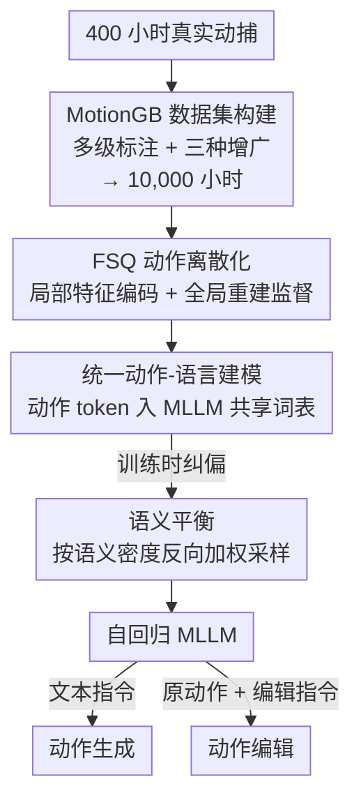

# MotionMaster: Generalizable Text-Driven Motion Generation and Editing

**会议**: CVPR 2026  
**论文**: [CVF Open Access](https://openaccess.thecvf.com/content/CVPR2026/html/Jiang_MotionMaster_Generalizable_Text-Driven_Motion_Generation_and_Editing_CVPR_2026_paper.html)  
**领域**: 人体理解 / 文本驱动人体动作生成与编辑  
**关键词**: 人体动作生成, 动作编辑, MLLM 微调, FSQ 离散化, 多动作组合

## 一句话总结
MotionMaster 把人体动作当成一种新模态塞进预训练多模态大模型（Qwen2.5-VL）的共享词表里，配上一个 10,000 小时的标注动作数据集（MotionGB）和一个兼顾局部关节精度与全局轨迹一致性的 FSQ 离散化器，用一个端到端自回归模型同时做文本驱动的动作生成和动作编辑，在多动作语义一致性上比之前方法高 41.6%、身体部位组合上高 20.8%。

## 研究背景与动机
**领域现状**：文本驱动人体动作生成已经从早期的 VAE / GAN，走到扩散模型（MDM、MotionDiffuse、MLD）和「把动作当离散 token 做自回归」（T2M-GPT、MotionGPT）两条主线。这些方法在「一句话→一个简单动作」上已经做得不错。

**现有痛点**：一旦进入真实场景就崩。论文点出三个叠加的硬伤——① 数据基础太薄：主流数据集标注粗、语义多样性不足，连大数据集训练的模型也难泛化到需要组合理解的复杂指令；② 表示二选一：现有动作表示要么保住局部关节精度、要么保住全局轨迹一致性，难以兼得，大规模训练时这个矛盾被放大；③ 流程是拼接的：多动作生成、身体部位编辑都靠把分别生成的片段「事后拼起来」，没有真正端到端理解统一的动作语义。

**核心矛盾**：最根本的一点是，几乎所有方法都从零训练动作模型，白白丢掉了预训练 MLLM 里已经编码好的动作语义和长程推理能力。「踢球然后侧手翻」这种组合，MLLM 本来就理解每个动词的含义和先后逻辑，从零训练却要重新学一遍，自然学不会没见过的组合。

**本文目标**：用一个统一的端到端框架，同时支持文本→动作生成、文本指导的动作编辑，并且对训练时没见过的复杂/组合指令有零样本泛化。

**切入角度**：既然 MLLM 已经懂「动作语义」，那就别从零训练，而是把动作做成一种新模态、微调一个预训练 MLLM——让语言侧的先验知识直接迁移到动作理解上。

**核心 idea**：用「微调预训练 MLLM + 大规模动作数据 + 兼顾局部/全局的离散化器」三件套，把动作和语言放进同一个嵌入空间做自回归，统一生成与编辑。

## 方法详解

### 整体框架
MotionMaster 是一条「先把动作压成离散 token、再把这些 token 当成 MLLM 词表里的新词来自回归」的流水线。输入是一段文本指令（生成任务）或「原始动作 + 编辑指令」（编辑任务），输出是一段 SMPL-X 人体动作序列。整体分三块：先用 FSQ 离散化器把连续动作编码成离散 token（编码时用局部特征省码本，解码时在全局坐标里监督防漂移），再把这些 token 替换掉 Qwen2.5-VL 词表里最没用的文本 token、和语言 token 共享嵌入空间做自回归，最后训练时用语义平衡纠正数据集里「走路/站立远多于跳舞」的严重偏斜。而这 10,000 小时训练数据本身，是从 400 小时真实动捕通过三种增广「长」出来的——这也是数据集 MotionGB 的核心贡献。

### 关键设计

**1. MotionGB：把 400 小时真实动捕「增广」成 10,000 小时带多级标注的数据集**

数据薄是文本动作生成最致命的痛点，但高质量动捕极贵、扩不上去。MotionGB 的做法是「少量真数据 + 大量结构化增广」。先从开源动捕、视频恢复（GVHMR 从视频还原 SMPL-X）、自有录制三个来源收集 400 小时原始数据，人工剔除脚滑、关节抖动、解剖学上不可能的姿态。然后用两段式标注：先逐帧抽取关节角、肢体位置、躯干朝向、速度等定量报告，再喂给 Gemini 生成四个语义层级的描述——高层意图（「晨练」）、整体动作（「边走边伸展手臂」）、中间阶段（「右臂抬到肩高再向上伸」）、细粒度细节（「左膝弯 45 度同时右腕顺时针旋转」）。这套层级化标注让模型能区分左右、精确到角度，并把高层语义和底层运动学打通。

真正把数据从 400 小时撑到 10,000 小时的是三种增广，而且它们顺带造出了「编辑训练对」：① **时序拼接**——把 2–3 段动作首尾相接成多动作序列，描述也对应改写，并专门训一个 in-betweening 模型补 1 秒过渡段保证衔接自然；② **身体部位拼接**——把不同身体部位的动作融合成并发动作（如「边慢跑边打字」），对每段动作随机选 10 段替换特定部位，天然得到「把下半身换成跑步」这类部位编辑训练对；③ **细粒度参数调整**——施加 24 类参数化修改（关节变换、旋转、速度、风格等），每次修改都配一句精确的变更描述（「右臂抬高些」「加快动作」），造出大量指令跟随样本。这三种增广不只是扩量，而是直接生产了生成模型最缺的「原动作→编辑动作 + 编辑文本」三元组。

**2. 兼顾局部精度与全局一致的 FSQ 动作离散化：编码看局部、监督看全局**

第二个痛点是动作表示要么保局部关节精度、要么保全局轨迹一致。MotionMaster 把这两件事拆到「编码」和「监督」两端解决。编码侧只看**局部特征**：对每帧提取一个 85 维向量，描述从第 $t$ 帧到第 $t{+}1$ 帧在局部坐标系里的变化——先算根朝向的偏航角 $\theta_t = \mathrm{atan2}(r_t \cdot [0,0,1])$，取帧间偏航差 $\Delta\theta_t = \theta_{t+1} - \theta_t$ 表征转身，再把所有关节相对上一帧坐标系表达（投影到地面、按上一帧偏航的负角旋转 $p'_{t+1} = R_{-\theta_t}(p_{t+1} - p^{root}_t)$），最后拼成 $f_t = [\Delta\theta_t, \mathrm{flatten}(p'_{t+1})] \in \mathbb{R}^{85}$。这个局部表示让走路、转身这类相似动作不论出现在世界空间哪个绝对位置，特征都相似——于是同一批离散 token 能被反复复用，码本利用率天然拉满，不必为每个全局姿态都分配独立码。

离散化用 FSQ（Finite Scalar Quantization）：把每个隐变量维度独立量化到离散档位 $\hat z_{i,d} = \mathrm{round}(z_{i,d}\cdot L_d)/L_d$，训练时用 straight-through 估计让梯度穿过量化。FSQ 比传统 VQ 训练更稳、码本利用率更可预测，因为每维都能独立取满所有档位。但只看局部会有个隐患：从局部特征反推全局动作时是逐帧累积的，量化误差会沿时间累加导致轨迹漂移。所以监督侧反过来**只看全局**——重建时累积偏航 $\hat\theta_{t+1} = \hat\theta_t + \Delta\hat\theta_t$、变换回世界坐标，然后直接在全局坐标上监督关节位置 $L_{global} = \frac{1}{TJ}\sum_{t,j}\|p_{t,j} - \hat p_{t,j}\|_2^2$ 和速度 $L_{vel}$。「编码省码本（局部）+ 监督防漂移（全局）」这一拆，正好同时拿到了两端的好处。

**3. 统一动作-语言建模 + 双模态位置编码：动作 token 直接住进 MLLM 词表**

要让 MLLM 真的「会动作」，不是外挂一个动作分支，而是把动作 token 直接并进语言模型的自回归。MotionMaster 不扩词表（扩词表会破坏预训练知识），而是**替换 Qwen2.5-VL 里最没用的文本 token**（特殊字符、废弃符号）来腾位置给动作 token，再加 `<SOM>`/`<EOM>` 标记动作序列的起止。训练时冻结活跃文本 token 的嵌入以保住语言知识，只训新的动作 token 嵌入和 transformer 权重，用因果注意力做自回归 $P(m_t \mid t_{prompt}, m_{<t})$。这样动作和语言在同一个嵌入空间、同一个模型里直接跨模态融合，MLLM 关于动作语义和长程依赖的先验得以迁移过来——这正是「踢球然后侧手翻」这种没见过的组合能零样本生成的根源。

一个易被忽略但关键的细节是**双模态位置编码**：RoPE 给文本和动作用两套独立计数器。全局计数器顺序追踪所有文本 token 的位置；一遇到 `<SOM>`，就启一个从零开始、只在该动作序列内自增的动作专用计数器。这保证交错排列时两种模态各在自己的位置上下文里，避免跨模态位置干扰（否则动作 token 的位置会被前面一长串文本 token「顶」到很大的索引，破坏动作内部的相对位置关系）。

**4. 语义平衡：按语义密度反向加权采样，别让走路淹没跳舞**

原始动作数据语义严重失衡——走路、站立的样本数远超跳舞这类复杂动作，直接训练会让模型过拟合到常见模式、丢掉长尾能力。语义平衡的做法是：对每个动作-文本对，用 T5 文本编码器得到语义嵌入 $e_i = \phi(t_i)$，再用高斯核估计它在语义空间的局部密度 $\rho_i = \frac{1}{k}\sum_{j\in N_k(i)}\exp(-\|e_i - e_j\|^2 / 2\sigma^2)$（$N_k(i)$ 是 $k$ 近邻，$\sigma$ 控制带宽）。然后让采样概率与密度反相关 $p_i \propto \rho_i^{-\alpha}$，$\alpha$ 调节重平衡强度——语义稀疏区的动作被更频繁采样，过度代表的模式则相应减少曝光。消融显示语义平衡带来显著增益，是支撑长尾复杂动作泛化的关键一环。

### 损失函数 / 训练策略
离散化器训练用全局监督的关节位置损失 $L_{global}$ 和速度损失 $L_{vel}$ 防漂移；从生成的关键点轨迹还原 SMPL-X 参数时用一个两阶段 coarse-to-fine IK 求解器——先在 VPoser 的生成式姿态先验隐空间里优化（把搜索约束在生物力学合理的姿态流形内，避免拧断手腕/脚踝这类不合理解），再用第一阶段的解作鲁棒初始化精调关节旋转以严格回归目标关节位置。MLLM 侧用因果自回归损失，冻结文本嵌入只训动作嵌入与 transformer 权重，并配合语义平衡采样。生成和编辑两个任务**联合训练**（编辑任务把原动作作为额外上下文、让模型选择性修改相关 token 而保留其余部分）。

## 实验关键数据

### 主实验
评测用 MotionGB-test-lite（从测试集采 400 段，含单动作/多动作/并发动作/调整动作四类）。语义对齐指标比较特别：把生成动作渲染成视频喂给 Gemini 打分（0–10），与人工判断的相关系数达 0.89；编辑任务把原动作和编辑后动作并排渲染打分。

| 任务 | 指标 | MotionMaster | 最强基线 | 提升 |
|------|------|------|----------|------|
| 单动作生成 | Semantic↑ | 9.88 | 7.20 (MMM) | +37% |
| 长序列(多动作)生成 | Semantic↑ | 7.50 | 3.34 (MMM) | +124% |
| 动作编辑 | Semantic↑ | 9.10 | 7.02 (MotionFix) | +30% |
| 动作编辑 | R@1↑ | 0.77 | 0.27 (MotionFix) | 大幅领先 |

论文摘要给出的标准化提升口径为：OOD 单动作生成 +26.8%、多动作时序组合语义一致性 +41.6%、身体部位空间组合 +20.8%。注意 Diversity 指标 MotionMaster 偏低（单动作 1.62 vs MotionMillion 3.10），论文承认这是「多样性 vs 语义保真」的已知权衡，而非缺陷——生成更贴指令往往牺牲一点发散度。

离散化器质量对比（Tab. 3，越低越好）：

| 方法 | 局部位置(cm) | 全局旋转(°) | 全局位置(cm) | 速度(cm/s) |
|------|------|------|------|------|
| T2M-GPT | 11.92 | 11.89 | 16.92 | 20.1 |
| MoMask | 9.56 | 13.46 | 15.74 | 19.8 |
| MMM | 10.50 | 18.53 | 18.84 | 29.5 |
| **Ours** | **9.14** | **10.13** | **9.53** | **15.3** |

MotionMaster 的离散化器在局部/全局位置、全局旋转、速度上全面最优，尤其全局位置误差几乎砍半（9.53 vs 15.74）——印证了「局部编码 + 全局监督」确实同时拿到两端好处。唯一局部旋转误差偏高（7.55°），论文解释是骨骼绕自身轴向的旋转无约束、缺乏直接监督所致。

### 消融实验
| 配置 | 单动作 Semantic | 编辑 R@1 | 说明 |
|------|---------|------|------|
| Full model | 9.88 | 0.77 | 完整模型 |
| 3B 模型(缩小) | 8.78 | 0.75 | 模型容量↓，性能下降 |
| 50% 数据 | 7.90 | 0.66 | 数据量减半，单动作语义掉到 7.90 |
| w/o 语义平衡 | 8.58 | — | 去掉语义平衡，单动作掉 1.3 分 |

| 训练方式 | 生成 Semantic | 编辑 Semantic |
|------|------|------|
| 仅生成 | 7.40 | — |
| 仅编辑 | — | 8.30 |
| 联合训练 | 9.88 | 9.10 |

### 关键发现
- **数据规模和模型容量都直接决定能力**：数据砍一半（50%），单动作语义从 9.88 掉到 7.90；模型从主模型缩到 3B，长序列语义从 7.50 掉到 5.35。这支撑了「动作生成的泛化主要靠数据规模和多样性」这个核心论断。
- **生成与编辑互相增益**：联合训练在两个任务上都显著超过单任务训练（生成 7.40→9.88、编辑 8.30→9.10），说明两任务是互补而非竞争——编辑任务逼模型理解「动作的哪部分该改、哪部分该留」，反过来强化了生成时的语义控制。
- **语义平衡贡献明显**：去掉后单动作语义掉约 1.3 分，验证了纠正长尾失衡对复杂动作泛化的必要性。
- **涌现能力**：模型表现出从未显式监督过的零样本动作风格迁移、物理感知的动作纠正、复杂动作序列的组合推理——作者认为这来自 MLLM 预训练的真实语义理解，而非记忆模式。

## 亮点与洞察
- **「把动作当模态塞进 MLLM 词表」而不是外挂分支**：通过替换最没用的文本 token 来腾位置、且冻结文本嵌入，既复用了 MLLM 的动作语义先验，又不破坏语言知识——这是「踢球然后侧手翻」这种未见组合能零样本生成的根本原因。这个「替换而非扩词表 + 冻结文本嵌入」的范式可直接迁移到其他「把新模态接进预训练 LLM」的任务。
- **局部编码 + 全局监督的解耦**最巧妙：把「省码本」交给局部相对特征、把「防漂移」交给全局重建损失，一个老大难的二选一被拆成两端各自最优，全局位置误差几乎砍半就是直接证据。
- **用增广同时解决「数据量」和「编辑训练对稀缺」两个问题**：三种增广不只是把 400 小时撑到 10,000 小时，更顺带造出了生成模型最缺的「原动作→编辑动作 + 编辑文本」三元组——一举两得的数据工程思路值得借鉴。
- **双模态独立 RoPE 计数器**是个容易被忽略但关键的工程细节：交错排列文本和动作 token 时，让动作序列在自己的位置上下文里计数，避免被前面长文本「顶」到大索引而破坏动作内部相对位置——做多模态交错序列建模时都该注意这点。

## 局限与展望
- **离散化器局部旋转误差偏高**（7.55° vs MoMask 3.77°）：作者承认骨骼绕轴向旋转无约束、缺直接监督，对手部精细朝向、握姿这类任务可能不够准。
- **多样性偏低是真实代价**：Diversity 指标明显低于基线，虽被解释为「语义保真的权衡」，但对需要发散/创意性动作生成的场景（如舞蹈编排）可能是限制。
- **强依赖增广数据的真实性**：10,000 小时里绝大部分是从 400 小时增广出来的，时序拼接靠 in-betweening 模型补过渡、身体部位拼接靠随机替换——这些合成动作的物理合理性和分布偏差会直接影响模型上限，论文未充分讨论增广数据与真实动作的 gap。
- **评测重度依赖 Gemini 打分**：虽与人工相关系数 0.89，但用一个闭源 MLLM 当裁判评另一个 MLLM 生成的动作，存在评测偏差和不可复现风险；不同方法在同一裁判下的相对排序可能受裁判偏好影响。

## 相关工作与启发
- **vs T2M-GPT / MotionGPT（动作离散 token 自回归）**：它们也把动作当 token 做自回归，但**从零训练**、用 CLIP 当文本编码器，难以理解复杂动作语言和时序关系；MotionMaster 的差别在于直接微调预训练 MLLM、复用其动作语义先验，于是在多动作组合上拉开 41.6% 的差距。
- **vs MotionLab（rectified flow 统一生成与编辑）**：MotionLab 也追求统一框架，但基于流匹配从零训练；MotionMaster 靠 MLLM 微调 + 联合训练拿到生成↔编辑的互增益，编辑 R@1 从 0.21 提到 0.77。
- **vs MoMask / MMM（masked modeling 离散化）**：在离散化器质量上，MotionMaster 的「局部编码 + 全局监督」在全局位置/速度上全面更优；MoMask 局部旋转更准但全局轨迹一致性差很多（全局位置 15.74 vs 9.53）。
- **vs 扩散类编辑方法（MotionFix 等）**：扩散编辑紧耦合训练分布、对任意语义指令泛化差；MotionMaster 靠 MLLM 语义先验做到对任意未标注输入的零样本编辑。

## 评分
- 新颖性: ⭐⭐⭐⭐⭐ 「把动作当模态微调预训练 MLLM 统一生成与编辑」+「局部编码/全局监督的离散化器」是一套自洽且有说服力的新范式，零样本组合能力是真亮点。
- 实验充分度: ⭐⭐⭐⭐ 主结果、离散化器、数据/模型/任务三组消融都齐，但评测重度依赖 Gemini 裁判、增广数据 gap 讨论不足。
- 写作质量: ⭐⭐⭐⭐ 三大贡献逻辑清晰、公式完整、图示到位；部分引用占位符（??）和指标符号渲染稍乱。
- 价值: ⭐⭐⭐⭐⭐ 10,000 小时数据集 + 统一生成编辑框架 + MLLM 迁移到动作的范式，对动画、机器人、VR 都有直接价值，指向「通用动作智能」的可行路径。

<!-- RELATED:START -->

## 相关论文

- [\[CVPR 2026\] Hierarchical Enhancement of Semantic Priors for Disentangled Text-Driven Motion Generation](hierarchical_enhancement_of_semantic_priors_for_disentangled_text-driven_motion_.md)
- [\[CVPR 2026\] Text-Driven 3D Hand Motion Generation from Sign Language Data](text-driven_3d_hand_motion_generation_from_sign_language_data.md)
- [\[CVPR 2026\] MoLingo: Motion-Language Alignment for Text-to-Human Motion Generation](molingo_motion-language_alignment_for_text-to-motion_generation.md)
- [\[CVPR 2026\] Next-Scale Autoregressive Models for Text-to-Motion Generation](next-scale_autoregressive_models_for_text-to-motion_generation.md)
- [\[CVPR 2025\] SimMotionEdit: Text-Based Human Motion Editing with Motion Similarity Prediction](../../CVPR2025/human_understanding/simmotionedit_text-based_human_motion_editing_with_motion_similarity_prediction.md)

<!-- RELATED:END -->
